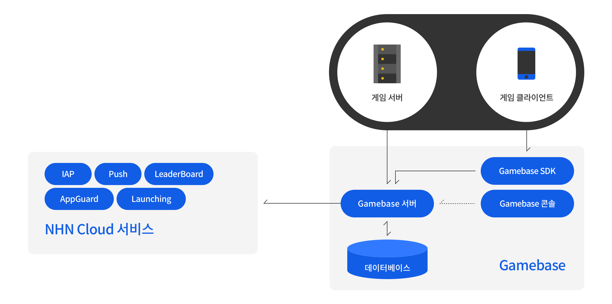

## Service Architecture
다음은 Gamebase 서비스 구조도와 간단한 설명입니다.

<!-- LLM_Image_DESC_20260406
    유형: Diagram
    내용: Gamebase 서비스 아키텍처 논리 구성도
    구성: 상단에 게임 서버와 게임 클라이언트가 있고, 게임 클라이언트는 Gamebase SDK를 통해 Gamebase 서버와 통신함. Gamebase 서버는 Gamebase 콘솔 및 데이터베이스와 연결되며, 좌측에 NHN Cloud 서비스(IAP, Push, LeaderBoard, AppGuard, Launching)가 Gamebase 서버와 연동됨
    Keyword: 서비스 아키텍처, Gamebase SDK, Gamebase 서버, 콘솔, NHN Cloud
-->
 

| 컴포넌트명           | 설명                                       |
| --------------- | ---------------------------------------- |
| Gamebase SDK    | - 클라이언트 개발을 위한 SDK                       |
| Gamebase Server | - 내부/외부 모듈 간의 매시업 API(mashup API)를 제공하고 내부 로직을 처리  - 클라이언트 초기 실행 시 데이터 제공  - 사용자 구분 키 발급과 관리, 매핑 관리  - 게임별 동시 접속 지표 수집 및 관리 |
| Console         | - 웹 Console                              |
