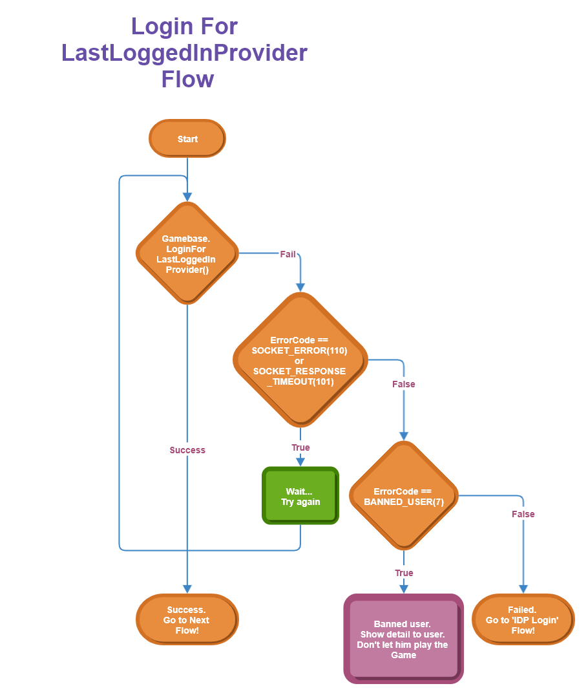

## Game > Gamebase > Android SDK 사용 가이드 > 인증

## Login

Gamebase에서는 게스트 로그인을 기본으로 지원합니다.

* 게스트 이외의 Provider에 로그인하려면 해당 Provider AuthAdapter가 필요합니다.
* AuthAdapter 및 3rd-Party Provider SDK에 대한 설정은 다음을 참고하시기 바랍니다.
    * [Game > Gamebase > Android SDK 사용 가이드 > 시작하기 > Setting > Gradle](../../aos-started.md#gradle)
    * [Game > Gamebase > Android SDK 사용 가이드 > 시작하기 > Setting > Console > 3rd-Party Provider SDK Guide](../../aos-started.md#console)

### Login Flow

많은 게임이 타이틀 화면에 로그인을 구현합니다.

* 앱을 설치하고 처음 실행했을 때 타이틀 화면에서 게임 유저가 어떤 IdP(identity provider)로 인증할지 선택할 수 있게 합니다.
* 한 번 로그인한 후에는 IdP 선택 화면을 표시하지 않고 이전에 로그인한 IdP 유형으로 인증합니다.

위에서 설명한 로직은 다음과 같은 순서로 구현할 수 있습니다.


<!-- LLM_Image_DESC_20260406
    유형: Flowchart
    내용: 마지막 로그인 Provider로 로그인하는 플로우
    구성: Start에서 시작하여 LoginForLastLoggedInProvider를 호출하고, SOCKET_RESPONSE의 성공/실패를 분기. 성공 시 로그인 완료, 실패 시 에러 코드 확인 후 재시도 또는 Guest 로그인으로 전환하는 순서도
    Keyword: Login, LastLoggedInProvider, 로그인, 플로우차트, 인증, Guest
-->

<!-- LLM_Image_DESC_20260406
    유형: Flowchart
    내용: IDP 로그인 플로우를 나타내는 순서도
    구성: Start에서 LoginForLastLoggedInProvider 호출 후, LoggedIn 여부와 IDP 유형 확인을 거쳐 분기. SOCKET_RESPONSE의 성공/실패에 따라 재시도(Retry) 또는 에러 처리. 최종적으로 로그인 성공 또는 실패(Fail) 노드로 연결되는 흐름
    Keyword: IDP, Login, 로그인, 플로우차트, 인증, IdP, SOCKET_RESPONSE
-->

#### 1. 이전 로그인 유형으로 인증

* 이전에 인증했던 기록이 있다면 ID와 비밀번호를 입력받지 않고 인증을 시도합니다.
* **Gamebase.loginForLastLoggedInProvider()**를 호출합니다.

#### 1-1. 인증이 성공한 경우

* 축하합니다! 인증에 성공했습니다.
* **Gamebase.getUserID()**로 사용자 ID를 획득하여 게임 로직을 구현하시면 됩니다.

#### 1-2. 인증이 실패한 경우

* 네트워크 오류
    * 오류 코드 **SOCKET_ERROR(110)** 또는 **SOCKET_RESPONSE_TIMEOUT(101)**인 경우, 일시적인 네트워크 문제로 인증이 실패한 것이므로 **Gamebase.loginForLastLoggedInProvider()**를 다시 호출하거나, 잠시 후 다시 시도합니다.
* 이용 정지 게임 유저
    * 오류 코드가 **BANNED_MEMBER(7)**인 경우, 이용 정지 게임 유저이므로 인증에 실패한 것입니다.
    * **BanInfo.from(exception)**으로 제재 정보를 확인하여 게임 유저에게 게임을 할 수 없는 이유를 알려 주시기 바랍니다.
    * Gamebase 초기화 시 **GamebaseConfiguration.Builder.enablePopup(true)** 및 **enableBanPopup(true)**를 호출한다면 Gamebase가 이용 정지에 관한 팝업 창을 자동으로 띄웁니다.
* 그 외 오류
    * 이전 로그인 유형으로 인증에 실패했기 때문에 **'2. 지정된 IdP로 인증'**을 진행하시기 바랍니다.

#### 2. 지정된 IdP로 인증

* IdP 유형을 직접 지정하여 인증을 시도합니다.
    * 인증 가능한 유형은 **AuthProvider** 클래스에 선언돼 있습니다.
* **Gamebase.login(activity, idpType, callback)** API를 호출합니다.

#### 2-1. 인증에 성공한 경우

* 축하합니다! 인증에 성공했습니다.
* **Gamebase.getUserID()**로 사용자 ID를 획득하여 게임 로직을 구현하시면 됩니다.

#### 2-2. 인증에 실패한 경우

* 네트워크 오류
    * 오류 코드가 **SOCKET_ERROR(110)** 또는 **SOCKET_RESPONSE_TIMEOUT(101)**인 경우, 일시적인 네트워크 문제로 인증에 실패한 것이므로 **Gamebase.login(activity, idpType, callback)**을 다시 호출하거나, 잠시 후 다시 시도합니다.
* 이용 정지 게임 유저
    * 오류 코드가 **BANNED_MEMBER(7)**인 경우, 이용 정지 게임 유저이므로 인증에 실패한 것입니다.
    * **BanInfo.from(exception)**으로 제재 정보를 확인하여 게임 유저에게 게임을 플레이할 수 없는 이유를 알려주시기 바랍니다.
    * Gamebase 초기화 시 **GamebaseConfiguration.Builder.enablePopup(true)** 및 **enableBanPopup(true)**를 호출한다면 Gamebase가 이용 정지에 관한 팝업 창을 자동으로 띄웁니다.
* 그 외 오류
    * 오류가 발생했다는 것을 게임 유저에게 알리고, 게임 유저가 인증 IdP 유형을 선택할 수 있는 상태(주로 타이틀 화면 또는 로그인 화면)로 되돌아갑니다.

### Login as the Latest Login IdP

가장 최근에 로그인한 IdP로 로그인을 시도합니다. <br/>
해당 로그인에 대한 토큰이 만료되었거나, 토큰에 대한 검증 등이 실패하면 실패를 반환합니다. <br/>
이때는 해당 IdP에 대한 로그인을 구현해야 합니다.

* AdditionalInfo 파라미터 설정 방법

| keyname                                  | a use                                    | 값 종류                                     |
| ---------------------------------------- | ---------------------------------------- | ---------------------------------------- |
| AuthProviderCredentialConstants.SHOW_LOADING_ANIMATION | API 호출이 끝날 때까지 로딩 애니메이션을 표시 | **boolean**<br>**default**: true |

**API**

```java
+ (void)Gamebase.loginForLastLoggedInProvider(Activity activity, GamebaseDataCallback<AuthToken> callback);
+ (void)Gamebase.loginForLastLoggedInProvider(Activity activity, Map<String, Object> additionalInfo, GamebaseDataCallback<AuthToken> callback);
```

**Example**

```java
Gamebase.loginForLastLoggedInProvider(activity, new GamebaseDataCallback<AuthToken>() {
    @Override
    public void onCallback(AuthToken data, GamebaseException exception) {
        if (Gamebase.isSuccess(exception)) {
            // 로그인 성공
            Log.d(TAG, "Login successful");
            String userId = Gamebase.getUserID();
        } else {
            if (exception.getCode() == GamebaseError.SOCKET_ERROR ||
                    exception.getCode() == GamebaseError.SOCKET_RESPONSE_TIMEOUT) {
                // Socket error 로 일시적인 네트워크 접속 불가 상태임을 의미합니다.
                // 네트워크 상태를 확인하거나 잠시 대기 후 재시도 하세요.
                new Thread(new Runnable() {
                    @Override
                    public void run() {
                        try {
                            Thread.sleep(2000);
                            onLoginForLastLoggedInProvider(activity);
                        } catch (InterruptedException e) {}
                    }
                }).start();
            } else if (exception.getCode() == GamebaseError.BANNED_MEMBER) {
                // 로그인을 시도한 게임 유저가 이용 정지 상태입니다.
                // GamebaseConfiguration.Builder.enablePopup(true).enableBanPopup(true) 를 호출하였다면
                // Gamebase가 이용 정지에 관한 팝업 창을 자동으로 띄워줍니다.
                //
                // Game UI에 맞게 직접 이용 정지 팝업 창을 구현하고자 한다면 BanInfo.from(exception)으로
                // 제재 정보를 확인하여 게임 유저에게 게임을 플레이할 수 없는 사유를 표시해 주시기 바랍니다.
                BanInfo banInfo = BanInfo.from(exception);
            } else {
                // 그 외의 오류가 발생하는 경우 지정된 IdP로 인증을 시도합니다.
                Gamebase.login(activity, provider, logincallback);
            }
        }
    }
});
```

### Login with GUEST

Gamebase는 게스트 로그인을 지원합니다.

* 디바이스의 유일한 키를 생성하여 Gamebase에 로그인을 시도합니다.
* 게스트 로그인은 앱 삭제 또는 디바이스 초기화 시에 계정이 삭제될 수 있으므로 IdP를 활용한 로그인 방식을 권장합니다.

게스트 로그인을 구현하는 방법은 아래 예시 코드를 참고하세요.

**API**

```java
+ (void)Gamebase.login(Activity activity, AuthProvider.GUEST, GamebaseDataCallback<AuthToken> callback);
```

**Example**

```java
private static void onLoginForGuest(final Activity activity) {
    Gamebase.login(activity, AuthProvider.GUEST, new GamebaseDataCallback<AuthToken>() {
        @Override
        public void onCallback(AuthToken data, GamebaseException exception) {
            if (Gamebase.isSuccess(exception)) {
                // 로그인 성공
                Log.d(TAG, "Login successful");
                String userId = Gamebase.getUserID();
            } else {
                if (exception.getCode() == GamebaseError.SOCKET_ERROR ||
                        exception.getCode() == GamebaseError.SOCKET_RESPONSE_TIMEOUT) {
                    // Socket error 로 일시적인 네트워크 접속 불가 상태임을 의미합니다.
                    // 네트워크 상태를 확인하거나 잠시 대기 후 재시도 하세요.
                    new Thread(new Runnable() {
                        @Override
                        public void run() {
                            try {
                                Thread.sleep(2000);
                                onLoginForGuest(activity);
                            } catch (InterruptedException e) {}
                        }
                    }).start();
                } else if (exception.getCode() == GamebaseError.BANNED_MEMBER) {
                    // 로그인을 시도한 게임 유저가 이용 정지 상태입니다.
                    // GamebaseConfiguration.Builder.enablePopup(true).enableBanPopup(true) 를 호출하였다면
                    // Gamebase가 이용 정지에 관한 팝업 창을 자동으로 띄웁니다.
                    //
                    // Game UI에 맞게 직접 이용 정지 팝업 창을 구현하고자 한다면 BanInfo.from(exception)으로
                    // 제재 정보를 확인하여 게임 유저에게 게임을 플레이할 수 없는 사유를 표시해 주시기 바랍니다.
                    BanInfo banInfo = BanInfo.from(exception);
                } else {
                    // 로그인 실패
                    Log.e(TAG, "Login failed- "
                            + "errorCode: " + exception.getCode()
                            + "errorMessage: " + exception.getMessage());
                }
            }
        }
    });
}
```


### Login with IdP

다음은 특정 IdP로 로그인할 수 있게 하는 예시 코드입니다.<br/>
로그인할 수 있는 IdP 유형은 **AuthProvider** 클래스에서 확인할 수 있습니다.

> <font color="red">[주의]</font><br/>
>
> PAYCO IdP는 인증 모듈임에도 외부 결제로 오탐되어 앱 스토어 심사에서 거절되는 경우가 발생하여
> AuthProvider.PAYCO의 상수를 제공하지 않으므로
> "payco" 라는 문자열을 직접 파라미터로 전달해야 합니다.

> <font color="red">[주의]</font><br/>
>
> LINE IdP는 Gamebase SDK 2.43.0부터 LINE 서비스 제공 지역을 설정할 수 있습니다.
> 해당 지역은 AdditionalInfo에 설정할 수 있습니다. 

* AdditionalInfo 파라미터 설정 방법

| keyname                                  | a use                                    | 값 종류                                     |
| ---------------------------------------- | ---------------------------------------- | ---------------------------------------- |
| AuthProviderCredentialConstants.SHOW_LOADING_ANIMATION | API 호출이 끝날 때까지 로딩 애니메이션을 표시 | **boolean**<br>**default**: true |
| AuthProviderCredentialConstants.LINE_CHANNEL_REGION | LINE 서비스 제공 지역 설정 | "japan"<br/>"thailand"<br/>"taiwan"<br/>"indonesia" |

**API**

```java
+ (void)Gamebase.login(Activity activity, AuthProvider provider, GamebaseDataCallback<AuthToken> callback);
+ (void)Gamebase.login(Activity activity, AuthProvider provider, Map<String, Object> additionalInfo, GamebaseDataCallback<AuthToken> callback);
```

**Example**

```java
private static void onLoginForGoogle(final Activity activity) {
    Gamebase.login(activity, AuthProvider.GOOGLE, new GamebaseDataCallback<AuthToken>() {
        @Override
        public void onCallback(AuthToken data, GamebaseException exception) {
            if (Gamebase.isSuccess(exception)) {
                // 로그인 성공
                Log.d(TAG, "Login successful");
                String userId = Gamebase.getUserID();
            } else {
                if (exception.getCode() == GamebaseError.SOCKET_ERROR ||
                        exception.getCode() == GamebaseError.SOCKET_RESPONSE_TIMEOUT) {
                    // Socket error 로 일시적인 네트워크 접속 불가 상태임을 의미합니다.
                    // 네트워크 상태를 확인하거나 잠시 대기 후 재시도 하세요.
                    new Thread(new Runnable() {
                        @Override
                        public void run() {
                            try {
                                Thread.sleep(2000);
                                onLoginForGoogle(activity);
                            } catch (InterruptedException e) {}
                        }
                    }).start();
                } else if (exception.getCode() == GamebaseError.BANNED_MEMBER) {
                    // 로그인을 시도한 유저가 이용 정지 상태입니다.
                    // GamebaseConfiguration.Builder.enablePopup(true).enableBanPopup(true) 를 호출하였다면
                    // Gamebase가 이용 정지에 관한 팝업 창을 자동으로 띄워줍니다.
                    //
                    // Game UI에 맞게 직접 이용 정지 팝업 창을 구현하고자 한다면 BanInfo.from(exception)으로
                    // 제재 정보를 확인하여 유저에게 게임을 플레이 할 수 없는 사유를 표시해 주시기 바랍니다.
                    BanInfo banInfo = BanInfo.from(exception);
                } else {
                    // 로그인 실패
                    Log.e(TAG, "Login failed- "
                            + "errorCode: " + exception.getCode()
                            + "errorMessage: " + exception.getMessage());
                }
            }
        }
    });
}
```

### Login with Credential

IdP에서 제공하는 SDK를 사용해 게임에서 직접 인증한 후 발급 받은 Access Token 등을 이용하여, Gamebase에 로그인할 수 있는 인터페이스입니다.

* Credential 파라미터 설정 방법

| keyname                                  | a use                                    | 값 종류                                     |
| ---------------------------------------- | ---------------------------------------- | ---------------------------------------- |
| AuthProviderCredentialConstants.PROVIDER_NAME | IdP 유형 설정                                | AuthProvider.GOOGLE<br> AuthProvider.FACEBOOK<br>AuthProvider.NAVER<br>AuthProvider.TWITTER<br>AuthProvider.LINE<br>AuthProvider.HANGAME<br>AuthProvider.APPLEID<br>AuthProvider.WEIBO<br>AuthProvider.KAKAOGAME<br>AuthProvider.GPGS_V2<br>AuthProvider.STEAM<br>"payco" |
| AuthProviderCredentialConstants.ACCESS_TOKEN | IdP 로그인 이후 받은 인증 정보(Access Token) 설정<br/>Google 인증 시에는 사용 안 함 |                                          |
| AuthProviderCredentialConstants.AUTHORIZATION_CODE | Google 로그인 이후 획득할 수 있는 OTAC(one time authorization code) 입력 |                                          |
| AuthProviderCredentialConstants.GAMEBASE_ACCESS_TOKEN | IdP 인증 정보가 아닌 Gamebase Access Token으로 로그인하는 경우 사용 |  |
| AuthProviderCredentialConstants.IGNORE_ALREADY_LOGGED_IN | Gamebase에 로그인한 상태에서 로그아웃을 하지 않고 다른 계정을 이용해 로그인을 시도하는 것을 허용 | **boolean** |
| AuthProviderCredentialConstants.SHOW_LOADING_ANIMATION | API 호출이 끝날 때까지 로딩 애니메이션을 표시 | **boolean**<br>**default**: true |
| AuthProviderCredentialConstants.LINE_CHANNEL_REGION | LINE 서비스 제공 지역 설정 | [Login with IdP 참고](./aos-authentication-Login.md#login-with-idp) |

> [참고]
>
> 게임 내에서 외부 서비스(Facebook 등)의 고유 기능을 사용해야 할 때 필요할 수 있습니다.
>

<br/>

> <font color="red">[주의]</font><br/>
>
> 외부 SDK에서 지원 요구하는 개발 사항은 외부 SDK의 API를 사용해 구현해야 하며, Gamebase에서는 지원하지 않습니다.
>

**API**

```java
+ (void)Gamebase.login(Activity activity, Map<String, Object> credentialInfo, GamebaseDataCallback<AuthToken> callback);
```

**Example**

```java
private static void onLoginWithCredential(final Activity activity) {
    Map<String, Object> credentialInfo = new HashMap<>();
    credentialInfo.put(AuthProviderCredentialConstants.PROVIDER_NAME, AuthProvider.FACEBOOK);
    credentialInfo.put(AuthProviderCredentialConstants.ACCESS_TOKEN, facebookAccessToken);

    Gamebase.login(activity, credentialInfo, new GamebaseDataCallback<AuthToken>() {
        @Override
        public void onCallback(AuthToken data, GamebaseException exception) {
            if (Gamebase.isSuccess(exception)) {
                // 로그인 성공
                Log.d(TAG, "Login successful");
                String userId = Gamebase.getUserID();
            } else {
                if (exception.getCode() == GamebaseError.SOCKET_ERROR ||
                        exception.getCode() == GamebaseError.SOCKET_RESPONSE_TIMEOUT) {
                    // Socket error 로 일시적인 네트워크 접속 불가 상태임을 의미합니다.
                    // 네트워크 상태를 확인하거나 잠시 대기 후 재시도 하세요.
                    new Thread(new Runnable() {
                        @Override
                        public void run() {
                            try {
                                Thread.sleep(2000);
                                onLoginWithCredential(activity);
                            } catch (InterruptedException e) {}
                        }
                    }).start();
                } else if (exception.getCode() == GamebaseError.BANNED_MEMBER) {
                    // 로그인을 시도한 게임 유저가 이용 정지 상태입니다.
                    // GamebaseConfiguration.Builder.enablePopup(true).enableBanPopup(true) 를 호출하였다면
                    // Gamebase가 이용 정지에 관한 팝업 창을 자동으로 띄워줍니다.
                    //
                    // Game UI에 맞게 직접 이용 정지 팝업 창을 구현하고자 한다면 BanInfo.from(exception)으로
                    // 제재 정보를 확인하여 사용자에게 게임을 플레이할 수 없는 사유를 표시해 주시기 바랍니다.
                    BanInfo banInfo = BanInfo.from(exception);
                } else {
                    // 로그인 실패
                    Log.e(TAG, "Login failed- "
                            + "errorCode: " + exception.getCode()
                            + "errorMessage: " + exception.getMessage());
                }
            }
        }
    });
}
```

### Authentication Additional Information Settings

[Console Guide](../../oper-app.md#authentication-information)
