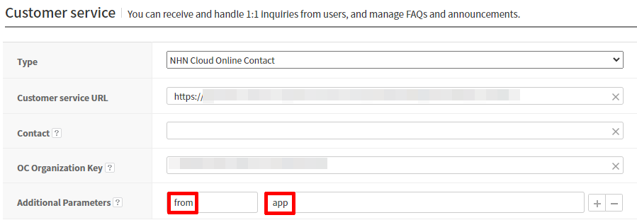
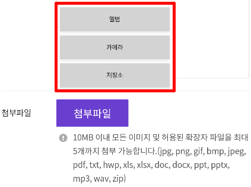

### Contact

Gamebase에서는 고객 문의 대응을 위한 기능을 제공합니다.

> [TIP]
>
> NHN Cloud Contact 서비스와 연동해서 사용하면 보다 쉽고 편리하게 고객 문의에 대응할 수 있습니다.
> 자세한 NHN Cloud Contact 서비스 이용법은 아래 가이드를 참고하시기 바랍니다.
> [NHN Cloud Online Contact Guide](https://docs.nhncloud.com/ko/Contact%20Center/ko/online-contact-overview/) 

> <font color="red">[주의]</font><br/>
>
> * Gamebase Android SDK 2.53.0 이상 버전은 아래 가이드에 따라 AndroidManifest.xml에 권한 선언만 추가하면 고객 센터에 파일 첨부 시 Gamebase Android SDK가 자동으로 권한을 요청합니다.
>     * [Game > Gamebase > Android SDK 사용 가이드 > 시작하기 > Setting > AndroidManifest.xml > Contact](../aos-started.md#contact)
> * Gamebase Android SDK 2.52.0 이하 버전은 플랫폼별 가이드를 참고하여 직접 권한 획득 처리를 구현해야 합니다.
>     * [Android Developer's Guide :Request App Permissions](https://developer.android.com/training/permissions/requesting)
>     * [Unity Guide : Requesting Permissions](https://docs.unity3d.com/2018.4/Documentation/Manual/android-RequestingPermissions.html)

#### Customer Service Type

**Gamebase 콘솔 > App > Customer service**에서는 아래와 같이 3가지 유형의 고객 센터를 선택할 수 있습니다.

<!-- LLM_Image_DESC_20260408_191856
    유형: Screenshot
    내용: Customer Service Type 관련 화면
    구성: Customer Service Type 관련 스크린샷
    Keyword: Android, Screenshot, Customer Service Type
-->

| Customer Service Type     | Required Login |
| ------------------------- | -------------- |
| Developer customer center | X              |
| Gamebase customer center  | △             |
| NHN Cloud Online Contact      | △              |

각 유형에 따라 Gamebase SDK의 고객 센터 API는 다음 URL을 사용합니다.

* 개발사 자체 고객 센터(Developer customer center)
    * **고객 센터 URL**에 입력한 URL.
* Gamebase 제공 고객 센터(Gamebase customer center)
    * 로그인 전 : 유저 정보가 **없는** 고객 센터 URL.
    * 로그인 후 : 유저 정보가 포함된 고객 센터 URL.
* NHN Cloud 조직 상품(Online Contact)
    * 로그인 전 : 유저 정보가 **없는** 고객 센터 URL.
    * 로그인 후 : 유저 정보가 포함된 고객 센터 URL.

#### Open Contact WebView

고객 센터 웹뷰를 표시합니다.
URL은 고객 센터 유형에 따라 결정됩니다.
ContactConfiguration으로 URL에 추가 정보를 전달할 수 있습니다.

**ContactConfiguration**

| API | Mandatory(M) / Optional(O) | Description |
| --- | --- | --- |
| newBuilder() | **M** | ContactConfiguration 객체는 newBuilder() 함수를 통해 생성할 수 있습니다. |
| build() | **M** | 설정을 마친 Builder를 Configuration 객체로 변환합니다. |
| setUserName(String userName) | O | 사용자 이름(닉네임)을 전달하고자 할 때 사용합니다.<br>NHN Cloud 조직 상품(Online Contact) 유형에서 사용하는 필드입니다.<br>**default**: null |
| setAdditionalURL(String additionalURL) | O | 개발사 자체 고객 센터 URL 뒤에 붙는 추가적인 URL입니다.<br>고객 센터 타입이 `CUSTOM` 인 경우에만 사용하시기 바랍니다.<br>**default**: null |
| setAdditionalParameters(Map&lt;String, String&gt; additionalParameters) | O | 고객 센터 URL 뒤에 붙는 추가적인 파라미터입니다.<br>**default**: null |
| setExtraData(Map&lt;String, Object&gt; extraData) | O | 개발사가 원하는 extra data를 고객 센터 오픈 시에 전달합니다.<br>**default**: EmptyMap |

**API**

```java
+ (void)Gamebase.Contact.openContact(@NonNull  final Activity activity,
                                     @Nullable final GamebaseCallback onCloseCallback);

+ (void)Gamebase.Contact.openContact(@NonNull  final Activity activity,
                                     @NonNull  final ContactConfiguration configuration,
                                     @Nullable final GamebaseCallback onCloseCallback);
```

**ErrorCode**

| Error Code | Description |
| --- | --- |
| NOT\_INITIALIZED(1)                                 | Gamebase.initialize가 호출되지 않았습니다. |
| UI\_CONTACT\_FAIL\_INVALID\_URL(6911)               | 고객 센터 URL이 존재하지 않습니다.<br>Gamebase 콘솔의 **고객 센터 URL**을 확인하세요. |
| UI\_CONTACT\_FAIL\_ISSUE\_SHORT\_TERM\_TICKET(6912) | 사용자 식별을 위한 임시 티켓 발급에 실패하였습니다. |
| UI\_CONTACT\_FAIL\_ANDROID\_DUPLICATED\_VIEW(6913)  | 고객 센터 웹뷰가 이미 표시중입니다. |

**Example**

``` java
Gamebase.Contact.openContact(activity, new GamebaseCallback() {
    @Override
    public void onCallback(GamebaseException exception) {
        if (Gamebase.isSuccess(exception)) {
            // A user close the contact web view.
        } else if (exception.code == UI_CONTACT_FAIL_INVALID_URL) { // 6911
            // TODO: Gamebase Console Service Center URL is invalid.
            // Please check the url field in the TOAST Gamebase Console.
        } else if (exception.code == UI_CONTACT_FAIL_ANDROID_DUPLICATED_VIEW) { // 6913
            // The customer center web view is already opened.
        } else {
            // An error occur when opening the contact web view.
        }
    }
});
```

#### Request Contact URL

고객 센터 웹뷰를 표시하는데 사용되는 URL을 반환합니다.

**API**

```java
+ (void)Gamebase.Contact.requestContactURL(@NonNull final GamebaseDataCallback<String> callback);

+ (void)Gamebase.Contact.requestContactURL(@NonNull final ContactConfiguration configuration,
                                           @NonNull final GamebaseDataCallback<String> callback);
```

**ErrorCode**

| Error Code | Description |
| --- | --- |
| NOT\_INITIALIZED(1)                                 | Gamebase.initialize가 호출되지 않았습니다. |
| UI\_CONTACT\_FAIL\_INVALID\_URL(6911)               | 고객 센터 URL이 존재하지 않습니다.<br>Gamebase 콘솔의 **고객 센터 URL**을 확인하세요. |
| UI\_CONTACT\_FAIL\_ISSUE\_SHORT\_TERM\_TICKET(6912) | 사용자를 식별을 위한 임시 티켓 발급에 실패하였습니다. |

**Example**

``` java
ContactConfiguration configuration = ContactConfiguration.newBuilder()
        .setUserName(userName)
        .build();
Gamebase.Contact.requestContactURL(configuration, new GamebaseDataCallback<String>() {
    @Override
    public void onCallback(String contactUrl, GamebaseException exception) {
        if (Gamebase.isSuccess(exception)) {
            // Open webview with 'contactUrl'
        } else if (exception.code == UI_CONTACT_FAIL_INVALID_URL) { // 6911
            // TODO: Gamebase Console Service Center URL is invalid.
            // Please check the url field in the TOAST Gamebase Console.
        } else {
            // An error occur when requesting the contact web view url.
        }
    }
});
```

#### File Attach Type Popup

고객 센터 유형이 'NHN Cloud 조직 상품'인 경우 '추가 파라미터' 항목의 Key에 **from**, Value에 **app**을 입력하면 파일 첨부 시 타입 선택 팝업이 표시됩니다.

<!-- LLM_Image_DESC_20260408_191856
    유형: Screenshot
    내용: File Attach Type Popup 관련 화면
    구성: File Attach Type Popup 관련 스크린샷
    Keyword: Android, Screenshot, File Attach Type Popup
-->

<!-- LLM_Image_DESC_20260408_191856
    유형: Screenshot
    내용: File Attach Type Popup 관련 화면
    구성: File Attach Type Popup 관련 스크린샷
    Keyword: Android, Screenshot, File Attach Type Popup
-->
