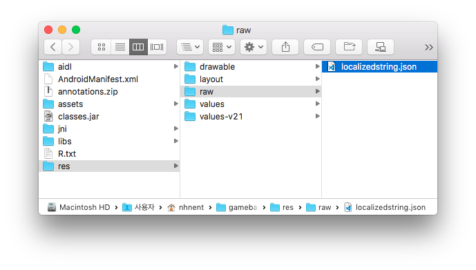

### Display Language

점검 팝업 창과 같이 Gamebase가 표시하는 언어는 단말기에 설정된 언어로 표시됩니다.

그런데 게임에서 표시하는 언어를 단말기에 설정된 언어가 아닌, 별도의 옵션으로 언어를 변경할 수 있는 게임이 있습니다.
예를 들어, 단말기에 설정된 언어는 영어 이지만 게임 표시 언어를 일본어로 변경한 경우, Gamebase에서 표시하는 언어도 일본어로 변경하고 싶지만 Gamebase가 표시하는 언어는 단말기에 설정된 언어인 영어로 표시됩니다.

이와 같이 `단말기에 설정된 언어가 아닌, 다른 언어로 Gamebase 메시지를 표시하고 싶은` 애플리케이션을 위해 Gamebase는 `Display Language` 라는 기능을 제공합니다.

Gamebase는 Display Language로 설정한 언어로 Gamebase 메시지를 표시합니다.
Display Language에 입력하는 언어 코드는 반드시 아래의 표(**Gamebase에서 지원하는 언어코드의 종류**)에 지정된 코드만을 사용할 수 있습니다.

> <font color="red">[주의]</font><br/>
>
> * Display Language는 단말기 설정 언어와 무관하게 Gamebase의 표시 언어를 변경하고 싶은 경우에만 사용하시기 바랍니다.
> * Display Language Code는 ISO-639 형태의 값으로, 대소문자를 구분합니다.
> 'EN'이나 'zh-cn'과 같이 설정하면 문제가 발생할 수 있습니다.
> * 만일 Display Language Code로 입력한 값이 아래의 표(**Gamebase에서 지원하는 언어코드의 종류**)에 존재하지 않는다면, Display Langauge Code는 Gamebase 콘솔에서 설정한 기본 언어로 지정됩니다.
>     * 만일 Gamebase 콘솔에서 언어 설정을 하지 않았다면 영어(en)가 기본 언어로 설정됩니다.

> [참고]
>
> * Gamebase의 클라이언트에 포함되어 있지 않은 언어셋은 직접 추가할 수 있습니다.
> **신규 언어셋 추가** 항목을 참조하시기 바랍니다.

#### Gamebase에서 지원하는 언어코드의 종류

| Code | Name |
| --- | --- |
| de | German |
| en |English  |
| es | Spanish |
| fi | Finnish |
| fr | French |
| id | Indonesian |
| it | Italian |
| ja | Japanese |
| ko | Korean |
| pt | Portuguese |
| ru | Russian |
| th | Thai |
| vi | Vietnamese |
| ms | Malay |
| zh-CN | Chinese-Simplified |
| zh-TW | Chinese-Traditional |

해당 언어 코드는 `DisplayLanguage` 클래스에 정의되어 있습니다.

```cs
package com.toast.android.gamebase.base.ui;

public class DisplayLanguage {
    public static class Code {
        public static final String German              = "de";
        public static final String English             = "en";
        public static final String Spanish             = "es";
        public static final String Finnish             = "fi";
        public static final String French              = "fr";
        public static final String Indonesian          = "id";
        public static final String Italian             = "it";
        public static final String Japanese            = "ja";
        public static final String Korean              = "ko";
        public static final String Portuguese          = "pt";
        public static final String Russian             = "ru";
        public static final String Thai                = "th";
        public static final String Vietnamese          = "vi";
        public static final String Malay               = "ms";
        public static final String Chinese_Simplified  = "zh-CN";
        public static final String Chinese_Traditional = "zh-TW";
    }
    ...
}
```

#### Gamebase 초기화 시 Display Language 설정

Gamebase 초기화 시 Display Language를 설정할 수 있습니다.

**API**

```java
+ (GamebaseConfiguration)GamebaseConfiguration.Builder.setDisplayLanguageCode(String displayLanguageCode);
```

**Example**

```java
public class MainActivity extends AppCompatActivity {
    ...
    @Override
    protected void onCreate(Bundle savedInstanceState) {
        super.onCreate(savedInstanceState);
        String appId = "T0aStC1d";
        String appVersion = "1.0.0";
        GamebaseConfiguration configuration = new GamebaseConfiguration.Builder(appId, appVersion)
                                .enableLaunchingStatusPopup(true)
                                .setDisplayLanguageCode(DisplayLanguage.Code.English)
                                .build();
        
        Gamebase.initialize(activity, configuration, new GamebaseDataCallback<LaunchingInfo>() {
            @Override
            public void onCallback(final LaunchingInfo data, GamebaseException exception) {
                ...
            }
        });
        ...
    }
    ...
}
```

#### Set Display Language

Gamebase 초기화 시 입력된 Display Language를 변경할 수 있습니다.

**API**

```java
+ (void)Gamebase.setDisplayLanguageCode(String displayLanguageCode);
```

**Example**

```java
public void setDisplayLanguageCodeToEnglishInRuntime() {
    Gamebase.setDisplayLanguageCode(DisplayLanguage.Code.English);
}
```

#### Get Display Language

현재 적용된 Display Language를 조회할 수 있습니다.

**API**

```java
+ (String)Gamebase.getDisplayLanguageCode();
```

**Example**

```java
public void getDisplayLanguageCodeInRuntime() {
    String currentDisplayLanguageCode = Gamebase.getDisplayLanguageCode();
}
```

#### 신규 언어셋 추가

Gamebase에서 제공하는 기본 언어(ko, en, ja, zh-CN, zh-TW, th) 외 다른 언어를 추가하려면 프로젝트의 res > raw 폴더에 localizedstring.json 파일을 추가하면 됩니다.


<!-- LLM_Image_DESC_20260406
    유형: Screenshot
    내용: Android 프로젝트의 res > raw 폴더에 localizedstring.json 파일이 위치한 디렉토리 구조를 보여주는 macOS Finder 스크린샷
    구성: 왼쪽에 aidl, AndroidManifest.xml, annotations.zip, assets, classes.jar, jni, libs, R.txt, res 등의 폴더/파일 목록이 있고, 중앙에 drawable, layout, raw, values, values-v21 폴더가 표시되며, 오른쪽에 raw 폴더 내의 localizedstring.json 파일이 선택된 상태
    Keyword: localizedstring.json, Android, res, raw, 다국어, 언어설정, Finder, 프로젝트구조
-->

localizedstring.json에 정의되어 있는 형식은 아래와 같습니다.

```json
{
  "en": {
    "common_ok_button": "OK",
    "common_cancel_button": "Cancel",
    ...
    "launching_service_closed_title": "Service Closed"
  },
  "ko": {
    "common_ok_button": "확인",
    "common_cancel_button": "취소",
    ...
    "launching_service_closed_title": "서비스 종료"
  },
  "ja": {
    "common_ok_button": "確認",
    "common_cancel_button": "キャンセル",
    ...
    "launching_service_closed_title": "サービス終了"
  },
  "zh-CN": {
    "common_ok_button": "确定",
    "common_cancel_button": "取消",
    ...
    "launching_service_closed_title": "关闭服务"
  },
  "zh-TW": {
    "common_ok_button": "好",
    "common_cancel_button": "取消",
    ...
    "launching_service_closed_title": "服務關閉"
  },
  "th": {
    "common_ok_button": "ยืนยัน",
    "common_cancel_button": "ยกเลิก",
    ...
    "launching_service_closed_title": "ปิดให้บริการ"
  },
  "de": {},
  "es": {},
  ...
  "ms": {}
}
```

다른 언어셋을 추가해야 할 경우에는 localizedstring.json 파일의 해당 언어 코드에 `"key":"value"` 형태로 값을 추가하면 됩니다.

```json
{
  "en": {
    "common_ok_button": "OK",
    "common_cancel_button": "Cancel",
    ...
    "launching_service_closed_title": "Service Closed"
  },
  ...
  "vi": {
    "common_ok_button": "value",
    "common_cancel_button": "value",
    ...
    "launching_service_closed_title": "value"
  },
  ...
  "ms": {}
}
```

#### Display Language 우선순위

초기화 및 SetDisplayLanguageCode API를 통해 Display Language를 설정할 경우, 최종 적용되는 Display Language는 입력한 값과 다르게 적용될 수 있습니다.

1. 입력된 languageCode가 localizedstring.json 파일에 정의되어 있는지 확인합니다.
2. 1번이 실패했다면 Gamebase 초기화 시, 단말기에 설정된 언어코드가 localizedstring.json 파일에 정의되어 있는지 확인합니다.(이 값은 초기화 이후, 단말기에 설정된 언어를 변경하더라도 유지됩니다.)
3. 2번이 실패했다면 Gamebase 콘솔에 설정된 기본 언어가 설정됩니다.
4. Gamebase 콘솔에 언어 설정이 없다면 `en`이 기본값으로 설정됩니다.
