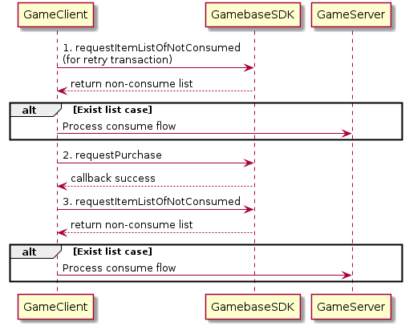

### Purchase Flow

아이템 구매는 크게 **결제 Flow** 와 **[Consume Flow](./aos-purchase-Consume-Flow.md#consume-flow)**, **[재처리 Flow](./aos-purchase-Retry-Transaction-Flow.md#retry-transaction-flow)** 로 나누어 볼 수 있습니다.
**결제 Flow**는 다음과 같은 순서로 구현하시기 바랍니다.

<!-- LLM_Image_DESC_20260408_185735
    유형: Sequence Diagram
    내용: Purchase Flow 결제 처리 시퀀스 다이어그램
    구성: GameClient, GamebaseSDK, GameServer 3개 참여자 간의 시퀀스로, requestItemListOfNotConsumed로 재처리 후 미소비 내역 존재 시 Consume Flow 진행, requestPurchase로 결제 시도, 성공 후 다시 requestItemListOfNotConsumed 호출하여 미소비 결제 내역 확인 및 Consume Flow 처리
    Keyword: Sequence Diagram, Purchase Flow
-->

1. 이전 결제가 정상적으로 종료되지 못한 경우 재처리가 동작하지 않으면 결제가 실패합니다. 그러므로 결제 전에 **requestItemListOfNotConsumed**를 호출하여 재처리를 동작시켜 미지급된 아이템이 있으면 Consume Flow 를 진행합니다.
2. 게임 클라이언트에서는 Gamebase SDK의 **requestPurchase**를 호출하여 결제를 시도합니다.
3. 결제가 성공하였다면 **requestItemListOfNotConsumed**를 호출하여 미소비 결제 내역을 확인한 후 지급할 아이템이 존재한다면 Consume Flow 를 진행합니다.
