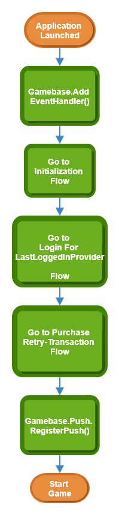

## Recommended Flow

* Gamebase에서 권장하는 flow는 Sample Project에도 동일하게 구현되어 있습니다.
    * Android Sample Project
        * [https://github.com/nhn/toast.gamebase.android.sample](https://github.com/nhn/toast.gamebase.android.sample)
            * app/src/main/java/com/toast/android/gamebase/sample/gamebase_manager 폴더의 kt 파일들을 참고하시면 됩니다.
    * Unity Sample Project
        * [https://github.com/nhn/toast.gamebase.unity.sample](https://github.com/nhn/toast.gamebase.unity.sample)
* 게임이 시작되었을 때 Gamebase 클라이언트 SDK를 초기화하고 로그인이 성공하면, 결제 재처리를 시작하고 푸시 토큰을 등록하세요.

<!-- LLM_Image_DESC_20260406
    유형: Flowchart
    내용: Gamebase SDK 초기화부터 게임 시작까지의 전체 권장 플로우
    구성: Application Launched에서 시작하여 Gamebase.AddEventHandler() 호출, Initialization Flow, Login For LastLoggedInProvider Flow, Purchase Retry-Transaction Flow, Gamebase.Push.RegisterPush() 순서로 진행되어 최종적으로 Start Game에 도달하는 세로 방향 순서도
    Keyword: Overview, 권장플로우, 초기화, 로그인, 결제재처리, 푸시등록, Gamebase, SDK
-->

* 상세 flow 는 다음 링크에서 확인할 수 있습니다.
    * [Game > Gamebase > Android SDK 사용 가이드 > ETC > Additional Features > Gamebase Event Handler](../../aos-etc.md#gamebase-event-handler)
    * [Game > Gamebase > Android SDK 사용 가이드 > 초기화 > Initialization Flow](../../aos-initialization.md#initialization-flow)
    * [Game > Gamebase > Android SDK 사용 가이드 > 인증 > Login Flow](../../aos-authentication.md#login-flow)
    * [Game > Gamebase > Android SDK 사용 가이드 > 결제 > Retry Transaction Flow](../../aos-purchase.md#retry-transaction-flow)
    * [Game > Gamebase > Android SDK 사용 가이드 > 푸시 > Register Push](../../aos-push.md#register-push)
