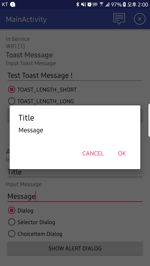

## Alert

시스템 알림을 표시할 수 있습니다.<br/>

### Simple Alert Dialog

제목과 메시지만 입력하여 간단하게 알림 대화 상자를 표시할 수 있습니다.

**API**

```java
+ (void)Gamebase.Util.showAlertDialog(Activity activity, String title, String message);
```


<!-- LLM_Image_DESC_20260408_185735
    유형: Screenshot
    내용: SDK 가이드 화면 (Simple Alert Dialog)
    구성: SDK 설정/사용 가이드 관련 스크린샷
    Keyword: Android, SDK, Screenshot, Simple Alert Dialog
-->


### Alert Dialog with Listener

알림 대화 상자를 표시한 후 처리 결과를 콜백받고 싶다면 다음 API를 사용합니다.

**API**

```java
+ (void)Gamebase.Util.showAlertDialog(Activity activity,
                            String title,
                            String messsage,
                            String okButtonText,
                            DialogInterface.OnClickListener clickListener);
```
