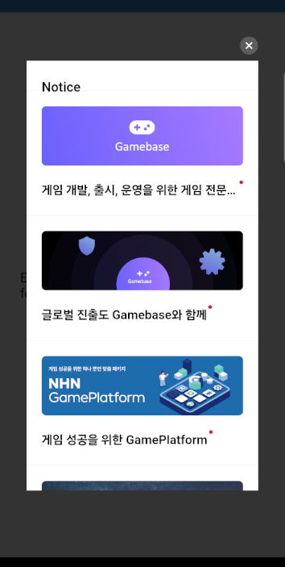

## Game > Gamebase > Android SDK 사용 가이드 > UI

## GameNotice

콘솔에 이미지와 함께 등록한 공지 사항을 표시하는 기능입니다.


<!-- LLM_Image_DESC_20260406
    유형: UI
    내용: 게임 공지사항(GameNotice) 목록 화면 예시
    구성: 상단에 닫기(X) 버튼이 있는 다크 테마 모달 창. "Notice" 제목 아래 Gamebase 로고와 설명("게임 개발, 출시, 운영을 위한 게임 전문..."), "글로벌 진출도 Gamebase와 함께", "NHN GamePlatform - 게임 성공을 위한 GamePlatform" 등 여러 개의 공지 카드가 세로로 나열된 목록형 UI
    Keyword: GameNotice, 공지사항, 모바일, UI, Gamebase, 목록
-->

<!-- LLM_Image_DESC_20260406
    유형: UI
    내용: 게임 공지사항(GameNotice) 상세 화면 예시
    구성: "Home" 타이틀과 닫기(X) 버튼이 있는 다크 테마 모달 창. Gamebase 로고가 포함된 보라색 배너 이미지와 "게임 개발, 출시, 운영을 위한 게임 전문 플랫폼 Gamebase" 설명 텍스트가 표시된 단일 공지 상세 화면. 하단에 페이지 인디케이터(빨간 점)가 있음
    Keyword: GameNotice, 공지사항, 상세, 모바일, UI, Gamebase, 배너
-->

### Open GameNotice

게임 공지를 화면에 표시합니다.

#### Required 파라미터
* Activity: 게임 공지가 노출되는 Activity입니다.


#### Optional 파라미터
* GameNoticeConfiguration: 게임 공지 설정을 변경할 수 있습니다.

* GamebaseCallback: 게임 공지가 정상적으로 종료되거나 에러로 표시하지 못했을 때 사용자에게 콜백으로 알려 줍니다.


**API**

```java
+ (void)Gamebase.GameNotice.openGameNotices(@NonNull Activity activity,
                                            @Nullable GamebaseCallback onCloseCallback);
+ (void)Gamebase.GameNotice.openGameNotices(@NonNull Activity activity,
                                            @Nullable GameNoticeConfiguration configuration,
                                            @Nullable GamebaseCallback onCloseCallback);
```

**ErrorCode**

| Error | Error Code | Description |
| ---- | ------- | ----------- |
| - | 0 | 성공 |
| NOT\_INITIALIZED | 1 | Gamebase.initialize가 호출되지 않았습니다. |
| UI\_GAME\_NOTICE\_FAIL\_INVALID\_URL | 6941 | 게임 공지 URL 생성에 실패했습니다. |
| UI\_GAME\_NOTICE\_FAIL\_ANDROID\_DUPLICATED\_VIEW | 6942 | 게임 공지 팝업을 종료하기 전에 다시 게임 공지를 호출했습니다. |
| WEBVIEW\_TIMEOUT | 7002 | 웹뷰 표시 시간이 초과되었습니다.(10초) |
| WEBVIEW\_HTTP\_ERROR | 7003 | 웹뷰 내부에서 HTTP 에러가 발생했습니다. |
| WEBVIEW\_UNKNOWN\_ERROR | 7999 | 알 수 없는 웹뷰 에러가 발생했습니다. |

**Example**

```java
Gamebase.GameNotice.openGameNotice(activity, (GamebaseCallback) exception -> {
    if (Gamebase.isSuccess(exception)) {
        // Game Notice was opened and closed successfully.
    } else {
        // Game Notice did not opened with error.
    }
});
```

### Custom GameNotice

사용자 설정 게임 공지를 표시합니다.
GameNoticeConfiguration으로 표시 설정을 변경할 수 있습니다.

**Example**

```java
GameNoticeConfiguration configuration = GameNoticeConfiguration.newBuilder()
        .setBackgroundColor("#80FFFF00")
        .build();
Gamebase.GameNotice.openGameNotice(
        activity,
        configuration,
        (GamebaseCallback) exception -> {
            if (Gamebase.isSuccess(exception)) {
                // Game Notice was opened and closed successfully.
            } else {
                // Game Notice did not opened with error.
            }
        });
```

#### GameNoticeConfiguration

| API | Mandatory(M) / Optional(O) | Description |
| --- | --- | --- |
| newBuilder() | **M** | GameNoticeConfiguration.Builder 객체는 newBuilder() 함수를 통해 생성할 수 있습니다. |
| build() | **M** | 설정을 마친 Builder를 Configuration 객체로 변환합니다. |
| setBackgroundColor(int backgroundColor)<br>setBackgroundColor(String backgroundColor) | O | 게임 공지 배경색입니다.<br>색상은 ARGB 순서입니다.<br>String 은 android.graphics.Color.parseColor(String) API로 변환한 값을 사용합니다.<br>**default**: #CC000000 |
