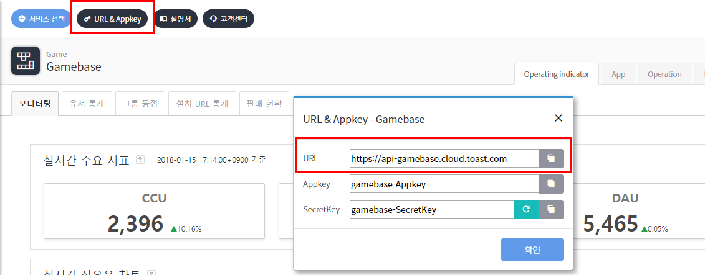
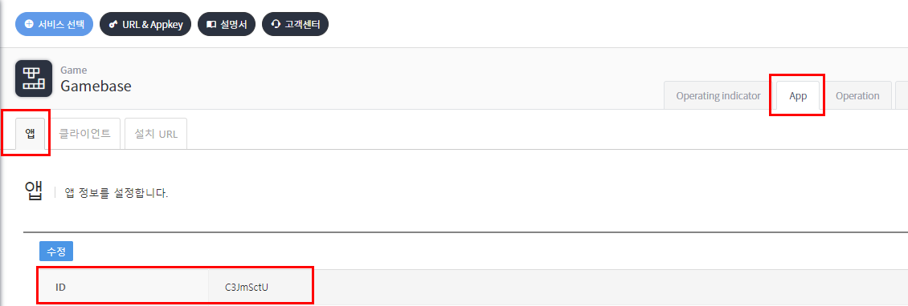

## Advance Notice

Gamebase Server API는 RESTful 형식으로, 서버 API를 사용하기 위해서는 다음 정보들을 알고 있어야 합니다.

#### Server Address

API를 호출하기 위한 서버 주소는 다음과 같습니다. 해당 주소는 Gamebase Console 화면에서도 확인 가능합니다.
> https://api-gamebase.cloud.toast.com

<!-- LLM_Image_DESC_20260406
    유형: Screenshot
    내용: Gamebase 콘솔에서 서버 API URL 확인 화면
    구성: 상단 'URL & Appkey' 버튼이 빨간 박스로 강조되어 있고, 클릭 시 나타나는 팝업에서 URL 필드(https://api-gamebase.cloud.toast.com)가 빨간 박스로 강조됨. Appkey, SecretKey 필드도 함께 표시. 배경에 실시간 주요 지표(CCU 2,396, DAU 5,465) 확인 가능.
    Keyword: 서버주소, URL, API, Gamebase Console, URL & Appkey, 콘솔
-->

#### AppId

앱 ID는 NHN Cloud 프로젝트 ID로 앱 메뉴 화면에서 확인할 수 있습니다.

<!-- LLM_Image_DESC_20260406
    유형: Screenshot
    내용: Gamebase 콘솔에서 앱 ID 확인 화면
    구성: 콘솔 상단 메뉴에서 'App' 탭이 빨간 박스로 강조, 좌측 '앱' 탭도 강조. 하단에 ID 필드(C3JmSctU)가 빨간 박스로 표시되어 앱 ID 위치를 안내.
    Keyword: AppId, 앱ID, 프로젝트ID, NHN Cloud, Gamebase Console, App
-->

#### SecretKey

비밀 키(secret key)는 API에 대한 접근 제어 방안으로, Gamebase Console에서 확인할 수 있습니다. 비밀 키는 Server API를 호출할 때 HTTP 헤더에 필수로 설정해야 합니다.
> [참고]
> 비밀 키가 외부에 노출되어 잘못된 호출이 발생한다면 **생성** 버튼을 클릭하여 새로운 비밀 키를 만든 후, 새 비밀 키를 사용하면 됩니다.

<!-- LLM_Image_DESC_20260406
    유형: Screenshot
    내용: Gamebase 콘솔에서 SecretKey 확인 화면
    구성: 상단 'URL & Appkey' 버튼이 빨간 박스로 강조, 팝업에서 SecretKey 필드(Gamebase-SecretKey)가 빨간 박스로 강조됨. 새로고침 버튼과 복사 버튼이 우측에 위치. 배경에 CCU 1,439, DAU 5,475 실시간 지표 표시.
    Keyword: SecretKey, 비밀키, API인증, HTTP헤더, Gamebase Console, URL & Appkey
-->

#### TransactionId

API를 호출하는 서버에서 내부적으로 API 요청을 관리할 수 있는 방안으로 TransactionId 기능을 제공합니다. 호출하는 서버에서 HTTP 헤더에 트랜잭션 ID를 설정하여 API를 호출하면, Gamebase 서버는 응답 HTTP Header 및 응답 결과의 Response Body Header에 해당 TransactionId를 설정하여 결과를 전달합니다.
