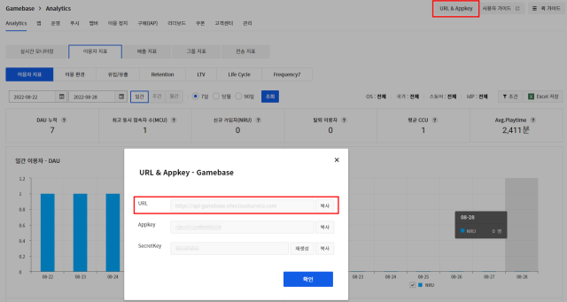

## Advance Notice

Gamebase Server API는 RESTful 형식으로, 서버 API를 사용하기 위해서는 다음 정보들을 알고 있어야 합니다.

#### Server Address

API를 호출하기 위한 서버 주소는 다음과 같습니다. 해당 주소는 Gamebase Console 화면에서도 확인 가능합니다.
> https://api-gamebase.nhncloudservice.com

<!-- LLM_Image_DESC_20260406
    유형: Screenshot
    내용: Gamebase 콘솔에서 서버 주소(URL)를 확인하는 화면
    구성: Gamebase Analytics 대시보드 배경에 'URL & Appkey - Gamebase' 팝업이 표시되어 있으며, URL 필드가 빨간색 테두리로 강조되어 있음. URL, Appkey, SecretKey 필드와 복사 버튼이 포함됨. 배경에는 일간 이용자(DAU) 차트가 보임
    Keyword: Gamebase, 콘솔, 서버주소, URL, Appkey, Analytics
-->

#### AppId

앱 ID는 NHN Cloud 프로젝트 ID로 앱 메뉴 화면에서 확인할 수 있습니다.

<!-- LLM_Image_DESC_20260406
    유형: Screenshot
    내용: Gamebase 콘솔에서 앱 ID를 확인하는 화면
    구성: NHN Cloud 콘솔의 Gamebase 앱 설정 화면. 상단에 서비스 선택, URL & Appkey, 설명서, 고객센터 버튼이 있고, App 탭이 선택된 상태. 하단에 앱 정보 섹션이 있으며, ID 필드에 'C3JmSctU' 값이 빨간색 테두리로 강조 표시됨
    Keyword: Gamebase, 콘솔, AppId, 앱설정, NHN Cloud
-->

#### SecretKey

비밀 키(secret key)는 API에 대한 접근 제어 방안으로, Gamebase Console에서 확인할 수 있습니다. 비밀 키는 Server API를 호출할 때 HTTP 헤더에 필수로 설정해야 합니다.
> [참고]
> 비밀 키가 외부에 노출되어 잘못된 호출이 발생한다면 **생성** 버튼을 클릭하여 새로운 비밀 키를 만든 후, 새 비밀 키를 사용하면 됩니다.

<!-- LLM_Image_DESC_20260406
    유형: Screenshot
    내용: Gamebase 콘솔에서 SecretKey를 확인하는 화면
    구성: NHN Cloud 콘솔의 Gamebase 모니터링 화면 배경에 'URL & Appkey - Gamebase' 팝업이 표시됨. URL, Appkey, SecretKey 필드가 있으며 SecretKey 필드가 빨간색 테두리로 강조되어 있음. SecretKey 옆에 갱신 버튼과 복사 버튼이 있음. 배경에 CCU(1,439)와 DAU(5,475) 지표가 보임
    Keyword: Gamebase, 콘솔, SecretKey, 비밀키, URL, Appkey
-->

#### TransactionId

API를 호출하는 서버에서 내부적으로 API 요청을 관리할 수 있는 방안으로 TransactionId 기능을 제공합니다. 호출하는 서버에서 HTTP 헤더에 트랜잭션 ID를 설정하여 API를 호출하면, Gamebase 서버는 응답 HTTP Header 및 응답 결과의 Response Body Header에 해당 TransactionId를 설정하여 결과를 전달합니다.
