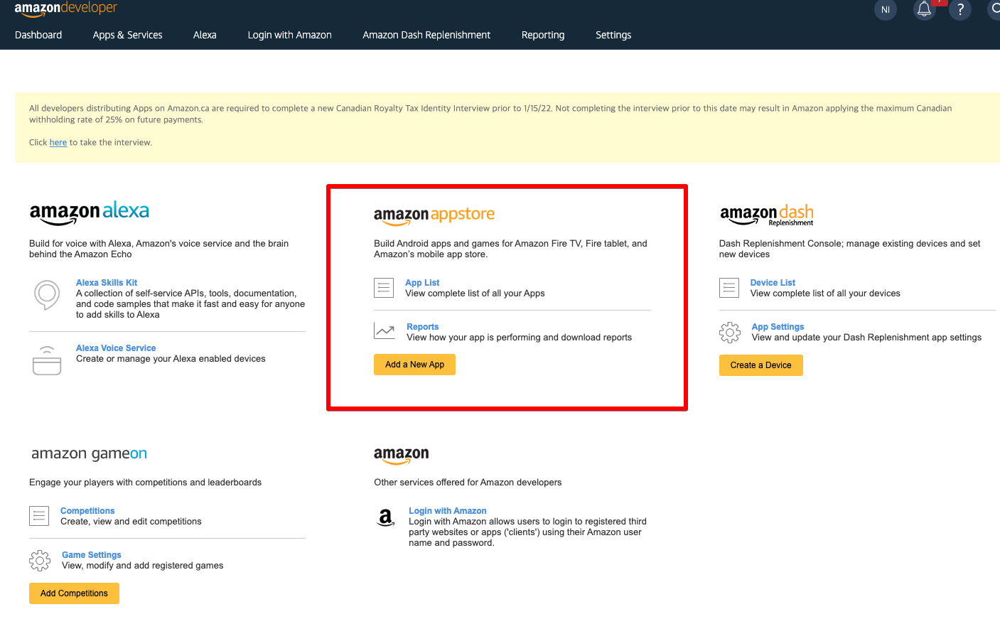
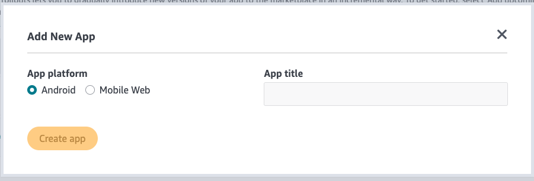
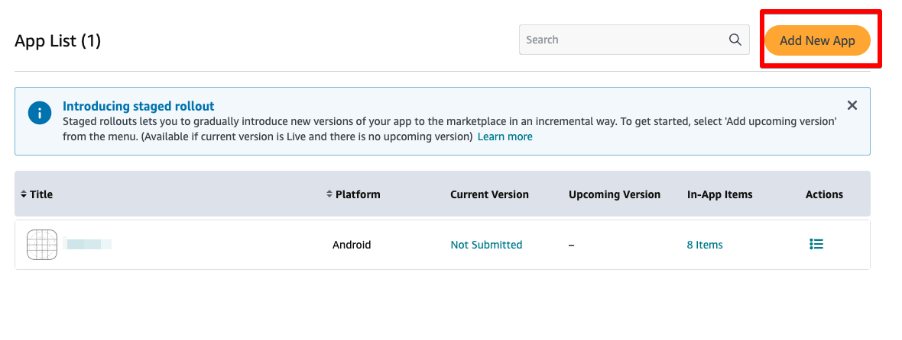
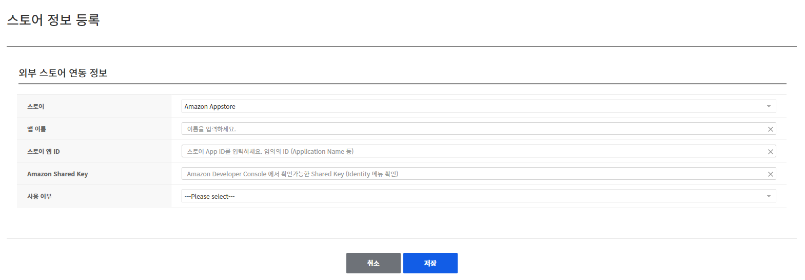
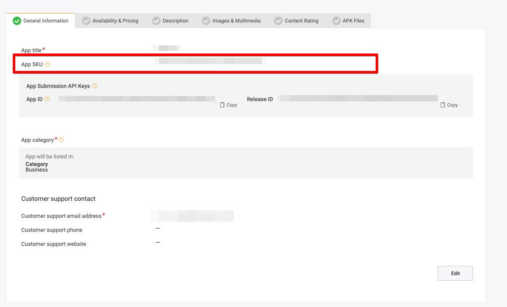
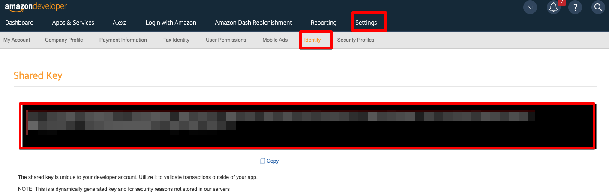

## Game > Gamebase > 스토어 콘솔 가이드 > Amazon Appstore 콘솔 가이드

## Amazon Developer Console
1. [아마존 개발자 콘솔](https://developer.amazon.com/)에 계정을 등록한 후 아마존 앱스토어 관리 메뉴에서 앱을 생성합니다.
   
<!-- LLM_Image_DESC_20260408_185735
    유형: Screenshot
    내용: Amazon Appstore 콘솔 Amazon Developer Console 화면
    구성: Amazon Appstore 콘솔의 Amazon Developer Console 기능 설정/조회 화면 스크린샷
    Keyword: Amazon, Console, Screenshot, Amazon Developer Console
-->
2. NHN Cloud IAP는 안드로이드 플랫폼의 아마존 앱스토어 앱만을 공식 지원합니다. 안드로이드 플랫폼을 선택하고 앱 이름을 입력한 후 `Create app` 버튼을 클릭하여 앱을 생성합니다.
   
<!-- LLM_Image_DESC_20260408_185735
    유형: Screenshot
    내용: Amazon Appstore 콘솔 Amazon Developer Console 화면
    구성: Amazon Appstore 콘솔의 Amazon Developer Console 기능 설정/조회 화면 스크린샷
    Keyword: Amazon, Console, Screenshot, Amazon Developer Console
-->
3. 앱을 생성하면 아래와 같이 생성된 앱의 목록을 확인할 수 있습니다.
   
<!-- LLM_Image_DESC_20260408_185735
    유형: Screenshot
    내용: Amazon Appstore 콘솔 Amazon Developer Console 화면
    구성: Amazon Appstore 콘솔의 Amazon Developer Console 기능 설정/조회 화면 스크린샷
    Keyword: Amazon, Console, Screenshot, Amazon Developer Console
-->
4. 앱 생성 후 추가적인 정보를 입력하고, 개발자 콘솔에서 제공하는 정보들을 NHN Cloud IAP 콘솔의 앱 설정에 입력해 줘야 합니다.
5. 본 가이드의 내용은 아마존 앱스토어에 등록된 앱의 정보와 NHN Cloud IAP 간의 앱 정보를 연결하기 위한 가이드만을 다루고 있으며,   보다 자세한 아마존 앱스토어의 앱 등록 절차에 대해서는 [아마존의 가이드 문서](https://developer.amazon.com/apps-and-games/documentation)를 참조하시기 바랍니다.

## 연결을 위해 필요한 설정 값들

<!-- LLM_Image_DESC_20260408_185735
    유형: Screenshot
    내용: Amazon Appstore 콘솔 연결을 위해 필요한 설정 값들 화면
    구성: Amazon Appstore 콘솔의 연결을 위해 필요한 설정 값들 기능 설정/조회 화면 스크린샷
    Keyword: Amazon, Console, Screenshot, 연결을 위해 필요한 설정 값들
-->
### Store App ID
- [앱 목록](https://developer.amazon.com/apps-and-games/console/apps/list.html) 화면에서 생성된 앱의 이름을 클릭하면 상세 설정 메뉴로 진입합니다.
- 상세 설정 메뉴에서 편집을 눌러 'App SKU'를 입력해야 하며, 이 App SKU의 값을 [NHN Cloud Gamebase 콘솔 > 스토어]에서 스토어 정보 등록 화면의 '스토어 앱 ID'에 입력해야 합니다.
  
<!-- LLM_Image_DESC_20260408_185735
    유형: Screenshot
    내용: Amazon Appstore 콘솔 Store App ID 화면
    구성: Amazon Appstore 콘솔의 Store App ID 기능 설정/조회 화면 스크린샷
    Keyword: Amazon, Console, Screenshot, Store App ID
-->

### Amazon Shared Key
- 아마존 개발자 콘솔의 [Settings -> Identity 메뉴](https://developer.amazon.com/settings/console/sdk/shared-key)로 진입하면 아래와 같은 화면에서 공유 키를 확인할 수 있습니다.
  
<!-- LLM_Image_DESC_20260408_185735
    유형: Screenshot
    내용: Amazon Appstore 콘솔 Amazon Shared Key 화면
    구성: Amazon Appstore 콘솔의 Amazon Shared Key 기능 설정/조회 화면 스크린샷
    Keyword: Amazon, Console, Screenshot, Amazon Shared Key
-->
- 이 값을 NHN Cloud Gamebase 콘솔 앱 설정의 'Amazon Shared Key' 항목에 입력해야 합니다.