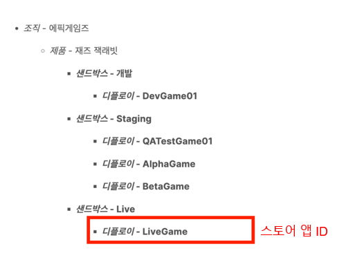
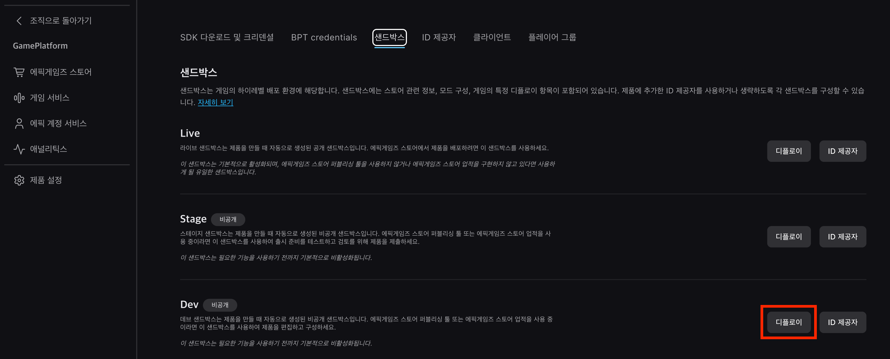
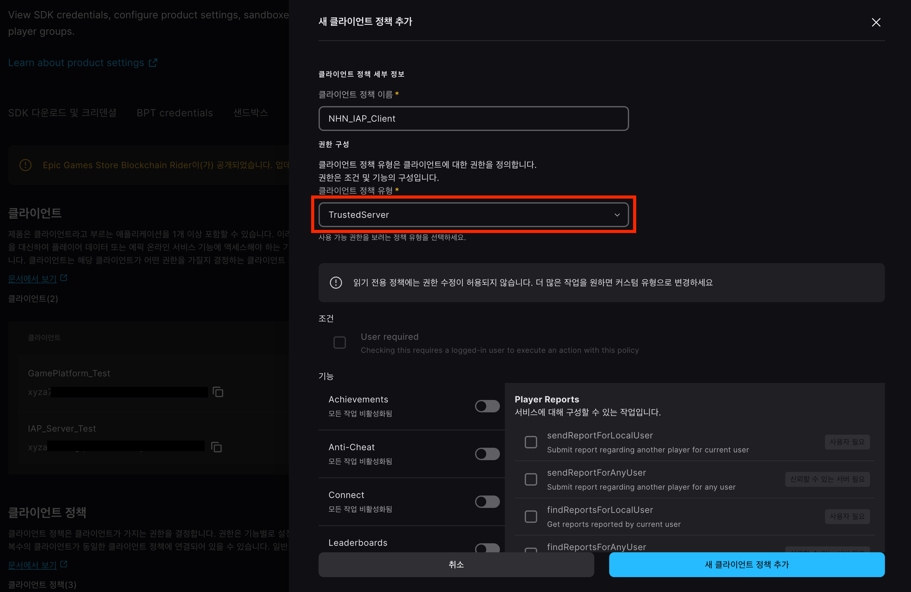
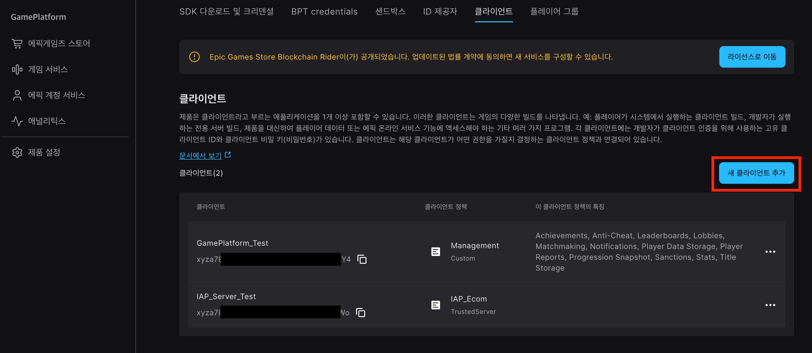
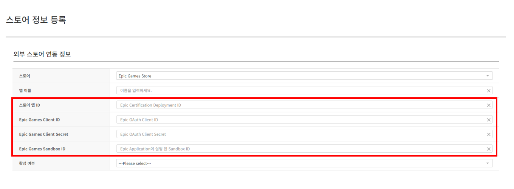
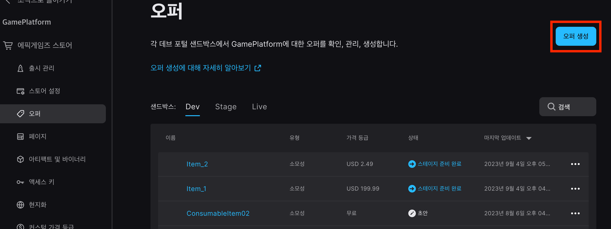
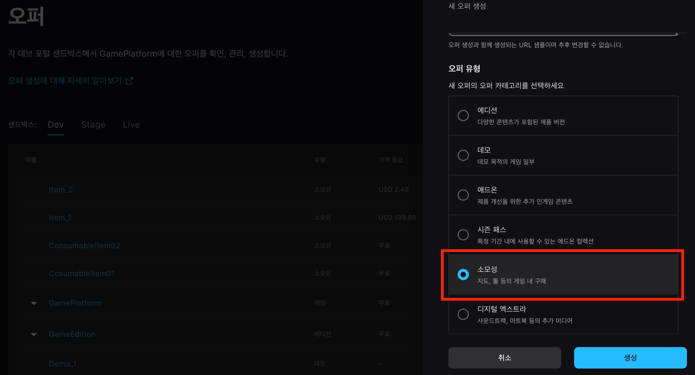
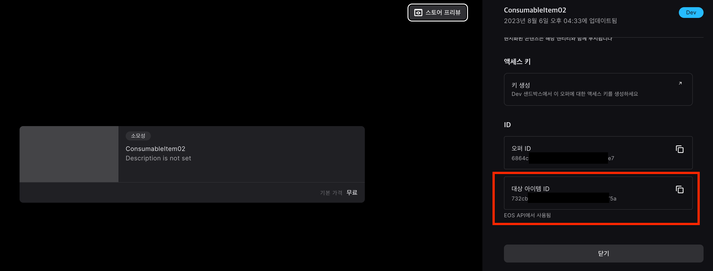
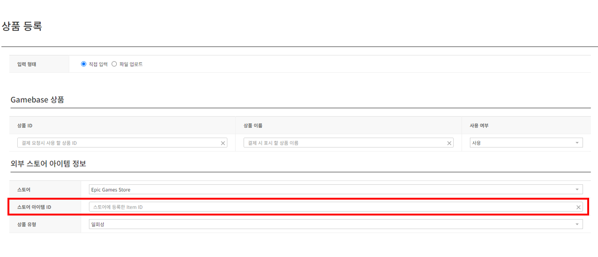

## Game > Gamebase > 스토어 콘솔 가이드 > Epic Games Store 콘솔 가이드

본 문서는 에픽게임즈 스토어(이하 에픽)와 연동하는 방법을 다룹니다.
에픽에 제품 출시를 위한 보다 자세한 문서는 [에픽 개발자 리소스 문서](https://dev.epicgames.com/docs/ko)를 참고하시기 바랍니다.

## 에픽 프로젝트 연결
연동과 관련된 정보는 [에픽 데브 포털](https://dev.epicgames.com/)에서 생성합니다.
에픽에서 제품 배포를 위해 제공하는 환경은 다음과 같습니다.

<!-- LLM_Image_DESC_20260408_191856
    유형: Screenshot
    내용: Epic Games Store 콘솔 에픽 프로젝트 연결 화면
    구성: Epic Games Store 콘솔의 에픽 프로젝트 연결 기능 설정/조회 화면 스크린샷
    Keyword: Epic Games, Console, Screenshot, 에픽 프로젝트 연결
-->

* 에픽은 Dev, Stage, Live 세 개의 샌드박스를 기본적으로 제공하고, 각 샌드박스 하위에 개발자가 디플로이를 생성할 수 있습니다.
* Gamebase는 에픽의 샌드박스 내 생성된 디플로이와 매핑되며, 앱 정보에서 사용할 **스토어 앱 ID**는 **디플로이 ID**입니다.

### 디플로이 생성
* **제품 설정 > 샌드박스** 메뉴에서 디플로이를 생성합니다.

<!-- LLM_Image_DESC_20260408_191856
    유형: Screenshot
    내용: Epic Games Store 콘솔 디플로이 생성 화면 #02
    구성: Epic Games Store 콘솔의 디플로이 생성 기능 설정/조회 화면 스크린샷
    Keyword: Epic Games, Console, Screenshot, 디플로이 생성
-->

### 클라이언트 생성
* Gamebase가 에픽과 통신하기 위해서는 에픽의 OAuth 클라이언트가 필요합니다.
* **제품 설정 > 클라이언트** 메뉴에서 Gamebase에 사용할 클라이언트를 생성할 수 있습니다.
> 클라이언트 생성 전 클라이언트 정책을 먼저 생성하세요.

* 클라이언트 생성을 위해서는 클라이언트에 적용할 정책이 먼저 추가되어야 합니다.
  * 클라이언트 정책 이름은 임의의 이름을 설정합니다.
  * 클라이언트 정책 유형은 **TrustedServer**를 선택합니다.
  * 기능은 Gamebase에서 필요하지 않으므로 선택하지 않습니다.

<!-- LLM_Image_DESC_20260408_191856
    유형: Screenshot
    내용: Epic Games Store 콘솔 클라이언트 생성 화면 #01
    구성: Epic Games Store 콘솔의 클라이언트 생성 기능 설정/조회 화면 스크린샷
    Keyword: Epic Games, Console, Screenshot, 클라이언트 생성
-->

* 클라이언트 정책 추가 후 클라이언트를 생성합니다.

<!-- LLM_Image_DESC_20260408_191856
    유형: Screenshot
    내용: Epic Games Store 콘솔 클라이언트 생성 화면 #02
    구성: Epic Games Store 콘솔의 클라이언트 생성 기능 설정/조회 화면 스크린샷
    Keyword: Epic Games, Console, Screenshot, 클라이언트 생성
-->

### 디플로이 및 클라이언트 정보 확인
* 생성된 디플로이와 클라이언트 정보는 **제품 설정 > SDK 다운로드 및 크리덴셜** 메뉴에서 확인할 수 있습니다.

<!-- LLM_Image_DESC_20260408_191856
    유형: Screenshot
    내용: Epic Games Store 콘솔 디플로이 및 클라이언트 정보 확인 화면 #03
    구성: Epic Games Store 콘솔의 디플로이 및 클라이언트 정보 확인 기능 설정/조회 화면 스크린샷
    Keyword: Epic Games, Console, Screenshot, 디플로이 및 클라이언트 정보 확인
-->

* **디플로이 ID**, **클라이언트 ID**, **클라이언트 비밀 키**, **샌드박스 ID**를 Gamebase 스토어 정보에 등록합니다.

<!-- LLM_Image_DESC_20260408_191856
    유형: Screenshot
    내용: Epic Games Store 콘솔 디플로이 및 클라이언트 정보 확인 화면 #01
    구성: Epic Games Store 콘솔의 디플로이 및 클라이언트 정보 확인 기능 설정/조회 화면 스크린샷
    Keyword: Epic Games, Console, Screenshot, 디플로이 및 클라이언트 정보 확인
-->

## 아이템(오퍼) 연결
* 에픽의 아이템은 스토어의 오퍼로 관리합니다.
* 오퍼는 에디션, 데모와 같이 소유하는 오퍼와 구매 후 소비하는 소모성 오퍼로 나뉩니다.
* Gamebase에서는 이 중 소모성 오퍼만을 아이템으로 관리합니다.

### 오퍼 등록
* **에픽게임즈 스토어 > 오퍼** 메뉴에서 오퍼를 등록합니다.
* 오퍼 유형에서 소모성을 선택합니다.

<!-- LLM_Image_DESC_20260408_191856
    유형: Screenshot
    내용: Epic Games Store 콘솔 오퍼 등록 화면 #01
    구성: Epic Games Store 콘솔의 오퍼 등록 기능 설정/조회 화면 스크린샷
    Keyword: Epic Games, Console, Screenshot, 오퍼 등록
-->

<!-- LLM_Image_DESC_20260408_191856
    유형: Screenshot
    내용: Epic Games Store 콘솔 오퍼 등록 화면 #02
    구성: Epic Games Store 콘솔의 오퍼 등록 기능 설정/조회 화면 스크린샷
    Keyword: Epic Games, Console, Screenshot, 오퍼 등록
-->

### 아이템 ID 확인 및 상품 등록
* 아이템 ID 확인은 등록 후 오퍼 세부 정보에서 확인할 수 있습니다.
* ID 항목에서 **대상 아이템 ID**를 Gamebase의 **스토어 아이템 ID**로 등록합니다.

<!-- LLM_Image_DESC_20260408_191856
    유형: Screenshot
    내용: Epic Games Store 콘솔 아이템 ID 확인 및 상품 등록 화면 #03
    구성: Epic Games Store 콘솔의 아이템 ID 확인 및 상품 등록 기능 설정/조회 화면 스크린샷
    Keyword: Epic Games, Console, Screenshot, 아이템 ID 확인 및 상품 등록
-->

<!-- LLM_Image_DESC_20260408_191856
    유형: Screenshot
    내용: Epic Games Store 콘솔 아이템 ID 확인 및 상품 등록 화면 #02
    구성: Epic Games Store 콘솔의 아이템 ID 확인 및 상품 등록 기능 설정/조회 화면 스크린샷
    Keyword: Epic Games, Console, Screenshot, 아이템 ID 확인 및 상품 등록
-->
