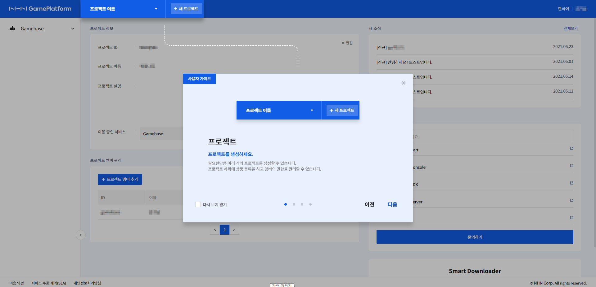
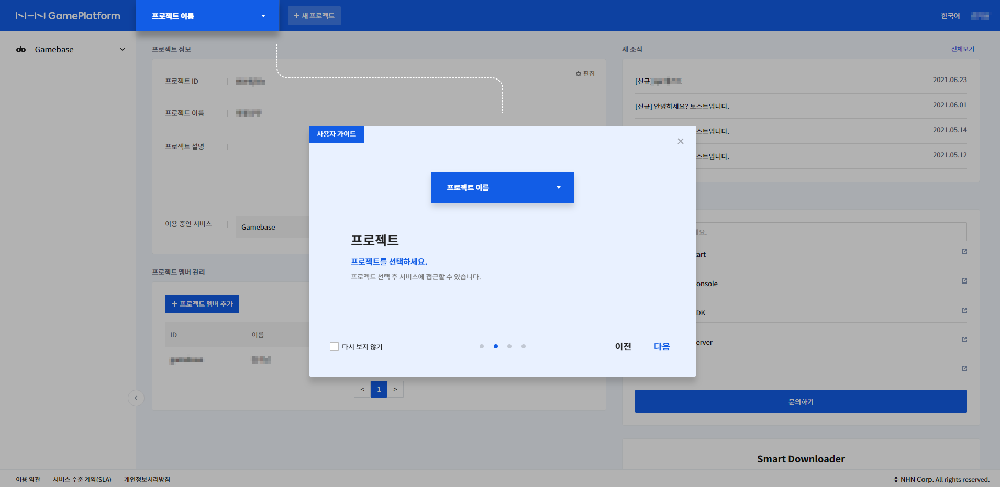
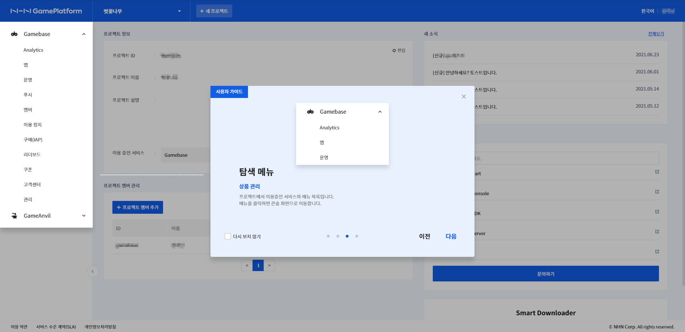
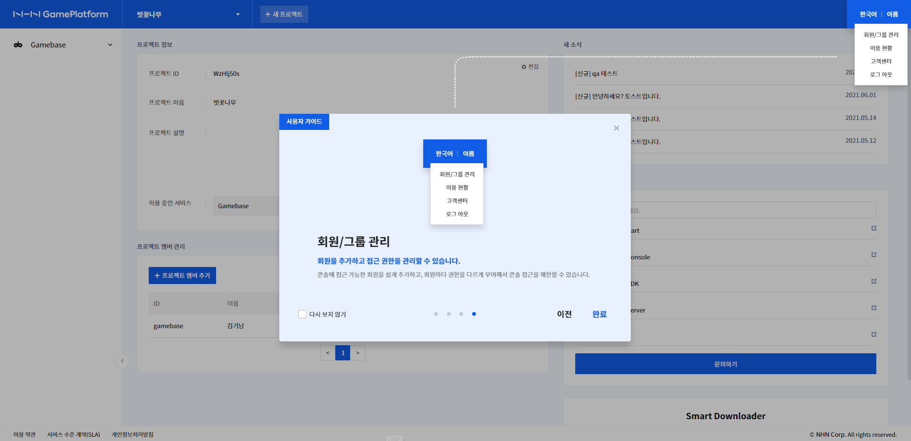

## Game > Gamebase > Console for AWS

AWS marketplace를 통해 회원가입을 한 사용자가 로그인하는 콘솔의 기본적인 설정과 사용 방법을 안내합니다.

Gamebase for AWS 의 콘솔은 아래와 같은 기능을 제공합니다.
* 프로젝트, 서비스 관리
* 서비스를 이용하는 회원 관리

## 퀵가이드

콘솔에서 제공하는 기본 기능에 대한 퀵 가이드입니다.

<!-- LLM_Image_DESC_20260408_185735
    유형: Screenshot
    내용: Gamebase for AWS 콘솔 퀵가이드 - 프로젝트 생성 단계
    구성: 좌측에 NHN Cloud GamePlatform 콘솔 사이드바(Gamebase 메뉴 트리)가 있고, 배경에 콘솔 대시보드가 보임. 중앙에 '프로젝트' 모달 팝업이 열려 있으며, '프로젝트 이름' 단계와 '+ 프로젝트 이름' 단계를 안내하는 위저드가 표시됨. '프로젝트를 생성합니다' 설명과 이전/다음 버튼이 있음
    Keyword: AWS Console, Console, Screenshot, 퀵가이드, 프로젝트 생성
-->

<!-- LLM_Image_DESC_20260408_185735
    유형: Screenshot
    내용: Gamebase for AWS 콘솔 퀵가이드 - 프로젝트 선택 단계
    구성: 이전 화면과 동일한 콘솔 레이아웃에서 중앙 모달 팝업에 '프로젝트 이름' 드롭다운이 표시되고, '프로젝트를 선택합니다' 안내 메시지와 함께 프로젝트 선택 단계를 설명. 이전/다음 버튼이 있음
    Keyword: AWS Console, Console, Screenshot, 퀵가이드, 프로젝트 선택
-->

<!-- LLM_Image_DESC_20260408_185735
    유형: Screenshot
    내용: Gamebase for AWS 콘솔 퀵가이드 - 활성 메뉴 안내 단계
    구성: 콘솔 좌측 사이드바에서 Gamebase/Analytics/운영 등의 메뉴가 보이고, 중앙에 '활성 메뉴' 팝업이 열려 있음. Gamebase, Analytics, 운영 항목이 리스트로 표시되며, '활성 메뉴' 설명과 이전/다음 버튼이 있음
    Keyword: AWS Console, Console, Screenshot, 퀵가이드, 활성 메뉴
-->

<!-- LLM_Image_DESC_20260408_185735
    유형: Screenshot
    내용: Gamebase for AWS 콘솔 퀵가이드 - 회원/그룹 관리 안내 단계
    구성: 콘솔 우측 상단에 '회원 > 회원 관리/그룹 관리' 메뉴가 펼쳐져 있고, 중앙에 '회원/그룹 관리' 팝업이 열려 있음. '회원을 추가하고 각각 권한을 관리할 수 있습니다' 안내 메시지가 표시되며, 이전/완료 버튼이 있음
    Keyword: AWS Console, Console, Screenshot, 퀵가이드, 회원 관리
-->
