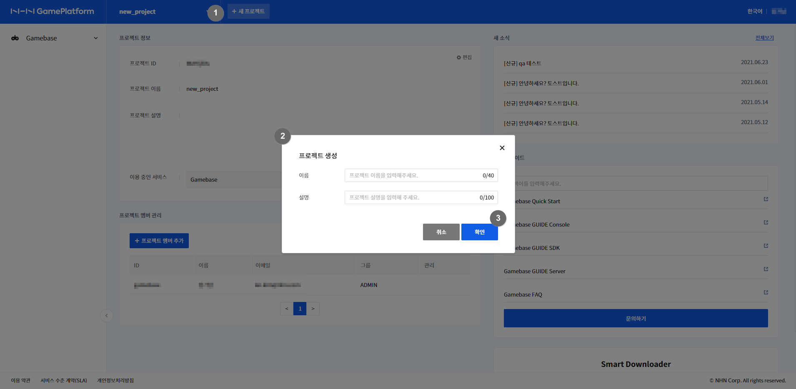
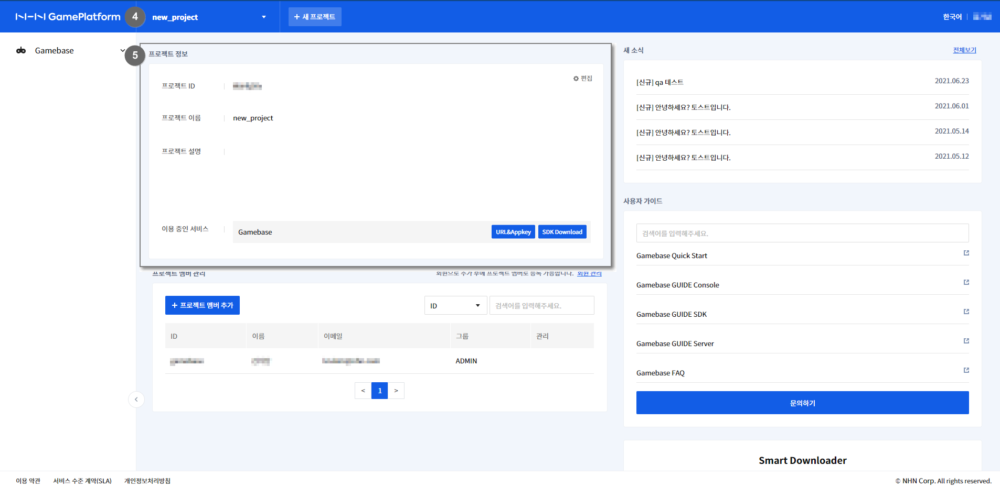

## 프로젝트 관리

Gamebase는 프로젝트 단위로 이용하여, 이에 따라 과금합니다.

### 프로젝트 생성

* aws marketplace페이지를 통해 가입한 관리자 회원만 프로젝트를 생성, 수정, 삭제 할 수 있습니다.
* 프로젝트 이름과 설명을 입력하면 프로젝트의 ID는 자동으로 생성됩니다.
* 프로젝트를 생성하면 Gamebase 서비스는 자동으로 활성화 됩니다.
* 프로젝트 생성 후 협업이 필요한 경우 프로젝트 멤버로 일반 회원을 추가할 수 있습니다.

<!-- LLM_Image_DESC_20260406
    유형: Screenshot
    내용: NHN GamePlatform 프로젝트 생성 팝업 화면
    구성: GamePlatform 콘솔에서 프로젝트 생성 대화상자가 표시됨. 이름과 프로젝트 설명 입력 필드, 확인/취소 버튼이 있으며 우측에는 Gamebase 관련 서비스 목록(Gamebase Quick Start, GUIDE Console 등)이 나열됨
    Keyword: 프로젝트, 생성, GamePlatform, 콘솔, AWS
-->

<!-- LLM_Image_DESC_20260406
    유형: Screenshot
    내용: NHN GamePlatform 프로젝트 대시보드 화면
    구성: 생성된 프로젝트의 대시보드 화면. 프로젝트 정보(이름, 설명, App ID), 프로젝트 멤버 관리 영역, 우측에 Gamebase 관련 서비스 바로가기(Gamebase Quick Start, GUIDE Console, SDK, Server 등) 목록이 표시됨
    Keyword: 프로젝트, 대시보드, GamePlatform, 콘솔, AWS
-->

1. **+새프로젝트** 버튼을 클릭하여 프로젝트를 생성합니다.
2. **프로젝트 이름**과 **프로젝트 설명**을 입력합니다.
3. **확인** 버튼을 클릭하여 프로젝트를 생성합니다.
4. 프로젝트가 생성되면 메뉴에 프로젝트 이름이 표시됩니다.
5. **대시보드** 화면에서 프로젝트 정보를 확인합니다.

### 프로젝트 편집

* 프로젝트 상세 화면의 우측 상단의 **편집** 버튼을 클릭하면 프로젝트 편집 화면이 표시됩니다.
* 편집 화면에서는 프로젝트 정보의 수정 및 삭제, 이용중인 서비스의 비활성화가 가능합니다.
* 프로젝트 이름과 설명은 수정 가능하나 프로젝트 ID는 수정이 불가능합니다.
* 프로젝트에서 이용 중인 서비스가 없을 경우에 프로젝트 삭제가 가능합니다.
* 프로젝트 삭제 시, 프로젝트의 모든 리소스는 삭제되며 복원이 불가능합니다.
	
### 프로젝트 변경

* 상단의 프로젝트 이름을 클릭하면 등록된 프로젝트 목록을 확인할 수 있습니다.
