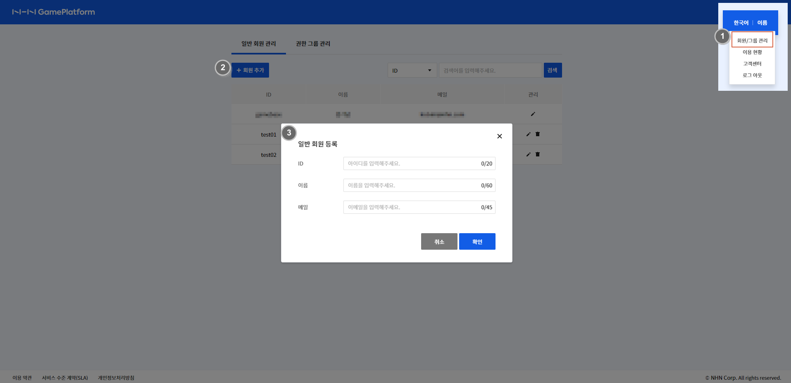
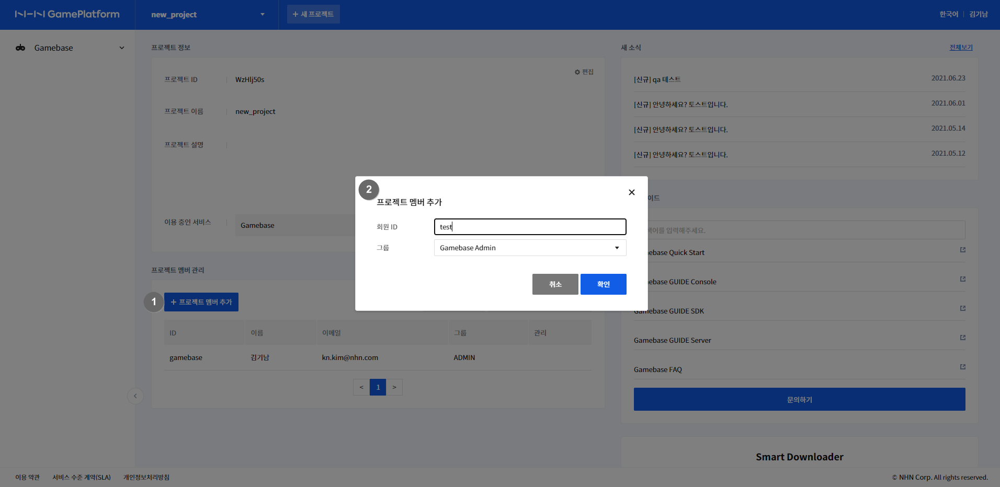
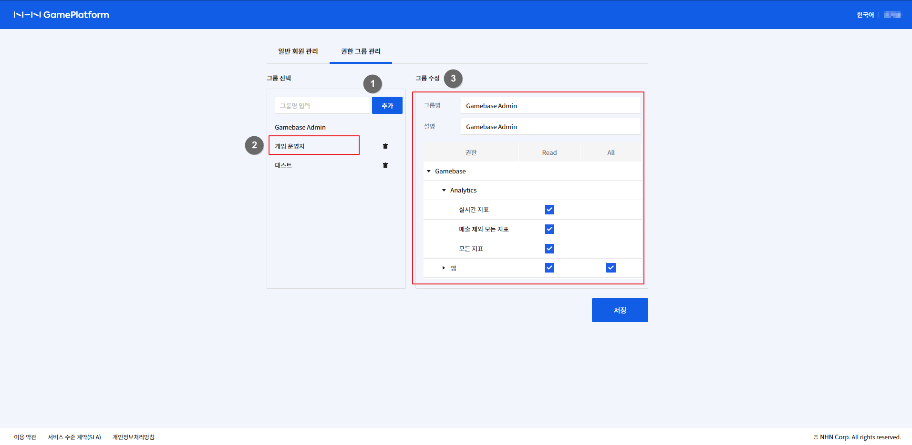

## 회원 

| 구분     | 관리자 | 일반 | 
| ------ | ------------ | ------------ | 
| 정의     | 프로젝트 관리 | 서비스 이용만 가능 | 
| 등록 방법 | aws marketplace 구독 페이지를 통해 가입  | 관리자가 콘솔에서 생성한 회원 | 
| 권한 | - 프로젝트 관리: 생성/수정/삭제 - 일반 회원 관리 | 권한이 부여된 서비스 콘솔에만 접근 | 

### 프로젝트에 일반 회원 추가하기

아래의 순서로 콘솔에 접근할 수 있는 일반 회원을 추가할 수 있습니다.
#### 1. 일반 회원 추가하기

<!-- LLM_Image_DESC_20260408_191856
    유형: Screenshot
    내용: Gamebase for AWS 콘솔 1. 일반 회원 추가하기 화면
    구성: Gamebase for AWS 콘솔의 1. 일반 회원 추가하기 기능 설정/조회 화면 스크린샷
    Keyword: AWS Console, Console, Screenshot, 1. 일반 회원 추가하기
-->

1. **이름 > 일반/그룹 관리** 클릭하면 일반 회원 관리 페이지가 표시됩니다.
2. **+회원 추가** 버튼을 클릭합니다.
3. ID, 이름, 메일을 입력하면 입력한 메일로 **비밀번호 설정 확인 메일**이 발송됩니다.
4. 전달받은 메일을 이용하여 비밀번호를 변경하면 추가된 ID로 로그인이 가능합니다.

#### 2. 프로젝트 멤버로 추가

<!-- LLM_Image_DESC_20260408_191856
    유형: Screenshot
    내용: Gamebase for AWS 콘솔 2. 프로젝트 멤버로 추가 화면
    구성: Gamebase for AWS 콘솔의 2. 프로젝트 멤버로 추가 기능 설정/조회 화면 스크린샷
    Keyword: AWS Console, Console, Screenshot, 2. 프로젝트 멤버로 추가
-->
1. 프로젝트 대시보드 화면에서 **+프로젝트 멤버 추가** 버튼을 클릭합니다.
2. 1에서 추가한 일반 회원 ID를 입력하고 그룹 권한을 부여하며 현재 프로젝트에 접근이 가능합니다.

### 그룹 권한 관리

일반 회원의 서비스 콘솔 접근 권한을 관리할 수 있습니다.
**이름 > 일반/그룹 관리** 클릭하여 권한 그룹 관리 페이지에서 권한 그룹의 생성, 수정, 삭제가 가능합니다.

<!-- LLM_Image_DESC_20260408_191856
    유형: Screenshot
    내용: Gamebase for AWS 콘솔 그룹 권한 관리 화면
    구성: Gamebase for AWS 콘솔의 그룹 권한 관리 기능 설정/조회 화면 스크린샷
    Keyword: AWS Console, Console, Screenshot, 그룹 권한 관리
-->
1. 추가하고자 하는 그룹명을 입력하고 **추가** 버튼을 클릭합니다.
2. 추가된 그룹명을 선택하면 화면의 오른쪽에 그룹의 권한을 수정할 수 있는 화면이 표시됩니다.
3. 그룹 수정 화면에서 서비스 메뉴별로 Read, ALL 권한 부여가 가능합니다. 부여하고자 하는 권한 체크후 저장 버튼을 클릭합니다.
