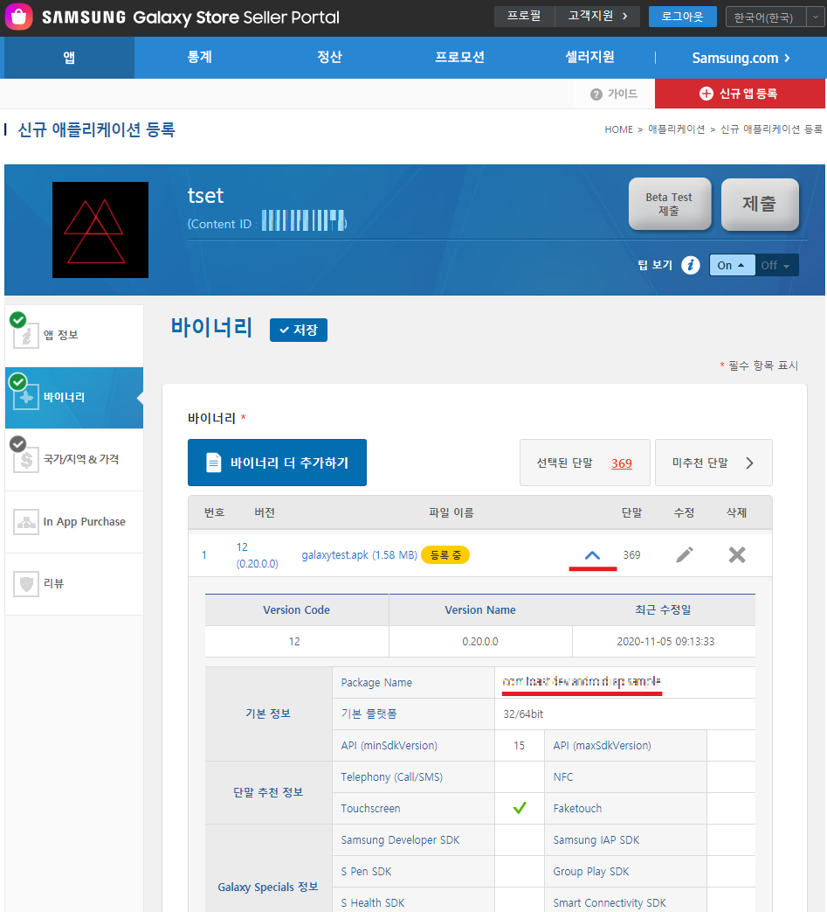
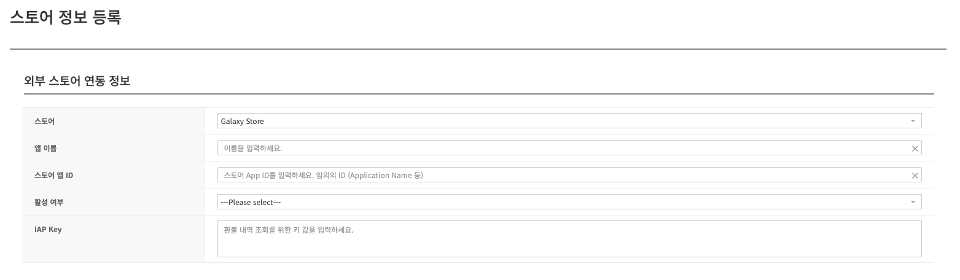
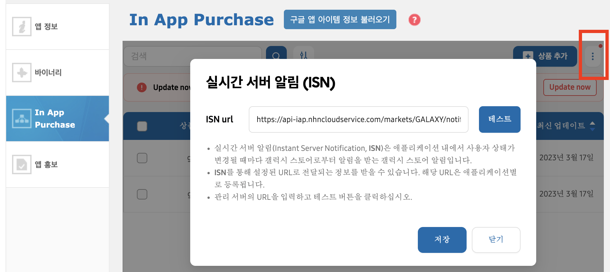

## Game > Gamebase > 스토어 콘솔 가이드 > Galaxy 콘솔 가이드

IAP에서 Galaxy Store를 연동하려면 앱 등록 시, PackageName과 IAP Public Key를 입력해야 합니다.

## Package Name 확인하기
* [Galaxy Store Seller Portal](https://seller.samsungapps.com/main/sellerMain.as) 에서 바이너리 파일 등록 후, 패키지명을 확인합니다. 
* Galaxy Store Seller Portal > 앱 > 앱 선택 > 바이너리
 
<!-- LLM_Image_DESC_20260616_110448
    유형: 콘솔 스크린샷
    내용: Galaxy Store Seller Portal의 신규 애플리케이션 등록 > 바이너리 화면에서 Package Name 위치를 안내
    구성: 좌측 메뉴(앱 정보/바이너리/국가·지역&가격/In App Purchase/리뷰), 우측 바이너리 목록(galaxytest.apk, 버전 12, 0.20.0.0)과 펼쳐진 기본 정보 영역. 기본 정보의 Package Name 항목(com.toast.dev.android.iap.sample)이 빨간 밑줄로 강조되어 있음
    Keyword: Galaxy Store, Seller Portal, 바이너리, Package Name, 패키지명
-->
 

## IAP Public Key 생성하기
> [참고]
> https://developer.samsung.com/iap/isn/requirements.html#Create-an-IAP-key-in-Seller-Portal

* [Galaxy Store Seller Portal](https://seller.samsungapps.com/main/sellerMain.as) > 셀러지원 > IAP 서비스 > IAP Key > IAP Key 만들기

## 콘솔에서 정보 입력하기
[NHN Cloud 콘솔](https://console.nhncloud.com/)에서 조직 및 프로젝트를 선택하고 <strong>Game > Gamebase > 구매(IAP) > 스토어 > 등록</strong> 또는 <strong>Galaxy Store를 선택하고 [수정]</strong>을 클릭합니다.

* 스토어 : Galaxy Store 앱 Package Name 입력
* IAP Key : IAP Key에서 생성한 Public Key 입력


<!-- LLM_Image_DESC_20260616_110448
    유형: 콘솔 스크린샷
    내용: NHN Cloud 콘솔의 '스토어 정보 등록 > 외부 스토어 연동 정보' 입력 폼
    구성: 스토어(Galaxy Store 선택), 앱 이름, 스토어 앱 ID(Package Name 입력), 활성 여부(Please select), IAP Key(판매 내역 조회를 위한 키 값 입력) 항목으로 구성된 입력 폼
    Keyword: NHN Cloud 콘솔, 외부 스토어 연동, 스토어 앱 ID, IAP Key, Package Name
-->


## 실시간 서버 알림 (ISN) 등록
* 앱 > 앱 선택 > <strong>In App Purchase</strong> > 더보기 > <strong>실시간 서버 알림 (ISN)</strong>

<!-- LLM_Image_DESC_20260616_110448
    유형: 콘솔 스크린샷
    내용: Galaxy Store Seller Portal In App Purchase 화면의 실시간 서버 알림(ISN) 설정 팝업
    구성: 좌측 메뉴(앱 정보/바이너리/In App Purchase/앱 홍보), 우측 상단 더보기(점 3개) 버튼이 빨간 박스로 강조됨. 중앙 ISN 팝업에 ISN url 입력란(https://api-iap.nhncloudservice.com/markets/GALAXY/noti...)과 테스트/저장/닫기 버튼, ISN 설명 문구 표시
    Keyword: ISN, 실시간 서버 알림, Instant Server Notification, In App Purchase, Galaxy Store
-->

* ISN url: ```https://api-iap.nhncloudservice.com/markets/GALAXY/notification/{Galaxy Store Package Name}/receive```
* Gamebase 샌드박스를 사용하고 있다면 ISN url은 ```https://sandbox-api-iap.nhncloudservice.com/markets/GALAXY/notification/{Galaxy Store Package Name}/receive``` 입력
