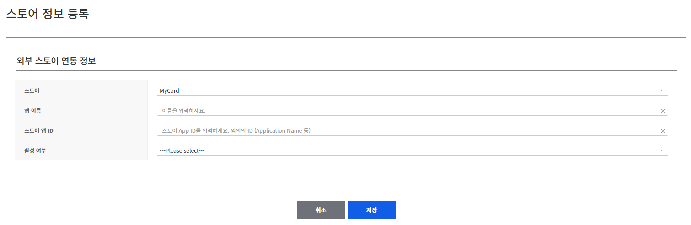

## Game > Gamebase > 스토어 콘솔 가이드 > MyCard 콘솔 가이드

## MyCard 스토어 등록

- MyCard에서는 고객사가 로그인 가능한 웹콘솔을 제공하지 않습니다. (2023년 7월 기준)
- MyCard 연동은 NHN Cloud IAP 콘솔에 입력한 정보를 기준으로 처리 됩니다.
- 따라서 MyCard와 입력할 정보에 대해서 사전에 협의 해 주시기 바랍니다.
```
1. 아래 화면에서 입력된 App Name과 Store App ID 는 결제 처리 시 MyCard의 facGameName 과 facGameId 항목으로 연동됩니다.
 - MyCard에 문의 하실 경우 facGameName 과 facGameId 으로 문의해 주시기 바랍니다.
 - 반드시 정확하게 입력해 주시기 바랍니다.
2. Live 중인 게임일 경우 아래 화면에서 App Name과 Store App ID를 수정하면 결제 오류 및 장애발생의 원인이 될 수 있습니다.
 - 반드시 서비스 Live 전에 정상 입력 여부를 확인하시기 바랍니다.  
```

<!-- LLM_Image_DESC_20260408_191856
    유형: Screenshot
    내용: MyCard 스토어 콘솔 MyCard 스토어 등록 화면 #01
    구성: MyCard 스토어 콘솔의 MyCard 스토어 등록 기능 설정/조회 화면 스크린샷
    Keyword: MyCard, Console, Screenshot, MyCard 스토어 등록
-->