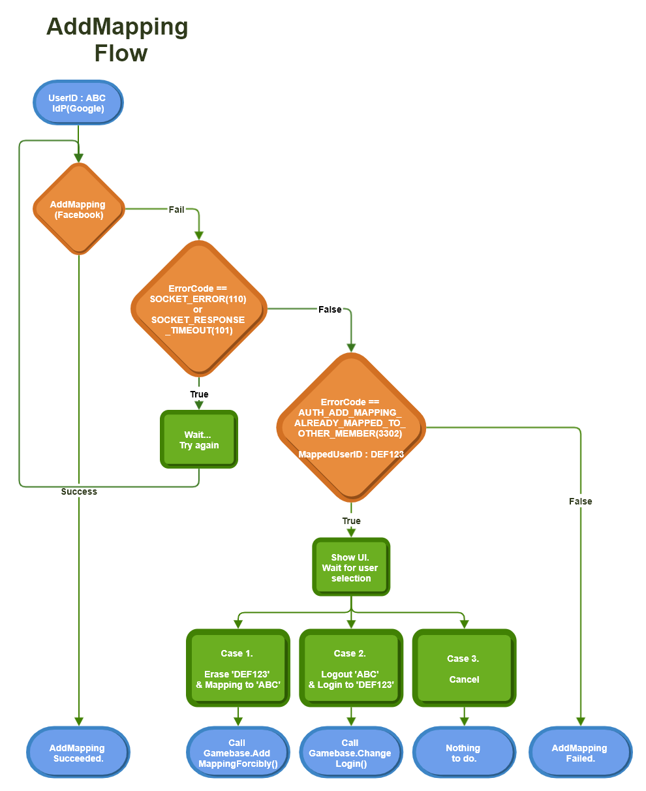

## Mapping

매핑은 기존에 로그인된 계정에 다른 IdP의 계정을 연동하거나 해제시키는 기능입니다.

대다수의 게임에서는 게임 유저 계정 하나에 여러 IdP를 연동(매핑)할 수 있습니다.<br/>Gamebase의 매핑 API를 사용하면 기존에 로그인된 계정에 다른 IdP 계정을 연동하거나 해제할 수 있습니다.

즉, 연동 중인 IdP 계정으로 로그인을 시도하면 항상 같은 사용자 ID로 로그인됩니다.<br/><br/>

주의할 점은, IdP마다 하나의 계정만 연동할 수 있다는 점입니다.<br/>
예를 들어 Google 계정을 연동 중이면, 다른 Google 계정을 추가로 연동할 수 없습니다.<br/>
계정 연동 예시는 다음과 같습니다.<br/><br/>

* Gamebase 사용자 ID: 123bcabca
    * Google ID: aa
    * Facebook ID: bb
    * AppleGameCenter ID: cc
* Gamebase 사용자 ID: 456abcabc
    * Google ID: ee
    * Google ID: ff **-> 이미 Google ee 계정이 연동 중이므로 Google 계정을 추가로 연동할 수 없습니다.**

매핑 API에는 매핑 추가와 매핑 해제 API가 있습니다.

> <font color="red">[주의]</font><br/>
>
> Guest 로그인 중에 매핑을 성공하면 Guest IdP는 사라집니다.
>

### Add Mapping Flow

매핑은 다음 순서로 구현할 수 있습니다.


<!-- LLM_Image_DESC_20260406
    유형: Flowchart
    내용: AddMapping(계정 연동 추가) 흐름도
    구성: Login 후 AddMapping 호출, 성공/실패 분기, SOCKET_RESPONSE_TIMEOUT 에러 처리 및 Retry 로직, 실패 시 Case 1(이미 연동된 IdP) Case 2(Logout 후 Login) Case 3(Nothing) Case 4(Cancel) 등 다양한 분기 처리를 보여주는 플로우차트
    Keyword: 매핑, AddMapping, 계정연동, 인증, 플로우차트, Gamebase
-->

#### 1. 로그인
매핑은 현재 계정에 IdP 계정 연동을 추가하는 것이므로 우선 로그인이 돼 있어야 합니다.
먼저 로그인 API를 호출해 로그인합니다.

#### 2. 매핑

**[TCGBGamebase addMappingWithType:viewController:completion:]**을 호출해 매핑을 시도합니다.

#### 2-1. 매핑이 성공한 경우

* 축하합니다! 현재 계정과 연동 중인 IdP 계정이 추가되었습니다.
* 매핑에 성공해도 '현재 로그인 중인 IdP'가 바뀌지는 않습니다. 즉, Gamecenter 계정으로 로그인한 후, Facebook 계정 매핑 시도가 성공했다고 해서 '현재 로그인 중인 IdP'가 Gamecenter에서 Facebook으로 변경되지는 않습니다. Gamecenter 상태로 유지됩니다.
    * <font color="red">[주의]</font><br/>: Guest 계정은 예외입니다. Guest 계정으로 로그인한 상태에서 시도한 매핑이 성공했다면 Guest IdP는 **삭제**되고 '현재 로그인 중인 IdP'도 매핑된 IdP로 변경됩니다.
* 매핑은 단순히 IdP 연동만 추가해 줍니다.

#### 2-2. 매핑이 실패한 경우

* 네트워크 오류
    * 오류 코드가 **TCGB_ERROR_SOCKET_ERROR(110)** 또는 **TCGB_ERROR_SOCKET_RESPONSE_TIMEOUT(101)**인 경우, 일시적인 네트워크 문제로 인증이 실패한 것이므로 **[TCGBGamebase addMappingWithType:viewController:completion:]**을 다시 호출하거나, 잠시 대기했다가 재시도 합니다.
* 이미 다른 계정에 연동 중일 때 발생하는 오류
    * 오류 코드가 **TCGB_ERROR_AUTH_ADD_MAPPING_ALREADY_MAPPED_TO_OTHER_MEMBER(3302)**인 경우, 매핑하려는 IdP의 계정이 이미 다른 계정에 연동 중이라는 뜻입니다. 이때 획득한 **ForcingMappingTicket**으로 강제 매핑(**[TCGBGamebase addMappingForciblyWithTicket:viewController:completion:]**)이나 로그인 계정 변경(**[TCGBGamebase changeLoginWithForcingMappingTicket:viewController:completion:]**)을 시도할 수 있습니다.
* 이미 동일한 IdP 계정에 연동돼 발생하는 오류
	* 오류 코드가 **TCGB_ERROR_AUTH_ADD_MAPPING_ALREADY_HAS_SAME_IDP(3303)** 인 경우 매핑하려는 IdP와 같은 종류의 계정이 이미 연동 중이라는 뜻입니다.
	* Gamebase 매핑은 한 IdP당 하나의 계정만 연동 가능합니다. 예를 들어 Google 계정에 이미 연동 중이라면 더 이상 Google 계정을 추가할 수 없습니다.
	* 동일 IdP의 다른 계정을 연동하기 위해서는 **[TCGBGamebase removeMappingWithType:viewController:completion:]**을 호출해 연동을 해제한 후 다시 매핑을 시도하세요.
* 그 외의 오류
    * 매핑 시도가 실패했습니다.

### Import Header file into ViewController

매핑을 구현하고자 하는 ViewController에 다음의 헤더 파일을 가져옵니다.

```objectivec
#import <Gamebase/Gamebase.h>
```


### Add Mapping API

특정 IdP에 로그인된 상태에서 다른 IdP로 매핑을 시도합니다.<br/>

* additionalInfo 파라미터 설정 방법

| keyname                                  | a use                          | 값 종류                           |
| ---------------------------------------- | ------------------------------ | ------------------------------ |
|kTCGBAuthLoginWithCredentialLineChannelRegionKeyname | LINE 서비스 제공 지역 중 로그인을 수행할 하나의 지역 | [Login with IdP 참고](./ios-authentication-Login.md#login-with-idp)|

**API**

```objectivec
+ (void)addMappingWithType:(NSString *)type viewController:(UIViewController *)viewController completion:(LoginCompletion)completion;
+ (void)addMappingWithType:(NSString *)type additionalInfo:(nullable NSDictionary<NSString *, id> *)additionalInfo viewController:(UIViewController *)viewController completion:(LoginCompletion)completion;
```

**Example**

다음은 Facebook에 매핑을 시도하는 예시입니다.

```objectivec
- (void)authAddMapping {
    [TCGBGamebase addMappingWithType:kTCGBAuthFacebook viewController:parentViewController completion:^(TCGBAuthToken *authToken, TCGBError *error) {
        if ([TCGBGamebase isSuccessWithError:error] == YES) {
            NSLog(@"AddMapping is succeeded.");
        } else if (error.code == TCGB_ERROR_SOCKET_ERROR || error.code == TCGB_ERROR_SOCKET_RESPONSE_TIMEOUT) {
            NSLog(@"Retry addMapping");
        } else if (error.code == TCGB_ERROR_AUTH_ADD_MAPPING_ALREADY_MAPPED_TO_OTHER_MEMBER) {
            NSLog(@"Already mapped to other member");
        } else {
            NSLog(@"AddMapping Error - %@", [error description]);
        }
    }];
}
```

### AddMapping with Credential

게임에서 직접 IdP에서 제공하는 SDK로 먼저 인증하고 발급 받은 Access Token 등을 이용하여, Gamebase AddMapping을 할 수 있는 인터페이스입니다.


* Credential 파라미터 설정 방법


| keyname                                  | a use                          | 값 종류                           |
| ---------------------------------------- | ------------------------------ | ------------------------------ |
| kTCGBAuthLoginWithCredentialProviderNameKeyname | IdP 유형 설정                      | facebook, iosgamecenter, naver, google, twitter, line, appleid |
| kTCGBAuthLoginWithCredentialAccessTokenKeyname | IdP 로그인 이후 받은 인증 정보(Access Token) 설정 |                                |


> [참고]
>
> 게임 내에서 외부 서비스(Facebook 등)의 고유 기능을 사용해야 할 때 필요할 수 있습니다.
>

<br/>


> <font color="red">[주의]</font><br/>
>
> 외부 SDK에서 요구하는 개발 사항은 외부 SDK의 API를 사용해 구현해야 하며, Gamebase에서는 지원하지 않습니다.
>

**API**

```objectivec
+ (void)addMappingWithCredential:(NSDictionary *)credentialInfo viewController:(UIViewController *)viewcontroller completion:(LoginCompletion)completion;
```

**Example**

```objectivec
- (void)authAddMappingCredential {
    UIViewController* topViewController = nil;

    NSString* facebookAccessToken = @"FACEBOOK_ACCESS_TOKEN";
    NSMutableDictionary* credentialInfo = [NSMutableDictionary dictionary];
    credentialInfo[kTCGBAuthLoginWithCredentialProviderNameKeyname] = kTCGBAuthFacebook;
    credentialInfo[kTCGBAuthLoginWithCredentialAccessTokenKeyname] = facebookAccessToken;

    [TCGBGamebase addMappingWithCredential:credentialInfo viewController:topViewController completion:^(TCGBAuthToken *authToken, TCGBError *error) {
        if ([TCGBGamebase isSuccessWithError:error] == YES) {
            NSLog(@"AddMapping is succeeded.");
        }
        else if (error.code == TCGB_ERROR_SOCKET_ERROR || error.code == TCGB_ERROR_SOCKET_RESPONSE_TIMEOUT) {
            NSLog(@"Retry addMapping");
        }
        else if (error.code == TCGB_ERROR_AUTH_ADD_MAPPING_ALREADY_MAPPED_TO_OTHER_MEMBER) {
            NSLog(@"Already mapped to other member");
        }
        else {
            NSLog(@"AddMapping Error - %@", [error description]);
        }
    }];
}
```

### Add Mapping Forcibly
특정 IdP에 이미 매핑되어있는 계정이 있을 때, **강제로** 매핑을 시도합니다.
**강제 매핑**을 시도할 때는 AddMapping API에서 획득한 `ForcingMappingTicket`이 필요합니다.

**API**

```objectivec
+ (void)addMappingForciblyWithTicket:(TCGBForcingMappingTicket *)ticket viewController:(nullable UIViewController *)viewController completion:(LoginCompletion)completion;
```

**Example**

다음은 Facebook에 강제 매핑을 시도하는 예시입니다.

```objectivec
- (void)authAddMappingForcibly {
    [TCGBGamebase addMappingWithType:kTCGBAuthFacebook viewController:parentViewController completion:^(TCGBAuthToken *authToken, TCGBError *error) {
        if ([TCGBGamebase isSuccessWithError:error] == YES) {
            NSLog(@"AddMapping is succeeded.");
        } else if (error.code == TCGB_ERROR_SOCKET_ERROR || error.code == TCGB_ERROR_SOCKET_RESPONSE_TIMEOUT) {
            NSLog(@"Retry addMapping");
        } else if (error.code == TCGB_ERROR_AUTH_ADD_MAPPING_ALREADY_MAPPED_TO_OTHER_MEMBER) {
            NSLog(@"Already mapped to other member");
            TCGBForcingMappingTicket* ticket = [TCGBForcingMappingTicket forcingMappingTicketFromError:error];
            [TCGBGamebase addMappingForciblyWithTicket:ticket viewController:self completion:^(TCGBAuthToken *authToken, TCGBError *error) {
                if ([TCGBGamebase isSuccessWithError:error]) {
                    // Mapping success.
                }
                else {
                    // Mapping failed.
                }
            }];
        } else {
            NSLog(@"AddMapping Error - %@", [error description]);
        }
    }];
}
```

### Change Login with ForcingMappingTicket

특정 IdP에 이미 매핑되어 있는 계정이 있을 때, **로그인 계정을 변경**합니다.
**로그인 계정을 변경**할 때는 AddMapping API에서 획득한 `ForcingMappingTicket`이 필요합니다.

Change Login API 호출이 실패하는 경우, 이전 계정의 로그인 상태가 유지됩니다.

**API**

```objectivec
+ (void)changeLoginWithForcingMappingTicket:(TCGBForcingMappingTicket *)ticket viewController:(nullable UIViewController *)viewController completion:(LoginCompletion)completion;
```

**Example**

다음은 Facebook에 로그인 계정 변경을 시도하는 예시입니다.

```objectivec
- (void)authChangeLogin {
    [TCGBGamebase addMappingWithType:kTCGBAuthFacebook viewController:parentViewController completion:^(TCGBAuthToken *authToken, TCGBError *error) {
        if ([TCGBGamebase isSuccessWithError:error] == YES) {
            NSLog(@"AddMapping is succeeded.");
        } else if (error.code == TCGB_ERROR_SOCKET_ERROR || error.code == TCGB_ERROR_SOCKET_RESPONSE_TIMEOUT) {
            NSLog(@"Retry addMapping");
        } else if (error.code == TCGB_ERROR_AUTH_ADD_MAPPING_ALREADY_MAPPED_TO_OTHER_MEMBER) {
            NSLog(@"Already mapped to other member");
            TCGBForcingMappingTicket* ticket = [TCGBForcingMappingTicket forcingMappingTicketFromError:error];
            [TCGBGamebase changeLoginWithForcingMappingTicket:ticket viewController:self completion:^(TCGBAuthToken *authToken, TCGBError *error) {
                if ([TCGBGamebase isSuccessWithError:error]) {
                    // Change login successed.
                }
                else {
                    // Change login failed.
                    // The login status of the previous account is maintained.
                }
            }];
        } else {
            NSLog(@"AddMapping Error - %@", [error description]);
        }
    }];
}
```

### Remove Mapping API

특정 IdP에 대한 연동을 해제합니다. <br/>
만약, 해제하고자 하는 IdP가 **유일한 IdP**라면, 실패를 반환합니다.<br/>
연동 해제 후에는 Gamebase 내부에서, 해당 IdP에 대한 로그아웃을 처리합니다.

```objectivec
[TCGBGamebase removeMappingWithType:kTCGBAuthFacebook viewController:topViewController completion:^(TCGBError *error) {
    if ([TCGBGamebase isSuccessWithError:error] == YES) {
        // To Remove Mapping Succeeded
    } else {
        // To Remove Mapping Failed cause of the error
    }
}];
```

### Get IdP Mapping List
현재의 계정이 어떤 IdP들과 매핑되어 있는지 목록을 확인할 수 있습니다.

```objectivec
// Obtaining Names of Mapping IdPs
NSArray* authMappingList = [TCGBGamebase authMappingList];
```
