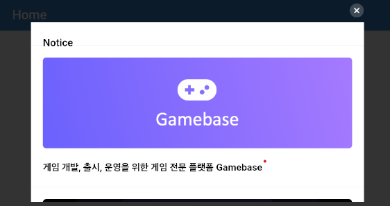

## Game > Gamebase > iOS SDK 사용 가이드 > UI

## GameNotice

콘솔에 이미지와 함께 등록한 공지 사항을 표시하는 기능입니다.

 
<!-- LLM_Image_DESC_20260406
    유형: UI
    내용: 게임 내 공지사항 목록 화면 예시
    구성: 모바일 화면에 Notice 제목의 공지사항 목록이 표시됨. Gamebase 로고와 설명 배너, 글로벌 진출 안내 배너, NHN GamePlatform 홍보 배너 등 여러 공지 항목이 카드 형태로 세로 나열됨
    Keyword: 게임공지, GameNotice, 공지사항, UI, Gamebase
-->

<!-- LLM_Image_DESC_20260406
    유형: UI
    내용: 게임 내 공지사항 상세 화면 예시
    구성: Notice 제목 하단에 Gamebase 로고가 포함된 보라색 배너와 "게임 개발, 출시, 운영을 위한 게임 전문 플랫폼 Gamebase" 설명 텍스트가 표시된 단일 공지 상세 화면
    Keyword: 게임공지, GameNotice, 공지상세, UI, Gamebase
-->

### Open GameNotice

게임 공지를 화면에 표시합니다.

#### Required 파라미터
* viewController: 게임 공지가 노출되는 ViewController입니다.
 
#### Optional 파라미터
* completion: 게임 공지가 종료될 때 사용자에게 콜백으로 알려 줍니다.

**API**

```objectivec
+ (void)openGameNoticeWithViewController:(nullable UIViewController *)viewController
                              completion:(nullable void(^)(TCGBError * _Nullable))completion;
```

**ErrorCode**

| Error | Error Code | Description |
| --- | --- | --- |
| TCGB\_ERROR\_NOT\_INITIALIZED | 1 | Gamebase가 초기화되어 있지 않습니다. |
| TCGB\_ERROR\_UI\_GAME\_NOTICE\_FAIL\_INVALID\_URL | 6941 | 게임 공지 URL 생성에 실패했습니다. |
| TCGB\_ERROR\_WEBVIEW\_TIMEOUT | 7002 | 약관 웹뷰 표시 중 타임아웃이 발생했습니다. |
| TCGB\_ERROR\_WEBVIEW\_HTTP\_ERROR | 7003 | 약관 웹뷰 오픈 중 HTTP 에러가 발생하였습니다. |

**Example**

```objectivec
- (void)openGameNotice {
    void(^completion)(TCGBError *) = ^(TCGBError *error) {
        // Called when the entire gameNotice is closed.
        NSLog(@"GameNotice closed");
    };

    [TCGBGameNotice openGameNoticeWithViewController:self completion:completion];
}
```
