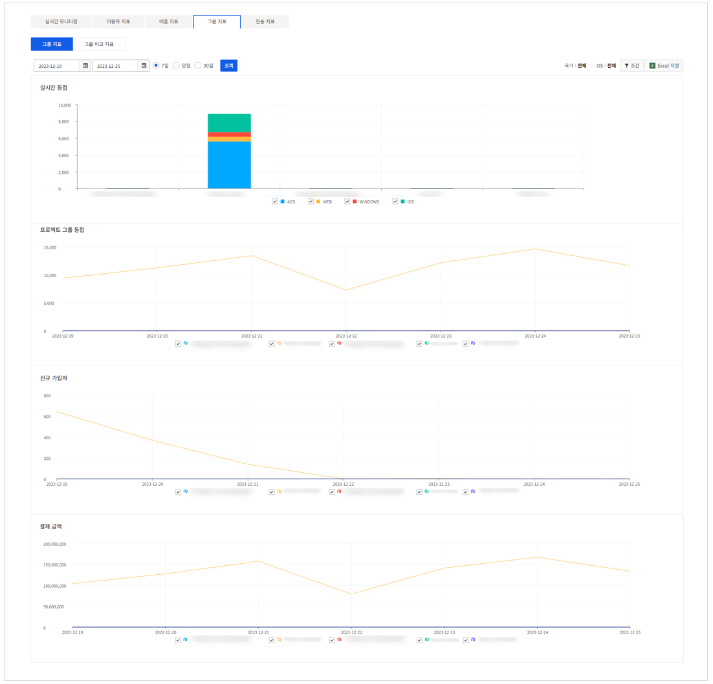
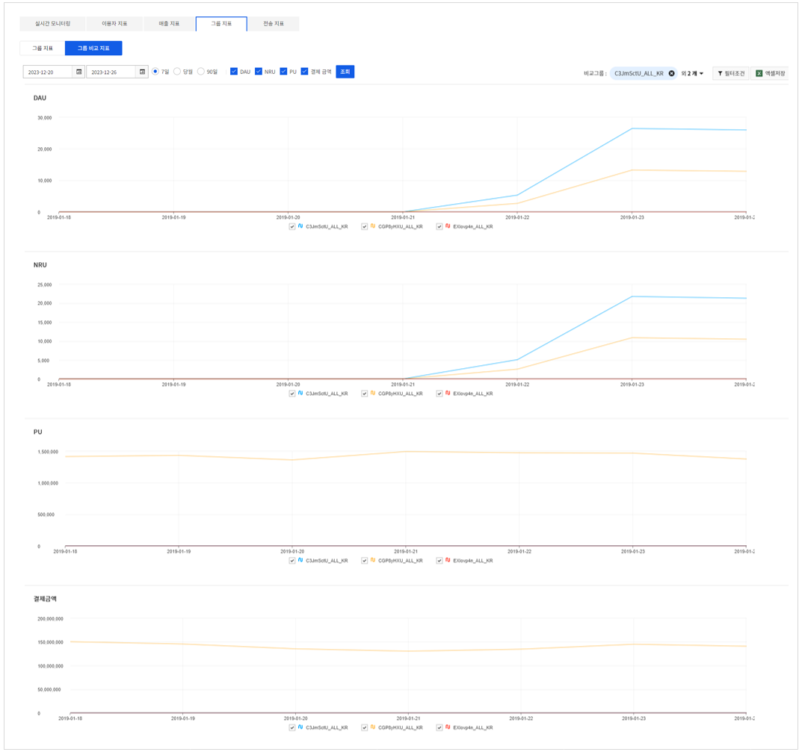

## Concurrent Group User
### Concurrent Group User

<!-- LLM_Image_DESC_20260408_185735
    유형: Screenshot
    내용: Gamebase Analytics 콘솔 Concurrent Group User 화면 #14
    구성: Gamebase Analytics 콘솔의 Concurrent Group User 기능 설정/조회 화면 스크린샷
    Keyword: Analytics, Console, Screenshot, Concurrent Group User
-->

Gamebase 서비스 이용자가 속한 모든 프로젝트의 동접 지표를 확인할 수 있습니다.

* 실시간 그룹 동접: Gamebase 서비스 이용자가 속한 프로젝트의 실시간 동접자(CCU)를 나타냅니다.
* 프로젝트 그룹 동접: 선택된 기간, 필터를 기준으로 앱 이용자 수가 나타납니다.

### Group Comparison

<!-- LLM_Image_DESC_20260408_185735
    유형: Screenshot
    내용: Gamebase Analytics 콘솔 Group Comparison 화면 #15
    구성: Gamebase Analytics 콘솔의 Group Comparison 기능 설정/조회 화면 스크린샷
    Keyword: Analytics, Console, Screenshot, Group Comparison
-->

Gamebase 서비스 이용자가 속한 프로젝트들을 필터와 조합하여 그룹으로 비교할 수 있습니다.

* DAU: 일간 memberno 기준 로그인 1회 이상 액티브 이용자 수 (Daily Active Users)
* NRU: 당일 신규 가입자
* PU: 유료상품을 결제한 이용자 (Paying User). (=재구매 PU + 신규 PU)
* 결제금액: 이용자가 결제한 결제금액

※ 그래프에 표시되는 그룹명은 **{appId} _ {OS} _ {국가}** 형태입니다.
