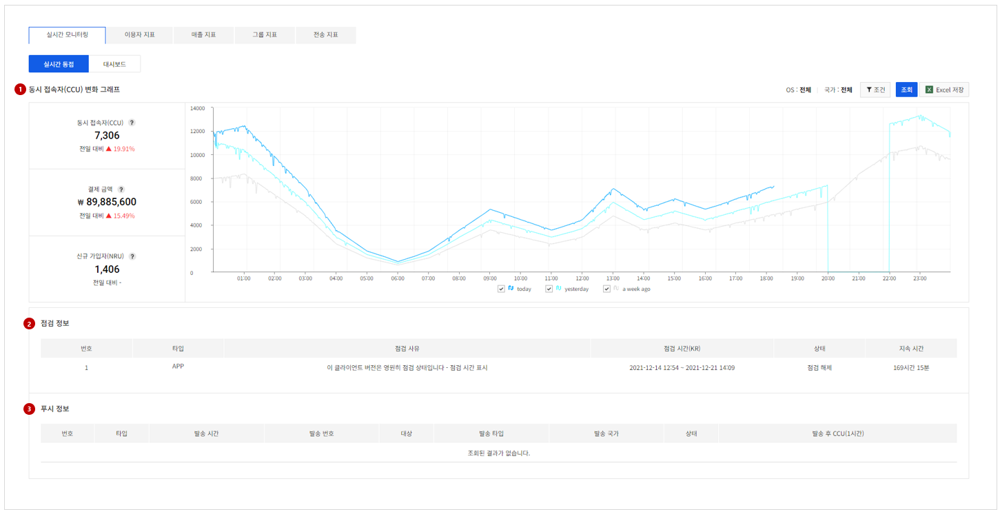
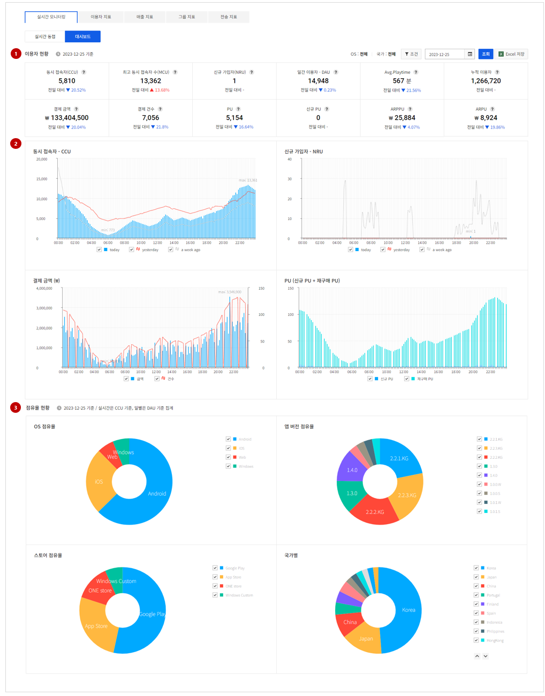

## Game > Gamebase > 콘솔 사용 가이드 > Analytics

앱 이용자의 현황, 매출과 관련된 지표들을 표와 그래프로 확인할 수 있습니다.
Analytics는 다음의 메뉴로 구성되어 있습니다.

* 실시간 모니터링: 앱 이용자들의 실시간 동접 및 실시간 결제 지표
* 이용자 지표: 앱 이용자들 중심의 기본 지표(DAU, MCU, NRU) 및 환경, 유입/유출, Retention과 같은 지표
* 매출 지표: 앱의 매출 관련 지표
* 그룹 동접: Gamebase 서비스 이용자가 속한 프로젝트의 그룹 동접과 그룹별 기본 지표
* 이용 환경: 설치 URL 호출에 대한 통계 지표

## Real-time Monitoring
### Concurrent User

<!-- LLM_Image_DESC_20260408_191856
    유형: Screenshot
    내용: Gamebase Analytics 콘솔 Concurrent User 화면 #01
    구성: Gamebase Analytics 콘솔의 Concurrent User 기능 설정/조회 화면 스크린샷
    Keyword: Analytics, Console, Screenshot, Concurrent User
-->

현재 앱 이용자의 실시간 동접 지표 및 점검, 푸시 정보를 확인할 수 있습니다.

#### 1. 실시간 동접(CCU) 변화 그래프
1분마다 데이터를 갱신하여, 실시간으로 변경된 지표를 확인할 수 있습니다.
모바일의 경우 10분 단위의 지표를 노출하므로 PC와 다소 차이가 있을 수 있습니다.

* 동시 접속자(CCU): 1분 단위로 측정된 실시간 동시 접속자 수 (로그인 이용자 수)
* 결제금액: 당일 0시~24시까지 이용자가 Gamebase에서 결제한 금액의 합으로 환불, 결제 취소 등의 정보가 포함되지 않은 순수 결제 금액을 말합니다.
* 신규 가입자(NRU): 신규 가입자. 당일 0시~24시까지 로그인 로그가 최초 수집된 유저 (memberno 기준)

#### 2. 점검 정보
당일 0시~24시까지 Gamebase에 등록된 점검 정보

#### 3. 푸시 정보
당일 0시~24시까지 Gamebase에 발송된 PUSH 정보

### Dashboard

<!-- LLM_Image_DESC_20260408_191856
    유형: Screenshot
    내용: Gamebase Analytics 콘솔 Dashboard 화면 #02
    구성: Gamebase Analytics 콘솔의 Dashboard 기능 설정/조회 화면 스크린샷
    Keyword: Analytics, Console, Screenshot, Dashboard
-->

실시간 이용자 현황에 대한 여러 지표를 한눈에 확인할 수 있습니다.

#### 1. 실시간 이용자 현황
앱 이용자 및 결제 관련 지표를 확인할 수 있습니다.
선택된 일자가 오늘이면 10분마다 갱신되고, 이전 날이면 해당 일의 지표를 보여줍니다.

* 동시 접속자(CCU): 10분 단위로 측정된 실시간 동시 접속자 수 (로그인 이용자 수)
* 최대 동접자(MCU): 0시~24시까지 최대 동접자 수 (1분 단위 CCU 중 가장 큰 값)
* 신규 가입자(NRU): 당일 0시 ~ 24시까지, 로그인 로그가 최초 수집된 신규 유저 (memberno 기준)
* 일 사용자(DAU): 일간 memberno 기준 로그인 1회 이상 액티브 이용자 수 (Daily Active Users)
* avg.Playtime: 일자별 전체 Playtime의 평균 (DAU의 Playtime의 합 / DAU)
* 누적 이용자: Gamebase 설치 후 가입된 전체 누적 유저 수 (memberno 기준)
* 결제금액: 0시~24시까지 이용자가 결제한 총 결제금액
* 결제 건수: 0시~24시까지 이용자의 총 결제 건수
* PU: 유료상품을 결제한 이용자 (Paying User). (=재구매 PU + 신규 PU)
* 신규 PU (NPU): 유료 상품을 처음 결제한 이용자 (New Paying Users)
* ARPPU: 결제 이용자 (PU) 1인이 결제한 평균 결제금액 (=결제금액/PU)
* ARPU: 게임 이용자 (DAU) 1인이 결제한 평균 결제금액 (=결제금액/DAU)

※ MCU, ACU, ARPU의 경우 필터가 전체일 경우만 확인할 수 있습니다.

#### 2. 주요 지표 실시간 변화 그래프
동시 접속자(CCU), 신규 가입자(NRU), 결제금액, PU 지표에 대해 10분 간격의 변화를 그래프로 확인할 수 있습니다.

#### 3. 실시간 점유율 현황
이용자의 OS, APP 버전, Store, 국가에 대한 점유율을 그래프로 확인할 수 있습니다.
일자가 오늘이면 CCU를 기준으로, 이전 날이면 DAU를 기준으로 보여줍니다.

* OS 점유율: DAU 중 OS 별 점유 비율 (당일은 CCU 기준)
* APP 버전 점유율: DAU 중 APP 버전 점유 비율 (당일은 CCU 기준)
* Store 점유율: DAU 중 Store 점유 비율 (당일은 CCU 기준)
* 국가별 점유율: DAU 중 국가별 점유 비율 (당일은 CCU 기준)
