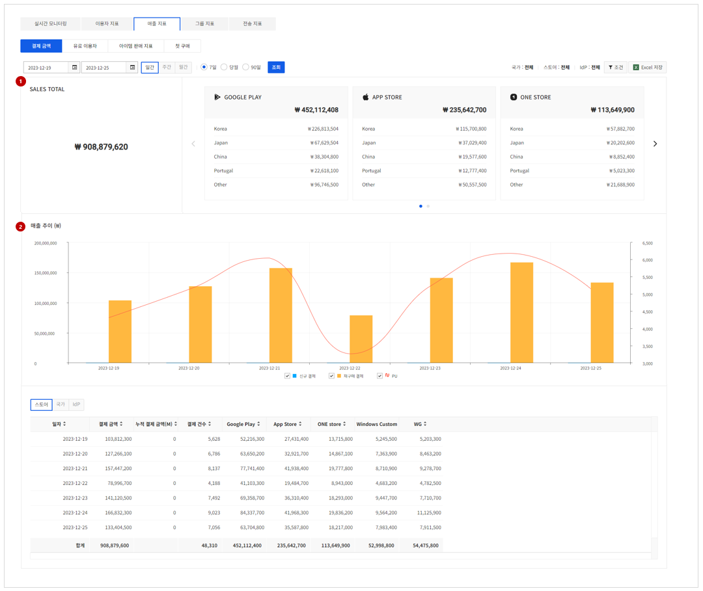
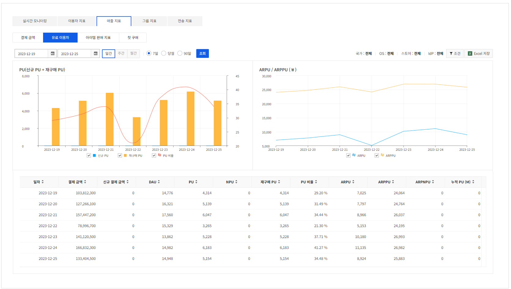
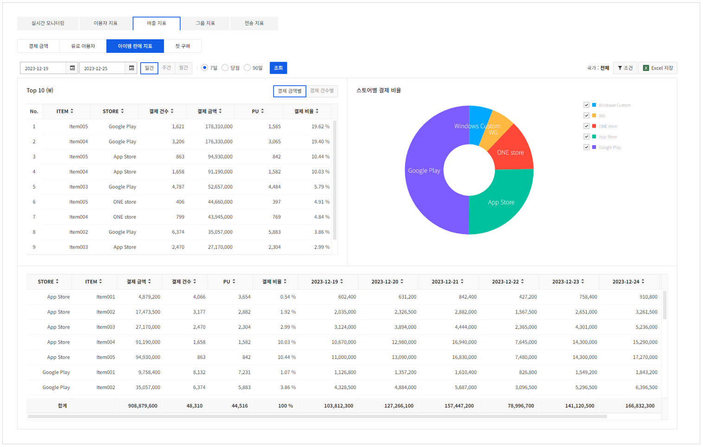
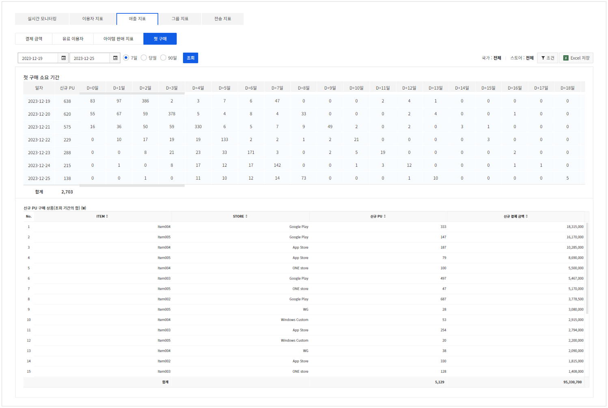

## Sales Statistics
### Payment Amount

<!-- LLM_Image_DESC_20260408_191856
    유형: Screenshot
    내용: Gamebase Analytics 콘솔 Payment Amount 화면 #10
    구성: Gamebase Analytics 콘솔의 Payment Amount 기능 설정/조회 화면 스크린샷
    Keyword: Analytics, Console, Screenshot, Payment Amount
-->

결제 금액에 대한 지표를 확인할 수 있습니다.

#### 1. 결제 금액 현황 표
선택된 기간 동안의 결제 금액을 보여줍니다.
총 결제금액과 주요 스토어의 국가 별 결제금액을 확인할 수 있습니다.

#### 2. 매출 추이
일자별로 신규 매출, 재구매 매출, PU(결제 이용자)의 추이를 그래프로 확인할 수 있습니다.
아래의 표에서는 스토어, 국가, IdP별 매출을 확인할 수 있습니다.
일간 조회 시에만 월 단위 누적 결제 금액을 확인할 수 있습니다.

### Paying User

<!-- LLM_Image_DESC_20260408_191856
    유형: Screenshot
    내용: Gamebase Analytics 콘솔 Paying User 화면 #11
    구성: Gamebase Analytics 콘솔의 Paying User 기능 설정/조회 화면 스크린샷
    Keyword: Analytics, Console, Screenshot, Paying User
-->

유료 이용자(PU)에 관한 지표를 확인할 수 있습니다.
아래는 그래프와 표에 나온 용어 설명입니다.

* 결제금액: 이용자가 결제한 결제금액
* 신규 결제금액: 신규 결제 이용자(NPU)가 결제한 결제금액
* DAU: 일간 memberno 기준 로그인 1회 이상 액티브 이용자수 (Daily Active Users)
* PU: 유료상품을 결제한 이용자 (Paying User). PU=재구매PU + 신규PU
* 신규 PU(NPU): 유료 상품을 처음 결제한 이용자 (New Paying Users)
* 재구매 PU: 누적 PU - 신규 PU (재구매 PU 는 일간 data 로 전일자 기준으로 계산)
* PUR: 유료 이용자의 비율 (PU/DAU * 100)
* ARPU: 하루 동안 게임 이용자 수의 평균 결제 금액 (결제 금액/DAU)
* ARPPU: 결제 이용자 수의 평균 결제 금액 (결제 금액/PU)
* ARPNPU: 신규 유료 이용자의 평균 결제 금액 (결제 금액/NPU)
* 누적 PU(M): 월 단위의 결제 이용자 수(중복 제외)

### Item Sales

<!-- LLM_Image_DESC_20260408_191856
    유형: Screenshot
    내용: Gamebase Analytics 콘솔 Item Sales 화면 #12
    구성: Gamebase Analytics 콘솔의 Item Sales 기능 설정/조회 화면 스크린샷
    Keyword: Analytics, Console, Screenshot, Item Sales
-->

등록된 아이템의 판매 지표를 확인할 수 있습니다.

* 아이템: Gamebase에 등록한 아이템 목록
* Best Item Top 10: 판매금액별, 판매건수별 판매량이 높은 아이템 top 10의 List 출력
* 스토어: 앱스토어, 구글플레이스토어 등과 같은 스토어
* 결제금액: 이용자가 결제한 아이템별 결제금액
* 결제 건수: 아이템별 결제 건수
* PU: 아이템별 구매자 수
* 결제 비율: 아이템별 결제 비중

### First Purchase

<!-- LLM_Image_DESC_20260408_191856
    유형: Screenshot
    내용: Gamebase Analytics 콘솔 First Purchase 화면 #13
    구성: Gamebase Analytics 콘솔의 First Purchase 기능 설정/조회 화면 스크린샷
    Keyword: Analytics, Console, Screenshot, First Purchase
-->

신규 유료 이용자의 첫 구매에 관한 정보를 확인할 수 있습니다.

신규 유료 이용자의 가입 후 첫 구매까지의 소요 기간을 D+0일부터 D+90일 경과까지 보여줍니다.

신규 유료 이용자가 구입한 모든 아이템을 결제 금액 순으로 보여줍니다.

* 아이템: 신규 PU가 구매한 아이템 목록
* 스토어: 앱스토어, 구글플레이스토어 등과 같은 스토어
* 신규 PU(NPU): 유료 상품을 처음 결제한 이용자 (New Paying Users)
* 신규 결제금액: 신규 PU가 발생시킨 결제금액
