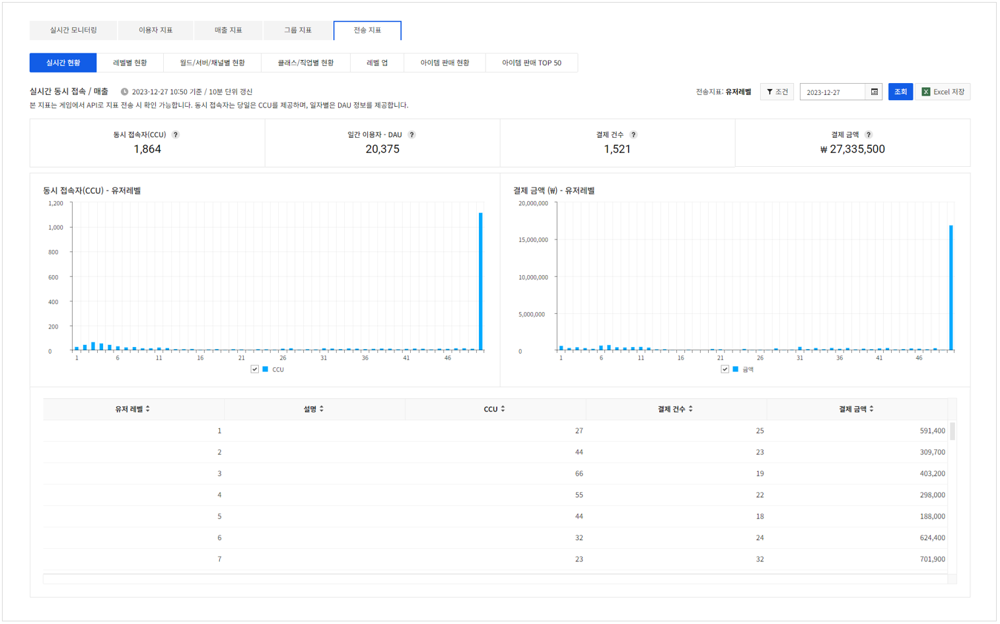
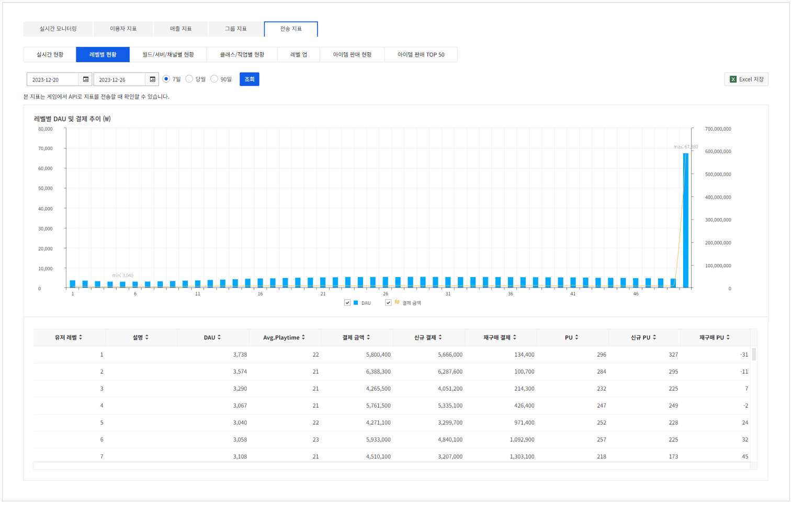
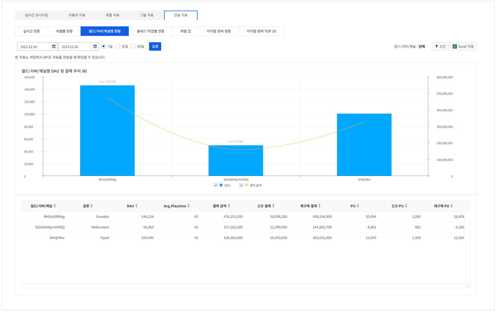
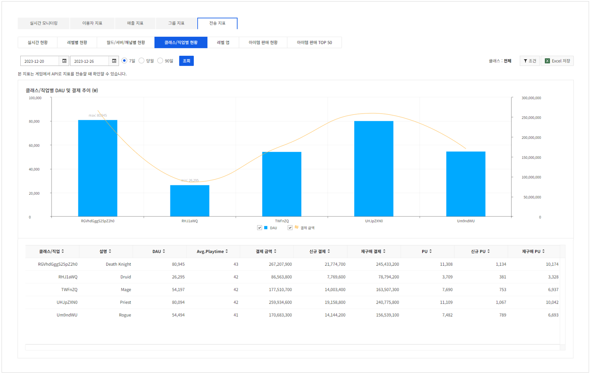
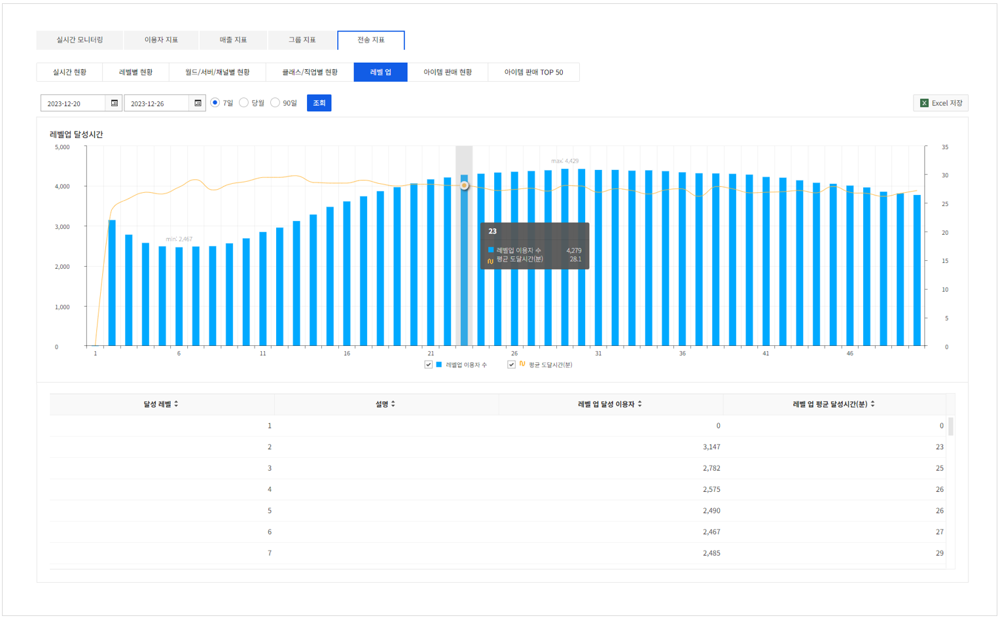
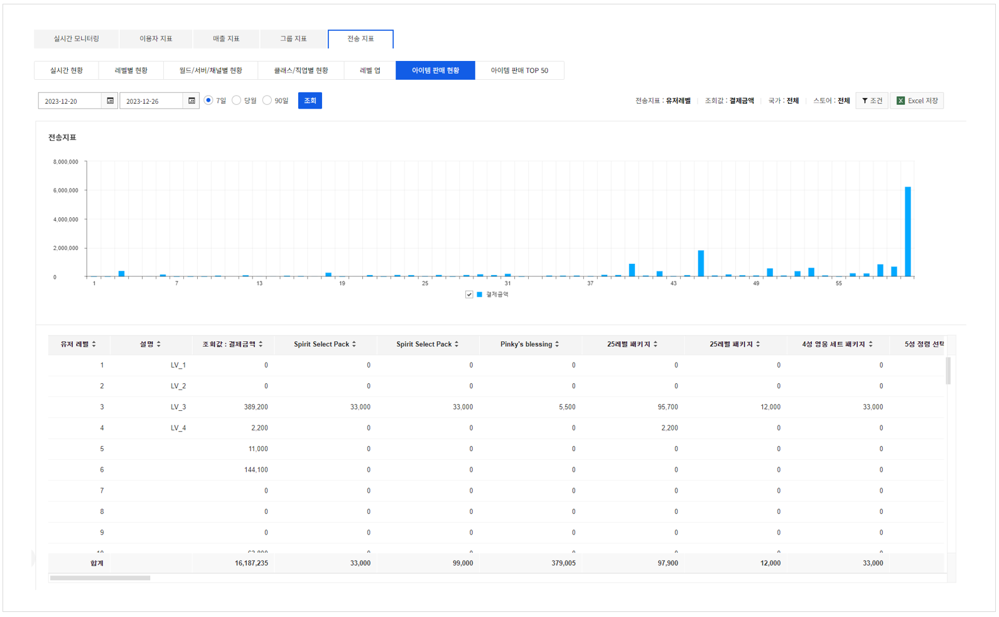
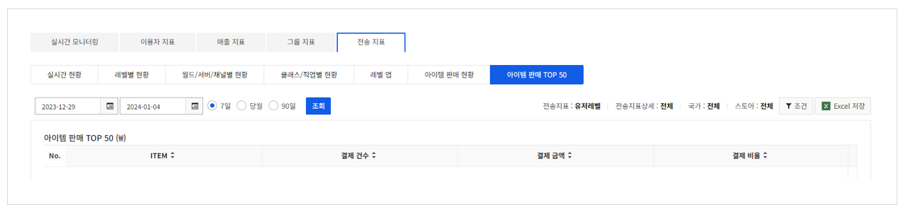

## Transmission

**전송 지표** 탭은 게임에서 API로 지표를 전송할 때 확인할 수 있습니다.
전송 지표의 종류는 아래 3개입니다.

* 이용자 레벨: 이용자 레벨별로 접속과 매출 정보를 확인할 수 있습니다.
* 월드/서버/채널: 월드/서버/채널별로 접속과 매출 정보를User IdUser Id 확인할 수 있습니다.
* 클래스/직업: 클래스/직업별로 접속과 매출 정보를 확인할 수 있습니다.

> [참고] 
>
> 월드/서버/채널, 클래스/직업은 사전에 등록된 정보만 처리 합니다.
> 등록 방법은 다음 문서를 참고하시기 바랍니다
>
> - [앱 > Analytics Indicator](../../oper-app.md#analytics-indicator)

### Concurrent Status

선택된 전송 지표 종류와 날짜의 접속, 매출 정보를 확인할 수 있습니다.
동시 접속자는 당일은 CCU를 제공하며, 일자별은 DAU 정보를 제공합니다. 당일이면 10분 단위로 정보가 갱신됩니다.

<!-- LLM_Image_DESC_20260406
    유형: Screenshot
    내용: Gamebase Analytics 전송 지표 - 실시간 현황 (Concurrent Status)
    구성: 상단에 전송 지표 탭과 실시간 현황/레벨별 현황 등 서브 탭, 날짜/필터 선택이 있음. 주요 수치(동접자 수, 결제 건수, 결제 금액 등)가 카드로 표시되고, 시간대별 동접자 추이를 보여주는 점 그래프가 중앙에 배치됨
    Keyword: 전송 지표, 실시간 현황, CCU, 결제 금액, 점 그래프
-->

* CCU (Concurrent User): 10분 단위로 측정된 실시간 동시 접속자 수(로그인 이용자 수)
* DAU (Daily Active User): 일간 이용자 아이디 기준, 로그인 1회 이상 액티브 이용자 수
* NRU (New Registered User): 당일 신규 가입자
* 결제 건수: 유료 상품 결제 건수
* 결제 금액: 유료 상품 결제 금액

### Status By Level

레벨별로 접속, 매출 현황을 확인할 수 있습니다.

<!-- LLM_Image_DESC_20260406
    유형: Screenshot
    내용: Gamebase Analytics 전송 지표 - 레벨별 현황 (Status By Level)
    구성: 상단에 레벨별 현황 탭과 날짜/필터 선택이 있고, 중앙에 레벨별 DAU 분포를 보여주는 막대 그래프와 꺾은선이 있음. 하단에 레벨별 DAU, Avg.Playtime, 결제 금액, PU 등의 상세 데이터 테이블이 배치됨
    Keyword: 레벨별 현황, DAU, Avg.Playtime, 결제 금액, PU, 막대그래프
-->

* DAU (Daily Active User): 일간 이용자 아이디 기준, 로그인 1회 이상 액티브 이용자 수
* Avg.Playtime: 해당 레벨의 일자별 전체 Playtime의 평균(DAU의 Playtime의 합 / DAU)
* 결제 금액: 유료 상품 결제 금액
* 신규 결제: 신규 결제 이용자(NPU)가 결제한 금액
* 재구매 결제: 재구매 결제 이용자가 결제한 금액
* PU (Paying User): 유료 상품을 결제한 이용자.(=재구매 PU + 신규 PU)
* 신규 PU: 유료 상품을 처음 결제한 이용자
* 재구매 PU: 전체 PU - 신규 PU(재구매 PU는 일간 데이터로 전일 기준으로 계산)

### Status By Channel

월드/서버/채널별로 접속, 매출 현황을 확인할 수 있습니다.

<!-- LLM_Image_DESC_20260406
    유형: Screenshot
    내용: Gamebase Analytics 전송 지표 - 월드/서버/채널별 현황 (Status By Channel)
    구성: 상단에 월드/서버/채널별 현황 탭과 날짜/필터 선택이 있고, 중앙에 채널별 DAU 및 결제 금액을 보여주는 막대/꺾은선 복합 차트가 있음. 하단에 채널별 DAU, Avg.Playtime, 결제 금액, PU 등의 상세 데이터 테이블이 배치됨
    Keyword: 채널별 현황, 월드, 서버, DAU, 결제 금액, 막대그래프
-->

* DAU (Daily Active User): 일간 이용자 아이디 기준, 로그인 1회 이상 액티브 이용자 수
* Avg.Playtime: 해당 레벨의 일자별 전체 Playtime의 평균(DAU의 Playtime의 합 / DAU)
* 결제 금액: 유료 상품 결제 금액
* 신규 결제: 신규 결제 이용자(NPU)가 결제한 금액
* 재구매 결제: 재구매 결제 이용자가 결제한 금액
* PU (Paying User): 유료 상품을 결제한 이용자(= 재구매 PU + 신규 PU)
* 신규 PU: 유료 상품을 처음 결제한 이용자
* 재구매 PU: 전체 PU - 신규 PU(재구매 PU는 일간 데이터로 전일 기준으로 계산)

### Status By Class

클래스/직업별로 접속, 매출 현황을 확인할 수 있습니다.

<!-- LLM_Image_DESC_20260406
    유형: Screenshot
    내용: Gamebase Analytics 전송 지표 - 클래스/직업별 현황 (Status By Class)
    구성: 상단에 클래스/직업별 현황 탭과 날짜/필터 선택이 있고, 중앙에 클래스별 DAU 및 결제 금액을 보여주는 막대/꺾은선 복합 차트가 있음. 하단에 클래스별 DAU, Avg.Playtime, 결제 금액, PU 등의 상세 데이터 테이블이 배치됨
    Keyword: 클래스별 현황, 직업별, DAU, 결제 금액, 막대그래프
-->

* DAU (Daily Active Users): 일간 이용자 아이디 기준, 로그인 1회 이상 액티브 이용자 수
* Avg.Playtime: 해당 레벨의 일자별 전체 Playtime의 평균(DAU의 Playtime의 합 / DAU)
* 결제 금액: 유료 상품 결제 금액
* 신규 결제: 신규 결제 이용자(NPU)가 결제한 금액
* 재구매 결제: 재구매 결제 이용자가 결제한 금액
* PU (Paying User): 유료 상품을 결제한 이용자.(=재구매 PU + 신규 PU)
* 신규 PU: 유료 상품을 처음 결제한 이용자
* 재구매 PU: 전체 PU - 신규 PU(재구매 PU는 일간 데이터로 전일 기준으로 계산)

### Level Up

이용자들의 레벨 업 정보를 확인할 수 있습니다.

* 달성 레벨: 달성한 레벨
* 레벨 업 달성 이용자: 해당 레벨을 달성한 이용자 수
* 레벨 업 평균 달성 시간(분): 해당 레벨을 달성한 이용자들의 평균 달성 시간(분)

<!-- LLM_Image_DESC_20260406
    유형: Screenshot
    내용: Gamebase Analytics 전송 지표 - 레벨 업 현황
    구성: 상단에 레벨 업 탭과 날짜/필터 선택이 있고, 중앙에 레벨별 달성 이용자 수를 보여주는 막대 그래프가 있음. 하단에 달성 레벨, 레벨 업 달성 이용자 수, 평균 달성 시간 등의 상세 데이터 테이블이 배치됨
    Keyword: 레벨 업, 달성 이용자, 평균 달성 시간, 막대그래프
-->

### Item Sales Status
선택된 전송 지표 종류에 따른 아이템 판매 현황을 확인할 수 있습니다.
**조건** 버튼을 클릭해, 아래의 조횟값을 선택할 수 있습니다.

* 결제 금액
* 결제 건수
* PU (Paying User)
* 신규 PU

<!-- LLM_Image_DESC_20260406
    유형: Screenshot
    내용: Gamebase Analytics 전송 지표 - 아이템 판매 현황 (Item Sales Status)
    구성: 상단에 아이템 판매 현황 탭과 날짜/필터/조건 선택이 있고, 중앙에 아이템별 판매금액을 보여주는 막대 그래프가 있음. 하단에 아이템별 결제금액, 결제 건수, PU 등의 상세 데이터 테이블이 배치됨
    Keyword: 아이템 판매, 결제금액, 결제 건수, PU, 막대그래프
-->

### Item Sales TOP 50

선택된 전송 지표 종류 및 값에 따른 아이템 판매 상위 50개 항목을 확인할 수 있습니다.

<!-- LLM_Image_DESC_20260406
    유형: Screenshot
    내용: Gamebase Analytics 전송 지표 - 아이템 판매 TOP 50
    구성: 상단에 아이템 판매 TOP 50 탭이 선택되어 있고, 날짜/필터 선택이 있음. 아이템 판매 TOP 50 테이블에 No, ITEM, 결제 건수, 결제 금액, 결제 비율 컬럼이 표시됨
    Keyword: 아이템 판매, TOP 50, 결제 건수, 결제 금액, 결제 비율
-->
