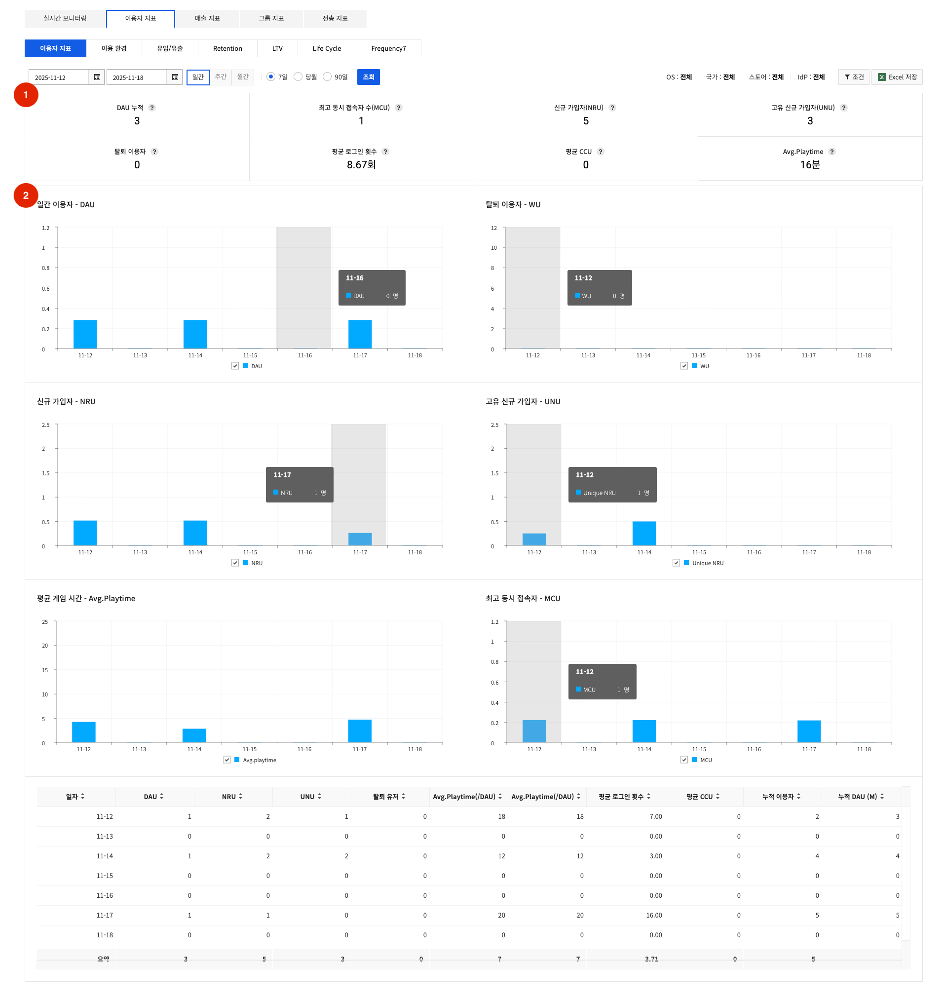
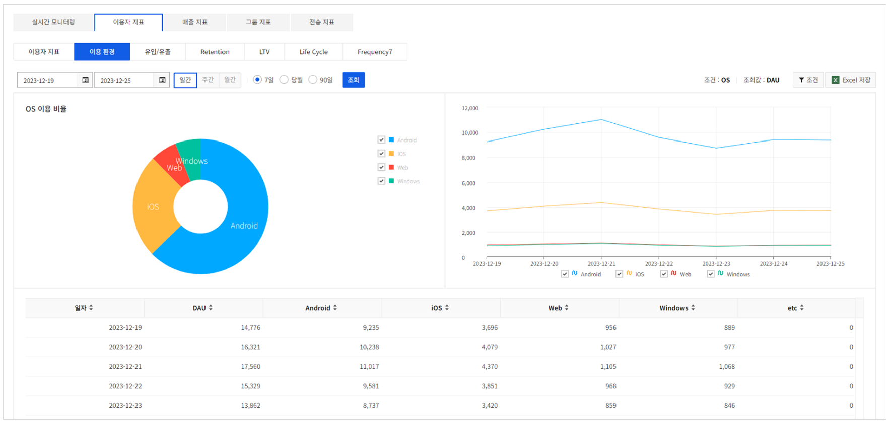
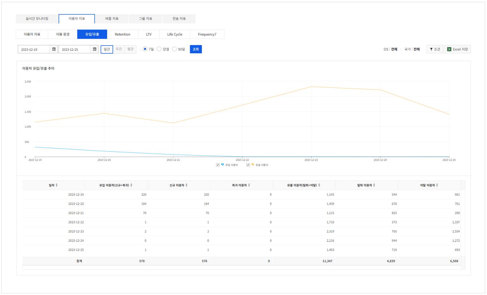
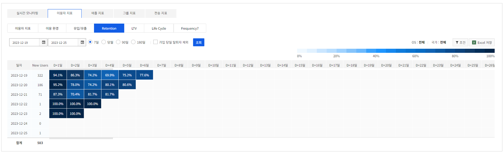
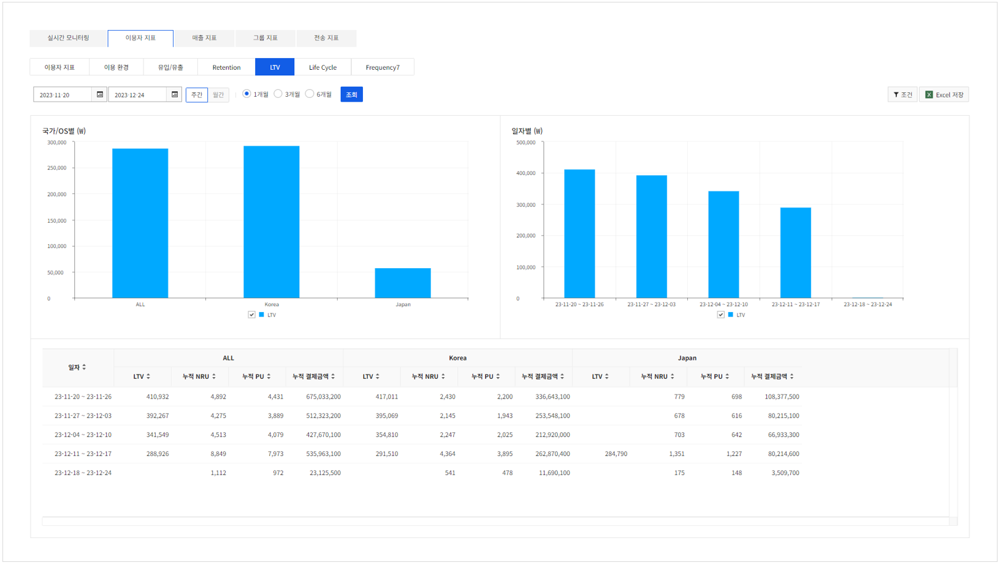
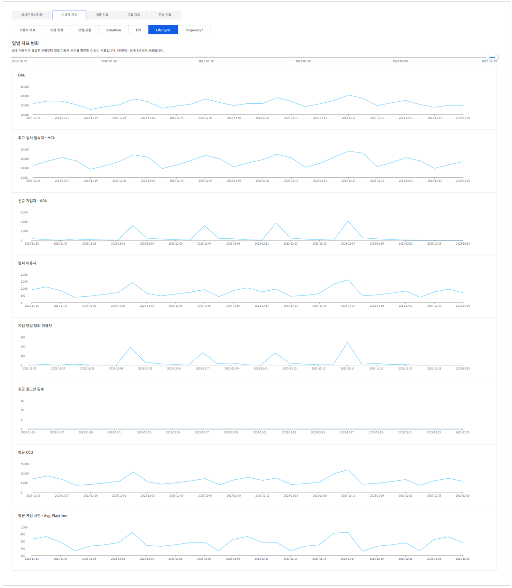
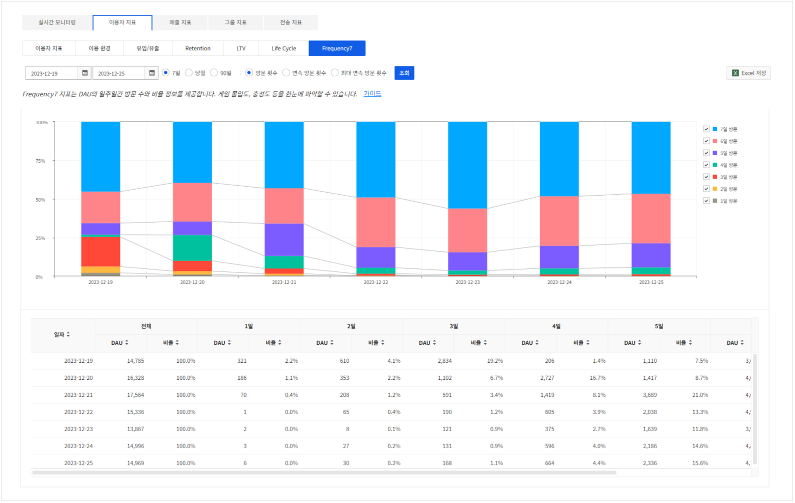

## User Statistics
### User

<!-- LLM_Image_DESC_20260408_185735
    유형: Screenshot
    내용: Gamebase Analytics 콘솔 User 화면 #03
    구성: Gamebase Analytics 콘솔의 User 기능 설정/조회 화면 스크린샷
    Keyword: Analytics, Console, Screenshot, User
-->

이용자의 기본 지표들을 확인할 수 있습니다.

#### 1. 이용자 현황
선택된 기간 동안의 이용자 기본 지표들을 보여줍니다.

* DAU 누적: 일간 memberno 기준 로그인 1회 이상 액티브 이용자 수의 합(Daily Active Users)
* WAU 누적: 주간 AU의 합(Weekly Active Users). 주간 지표 선택 시 DAU 항목이 WAU로 대체
* MAU 누적: 월간 AU의 합(Monthly Active Users). 월간 지표 선택 시 DAU 항목이 MAU로 대체
* 최대 동접자 수(MCU): 0시~24시까지 최대 동접자 수. 1분 단위 CCU 값에서 가장 큰 값을 1일 단위로 집계함.
* 신규 가입자(NRU): 신규 가입자. 당일 0시~24시까지 로그인 로그가 최초 수집된 유저(memberno 기준)
* 고유 신규 가입자(UNU): 고유 신규 가입자. 당일 0시~24시까지 로그인 로그가 최초 수집된 순수한 신규 유저(memberno, device 기준)
* 탈퇴 이용자: 탈퇴 유저. 당일 0시~24시까지 memberno가 삭제된 유저 수
* 평균 로그인 횟수: 선택된 기간 동안의 평균 로그인 수
* 평균.CCU: 선택된 기간 동안의 CCU의 평균
* Avg.Playtime(/DAU): 조회기간의 Playtime 평균 (DAU의 Playtime의 합 / DAU)

#### 2. 일별 지표
선택된 기간 동안의 일별 이용자 기본 지표를 그래프와 표로 보여줍니다.

※ MCU, 누적 이용자(ACU)의 경우 필터가 전체일 경우만 확인할 수 있습니다.

### User Environment

<!-- LLM_Image_DESC_20260408_185735
    유형: Screenshot
    내용: Gamebase Analytics 콘솔 User Environment 화면 #04
    구성: Gamebase Analytics 콘솔의 User Environment 기능 설정/조회 화면 스크린샷
    Keyword: Analytics, Console, Screenshot, User Environment
-->

이용 환경에 따른 이용자의 지표를 확인할 수 있습니다.

* 조회 조건
    * OS: 모바일 운영 소프트웨어 Android, IOS 등
    * Country: 이용자 모바일 단말기에 설정된 국가
    * Store: IdP: 페이스북, 구글 등 이용자의 IdP 로그인/인증 정보
    * App Version: 실행된 앱의 버전 정보
    * Device: 이용자의 디바이스 단말기 종류. Device 선택 시 PU, 결제금액은 제공하지 않음.(주간, 월간 데이터도 제공하지 않음)
* 조회 값
    * 일 사용자(DAU): 일간 memberno 기준 로그인 1회 이상 액티브 이용자 수 (Daily Active Users)
    * 신규 가입자(NRU): 신규 가입자. 당일 0시~24시까지 로그인 로그가 최초 수집된 유저 (memberno 기준)
    * PU: 유료상품을 결제한 이용자 (Paying User). (=재구매 PU + 신규 PU)
    * 결제금액: 이용자가 결제한 총 결제금액

### User Inflow and Outflow

<!-- LLM_Image_DESC_20260408_185735
    유형: Screenshot
    내용: Gamebase Analytics 콘솔 User Inflow and Outflow 화면 #05
    구성: Gamebase Analytics 콘솔의 User Inflow and Outflow 기능 설정/조회 화면 스크린샷
    Keyword: Analytics, Console, Screenshot, User Inflow and Outflow
-->

앱 이용자의 유입, 유출에 대한 일자별 추이를 확인할 수 있습니다.
주간, 월간 유입/유출 지표는 오전 10시 기준으로 업데이트되어 반영됩니다.

* 유입 이용자(신규+복귀): 유입 이용자는 신규 가입자와 복귀 이용자의 합(신규 가입자 + 복귀 이용자)
* 신규 가입자
  * 일별: 신규 가입자. 당일 0시~24시까지 로그인 로그가 최초 수집된 유저(memberno 기준)
  * 주별: 신규 가입자. 기준주 로그인 로그가 최초 수집된 유저(memberno 기준)
  * 월별: 신규 가입자. 기준월 로그인 로그가 최초 수집된 유저(memberno 기준)
* 복귀 이용자
  * 일별: 기준일에 이전 8일 동안 로그가 수집되지 않은 이용자
  * 주별: 전주 로그가 수집되지 않았으나 기준주 로그가 수집된 이용자
  * 월별: 전월 로그가 수집되지 않았으나 기준월 로그가 수집된 이용자
* 유출 이용자(탈퇴+이탈): 유출 이용자는 탈퇴 이용자와 이탈 이용자의 합(탈퇴 이용자 + 이탈 이용자)
* 탈퇴 이용자
  * 일별: 탈퇴 유저. 당일 0시~24시까지 memberno가 삭제된 유저 수
  * 주별: 탈퇴 유저. 기준주 memberno가 삭제된 유저 수
  * 월별: 탈퇴 유저. 기준월 memberno가 삭제된 유저 수
* 이탈 이용자
  * 일별: 기준일 이전 7일 동안 로그가 수집되지 않은 이용자
  * 주별: 전주 로그가 수집된 유저 중 기준주 로그가 수집되지 않은 이용자
  * 월별: 전월 로그가 수집된 유저 중 기준월 로그가 수집되지 않은 이용자
* 연속 이용자
  * 주별: 전주 및 기준주 로그가 모두 수집된 이용자
  * 월별: 전월 및 기준월 로그가 모두 수집된 이용자

### Retention

<!-- LLM_Image_DESC_20260408_185735
    유형: Screenshot
    내용: Gamebase Analytics 콘솔 Retention 화면 #06
    구성: Gamebase Analytics 콘솔의 Retention 기능 설정/조회 화면 스크린샷
    Keyword: Analytics, Console, Screenshot, Retention
-->

Retention은 특정일에 가입한 이용자가 D+1일부터 D+180일까지 얼마나 잔존해 있는지를 보여 주는 지표입니다.

당일 탈퇴자를 포함하거나 제외하여 Retention 값을 보여주고 있습니다.

* 당일 탈퇴자 제외: 당일에 가입하고, 당일에 탈퇴한 이용자를 신규 이용자에서 제외하고 Retention 값을 계산합니다. 
    * 신규 가입자(New User) = 당일 가입자 - 당일가입 후 탈퇴자
    * 예) 1월 1일 100명 신규 가입, 이 중 20명이 1월 1일 탈퇴자라면 실제 신규 가입자를 80명(100명-20명)으로 계산

### LTV

<!-- LLM_Image_DESC_20260408_185735
    유형: Screenshot
    내용: Gamebase Analytics 콘솔 LTV 화면 #07
    구성: Gamebase Analytics 콘솔의 LTV 기능 설정/조회 화면 스크린샷
    Keyword: Analytics, Console, Screenshot, LTV
-->

LTV는 선택된 이용자 그룹에서 이용자 1명의 1년간 기대 매출을 나타내는 추정 지표입니다.

국가/OS 별, 일자별로 LTV 차트를 제공하고, 하단의 표에는 LTV, 누적 NRU, 누적 PU, 누적 결제금액 정보를 세부적으로 확인할 수 있습니다.

#### 추정 방법
Gamebase에서는 LTV 추정 방법으로 가입 후 365일 경과 시점의 누적 ARPU를 사용합니다. 

#### 이용자 그룹 조건
이용자 그룹의 조건은 아래와 같습니다.

* 가입일
* 국가
* OS

#### 제한 조건
LTV의 정확한 추정을 위해 아래의 제한 조건이 있습니다.

* 이용자 그룹의 이용자 수가 1000명 이상이어야 합니다.
* 이용자 그룹의 PU(결제 이용자 수)가 30 이상이어야 합니다.
* 이용자 그룹 중 가장 최근 가입일에 대해 7일이 경과해야 합니다.

### Life Cycle

<!-- LLM_Image_DESC_20260408_185735
    유형: Screenshot
    내용: Gamebase Analytics 콘솔 Life Cycle 화면 #08
    구성: Gamebase Analytics 콘솔의 Life Cycle 기능 설정/조회 화면 스크린샷
    Keyword: Analytics, Console, Screenshot, Life Cycle
-->

Life Cycle은 최초로 이용자가 유입된 시점부터, 일별 이용자 추이를 확인할 수 있는 지표입니다. 데이터는 최대 3년까지 제공됩니다.

* 일간 이용자(DAU): 일간 memberno 기준 로그인 1회 이상 액티브 이용자 수(Daily Active Users)
* 최대 동시 접속자(MCU): 0시~24시까지 최대 동접자 수. 1분 단위 CCU 값에서 가장 큰 값을 1일 단위로 집계함.
* 신규 가입자(NRU): 신규 가입자. 당일 0시~24시까지 로그인 로그가 최초 수집된 이용자 (memberno 기준)
* 탈퇴 이용자: 탈퇴한 이용자. 당일 0시~24시까지 memberno 가 삭제된 이용자
* 가입 당일 탈퇴 이용자: 당일에 가입하고, 당일에 탈퇴한 이용자
* 평균 CCU: 선택된 기간 동안의 CCU의 평균
* 평균 게임 시간 - Avg.Playtime(/DAU): 조회기간의 Playtime 평균 (DAU의 Playtime의 합 / DAU)

### Frequency7

<!-- LLM_Image_DESC_20260408_185735
    유형: Screenshot
    내용: Gamebase Analytics 콘솔 Frequency7 화면 #09
    구성: Gamebase Analytics 콘솔의 Frequency7 기능 설정/조회 화면 스크린샷
    Keyword: Analytics, Console, Screenshot, Frequency7
-->

Frequency7 지표는 DAU의 일주일간 방문 수와 비율 정보를 제공합니다. 게임 몰입도, 충성도 등을 한눈에 파악할 수 있습니다.

Frequency7 기준은 아래 3개로 나뉩니다.

* 방문 횟수: 7일 중 총 방문 횟수
* 연속 방문 횟수: 7일 중 해당 일을 포함하는 연속 방문한 횟수
* 최대 연속 방문 횟수: 7일 중 연속 방문한 최대 횟수

위 3가지 기준의 계산 방법 예를 살펴보면 다음과 같습니다. 
3/7 일을 기준으로 3/1, 3/2, 3/3, 3/6, 3/7 방문한 유저가 있다면, 기준에 따른 방문 횟수는 다음과 같습니다.

* 총 방문 횟수: 5일(3/1, 3/2, 3/3, 3/6, 3/7)
* 연속 방문 횟수: 2일(3/6, 3/7)
* 최대 연속 방문 횟수: 3일(3/1, 3/2, 3/3)
