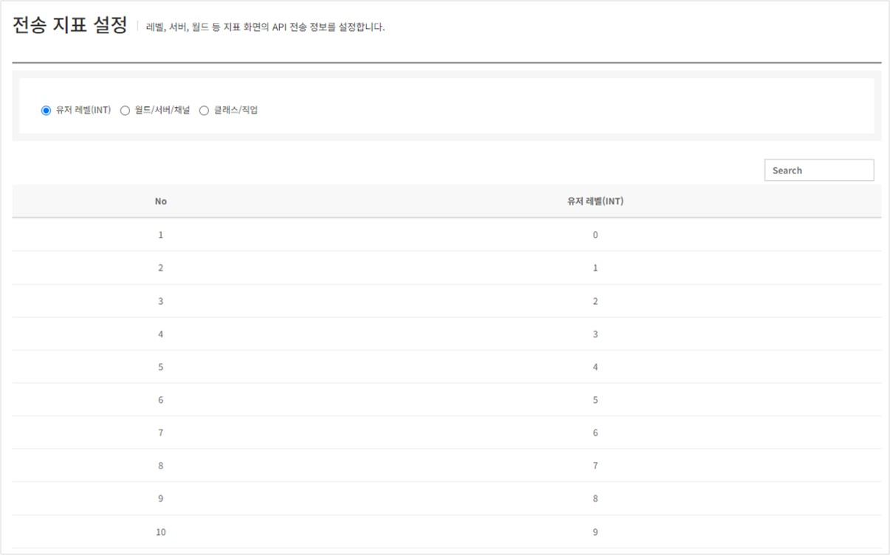
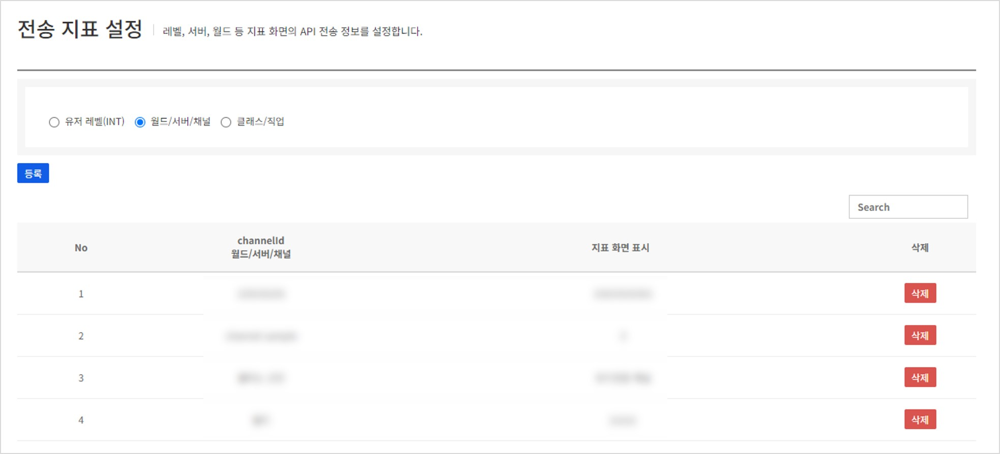
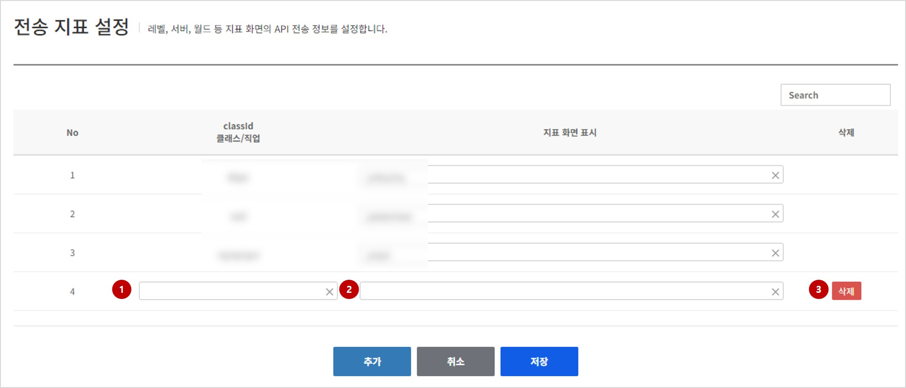

## Analytics indicator
Analytics에 지표를 쌓기위한 전송 지표를 확인 및 설정할 수 있습니다.
유저 레벨(INT)별, 월드/서버/채널별, 클래스/직업별 항목이 나누어져 있으며 유저 레벨의 경우는 실제 Analytics에 전송된 레벨 항목만 표시되고 월드/서버/채널별, 클래스/직업별 항목에서는 이 메뉴에서 등록된 항목들만 Analytics에 지표로 쌓이게 됩니다.
### 유저 레벨(INT)별
Analytics 시스템에 전송된 레벨 지표 항목을 확인할 수 있습니다.
이 항목에서는 별도의 수정항목이 없이 조회만 가능합니다.

<!-- LLM_Image_DESC_20260406
    유형: Screenshot
    내용: 전송 지표 설정 - 유저 레벨(INT) 조회 화면
    구성: 유저 레벨(INT), 월드/서버/채널, 클래스/직업 탭 중 유저 레벨(INT) 선택 상태. No와 유저 레벨(INT) 컬럼으로 구성된 테이블에 레벨 0~9까지의 데이터가 표시됨. 우측 상단에 Search 검색 필드 존재.
    Keyword: Analytics, 전송 지표, 유저 레벨, 조회, 지표 설정
-->

### 월드/서버/채널별, 클래스/직업별 조회
현재 각 항목별로 설정되어 있는 전송 지표 항목을 확인할 수 있습니다.
조회화면에서는 설정된 항목들에 대한 지표를 쌓지 않고자 할 경우 삭제 버튼을 통하여기존에 등록된 항목에 대한 삭제가 가능합니다.
항목이 삭제되면 이후 **Analytics 메뉴에서 지표에 표시가 되지 않으며** 이후에는 삭제한 항목에 대한 지표가 쌓이지 않으므로 삭제 시 주의가 필요합니다.

<!-- LLM_Image_DESC_20260406
    유형: Screenshot
    내용: 전송 지표 설정 - 월드/서버/채널 조회 화면
    구성: 월드/서버/채널 탭 선택 상태. 등록 버튼과 Search 필드, No/channelId(월드/서버/채널)/지표 화면 표시/삭제 컬럼으로 구성된 테이블. 각 행에 빨간색 삭제 버튼 표시.
    Keyword: Analytics, 전송 지표, 월드, 서버, 채널, 삭제
-->

### 월드/서버/채널별, 클래스/직업별 등록
Analytics 지표로 쌓고자 하는 정보를 새롭게 등록할 수 있습니다.
하단에 있는 추가 버튼을 이용해 등록할 수 있으며 **전체 항목 최대 100개**까지 신규로 등록이 가능합니다.
등록화면에서는 기존에 등록된 데이터들에 대하여 **지표 화면 표시 항목을 수정만을 제공**하며 삭제를 하고자 할 경우 다시 조회화면으로 이동하여 삭제를 진행해주셔야 합니다.

<!-- LLM_Image_DESC_20260406
    유형: Screenshot
    내용: 전송 지표 설정 - 클래스/직업 등록 화면
    구성: 클래스/직업 탭 선택 상태. classid(클래스/직업)과 지표 화면 표시 컬럼으로 구성된 테이블. 기존 등록 항목의 지표 화면 표시는 수정 가능하며, 신규 항목(4번)은 (1)ClassId 입력 필드와 (2)지표 화면 표시 필드, (3)삭제 버튼이 표시됨. 하단에 추가/취소/저장 버튼 존재.
    Keyword: Analytics, 전송 지표, 클래스, 직업, 등록, 수정
-->

#### (1) ChannelId / ClassId: Analytics내에 쌓을 구분자 정보를 입력합니다. 지표를 쌓고자 할 떄 설정하실 ID정보를 입력하시면 됩니다.
#### (2) 지표 화면 표시: 1번항목으로 입력한 ID로 전송된 지표를 화면에서 표시할 떄 보여주고자 하는 내용을 입력합니다. 해당정보는 기존에 등록된 지표항목들도 수정할 수 있습니다.
#### (3) 삭제: 등록 화면에서는 새롭게 추가된 항목들만 삭제가 가능합니다.
