## Game > Gamebase > 콘솔 사용 가이드 > 앱

NHN Cloud Console에서 **Game > Gamebase > App**을 클릭하여 앱의 기본 정보를 설정할 수 있습니다.

* **앱**: 앱 정보 관리
* **클라이언트**: 클라이언트 버전과 상태 정보 관리
* **설치 URL**: 앱의 스토어별 설치 URL 관리


## App

Gamebase 서비스를 활성화하면 자동으로 앱이 생성되며 해당 메뉴에서는 등록된 정보의 수정만 가능합니다.
NHN Cloud 프로젝트 하나당 하나의 Gamebase 앱을 관리할 수 있으므로 앱을 추가로 등록하거나 삭제할 수는 없습니다. Gamebase 서비스를 비활성화 하시면 앱에 등록된 정보가 삭제됩니다.
각 항목별 상세 설명은 아래 세부 항목을 참고합니다.

### 기본 정보
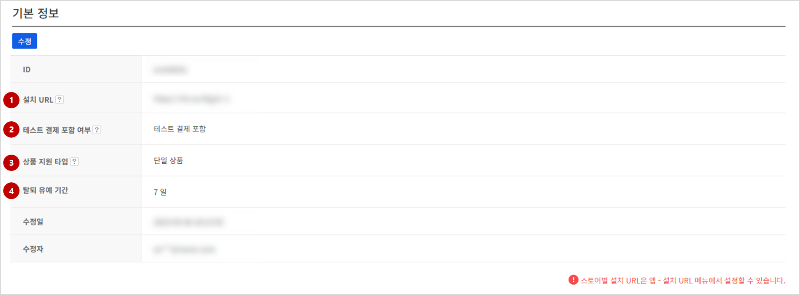
<!-- LLM_Image_DESC_20260406
    유형: Screenshot
    내용: Gamebase 앱 기본 정보 화면
    구성: 수정 버튼, ID, 설치 URL, 테스트 결제 포함 여부(테스트 결제 포함), 상품 지원 타입(단일 상품), 탈퇴 유예 기간(7일), 수정일, 수정자 필드가 표시됨. 하단에 스토어별 설치 URL은 설치 URL 메뉴에서 설정 가능하다는 안내 메시지.
    Keyword: 기본 정보, 앱 설정, 설치 URL, 테스트 결제, 탈퇴 유예 기간
-->

#### (1) 설치 URL
앱 설치와 홍보에 이용할 수 있는 단축 URL 정보입니다.
앱이 배포된 스토어가 여러 개인 경우에도 하나의 단축 URL로 관리할 수 있습니다.
자세한 동작 및 관리 방법은 다음 링크를 참고합니다. [설치 URL 관리](./oper-app-Installed-URL.md#installed-url)

> [참고]
> Gamebase를 활성화하면 자동으로 생성되므로 변경은 불가능합니다.

#### (2) 테스트 결제 포함 여부
앱 지표에 테스트 결제도 포함하여 표시할지 여부를 선택합니다.
기본 설정은 '테스트 결제 포함'으로 설정되어 있으며 '테스트 결제 제외'로 설정하면 Analytics 매출 지표에서 테스트 결제 건은 모두 제외하여 보여줍니다.
> [참고 1]
> 지표 표시 설정 여부에 관계없이 데이터는 테스트 결제 건과 실제 결제 건을 항상 쌓고 있으므로 테스트 결제에 대한 표시 여부는 언제든지 변경해도 실제 데이터 수집에는 영향이 없습니다.

> [참고 2]
> 테스트 결제 제외 설정 이후부터 발생하는 결제 건에 대해서 Analytics 매출 지표에서 테스트 결제 건은 제외됩니다.

> [참고 3]
> 테스트 데이터는 Google 및 AppStore만 지원하고 있으며 다른 스토어는 지원하지 않습니다.
> 각 스토어 별 테스트 지표 기준은 아래와 같습니다.
> * Google: Google 콘솔에 등록한 테스트 계정을 이용하여 결제를 진행한 내역
> * AppStore: Sandbox 환경에서 테스트 결제를 진행한 내역

#### (3) 탈퇴 유예 기간
앱의 탈퇴 유예 기능을 사용하고자 할 경우 탈퇴 유예시 부여할 기간을 설정합니다.
기본 설정은 '7일'로 설정되어 있으며 1일 ~ 30일까지 설정이 가능합니다.
> [참고]
> 탈퇴 유예 기간동안에는 정상적으로 서비스 이용이 가능합니다.

### 서버 주소
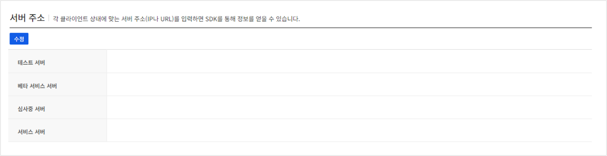
<!-- LLM_Image_DESC_20260406
    유형: Screenshot
    내용: 서버 주소 설정 화면
    구성: 서버 주소 섹션에 수정 버튼과 테스트 서버, 베타 서비스 서버, 심사중 서버, 서비스 서버 입력 필드가 각 클라이언트 상태별로 표시됨. IP나 URL을 입력하면 SDK를 통해 정보를 얻을 수 있다는 설명.
    Keyword: 서버 주소, 테스트 서버, 베타 서버, 서비스 서버, 클라이언트 상태
-->

- 게임에서 게임 서버 주소(IP, URL 등)를 실시간으로 전달받아야 할 때 사용합니다.
- 서버 주소를 설정하면 클라이언트 초기화 이후에 '런칭정보'에서 입력된 정보를 확인할 수 있습니다.
- 클라이언트의 상태별로 서버 주소를 설정할 수 있고 런칭 정보에서 서버 주소를 확인할 수 있습니다.
- 게임에서 필요한 경우에만 입력하고, 그렇지 않은 경우에는 비워 두시면 됩니다.

### 언어 설정
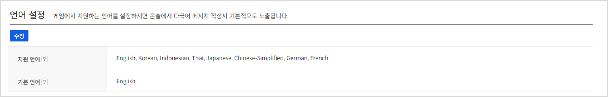
<!-- LLM_Image_DESC_20260406
    유형: Screenshot
    내용: 언어 설정 화면
    구성: 수정 버튼, 지원 언어(English, Korean, Indonesian, Thai, Japanese, Chinese-Simplified, German, French)와 기본 언어(English) 설정 필드가 표시됨.
    Keyword: 언어 설정, 지원 언어, 기본 언어, 다국어
-->
- 각 메뉴의 다국어 설정에서 기본적으로 노출할 언어를 미리 지정할 수 있습니다.
- 다국어 항목을 표시할 때 선택한 언어들이 표시되며 기본 언어도 설정한 항목으로 선택되어 있습니다.
- 사용하고자 하지 않을 경우에는 해당 란을 비워 두시면 됩니다.

###  인증 정보
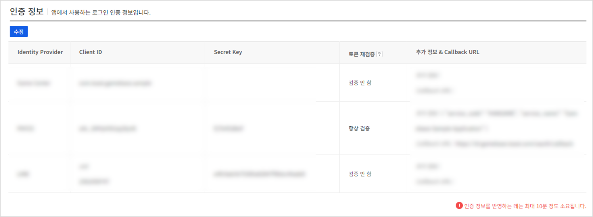
<!-- LLM_Image_DESC_20260406
    유형: Screenshot
    내용: 인증 정보 설정 화면
    구성: 수정 버튼, Identity Provider별 Client ID, Secret Key, 토큰 재검증(검증 안함/항상 검증), 추가 정보 & Callback URL 컬럼이 표시된 테이블. 복수의 IdP가 등록된 상태. 하단에 인증 정보 변경 시 최대 반영 시간 안내.
    Keyword: 인증 정보, Identity Provider, Client ID, Secret Key, 토큰 재검증
-->

앱에서 로그인할 때 사용할 IdP의 인증 정보를 등록, 수정, 삭제할 수 있습니다.

외부 인증의 클라이언트 아이디, 비밀 키(secret key)뿐만 아니라 콜백 URL과 추가 정보를 설정할 수 있습니다.
인증 정보 옆에 **+** 버튼을 클릭하면 정보를 추가할 수 있으며 **-** 버튼을 클릭하면 정보를 삭제할 수 있습니다.
Idp별 자세한 설정 방법은 [Authentication Information](#authentication-information)을 참고하시기 바랍니다.
> [참고]
> **토큰 재검증**이란?
> 클라이언트에서 Latest Login API 호출 시에 외부 IdP의 토큰 재검증 여부를 설정합니다.
> **검증 안함**을 선택하면 외부 IdP의 토큰 재검증 없이 내부 토큰 검증만을 수행합니다.
> **항상 검증**을 선택하면 Gamebase에서 발급한 내부 토큰뿐만 아니라 외부 IdP 토큰에 대해서도 항상 유효성 검증을 진행합니다.

### 인앱 URL
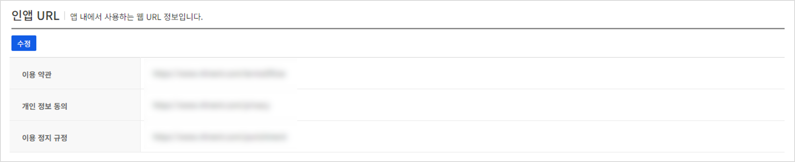
<!-- LLM_Image_DESC_20260406
    유형: Screenshot
    내용: 인앱 URL 설정 화면
    구성: 수정 버튼, 이용약관, 개인 정보동의, 이용 정지 규정 URL 입력 필드가 표시됨. 앱 내에서 사용하는 웹 URL을 실시간으로 수정 가능.
    Keyword: 인앱 URL, 이용약관, 개인 정보동의, 이용 정지 규정
-->
클라이언트를 다시 배포하지 않고 앱 내에서 자주 사용하는 URL을 Console을 통해 실시간으로 수정할 수 있습니다.

- 이용약관
- 개인 정보동의
- 이용 정지 규정

게임에서 필요한 경우에만 입력하며, 그렇지 않은 경우에는 비워 둡니다.
설정한 정보는 클라이언트 초기화 이후에 '런칭정보'에서 입력된 정보를 확인할 수 있습니다.

### 고객센터
고객센터 관련 설정을 진행할 수 있습니다.
현재 Gamebase에서는 3가지의 고객센터 형식을 제공하고 있으며 선택되는 고객센터 유형별로 설정할 수 있는 항목이 다릅니다.
각 고객센터 유형별 설정은 아래와 같습니다.

#### 1. 개발사 자체 고객센터
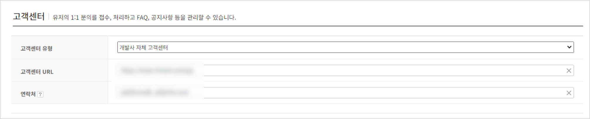
<!-- LLM_Image_DESC_20260406
    유형: Screenshot
    내용: 고객센터 설정 - 개발사 자체 고객센터 유형
    구성: 고객센터 유형 드롭다운(개발사 자체 고객센터 선택), 고객센터 URL 입력 필드, 연락처 입력 필드가 표시됨.
    Keyword: 고객센터, 개발사 자체, 고객센터 URL, 연락처
-->
개발사에서 자체적으로 고객센터를 사용하고 있을 경우 설정합니다.
설정 항목은 아래와 같습니다.
* **고객센터 URL**: 현재 제공하거나 사용하고 있는 개발사의 자체 고객센터 주소를 입력합니다.
* **연락처**: 고객센터 연락처를 입력합니다. 이 정보는 Gamebase SDK를 통해 전달받을 수 있습니다.

#### 2. Gamebase 제공 고객센터
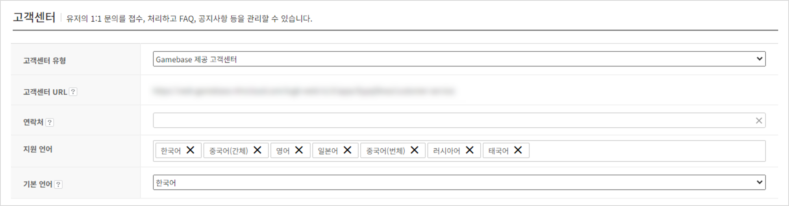
<!-- LLM_Image_DESC_20260406
    유형: Screenshot
    내용: 고객센터 설정 - Gamebase 제공 고객센터 유형
    구성: 고객센터 유형 드롭다운(Gamebase 제공 고객센터 선택), 고객센터 URL(자동 생성), 연락처 입력 필드, 지원 언어(한국어, 중국어(간체), 영어, 일본어, 중국어(번체), 러시아어, 태국어 태그), 기본 언어(한국어) 드롭다운이 표시됨.
    Keyword: 고객센터, Gamebase 제공, 지원 언어, 기본 언어
-->
Gamebase에서 제공하는 고객센터 기능을 사용하고자 할 때 설정합니다.
설정 항목은 아래와 같습니다.
* **고객센터 URL**: 고객에게 문의를 인입받을 수 있는 페이지 정보를 제공합니다. 해당 URL은 Gamebase 제공 고객센터를 선택할 경우 자동으로 생성되며 이 URL을 통해 고객의 문의를 별도의 웹페이지를 통해 전달받을 수 있습니다.
* **연락처**: 고객센터 연락처를 입력합니다. 이 정보는 Gamebase SDK를 통해 전달받을 수 있습니다.
* **지원 언어**: 고객센터 사용자에게 지원할 언어를 선택합니다. 프로젝트 자체 언어 설정과는 별도로 설정되며 한국어, 영어, 일본어, 중국어(간체), 중국어(번체), 러시아어를 지원합니다. 원하는 지원 언어가 없을 경우, 고객센터로 문의하시기 바랍니다.
* **기본 언어**: 지원 언어에서 선택한 항목 중 고객센터 내에서 기본으로 제공할 언어를 선택합니다.

#### 3. NHN Cloud 조직 상품(Online Contact)
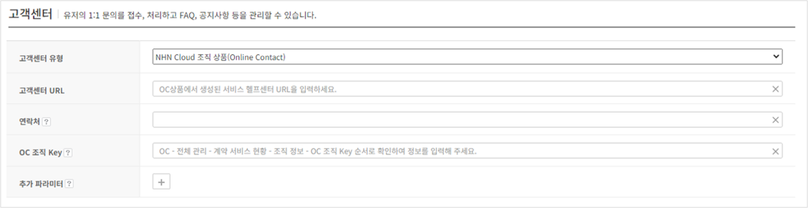
<!-- LLM_Image_DESC_20260406
    유형: Screenshot
    내용: 고객센터 설정 - NHN Cloud 조직 상품(Online Contact) 유형
    구성: 고객센터 유형 드롭다운(NHN Cloud 조직 상품(Online Contact) 선택), 고객센터 URL, 연락처, OC 조직 Key, 추가 파라미터(+ 버튼) 입력 필드가 표시됨.
    Keyword: 고객센터, NHN Cloud, Online Contact, OC 조직 Key
-->
NHN Cloud에서 조직별로 제공되는 Online contact 상품을 사용하는 경우 설정합니다.
설정 항목은 아래와 같습니다.
* **고객센터 URL**: NHN Cloud Online Contact에서 제공되는 주소를 입력합니다. 해당정보는 NHN Cloud Online Contact에 접속하여 확인할 수 있습니다.
* **연락처**: 고객센터 연락처를 입력합니다. 이 정보는 Gamebase SDK를 통해 추가로 정보를 전달받을 수 있습니다.
* **OC 조직 Key**: NHN Cloud Online Contact 고객센터 문의를 확인하기 위한 Key를 입력합니다. 해당정보를 입력하지 않을 경우 고객센터 페이지 내에서 인입된 문의를 확인할 수 없으므로 확인 후 입력해야 합니다. 자세한 연동 방법은 아래 참고내용을 보시고 연동해주시면 됩니다.
> [참고] NHN Cloud Online Contact와 Gamebase간의 연동
> Gamebase내에서 NHN Cloud Online Contact 연동하고자 할 경우 아래 과정에 따라 SSO 로그인 API Key를 발급받아 Gamebase내에 설정해주셔야 고객센터 서비스를 정상적으로 이용할 수 있습니다.
> 고객센터의 안정적인 서비스 제공을 위해 아래 순서대로 참고하시어 진행 해주시기 바랍니다.
>
> 1) NHN Cloud Online Contact에 회원 연동 방식 설정
> 서비스 관리 -> 헬프센터 -> 회원 연동
> 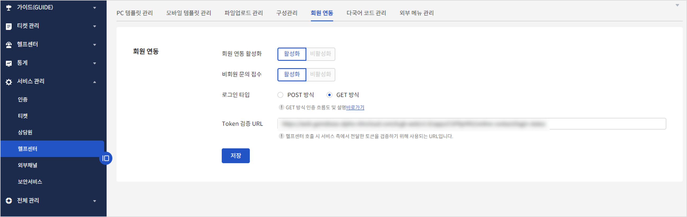
<!-- LLM_Image_DESC_20260406
    유형: Screenshot
    내용: NHN Cloud Online Contact 회원 연동 설정 화면
    구성: 좌측 메뉴에서 서비스 관리 > 헬프센터 > 회원 연동 선택 상태. 회원 연동 활성화/비활성화, 비회원 문의 접수 활성화/비활성화 토글, 로그인 타입(POST/GET 방식), Token 검증 URL 입력 필드, 저장 버튼이 표시됨.
    Keyword: Online Contact, 회원 연동, Token 검증 URL, 로그인 타입
-->
> 회원 연동 활성화: 활성화
> 로그인 타입: GET 방식
> Token 검증 URL: https://web-gamebase.nhncloud.com/tcgb-web/v1.0/apps/{appId}/online-contact/login-status
> **{appId}** 부분은 설정하고자 하는 Gamebase의 프로젝트 ID를 확인하신 후 해당 위치에 입력해주시면 됩니다.
>
> 2) OC 조직 Key를 획득하여 OC 조직 Key항목에 입력
> 전체 관리 -> 계약 서비스 현황 -> 조직 정보로 이동한 후 OC 조직 정보의 OC 조직 Key를 복사하여 Gamebase OC 조직 Key 항목에 입력
> 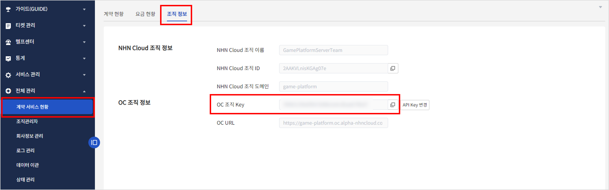
<!-- LLM_Image_DESC_20260406
    유형: Screenshot
    내용: NHN Cloud Online Contact 조직 정보에서 OC 조직 Key 확인 화면
    구성: 좌측 메뉴에서 전체 관리 > 계약 서비스 현황 > 조직 정보 선택 상태. NHN Cloud 조직 정보(조직 이름, 조직 도메인)와 OC 조직 정보(OC 조직 Key, OC URL)가 표시됨. OC 조직 Key가 빨간 박스로 강조.
    Keyword: Online Contact, OC 조직 Key, 조직 정보, NHN Cloud
-->
>
> 3) NHN Cloud Online contact 고객센터 페이지 주소를 획득하여 고객센터 URL에 입력
> 헬프센터 -> 하위메뉴 선택 -> 우측 위 헬프센터 바로가기 클릭
> 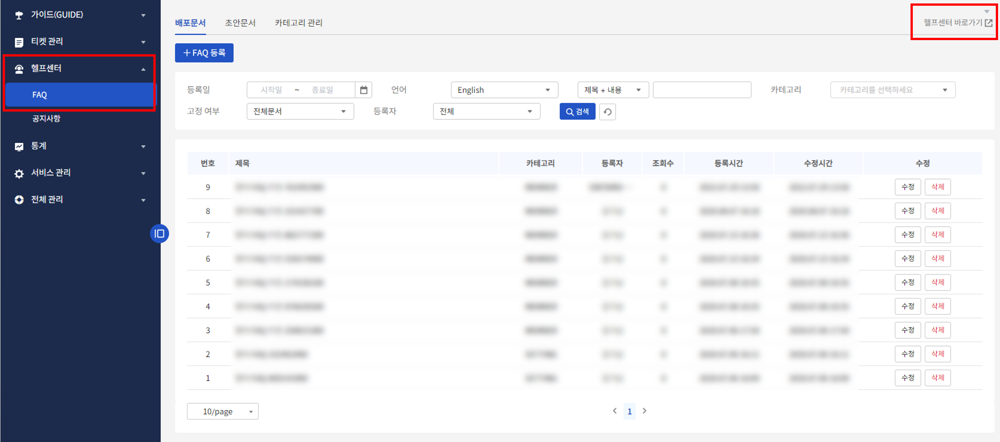
<!-- LLM_Image_DESC_20260406
    유형: Screenshot
    내용: NHN Cloud Online Contact 헬프센터 FAQ 관리 화면
    구성: 좌측 메뉴에서 헬프센터 > FAQ 선택 상태. FAQ 등록 목록 테이블(번호, 카테고리, 포커스, 등록시간, 수정시간, 수정자 컬럼), 검색 필터, +FAQ등록 버튼, 우측 상단에 '헬프센터 바로가기' 링크가 빨간 박스로 강조됨.
    Keyword: Online Contact, 헬프센터, FAQ, 바로가기
-->
> 브라우저 상단에 표시된 주소를 Gamebase 고객센터 URL 항목에 입력
> 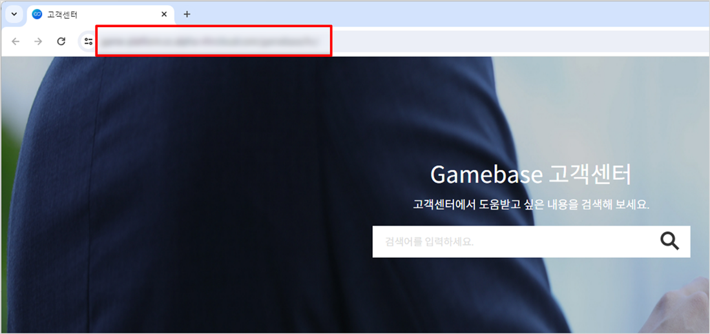
<!-- LLM_Image_DESC_20260406
    유형: Screenshot
    내용: Gamebase 고객센터 웹페이지 URL 확인 화면
    구성: 브라우저 주소창에 고객센터 URL이 빨간 박스로 강조 표시됨. Gamebase 고객센터 페이지 상단에 '고객센터에서 도움말과 고객 지원을 만나보세요' 텍스트가 표시됨.
    Keyword: 고객센터 URL, 브라우저, Gamebase 고객센터
-->
>

### Test Device

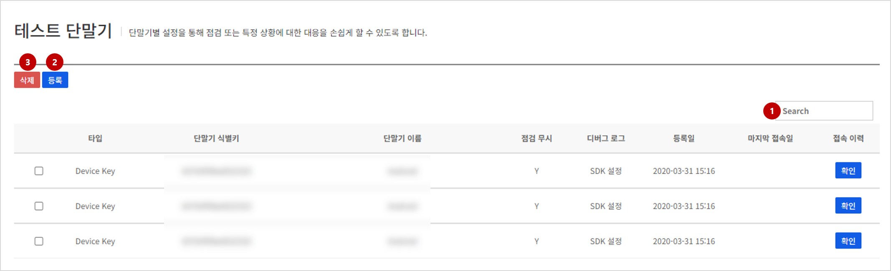
<!-- LLM_Image_DESC_20260406
    유형: Screenshot
    내용: 테스트 단말기 목록 조회 화면
    구성: 삭제/등록 버튼, Search 검색 필드, 테스트 단말기 목록 테이블(타입, 단말기 식별키, 단말기 이름, 점검 무시, 디버그 로그, 등록일, 마지막 접속 이력 컬럼). Device Key 타입의 등록된 단말기 목록이 체크박스와 함께 표시됨.
    Keyword: 테스트 단말기, 목록, Device Key, 점검 무시, 디버그 로그
-->
테스트 단말기로 등록되면 Gamebase를 사용하는 앱이 점검 중이어도 정상적으로 게임에 접근할 수 있습니다.
테스트 단말기를 등록하려면 **Device Key** 또는 **IP** 정보를 등록해야 합니다. 직접 입력하거나 **게임유저 ID**를 조회하여 등록할 수 있습니다.
점검시 게임플레이가 가능할 수 있도록 하거나 단말기별 Debug Log 출력 여부를 설정하여 테스트 단말기를 관리할 수 있습니다.
더 이상 사용하지 않는 테스트 단말기를 삭제할 수도 있습니다.
접속 이력 확인버튼을 누르면 해당 기기를 통한 **점검이 진행되는 동안의 접속 시간 및 상세 접속 로그**를 확인할 수 있습니다.
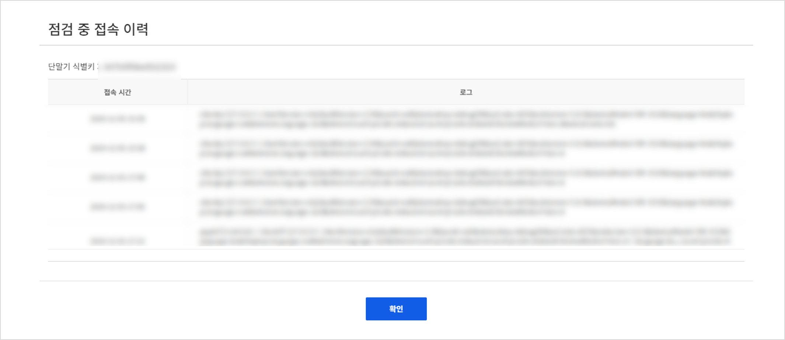
<!-- LLM_Image_DESC_20260406
    유형: Screenshot
    내용: 점검 중 접속 이력 다이얼로그
    구성: 단말기 식별키 정보와 접속 시간/로그 컬럼으로 구성된 테이블에 점검 중 접속한 상세 로그가 표시됨. 하단에 확인 버튼.
    Keyword: 점검 중 접속 이력, 접속 시간, 로그, 테스트 단말기
-->

> [참고]
> 테스트 단말기는 최대 100개까지만 등록할 수 있습니다.

#### (1) 조회

앱에 등록된 전체 테스트 단말기를 확인 할 수 있습니다. 검색어를 **Search**에 입력하여 검색 조건에 맞는 테스트 단말기를 찾아 볼 수 있습니다.

#### (2) 등록

조회 화면에서 **등록** 버튼을 클릭하면 테스트 단말기를 등록할 수 있는 화면이 나타납니다. **Device Key**를 직접 입력하거나 **게임유저 ID**를 검색해 테스트 단말기를 등록할 수 있습니다.

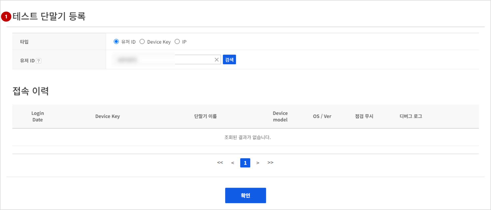
<!-- LLM_Image_DESC_20260406
    유형: Screenshot
    내용: 테스트 단말기 등록 - 유저 ID 검색 화면
    구성: 타입 선택(유저 ID/Device Key/IP 라디오 버튼), 유저 ID 입력 및 검색 버튼, 접속 이력 테이블(Login Date, Device Key, 단말기 이름, Device model, OS/Ver, 점검 무시, 디버그 로그 컬럼). 하단에 확인 버튼.
    Keyword: 테스트 단말기 등록, 유저 ID, 접속 이력, Device Key
-->
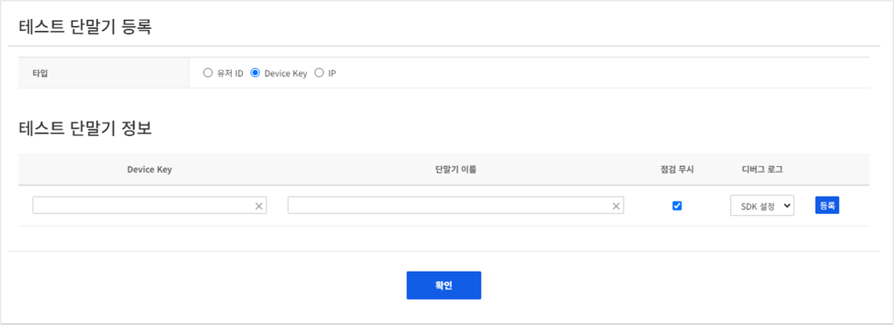
<!-- LLM_Image_DESC_20260406
    유형: Screenshot
    내용: 테스트 단말기 등록 - Device Key 직접 입력 화면
    구성: 타입 선택(Device Key 선택 상태), 테스트 단말기 정보 테이블(Device Key, 단말기 이름 입력 필드, 점검 무시 체크박스, 디버그 로그 SDK 설정 드롭다운, 등록 버튼). 하단에 확인 버튼.
    Keyword: 테스트 단말기 등록, Device Key, 직접 입력, 점검 무시
-->

**(1) 게임유저 ID를 통한 등록**

타입을 유저 ID로 선택하고 게임유저 ID를 입력하여 **검색** 버튼을 클릭하면 화면 하단에 사용자의 로그인 로그 내역이 조회됩니다. 조회된 내역에서 테스트 단말기로 등록하고자 하는 Device Key를 선택하여 **추가 정보**를 입력하여 **등록** 버튼을 클릭하면 해당 Device key가 테스트 단말기 정보로 등록됩니다.


**(2)Device Key 또는 IP를 통한 등록**

등록하고자 하는 Device key 또는 IP 정보를 알고 있을 경우 타입을 원하는 입력방식으로 선택하여 직접 테스트 단말기를 등록할 수 있습니다.
등록하고자 하는 단말기의 **단말기 이름** 및 디버그 로그, 점검 무시 여부를 입력 후 등록 버튼을 누르면 테스트 단말기로 등록됩니다.

> [참고]
> 단말기 이름에는 사용자가 알아보기 편한 별칭을 입력하시면 됩니다. 예시) iPhone 6 테스트, 토스트님 아이패드

#### (3) 삭제

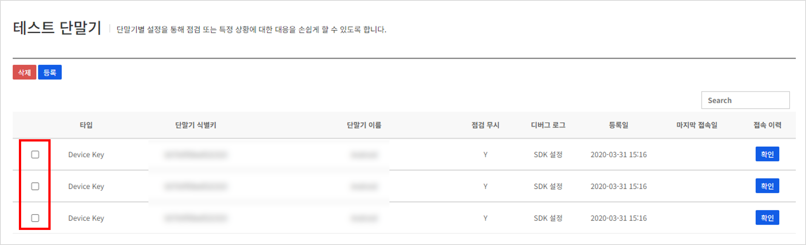
<!-- LLM_Image_DESC_20260406
    유형: Screenshot
    내용: 테스트 단말기 삭제 화면
    구성: 삭제/등록 버튼(삭제 버튼이 빨간색으로 강조), 테스트 단말기 목록에서 좌측 체크박스로 삭제할 단말기를 선택할 수 있는 상태. Search 검색 필드와 단말기 정보 컬럼들이 표시됨.
    Keyword: 테스트 단말기, 삭제, 체크박스, 선택 삭제
-->

테스트 단말기 조회 화면에서 삭제하고자 하는 테스트 단말기를 체크한 후 왼쪽 위의 삭제 버튼을 클릭하면 테스트 단말기 정보가 삭제됩니다. 삭제된 정보는 복구할 수 없으므로 삭제 전에 다시 한번 확인한 후 삭제하시기 바랍니다.

### Authentication Information

#### 1. Facebook
Facebook 개발자 사이트에 등록한 앱의 {앱 아이디}와 {앱 시크릿 코드}를 Gamebase Console에 입력합니다.

**입력 필드**

- Client ID: {AppID}
- Secret Key: {App Secret Code}
- 추가정보: Facebook Permission & Facebook Client Token (json format)


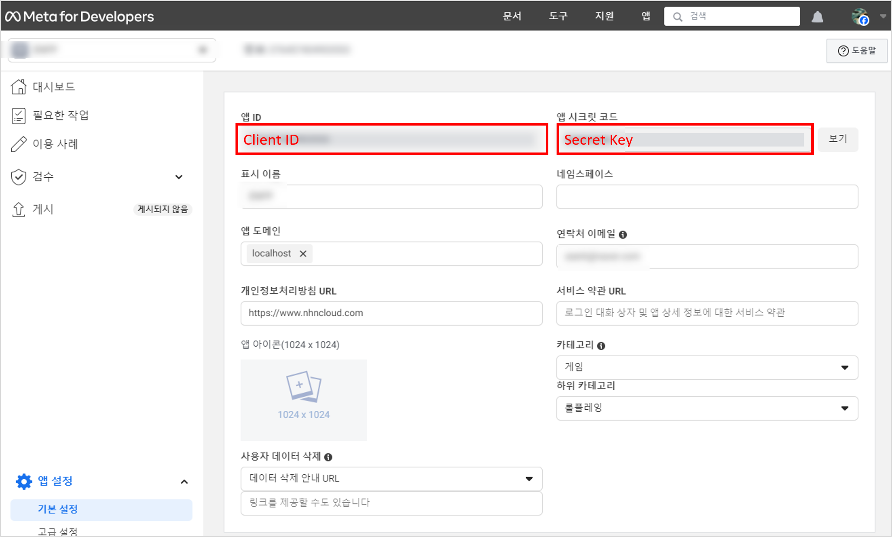
<!-- LLM_Image_DESC_20260406
    유형: Screenshot
    내용: Meta for Developers 앱 설정 화면 - Client ID와 Secret Key 확인
    구성: Meta for Developers 대시보드에서 앱 ID(Client ID)와 앱 시크릿 코드(Secret Key)가 빨간 박스로 강조 표시됨. 표시 이름, 도메인, 연락처 이메일, 개인정보처리방침 URL, 서비스 약관 URL, 아이콘, 카테고리, 사용자 데이터 삭제 등 앱 설정 필드가 표시됨.
    Keyword: Facebook, Meta for Developers, Client ID, Secret Key, 앱 설정
-->
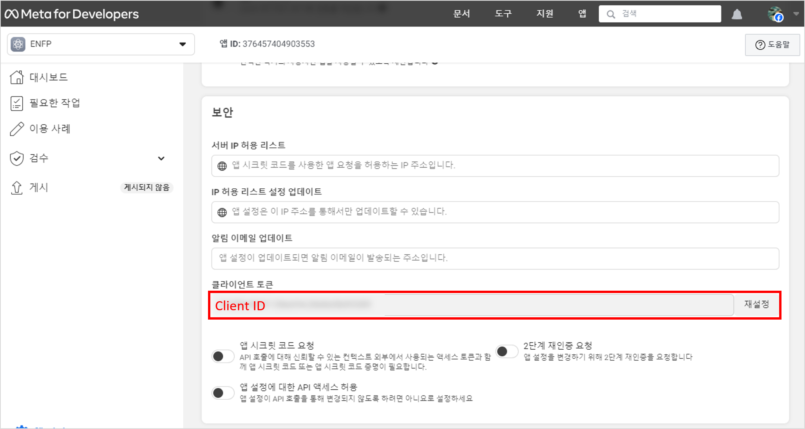
<!-- LLM_Image_DESC_20260406
    유형: Screenshot
    내용: Meta for Developers 보안 설정 - 클라이언트 토큰 확인
    구성: Meta for Developers의 보안 설정 화면에서 서버 IP 허용 리스트, 알림 이메일 업데이트, 클라이언트 토큰(Client ID 빨간 박스 강조) 등의 설정이 표시됨.
    Keyword: Facebook, Meta for Developers, 클라이언트 토큰, 보안 설정
-->

##### Additional Info Settings
* **NHN Cloud Console > Gamebase > App > 인증 정보 > 추가 정보** 항목에 JSON string 형태의 정보를 설정해야 합니다.
* Facebook의 경우, OAuth 인증 시도 시 Facebook에 요청할 권한 정보인 **facebook_permission**과 **facebook_client_token**을 설정해야 합니다.
* Facebook 추가 인증 정보 입력 예제

        { "facebook_permission": ["public_profile", "email"], "facebook_client_token": "Your Facebook Client Token" }

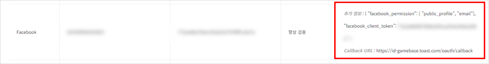
<!-- LLM_Image_DESC_20260406
    유형: Screenshot
    내용: Gamebase 콘솔 Facebook 인증 정보 추가 정보 설정
    구성: Facebook IdP의 추가 정보란에 facebook_permission(public_profile, email)과 facebook_client_token JSON 값이 빨간 박스로 강조되어 표시됨. Callback URL도 함께 표시.
    Keyword: Facebook, 인증 정보, 추가 정보, facebook_permission, Callback URL
-->

**Reference URL**<br />

- [Facebook 개발자 사이트](https://developers.facebook.com/)
- [Facebook 권한](https://developers.facebook.com/docs/facebook-login/permissions/)

##### Android
* [Gamebase > Android SDK 사용 가이드 > 시작하기 > Setting > AndroidManifest.xml > Facebook IdP](../../aos-started.md#facebook-idp)

##### iOS
* [Gamebase > iOS SDK 사용 가이드 > 시작하기 > IdP Settings > Facebook](../../ios-started.md#facebook)

#### 2. Google

##### Google Cloud Console - Common

* Gamebase에서 Google 인증을 하기 위한 준비로 우선 **Google Cloud Console > APIs & Services > Credentials > + CREATE CREDENTIALS > OAuth client ID** 메뉴에서 **Web application** 유형의 Client id를 생성합니다.
    * 이미 생성된 Web application 유형의 Client id가 존재한다면 해당 Client id를 사용해도 됩니다.
    * 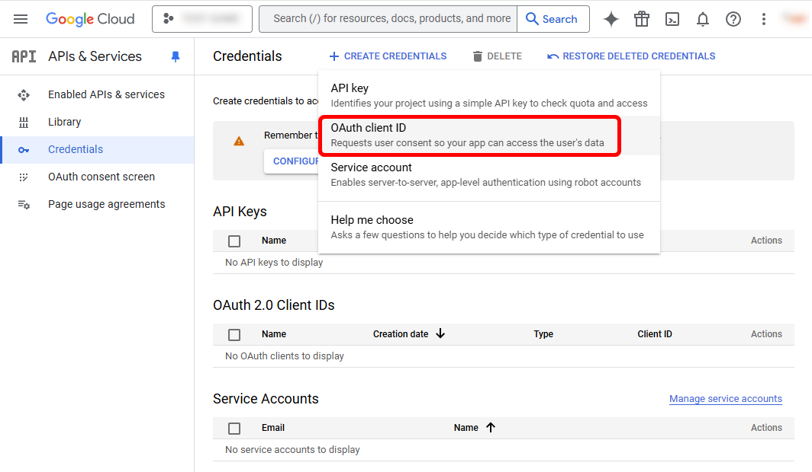 
<!-- LLM_Image_DESC_20260406
    유형: Screenshot
    내용: Google Cloud Console Credentials 메뉴 - OAuth client ID 생성
    구성: Google Cloud Console의 APIs & Services > Credentials 화면. + CREATE CREDENTIALS 드롭다운에서 OAuth client ID 옵션이 빨간 박스로 강조됨. API Keys, OAuth 2.0 Client IDs, Service Accounts 섹션이 표시됨.
    Keyword: Google Cloud Console, Credentials, OAuth client ID, CREATE CREDENTIALS
-->
    * 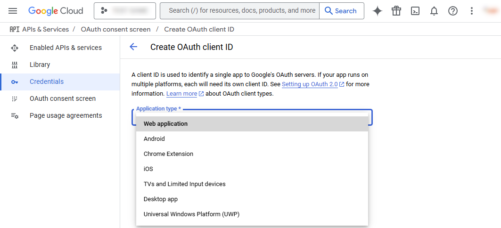 
<!-- LLM_Image_DESC_20260406
    유형: Screenshot
    내용: Google Cloud Console - OAuth client ID 유형 선택 화면
    구성: Create OAuth client ID 페이지에서 Application type 드롭다운에 Web application, Android, Chrome Extension 등 유형 목록이 표시됨.
    Keyword: Google Cloud Console, OAuth client ID, Application type, Web application
-->
* **승인된 리디렉션 URI** 란에는 다음 값을 입력해야 합니다. 
    * https://id-gamebase.toast.com/oauth/callback 
    * https://alpha-id-gamebase.toast.com/oauth/callback
    * 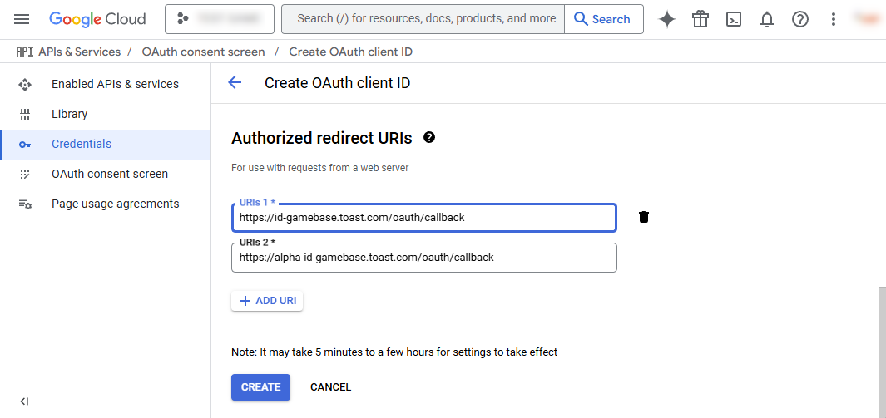
<!-- LLM_Image_DESC_20260406
    유형: Screenshot
    내용: Google Cloud Console - 승인된 리디렉션 URI 설정
    구성: Create OAuth client ID 페이지의 Authorized redirect URIs 섹션. id-gamebase.toast.com과 alpha-id-gamebase.toast.com의 OAuth callback URL 2개가 입력됨. CREATE/CANCEL 버튼 표시.
    Keyword: Google Cloud Console, 리디렉션 URI, OAuth callback, 승인된 URI
-->
* 생성한 Client id 정보를 **NHN Cloud Console > Game > Gamebase > 앱 > 인증 정보 > Google > Client ID > Web Application ID** 란에 입력합니다. 
    * 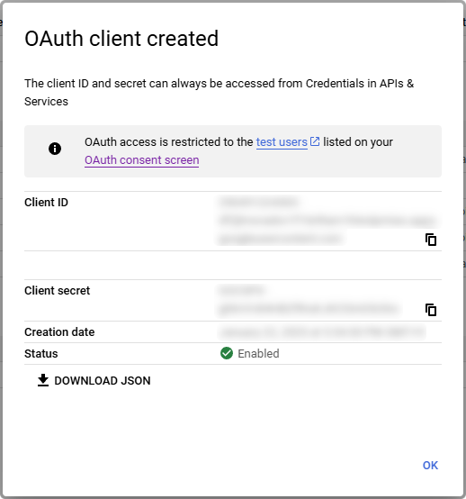
<!-- LLM_Image_DESC_20260406
    유형: Screenshot
    내용: Google Cloud Console - OAuth client 생성 완료 다이얼로그
    구성: OAuth client created 팝업에 Client ID, Client secret, Creation date, Status(Enabled) 정보가 표시됨. DOWNLOAD JSON 링크와 OK 버튼 존재.
    Keyword: Google Cloud Console, OAuth client, Client ID, Client secret, 생성 완료
-->
    * 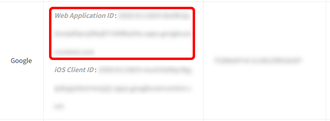 
<!-- LLM_Image_DESC_20260406
    유형: Screenshot
    내용: Gamebase 콘솔 Google 인증 정보 - Web Application ID 입력 위치
    구성: Google IdP의 Client ID 섹션에서 Web Application ID 입력란이 빨간 박스로 강조됨. iOS Client ID 필드도 하단에 표시됨.
    Keyword: Gamebase 콘솔, Google, Web Application ID, Client ID
-->
* **NHN Cloud Console > Game > Gamebase > 앱 > 인증 정보 > Google > Secret Key** 란에는 Web application 유형의 Client secret을 입력합니다. 
    * 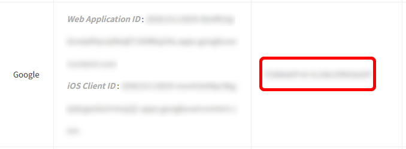
<!-- LLM_Image_DESC_20260406
    유형: Screenshot
    내용: Gamebase 콘솔 Google 인증 정보 - Secret Key 입력 위치
    구성: Google IdP의 인증 정보에서 Secret Key 입력란이 빨간 박스로 강조됨. Web Application ID와 iOS Client ID도 표시됨.
    Keyword: Gamebase 콘솔, Google, Secret Key, 인증 정보
-->

##### Google Cloud Console - Android

* Android 단말기에서 Google 인증을 하기 위해서는 Google Cloud Console에서 추가적으로 Android 유형의 Client id를 생성해야 합니다.
* **Google Cloud Console > APIs & Services > Credentials > + CREATE CREDENTIALS > OAuth client ID** 메뉴에서 **Android** 유형의 Client id를 생성합니다. 
    * 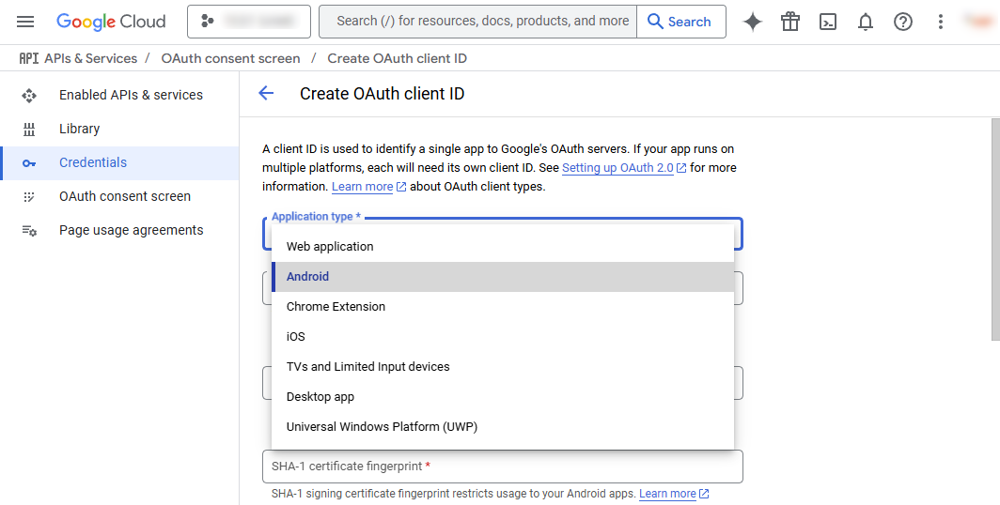
<!-- LLM_Image_DESC_20260406
    유형: Screenshot
    내용: Google Cloud Console - Android 유형 OAuth client ID 생성
    구성: Create OAuth client ID 페이지에서 Application type 드롭다운에 Android 옵션이 강조됨. Web application, Android, Chrome Extension 등 유형 목록 표시.
    Keyword: Google Cloud Console, Android, OAuth client ID, Application type
-->
* Android 유형은 Package name과 SHA-1 서명 정보가 필요합니다.
    * 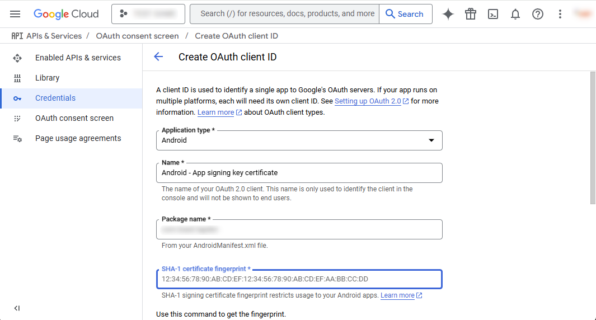
<!-- LLM_Image_DESC_20260406
    유형: Screenshot
    내용: Google Cloud Console - Android OAuth client ID 생성 세부 입력
    구성: Create OAuth client ID 페이지에서 Package name과 SHA-1 certificate fingerprint 입력 필드가 표시됨. keytool 명령어 안내 포함.
    Keyword: Google Cloud Console, Android, Package name, SHA-1, 인증서 서명
-->
* Android 빌드는 업로드 서명과 앱 서명이 다르므로 두 종류의 SHA-1 값을 모두 등록해야 빌드 테스트가 원활하게 진행됩니다.
    * Firebase나 GPGS와 같은 일부 Google 플랫폼을 사용하는 경우 자동으로 Android 유형의 Client id 설정이 추가되는 경우도 있습니다.
    * 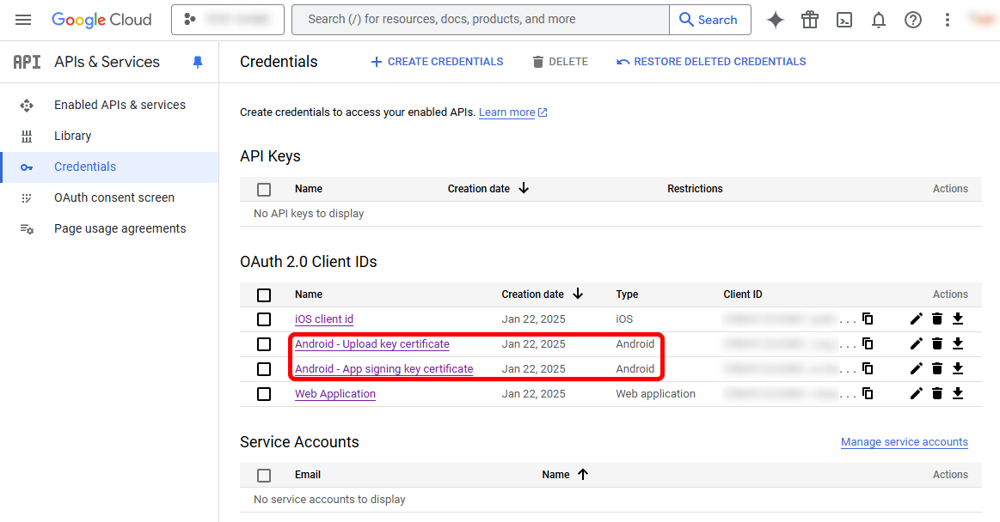
<!-- LLM_Image_DESC_20260406
    유형: Screenshot
    내용: Google Cloud Console - Credentials 페이지에서 생성된 OAuth 2.0 Client ID 목록
    구성: Credentials 페이지의 OAuth 2.0 Client IDs 섹션에 Android 유형의 Client ID가 빨간 박스로 강조되어 표시됨. 여러 유형(Web, Android 등)의 Client ID 목록이 나열됨.
    Keyword: Google Cloud Console, Credentials, OAuth 2.0 Client IDs, Android
-->
* 여기서 주의할 점은, Gamebase Console에는 Web application 유형의 Client id만 입력해야 하므로 Android 유형의 Client id는 입력하지 않아야 합니다.
    * 
<!-- LLM_Image_DESC_20260406
    유형: Screenshot
    내용: Gamebase 콘솔 Google 인증 정보 - Web Application ID 강조 (재확인)
    구성: Google IdP의 Client ID 섹션에서 Web Application ID 입력란이 빨간 박스로 강조됨. Android 유형이 아닌 Web application 유형의 Client ID만 입력해야 함을 안내.
    Keyword: Gamebase 콘솔, Google, Web Application ID, 주의사항
-->
* Google Credential Manager로 전환된 이후 버전(2.68.0)부터는 Google Cloud Console에서 아래와 같이 설정해야 합니다.
* **Google Cloud Console > Google 인증 플랫폼 > 대상** 메뉴에서 **사용자 유형**을 **외부**로, **게시 상태**를 **프로덕션 단계**로 설정합니다.
    * 이렇게 설정되지 않은 상태에서 로그인 시도 시 무조건 취소됩니다.
    * 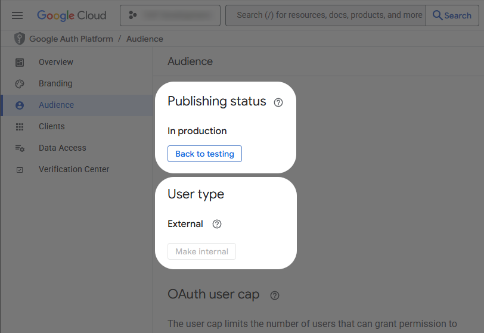
<!-- LLM_Image_DESC_20260406
    유형: Screenshot
    내용: Google Auth Platform Audience 설정 - 프로덕션 게시 상태
    구성: Google Cloud Console의 Google Auth Platform > Audience 페이지. Publishing status가 'In production'으로, User type이 'External'로 설정된 상태가 강조 표시됨. Back to testing, Make internal 버튼도 표시됨.
    Keyword: Google Auth Platform, Audience, Publishing status, In production, External
-->

##### Google Cloud Console - iOS
 
* iOS 단말기에서 Google 인증을 하기 위해서는 Google Cloud Console에서 추가적으로 iOS 유형의 Client id를 생성해야 합니다.  
* **Google Cloud Console > APIs & Services > Credentials > + CREATE CREDENTIALS > OAuth client ID** 메뉴에서 **iOS** 유형의 Client id를 생성합니다. 
    * 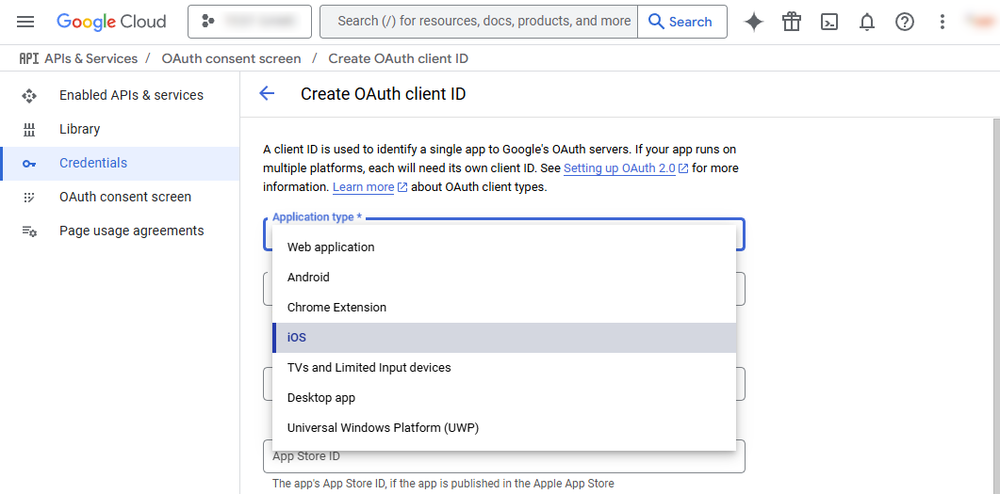
<!-- LLM_Image_DESC_20260406
    유형: Screenshot
    내용: Google Cloud Console - iOS 유형 OAuth client ID 생성
    구성: Create OAuth client ID 페이지에서 Application type 드롭다운에 iOS 옵션이 강조됨.
    Keyword: Google Cloud Console, iOS, OAuth client ID, Application type
-->
* Bundle ID를 입력합니다.
    * 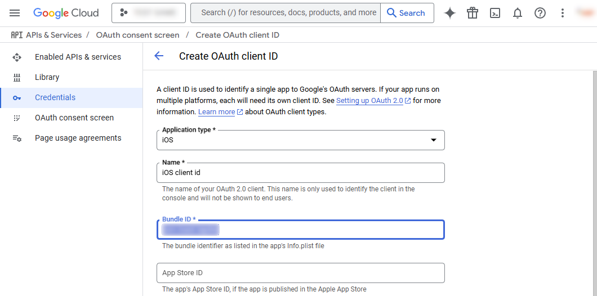
<!-- LLM_Image_DESC_20260406
    유형: Screenshot
    내용: Google Cloud Console - iOS OAuth client ID 생성 시 Bundle ID 입력
    구성: Create OAuth client ID 페이지에서 Application type이 iOS로 선택된 상태. Bundle ID와 App Store ID 입력 필드가 표시됨.
    Keyword: Google Cloud Console, iOS, Bundle ID, App Store ID
-->
* iOS는 Android와 다르게 **NHN Cloud Console > Game > Gamebase > 앱 > 인증 정보 > Google > Client ID > iOS Client ID** 란에 iOS 유형으로 발급 받은 Client id를 입력해야 합니다.
    * 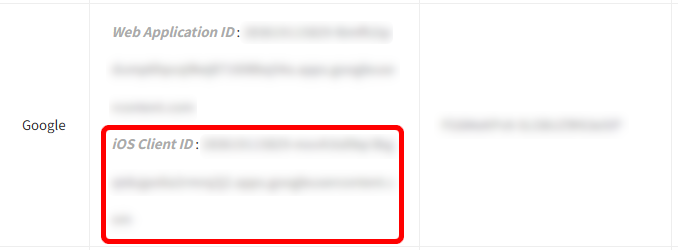
<!-- LLM_Image_DESC_20260406
    유형: Screenshot
    내용: Gamebase 콘솔 Google 인증 정보 - iOS Client ID 입력 위치
    구성: Google IdP의 Client ID 섹션에서 iOS Client ID 입력란이 빨간 박스로 강조됨. Web Application ID도 상단에 표시됨.
    Keyword: Gamebase 콘솔, Google, iOS Client ID, 인증 정보
-->

##### Gamebase Console

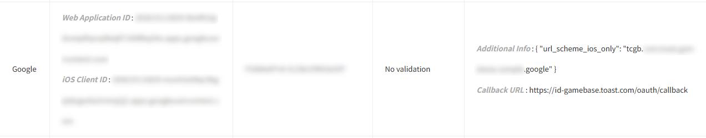
<!-- LLM_Image_DESC_20260406
    유형: Screenshot
    내용: Gamebase 콘솔 Google 인증 정보 전체 설정 화면
    구성: Google IdP의 전체 인증 정보. Web Application ID, iOS Client ID, Secret Key(Client secret), 토큰 재검증(No validation), 추가 정보(url_scheme_ios_only JSON), Callback URL이 모두 표시됨.
    Keyword: Gamebase 콘솔, Google, 인증 정보 전체, Web Application ID, iOS Client ID
-->

**입력 필드**<br />

- Web Application ID: {Google Web Application Client ID}
- iOS Client ID: {Google iOS Client ID}
- Secret Key: {Google Web Application Client secret}
- 추가정보: OAuth 2.0 Scopes (json format)

##### Additional Info Settings

* **NHN Cloud Console > Game > Gamebase > 앱 > 인증 정보 > 추가 정보** 항목에 JSON string 형태의 정보를 설정할 수 있습니다.
* Google의 경우 OAuth 인증 후 프로필 정보에서 email 정보를 획득하려면 인증 권한 범위인 **scope**를 설정해야 합니다.
* email 외에 선언할 수 있는 다양한 scope는 다음 문서에서 확인할 수 있습니다.
    * https://developers.google.com/identity/protocols/oauth2/scopes#google-sign-in
    * https://developers.google.com/identity/protocols/oauth2/scopes
* Google 추가 인증 정보 입력 예제

        { "scope": ["email","myscope1","myscope2",...] }

##### iOS

* [Gamebase > iOS SDK 사용 가이드 > 시작하기 > IdP Settings > Google](../../ios-started.md#google)

#### 3. Apple Game Center
Apple 개발자 사이트에 등록된 BundleID를 Gamebase Console에 입력합니다.

**입력 필드**<br />

- Client ID: {Bundle ID}<br />

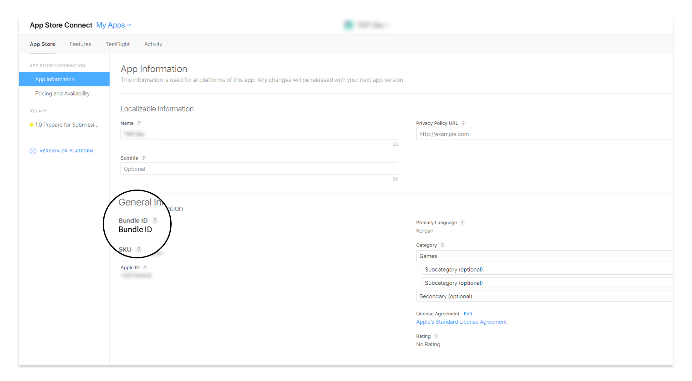
<!-- LLM_Image_DESC_20260406
    유형: Screenshot
    내용: App Store Connect 앱 정보 화면 - Bundle ID 확인
    구성: App Store Connect의 App Information 페이지. General Information 섹션에서 Bundle ID가 원형으로 강조 표시됨. Name, Subtitle, Apple ID, Primary Language, Category, License Agreement, Rating 등 앱 메타데이터 필드 표시.
    Keyword: App Store Connect, Bundle ID, Apple Game Center, 앱 정보
-->

**Reference URL**<br />

- [Apple Developer 사이트](https://developer.apple.com/)
- [Apple iTunes Connect](https://itunesconnect.apple.com/)


#### 4. PAYCO
PAYCO Client ID를 신청해서 발급 받은 {client_id} 및 {client_secret}을 Gamebase Console에 입력합니다.

**입력 필드**<br />

- Client ID: {PAYCO client_id}
- Secret Key: {PAYCO client_secret}
- 추가정보: PAYCO Service Code & Service Name (JSON format)

##### Additional Info Settings

* **NHN Cloud Console > Gamebase > App > 인증 정보 > 추가 정보** 항목에 JSON string 형태의 정보를 설정해야 합니다.
* PAYCO의 경우, PAYCO SDK에서 요구하는 **service_code**와 **service_name**을 설정해야 합니다.
* PAYCO 추가 인증 정보 입력 예제

        { "service_code": "Your Service Code", "service_name": "Your Service Name" }

##### iOS
* [Gamebase > iOS SDK 사용 가이드 > 시작하기 > IdP settings > PAYCO](../../ios-started.md#payco)

#### 5. NAVER
NAVER Developers 사이트에서 신청하여 발급 받은 {client_id} 및 {client_secret}을 Gamebase Console에 입력합니다.
이때, 로그인 동의 창에서 표시할 애플리케이션 이름인 **service_name**을 설정해야 합니다.

**입력 필드**

- Client ID: {NAVER client_id}
- Secret Key: {NAVER client_secret}
- 추가정보: NAVER Application Name (json format)

**Reference URL**

- [NAVER Developers - 애플리케이션 등록](https://developers.naver.com/apps/#/register)
- [NAVER Developers - 클라이언트 아이디와 클라이언트 시크릿 확인](https://developers.naver.com/docs/common/openapiguide/#/appregister.md)

##### Additional Info Settings

* **NHN Cloud Console > Gamebase > App > 인증 정보 > 추가 정보 & Callback URL**의 **추가 정보** 항목에 JSON String 형태의 정보를 설정해야 합니다.
* NAVER의 경우, 로그인 동의 창에 표시할 앱 이름인 **service_name**을 설정해야 합니다.
* 또한 NAVER Login SDK는 로그아웃 후에도 자동으로 로그인이 되어 계정을 변경할 수 없는데, 로그아웃 후 다른 NAVER 계정으로 로그인하려면 **logout_and_delete_token**을 **true**로 설정해야 합니다.

* NAVER 추가 인증 정보 입력 예제

        { "service_name": "Your Service Name", "logout_and_delete_token": true }

##### iOS
* [Gamebase > iOS SDK 사용 가이드 > 시작하기 > IdP settings > Naver](../../ios-started.md#naver)

#### 6. Twitter

##### Developer Portal

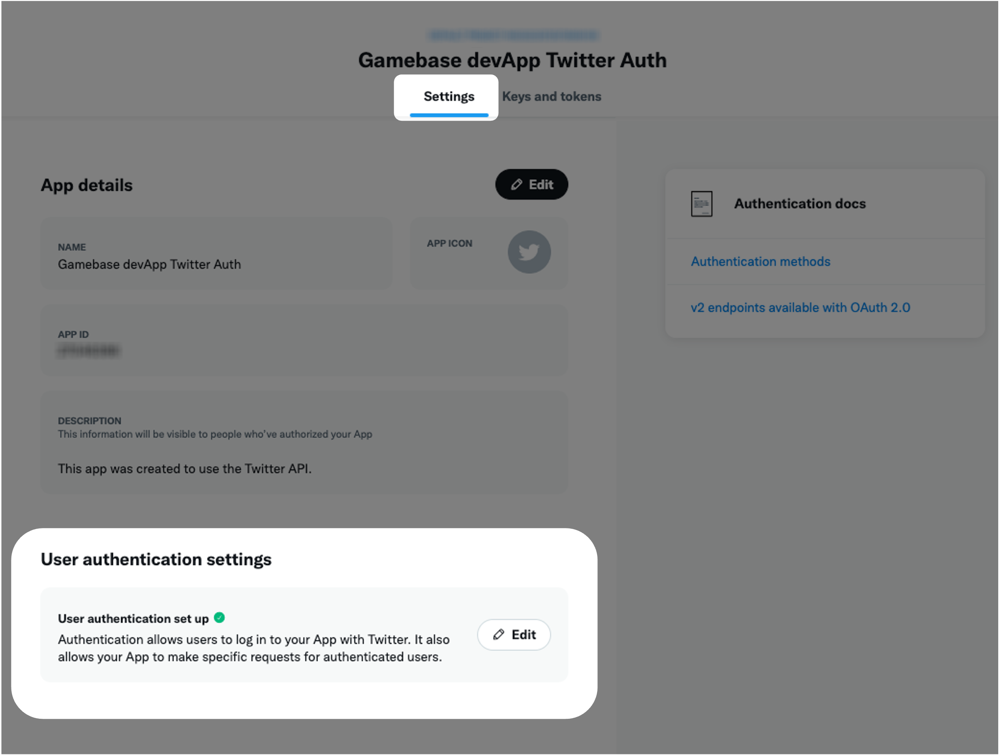
<!-- LLM_Image_DESC_20260406
    유형: Screenshot
    내용: Twitter Developer Portal 앱 설정 화면
    구성: Gamebase devApp Twitter Auth 앱의 Settings 탭. App details(Name, App Icon, App ID, Description)와 User authentication settings 섹션이 표시됨. Authentication docs 링크 포함.
    Keyword: Twitter, Developer Portal, App details, User authentication settings
-->

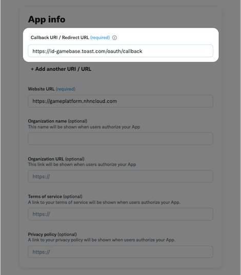
<!-- LLM_Image_DESC_20260406
    유형: Screenshot
    내용: Twitter Developer Portal App info - Callback URI 설정
    구성: App info 섹션에서 Callback URI / Redirect URL(필수) 필드에 id-gamebase.toast.com OAuth callback URL이 입력됨. Website URL, Organization name, Organization URL, Terms of service, Privacy policy 필드도 표시됨.
    Keyword: Twitter, Callback URI, Redirect URL, App info
-->

Twitter 인증을 위해서는 Developer Portal에서 Callback URI란에 다음 값을 입력합니다.
* https://id-gamebase.toast.com/oauth/callback

<br/>

##### Gamebase Console

Developer Portal에서 앱을 등록하고 **OAuth 2.0 Client ID와 Client Secret**을 발급 받아 Gamebase Console에 입력합니다.

**입력 필드**

- Client ID: {OAuth 2.0 Client ID}
- Secret Key: {OAuth 2.0 Client Secret}

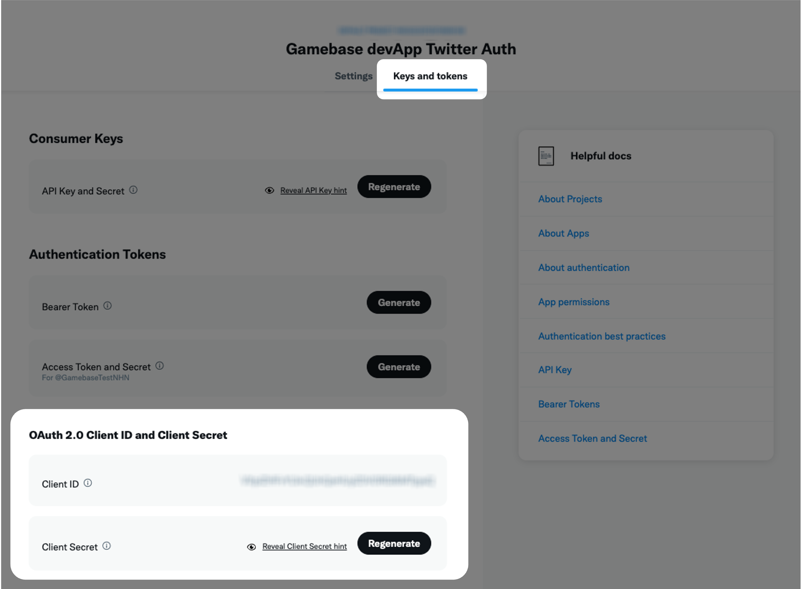
<!-- LLM_Image_DESC_20260406
    유형: Screenshot
    내용: Twitter Developer Portal Keys and tokens 탭 - OAuth 2.0 Client ID 및 Client Secret 확인
    구성: Keys and tokens 탭 선택 상태. Consumer Keys, Authentication Tokens(Bearer Token, Access Token and Secret), OAuth 2.0 Client ID and Client Secret 섹션이 표시됨. Client ID와 Client Secret이 하단에 강조.
    Keyword: Twitter, Keys and tokens, OAuth 2.0, Client ID, Client Secret
-->

**Reference URL**
- [Twitter Application Management](https://developer.x.com/)

<br/>

##### Android
 > <font color="red">[주의]</font><br/>
 >
 > 2019년 7월 25일부로 Twitter에서는 TLS 1.0, TLS 1.1 지원을 중단하고, TLS1.2만 지원합니다.
 > 이에, Android 4.3(Jelly Bean, API Level 18) 이하의 단말기에서는 Android 웹뷰로 Twitter에 로그인할 수 없습니다.
 >
 > 즉, Android 4.4 이상(KitKat, API Level 19)인 기기에서만 Twitter 로그인을 사용할 수 있습니다.

#### 7. LINE

**입력 필드**

- Region: {LINE Channel Region}
- Client ID: {LINE Channel ID}
- Secret Key: {LINE Channel Secret}

**Reference URL**

- [LINE Developer Console](https://developers.line.me/console/)

##### iOS
* [Gamebase > iOS SDK 사용 가이드 > 시작하기 > IdP settings > LINE](../../ios-started.md#line)

#### 8. Sign In with Apple
Sign In with Apple 기능을 사용하려면 App Store Connect, Gamebase 콘솔, Xcode에 설정이 필요합니다.

##### AppStore Connect Settings
* [Certificates, Identifiers & Profiles \> Keys 로 바로가기](https://developer.apple.com/account/resources/authkeys/list)

###### Certificates, Identifiers & Profiles > Keys > 추가(+)
1. **Sign In with Apple** 체크 박스를 선택하고 설정을 진행합니다.
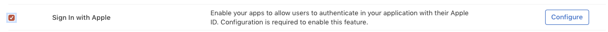
<!-- LLM_Image_DESC_20260406
    유형: Screenshot
    내용: Apple Developer - Sign In with Apple 기능 활성화 체크박스
    구성: Sign In with Apple 항목이 체크된 상태. 'Enable your apps to allow users to authenticate in your application with their Apple ID' 설명과 Configure 버튼이 표시됨.
    Keyword: Apple Developer, Sign In with Apple, 체크박스, Configure
-->
2. **Sign in with Apple**을 사용할 Bundle ID를 선택합니다.
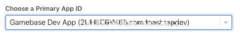
<!-- LLM_Image_DESC_20260406
    유형: Screenshot
    내용: Apple Developer - Primary App ID 선택
    구성: Choose a Primary App ID 드롭다운에서 Gamebase Dev App이 선택된 상태.
    Keyword: Apple Developer, Primary App ID, Sign In with Apple
-->
3. <span style="color:#e11d21">Privatekey</span>를 다운로드 후 보관, 생성된 <span style="color:#e11d21">Key ID를 </span>확인합니다.
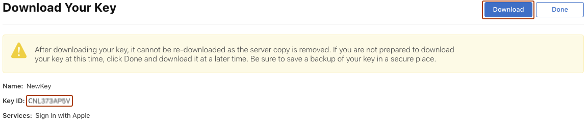
<!-- LLM_Image_DESC_20260406
    유형: Screenshot
    내용: Apple Developer - Private Key 다운로드 화면
    구성: Download Your Key 페이지. Name(NewKey), Key ID 정보 표시. Download/Done 버튼과 키 다운로드 후 재다운로드 불가 경고 메시지가 표시됨.
    Keyword: Apple Developer, Private Key, Download, Key ID
-->
4. Certificates, Identifiers & Profiles > Identifiers > 대상 앱을 선택하고 **Sign In with Apple**을 활성화합니다.
    * `Enable as a primary App ID` 로 설정합니다.
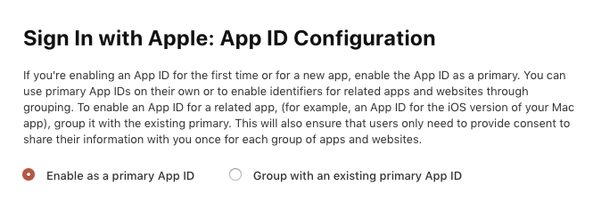
<!-- LLM_Image_DESC_20260406
    유형: Screenshot
    내용: Apple Developer - Sign In with Apple App ID Configuration
    구성: Sign In with Apple: App ID Configuration 화면. 'Enable as a primary App ID'와 'Group with an existing primary App ID' 라디오 버튼이 표시되며, 전자가 선택된 상태.
    Keyword: Apple Developer, App ID Configuration, Enable as primary, Sign In with Apple
-->

##### Gamebase Console > App Settings
[NHN Cloud Console 바로가기](https://console.toast.com/)

* Gamebase
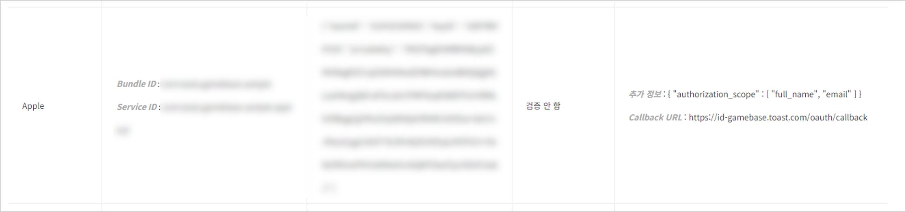
<!-- LLM_Image_DESC_20260406
    유형: Screenshot
    내용: Gamebase 콘솔 Apple 인증 정보 설정 화면
    구성: Apple IdP의 인증 정보. Bundle ID(Client ID)와 Service ID 입력 필드, Secret Key(JSON 형식), 토큰 재검증(검증 안 함), 추가 정보(authorization_scope JSON), Callback URL이 표시됨.
    Keyword: Gamebase 콘솔, Apple, Bundle ID, Service ID, Secret Key, 인증 정보
-->


###### Client ID Settings
> 앱의 Bundle ID를 설정합니다.

###### Secret Key Settings
> Apple Developer Account 설정에서 획득한 값(**TeamID**, **KeyID**, **PrivateKey**)으로 JSON 문자열을 생성해 설정합니다.

* **teamId**: 개발자 계정 오른쪽 상단의 값을 설정합니다.
* **keyId**: Certificates, Identifiers & Profiles > Keys > Sign In with Apple을 선택하여 생성된 값을 설정합니다.
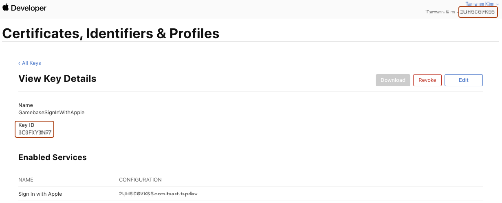
<!-- LLM_Image_DESC_20260406
    유형: Screenshot
    내용: Apple Developer - Key Details에서 Key ID 확인
    구성: Certificates, Identifiers & Profiles > View Key Details 페이지. Name(GamebaseSignInWithApple), Key ID가 표시됨. Enabled Services 테이블에 Sign In with Apple Configuration 정보가 나열됨. Download, Revoke, Edit 버튼 존재.
    Keyword: Apple Developer, Key Details, Key ID, Sign In with Apple
-->
* **privateKey**: 위의 Keys에서 키를 생성하면서 같이 생성된 PrivateKey 파일의 내용을 설정합니다. 다운로드한 파일을 열어서 아래 그림과 같이 빨간 사각형 부분의 값을 사용합니다.
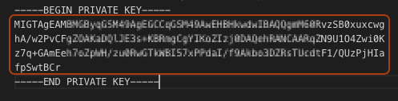
<!-- LLM_Image_DESC_20260406
    유형: Screenshot
    내용: Apple Private Key 파일 내용 확인
    구성: 터미널/텍스트 에디터에서 열린 Private Key 파일. BEGIN PRIVATE KEY와 END PRIVATE KEY 사이의 Base64 인코딩된 키 내용이 주황색 박스로 강조 표시됨.
    Keyword: Apple, Private Key, PEM, Base64, 키 파일
-->

위의 값을 아래의 예제와 같이 JSON으로 만들어서 설정합니다.


```json
{
    "teamId":"2UH5Cxxxx",
    "keyId":"3C3FXYxxxx",
    "privateKey":"MIGTAgEAMBMGByqGSM49AgEGCCqGSM49AwEHBHkwdwIBA.. 중략"
}
```

> <font color="red">[주의]</font><br/>
>
> privateKey에 개행이 들어가지 않도록 주의해 주세요.

###### Additional Info Settings
[Sign In with Apple 의 AuthorizationScope 알아보기](https://developer.apple.com/documentation/authenticationservices/asauthorizationscope?language=occ)

Gamebase 콘솔 **App**에서 Apple을 추가하면 기본으로 아래의 JSON 값이 설정됩니다.
2019년 11월 기준으로 Scope의 종류는 `full_name`, `email`만 있으며, Gamebase에서는 이 두 가지 값을 기본값으로 설정합니다.

```json
{ "authorization_scope":["full_name", "email"] }
```

##### Xcode Project Settings
> <font color="red">[주의]</font><br/>
>
> Xcode 11 이상에서만 **Sign In with Apple** 기능을 사용하는 프로젝트를 빌드할 수 있습니다.


1. **Target**을 선택하고 **Signing & Capabilities**에서 **Sign In with Apple** 항목을 추가합니다.
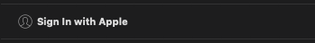
<!-- LLM_Image_DESC_20260406
    유형: Screenshot
    내용: Xcode Signing & Capabilities - Sign In with Apple 추가
    구성: Xcode의 Signing & Capabilities 탭에서 Sign In with Apple capability가 추가된 상태를 보여줌. 다크 테마 인터페이스.
    Keyword: Xcode, Signing & Capabilities, Sign In with Apple, Capability
-->
2. **Target**을 선택하고 **Build Phases > Link Binary With Libraries**에서 **Authentication.framework**를 **Optional**로 추가합니다.
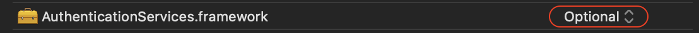
<!-- LLM_Image_DESC_20260406
    유형: Screenshot
    내용: Xcode Build Phases - AuthenticationServices.framework Optional 설정
    구성: AuthenticationServices.framework이 Link Binary With Libraries에 추가되어 있으며, Optional로 설정된 상태가 빨간 원으로 강조됨. 다크 테마 인터페이스.
    Keyword: Xcode, AuthenticationServices.framework, Optional, Build Phases
-->

> <font color="red">[주의]</font><br/>
> Optional이 아닌 Required로 설정되어 있으면 iOS 12 이하의 단말기에서는 앱 실행 시 런타임 크래시가 발생합니다.


##### iOS 12 버전 이하를 지원하기 위한 설정 (Sign In with Apple JS)

> <font color="red">[주의]</font><br/>
>
> Gamebase SDK iOS 2.13.0 이상 버전에서는 iOS 12 이하 버전에서의 웹뷰를 이용한 Sign In with Apple 기능 사용이 가능합니다.
>
> 기존의 2.13.0 이전버전을 사용했던 게임의 경우에도 하단 **iOS 12 버전 이하를 지원하기 위한 설정** 을 참고하여 기존 프로젝트를 설정하고,
>
> Gambase SDK iOS 2.13.0 이상을 적용하면, iOS 12 이하버전에서 Sign In with Apple 기능을 사용할 수 있습니다.


* iOS 12 이하 버전에서 Sign In with Apple 을 사용하기 위해서는 Sign In with Apple JS 를 사용해서, 웹페이지를 통해 로그인을 해야합니다.
* Apple ID 로그인 웹페이지에서는 Apple 계정과 비밀번호를 입력해서 로그인을 할 수 있습니다.

**아래의 절차를 따라서 Apple 개발자 사이트에서 새로운 Service ID 를 등록해야 합니다.**

1. Service ID 를 추가<br/>
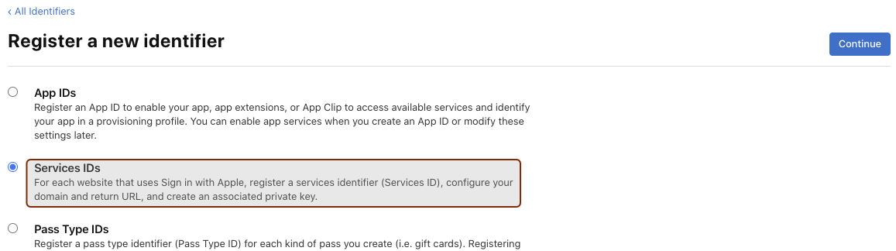
<!-- LLM_Image_DESC_20260406
    유형: Screenshot
    내용: Apple Developer - 새 식별자 등록에서 Services IDs 선택
    구성: Register a new identifier 페이지. App IDs, Services IDs, Pass Type IDs 등의 옵션 중 Services IDs가 선택된 상태. Continue 버튼 표시.
    Keyword: Apple Developer, Register identifier, Services IDs, Service ID
-->
2. Service ID 로 사용할 식별자를 설정 (일반적으로는 bundle ID + **.구분할 문자열**)<br/>
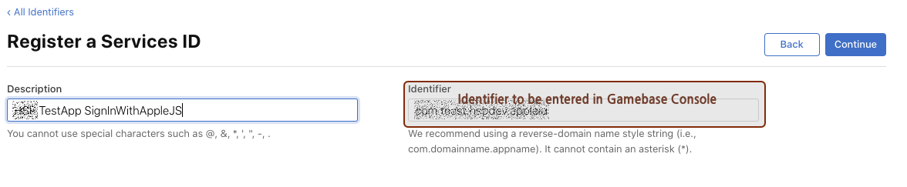
<!-- LLM_Image_DESC_20260406
    유형: Screenshot
    내용: Apple Developer - Services ID 등록 시 Description과 Identifier 입력
    구성: Register a Services ID 페이지. Description(TestApp SignInWithAppleJS)과 Identifier 입력 필드가 표시됨. Identifier가 Gamebase Console에 입력될 값으로 강조됨.
    Keyword: Apple Developer, Services ID, Description, Identifier, 등록
-->
3. 등록된 Service ID 를 확인 후 수정<br/>
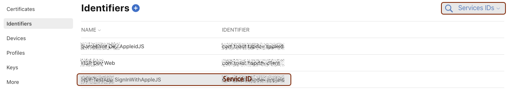
<!-- LLM_Image_DESC_20260406
    유형: Screenshot
    내용: Apple Developer - Identifiers 목록에서 등록된 Services ID 확인
    구성: Identifiers 페이지에서 Services IDs 필터 선택 상태. 등록된 Service ID 목록이 NAME과 IDENTIFIER 컬럼으로 표시됨. SignInWithAppleJS 항목의 Service ID가 강조됨.
    Keyword: Apple Developer, Identifiers, Services IDs, 목록 확인
-->
4. 하단의 Sign In with Apple 항목의 Configure 를 클릭<br/>
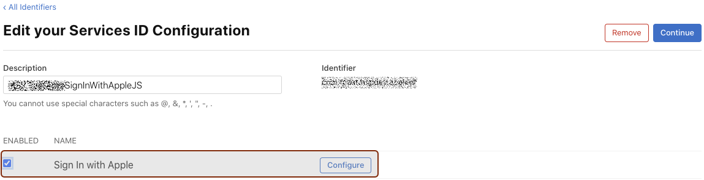
<!-- LLM_Image_DESC_20260406
    유형: Screenshot
    내용: Apple Developer - Services ID Configuration 편집
    구성: Edit your Services ID Configuration 페이지. Description, Identifier 필드와 Sign In with Apple 체크박스 및 Configure 버튼이 표시됨. Remove/Continue 버튼 존재.
    Keyword: Apple Developer, Services ID Configuration, Sign In with Apple, Configure
-->
5. Primary App ID 를 설정 (기존에 Sign In with Apple 을 사용하고 있었다면, 해당앱의 Bundle ID 를 설정)<br/>
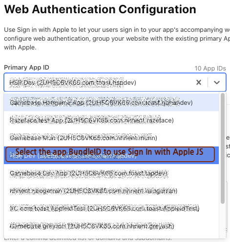
<!-- LLM_Image_DESC_20260406
    유형: Screenshot
    내용: Apple Developer - Web Authentication Configuration에서 Primary App ID 설정
    구성: Web Authentication Configuration 팝업. Primary App ID 드롭다운과 Domains and Subdomains, Return URLs 입력 필드가 표시됨.
    Keyword: Apple Developer, Web Authentication, Primary App ID, Domains
-->
6. Apple ID 로 인증한 이후 인증 정보를 받을 Callback URL 설정<br/>
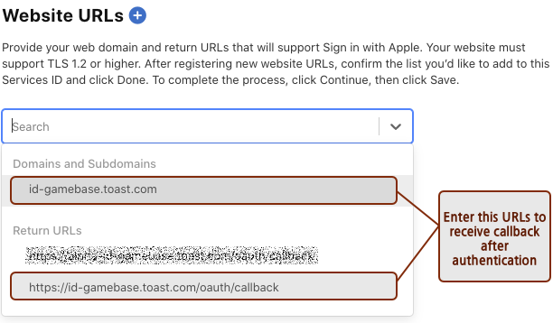
<!-- LLM_Image_DESC_20260406
    유형: Screenshot
    내용: Apple Developer - Website URLs 설정 (Domains and Return URLs)
    구성: Website URLs 설정 화면. Domains and Subdomains에 id-gamebase.toast.com, Return URLs에 OAuth callback URL이 입력됨. 인증 후 callback 수신 URL 설명 포함.
    Keyword: Apple Developer, Website URLs, Domains, Return URLs, Callback
-->
7. 설정 후 저장<br/>
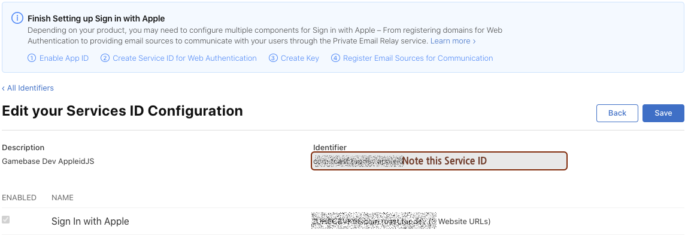
<!-- LLM_Image_DESC_20260406
    유형: Screenshot
    내용: Apple Developer - Services ID Configuration 최종 설정 확인 및 저장
    구성: Edit your Services ID Configuration 페이지. Finish Setting up Sign in with Apple 안내 배너, Description, Identifier, Sign In with Apple 항목의 설정 정보(Website URLs 포함)가 확인 가능. Back/Save 버튼 표시.
    Keyword: Apple Developer, Services ID, 최종 설정, 저장, Sign In with Apple
-->


**위에서 설정한 Service ID 를 NHN Cloud Gamebase Console > Gamebase > 앱 > 인증 정보 > Apple > Service ID 에 입력합니다.***

> <font color="red">[주의]</font><br/>
>
> 기존에 Sign In with Apple 설정이 되어 있지 않다면, 나머지 항목도 설정이 필요합니다.

1. Apple 개발자 사이트에서 설정한 Service ID 를 아래와 같이 Service ID 항목에 추가합니다. (기존에 Sign In with Apple 설정값이 있다면, 다른 값들은 변경이 필요없습니다.)
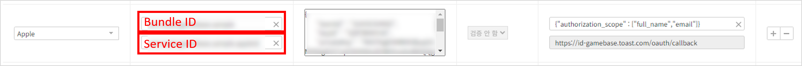
<!-- LLM_Image_DESC_20260406
    유형: Screenshot
    내용: Gamebase 콘솔 Apple 인증 정보 - Service ID 입력 위치
    구성: Apple IdP의 Client ID 섹션에서 Bundle ID와 Service ID 입력 필드가 빨간 박스로 강조됨. 추가 정보(authorization_scope JSON)와 Callback URL도 표시됨.
    Keyword: Gamebase 콘솔, Apple, Service ID, Bundle ID, Sign In with Apple JS
-->


#### 9. WEIBO

##### Weibo Console

1. Weibo Developers 사이트에서 신청하여 발급 받은 {client_id} 및 {client_secret}을 Gamebase Console에 입력합니다.
이때, 로그인 시 필요한 {scope} 또한 JSON String 형태로 추가 정보란에 입력해야 합니다.


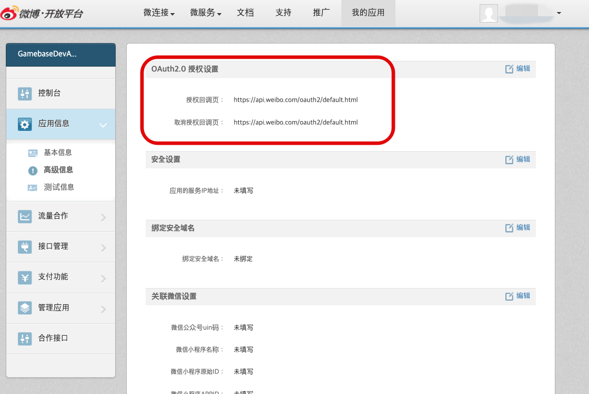
<!-- LLM_Image_DESC_20260406
    유형: Screenshot
    내용: Weibo 개발자 플랫폼 - OAuth2.0 콜백 설정 화면
    구성: Weibo 개방 플랫폼의 앱 관리 화면. OAuth2.0 인증설정 섹션에서 인증 콜백 페이지와 취소 인증 콜백 페이지 URL이 빨간 박스로 강조됨.
    Keyword: Weibo, OAuth2.0, 콜백 URL, 개발자 플랫폼
-->

2. callback URL 란에 다음 값을 입력합니다.
	* Authorization callback page: https://api.weibo.com/oauth2/default.html
	* Cancel authorization callback page: https://api.weibo.com/oauth2/default.html


**입력 필드**

- Client ID: {App Key}
- Secret Key: {App Secret}
- 추가 정보: scope(json format)


**Additional Info Settings**

* Scope

Application 에서 필요로 하는 권한을 나타냅니다.
Weibo 가이드 문서에 따라 기본값으로 모든 권한이 선언되어 있습니다.
필요에 따라 추가/제거/변경하실 수 있습니다.

* oauthApiUrl

내부적으로 Weibo Open API를 호출하기 위한 도메인입니다.
변경해서는 안됩니다.

* universalLink

Weibo 가이드 문서에 따라 universalLink를 설정할 수 있습니다.
입력하지 않으면 임의의 값으로 설정됩니다.

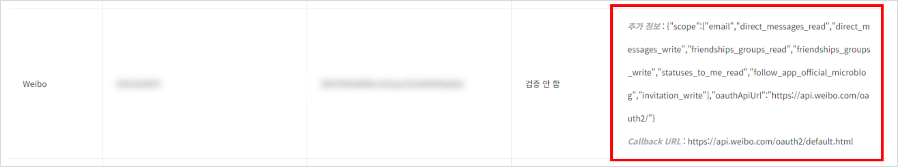
<!-- LLM_Image_DESC_20260406
    유형: Screenshot
    내용: Gamebase 콘솔 Weibo 인증 정보 추가 정보 설정
    구성: Weibo IdP의 인증 정보. 추가 정보란에 scope(email, direct_messages_read 등 권한 목록), oauthApiUrl JSON 값이 빨간 박스로 강조됨. 검증 안 함 설정과 Callback URL도 표시됨.
    Keyword: Gamebase 콘솔, Weibo, 인증 정보, scope, oauthApiUrl
-->


**Reference URL**
- [Weibo Developer](https://open.weibo.com/)

#### 10. Kakaogames

Kakao 인증 정보는 퍼블리싱 계약 관계에 따라 카카오 디벨로퍼스, 카카오 게임센터(채널링 게임), 카카오게임 3.0 어드민 등 다양한 곳에서 설정/확인이 가능합니다.

* 카카오 디벨로퍼스(https://developers.kakao.com/)
    * 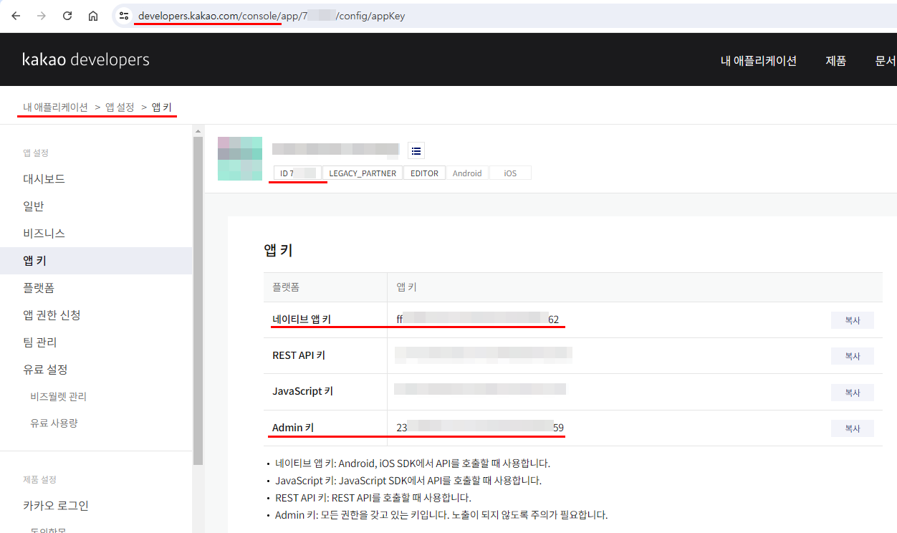
<!-- LLM_Image_DESC_20260406
    유형: Screenshot
    내용: 카카오 디벨로퍼스 - 앱 키 확인 화면
    구성: 카카오 디벨로퍼스 앱 설정 페이지. 앱 키 섹션에 네이티브 앱 키, REST API 키, JavaScript 키, Admin 키가 표시됨.
    Keyword: 카카오 디벨로퍼스, 앱 키, Native App Key, Admin Key
-->
* 카카오 게임센터(https://gamecenter.kakao.com/)
    * 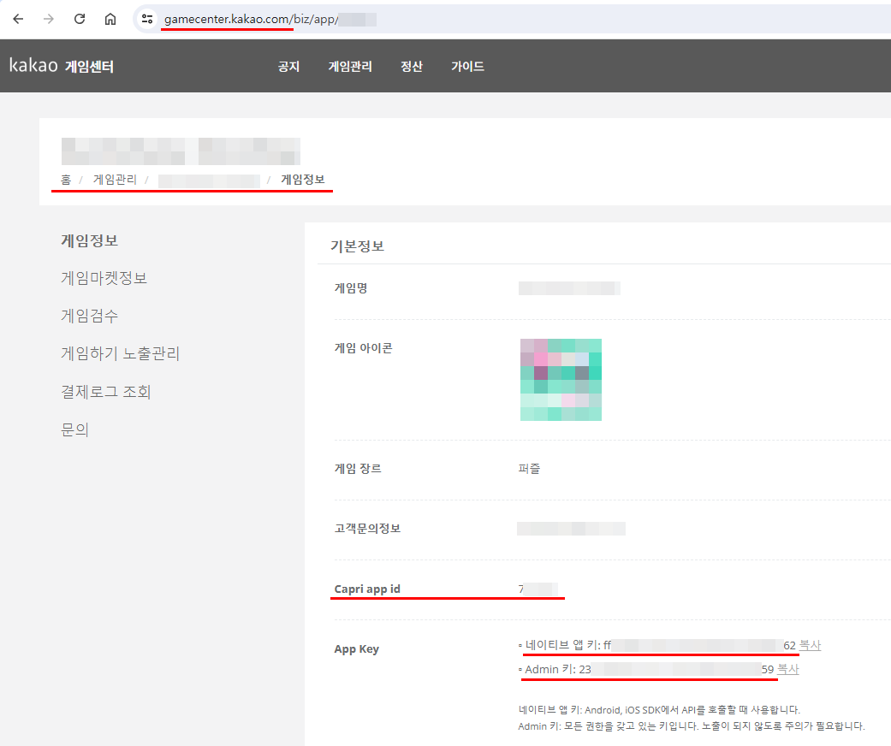
<!-- LLM_Image_DESC_20260406
    유형: Screenshot
    내용: 카카오 게임센터 - 게임 정보 확인 화면
    구성: 카카오 게임센터의 게임정보 페이지. 기본정보 섹션에 게임명, 게임 아이콘, 게임 장르(퍼즐), 고객문의정보, Capri app id, App Key(네이티브 앱 키, Admin 키)가 빨간 밑줄로 강조됨.
    Keyword: 카카오 게임센터, 게임정보, Capri app id, App Key
-->
* 카카오게임 3.0 어드민(https://admin-zinny3.game.kakao.com)
    * 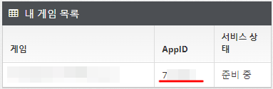
<!-- LLM_Image_DESC_20260406
    유형: Screenshot
    내용: 카카오게임 3.0 어드민 - 내 게임 목록에서 AppID 확인
    구성: 내 게임 목록 테이블에 게임명, AppID, 서비스 상태(준비 중) 컬럼이 표시됨. AppID가 빨간 밑줄로 강조됨.
    Keyword: 카카오게임 3.0 어드민, 내 게임 목록, AppID, 서비스 상태
-->

<br />
Kakaogames에서 발급 받은 {App ID}, {Native App Key} 및 {Admin Key}를 Gamebase Console에 입력합니다.
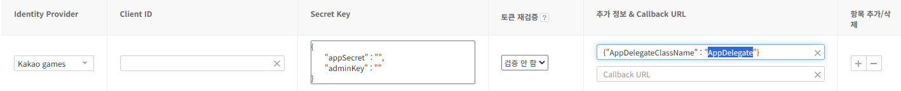
<!-- LLM_Image_DESC_20260406
    유형: Screenshot
    내용: Gamebase 콘솔 Kakao games 인증 정보 설정 화면
    구성: Kakao games IdP의 인증 정보. Identity Provider(Kakao games), Client ID 입력 필드, Secret Key(appSecret, adminKey JSON), 토큰 재검증(검증 안 함), 추가 정보(AppDelegateClassName JSON), Callback URL이 표시됨.
    Keyword: Gamebase 콘솔, Kakao games, appSecret, adminKey, 인증 정보
-->

##### Client ID Settings
App ID를 설정합니다.

##### Secret Key Settings
Gamebase 인증 정보로 Kakaogames를 추가하면 'Secret Key'에 아래의 JSON 값이 설정됩니다.
각각의 값을 Kakaogames 콘솔에서 발급 받은 값으로 변경하세요.

* **appSecret**: Native App Key
* **adminKey**: Admin Key

```json
{
    "appSecret":"...",
    "adminKey":"..."
}
```

##### Additional Info Settings
Gamebase 인증 정보로 Kakaogames를 추가하면 '추가 정보'에 아래의 JSON 값이 설정됩니다.
Unity 빌드인 경우 **AppDelegate**를 **UnityAppController**로 변경하세요.

```json
{"AppDelegateClassName" : "AppDelegate"}
```

#### 11. GPGS v2

GPGS(Google Play Games Services) v2 인증을 위해서는 Google 인증 타입 추가 방법과 동일하게 Google Cloud Console에서 **Web Application Client ID**를 발급 받고 승인된 리디렉션 URI란에 Gamebase Callback URL을 입력해야 합니다.
[Game > Gamebase > 콘솔 사용 가이드 > 앱 > App > Authentication Information > 2. Google](./oper-app-App.md#2-google)

**입력 필드**

- Client ID: {Google Web Application Client ID}
- Secret Key: {Google Web Application Client secret}

##### Android
* [Gamebase > Android SDK 사용 가이드 > 시작하기 > Setting > AndroidManifest.xml > GPGS v2 IdP](../../aos-started.md#gpgs-v2-idp)

#### 12. Steam

Steam 인증을 위해 Steamworks에서 **App ID**와 **Web API**를 발급 받아 Gamebase Console에 입력해야 합니다.

**입력 필드**

- Client ID: {App ID}
- Secret Key: {Web API}

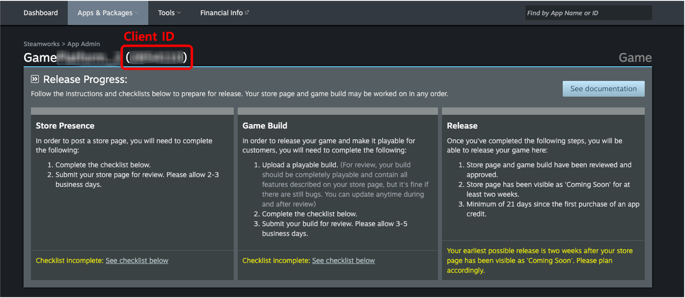
<!-- LLM_Image_DESC_20260406
    유형: Screenshot
    내용: Steamworks 앱 관리 - App ID(Client ID) 확인
    구성: Steamworks의 Apps & Packages 탭에서 게임 앱 페이지. App ID가 빨간 박스로 강조됨. Release Progress 섹션에 Store Presence, Game Build, Release 단계별 체크리스트가 표시됨.
    Keyword: Steamworks, App ID, Client ID, Release Progress
-->

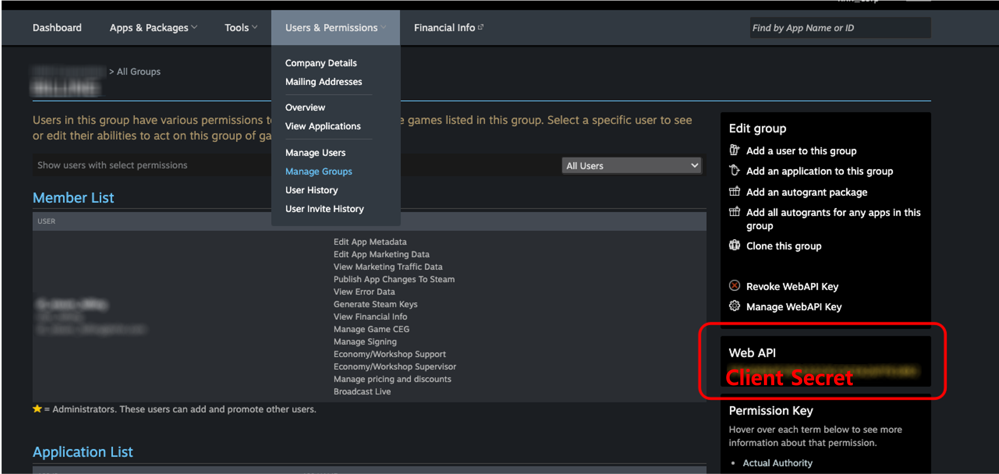
<!-- LLM_Image_DESC_20260406
    유형: Screenshot
    내용: Steamworks 사용자 및 권한 - Web API Key(Client Secret) 확인
    구성: Steamworks의 Users & Permissions 메뉴 하위 메뉴(Company Details, Manage Group 등)가 펼쳐진 상태. Web API(Client Secret)가 빨간 박스로 강조됨. Permission Key 섹션에 다양한 권한 항목이 나열됨.
    Keyword: Steamworks, Web API Key, Client Secret, Users & Permissions
-->

#### 13. Epic Games
[Epic Games Dev Portal](https://dev.epicgames.com/portal)에서 발급 받은 {Client ID} 및 {Client Secret}을 Gamebase Console에 입력합니다.
이때, 디플로이 ID와 인증 시 필요한 {scope}를 JSON String 형태로 추가 정보란에 입력해야 합니다.

1. **제품 설정 > 샌드박스** 메뉴에서 디플로이를 생성합니다.
2. **제품 설정 > 클라이언트** 메뉴에서 클라이언트를 생성합니다.
3. **제품 설정 > SDK 다운로드 및 크리덴셜** 메뉴에서 **Client ID**, **Client Secret**, **Deployment ID**를 확인합니다.

> [참고]
>
> 디플로이 및 클라이언트 생성에 대한 자세한 내용은 다음 문서를 참고하시기 바랍니다.
> [Game > Gamebase > 스토어 콘솔 가이드 > Epic Games Store 콘솔 가이드](../../console-epicgames-guide.md)

**입력 필드**

- Client ID: {Client ID}
- Secret Key: {Client Secret}
- 추가정보: deployment_id, scope (json format)

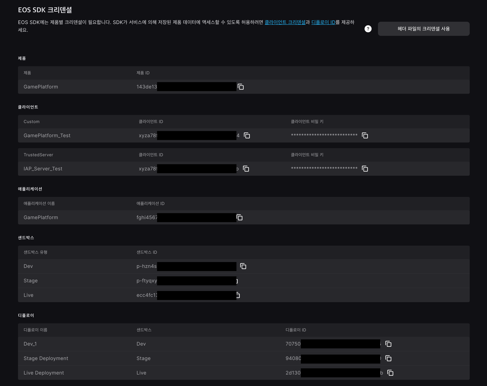
<!-- LLM_Image_DESC_20260406
    유형: Screenshot
    내용: Epic Games Dev Portal - EOS SDK 크리덴셜 확인 화면
    구성: EOS SDK 크리덴셜 페이지. 제품(제품 ID), 클라이언트(Custom/TrustedServer별 클라이언트 ID, 클라이언트 비밀 키), 애플리케이션(애플리케이션 ID), 샌드박스(Dev/Stage/Live별 샌드박스 ID), 디플로이(Dev/Stage/Live별 디플로이 ID) 정보가 표시됨.
    Keyword: Epic Games, EOS SDK, 크리덴셜, Client ID, Deployment ID
-->

**Reference URL**

- [Epic Games Dev Portal](https://dev.epicgames.com/portal)
- [Epic Online Services 문서](https://dev.epicgames.com/docs/epic-online-services)

##### Additional Info Settings

* **NHN Cloud Console > Gamebase > App > 인증 정보 > 추가 정보** 항목에 JSON string 형태의 정보를 설정해야 합니다.
* Epic Games의 경우, **제품 설정 > SDK 다운로드 및 크리덴셜 > EOS SDK 크리덴셜 > 디플로이**에서 확인한 **deployment_id**와 OAuth 인증 시 요청할 권한 범위인 **scope**를 설정해야 합니다.
* **deployment_id**는 EOS(Epic Online Services) 서비스 환경을 식별하기 위해 반드시 설정해야 합니다.
* **scope**는 인증 시 사용자의 프로필, 친구 목록, 접속 상태 등의 정보를 획득하기 위해 설정합니다.
* 인증 시 요청 가능한 scope는 다음 문서에서 확인할 수 있습니다.
    * https://dev.epicgames.com/docs/web-api-ref/authentication#requesting-an-access-token
* Epic Games 추가 인증 정보 입력 예제

        { "deployment_id": "Your Deployment ID", "scope": ["basic_profile", "friends_list", "presence"] }

### GPGS Automatic Login Settings

* [GPGS(Google Play Games Services)를 이용한 자동 로그인(Automatic sign-in)](https://developer.android.com/games/pgs/signin#automatic-sign-in) 기능을 지원합니다.
    * 이 기능을 사용하기 위해서는 Android 빌드 의존성에 **gamebase-adapter-auth-gpgs-autologin** 모듈 선언 및 [추가 설정](../../aos-started.md#gpgs-idp)이 필요합니다.
    * 또한 *GPGS 자동 로그인 설정* 항목에 *서비스 계정 json* 정보를 입력해야 합니다.
        * 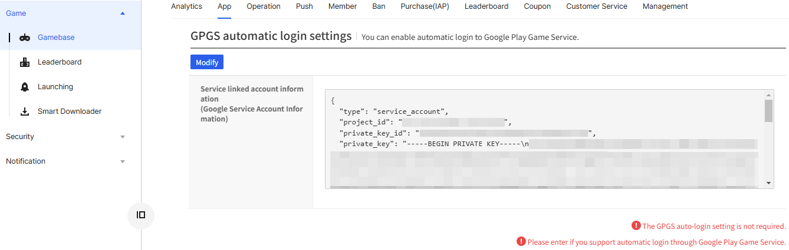
<!-- LLM_Image_DESC_20260406
    유형: Screenshot
    내용: Gamebase 콘솔 GPGS 자동 로그인 설정 화면
    구성: GPGS automatic login settings 섹션. Service Account Json File 및 Google Service Account 입력 필드와 Notification, Version 정보가 표시됨.
    Keyword: Gamebase 콘솔, GPGS, 자동 로그인, Service Account, JSON
-->
* Google 서비스 계정 생성 방법을 소개합니다.
    1. `Google Cloud Console > IAM & Admin > IAM > VIEW BY PRINCIPALS` 메뉴에서 '서비스 계정 사용자' 권한을 가진 유저가 있는지 찾습니다.
        * 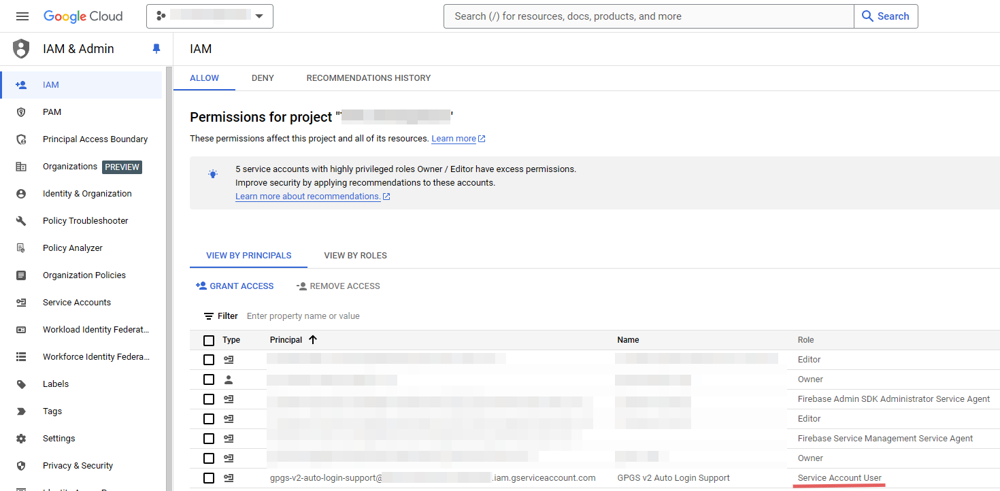
<!-- LLM_Image_DESC_20260406
    유형: Screenshot
    내용: Google Cloud Console IAM - 서비스 계정 사용자 권한 확인
    구성: Google Cloud Console의 IAM & Admin > IAM 페이지. VIEW BY PRINCIPALS 탭에서 프로젝트 권한 목록이 테이블로 표시됨. 서비스 계정 사용자 권한을 가진 유저를 확인하는 화면.
    Keyword: Google Cloud Console, IAM, 서비스 계정 사용자, 권한 확인
-->
    2. '서비스 계정 사용자' 권한을 가진 유저가 없다면 `Google Cloud Console > IAM & Admin > Service Accounts > + CREATE SERVICE ACCOUNT`를 선택해서 서비스 계정을 생성합니다.
        * 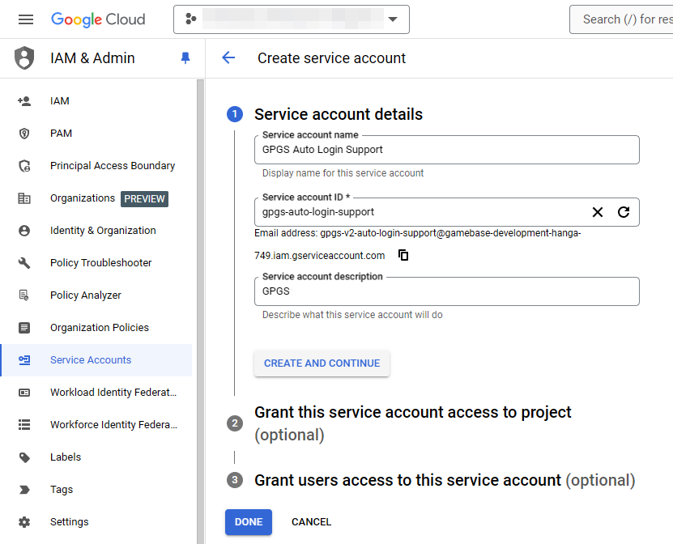
<!-- LLM_Image_DESC_20260406
    유형: Screenshot
    내용: Google Cloud Console - 서비스 계정 생성 화면
    구성: IAM & Admin > Service Accounts > Create service account 페이지. Service account details(이름, ID, 설명) 입력 필드와 Grant access to project, Grant users access 옵션이 표시됨.
    Keyword: Google Cloud Console, Service Account, 생성, GPGS
-->
    3. 역할로 '서비스 계정 사용자'를 찾아 부여합니다.
        * 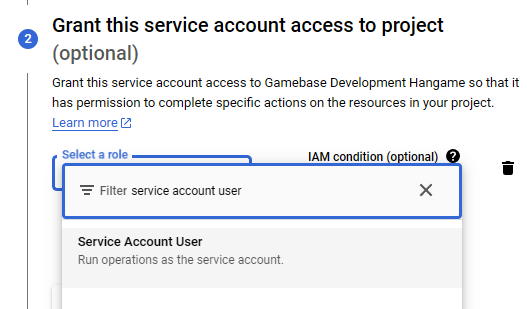
<!-- LLM_Image_DESC_20260406
    유형: Screenshot
    내용: Google Cloud Console - 서비스 계정에 역할 부여 (Service Account User)
    구성: Grant this service account access to project 섹션. Select a role 필터에서 'Service Account User'를 검색하여 선택하는 화면. 'Run operations as the service account' 설명이 표시됨.
    Keyword: Google Cloud Console, Service Account User, 역할 부여, IAM
-->
    4. 생성한 서비스 계정으로 이동하여 Key를 생성합니다.
        * 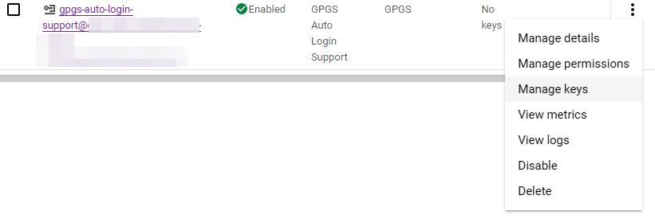
<!-- LLM_Image_DESC_20260406
    유형: Screenshot
    내용: Google Cloud Console - 서비스 계정 관리 메뉴 (Manage keys)
    구성: Service Accounts 목록에서 GPGS Auto Login Support 계정의 컨텍스트 메뉴(Manage details, Manage permissions, Manage keys, View metrics, View logs, Disable, Delete)가 표시됨. Manage keys 옵션이 강조.
    Keyword: Google Cloud Console, Service Account, Manage keys, GPGS
-->
        * 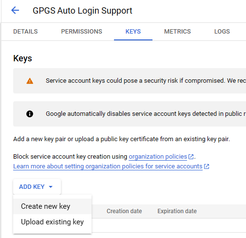
<!-- LLM_Image_DESC_20260406
    유형: Screenshot
    내용: Google Cloud Console - 서비스 계정 Keys 관리 (Add Key)
    구성: GPGS Auto Login Support 서비스 계정의 KEYS 탭. 보안 경고 메시지, ADD KEY 드롭다운(Create new key, Upload existing key 옵션)이 표시됨.
    Keyword: Google Cloud Console, Service Account, Keys, Add Key, Create new key
-->
    5. JSON 형식을 선택하면 키 생성과 함께 json 파일이 자동으로 다운로드 완료됩니다.
        * 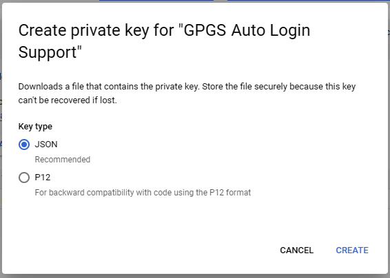
<!-- LLM_Image_DESC_20260406
    유형: UI
    내용: Google Cloud Console - Private Key 생성 다이얼로그 (JSON 형식 선택)
    구성: Create private key for "GPGS Auto Login Support" 다이얼로그. Key type으로 JSON(Recommended)과 P12 옵션이 표시됨. JSON이 선택된 상태. CANCEL/CREATE 버튼.
    Keyword: Google Cloud Console, Private Key, JSON, Key type, 서비스 계정
-->
        * 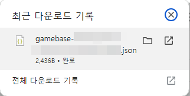
<!-- LLM_Image_DESC_20260406
    유형: Screenshot
    내용: 브라우저 다운로드 기록 - 서비스 계정 JSON 파일 다운로드 완료
    구성: 최근 다운로드 기록에 gamebase-*.json 파일(2,436B)이 다운로드 완료된 상태로 표시됨.
    Keyword: JSON, 다운로드, 서비스 계정, Key 파일, GPGS
-->
