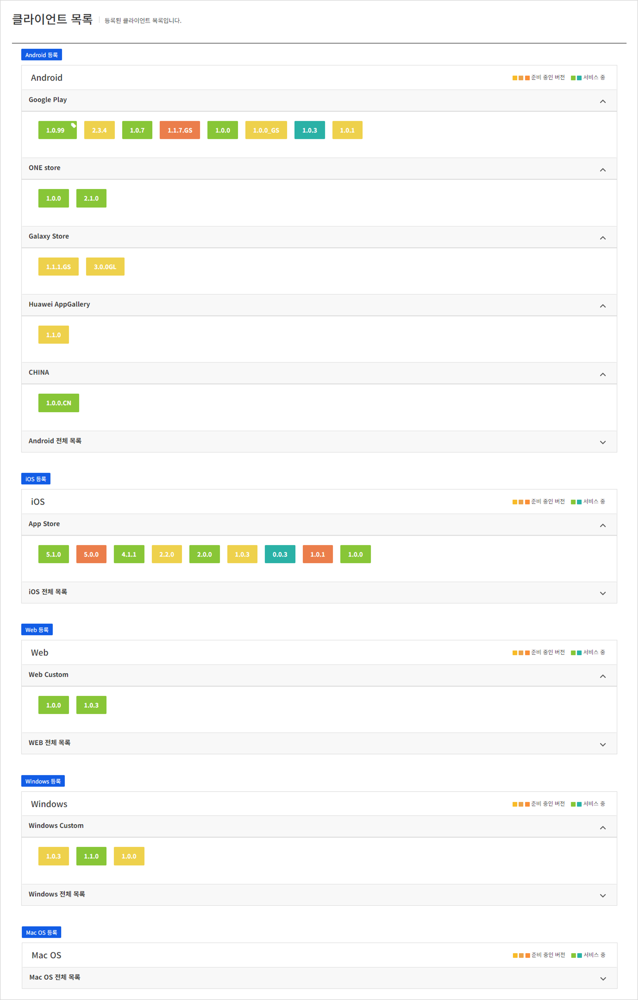
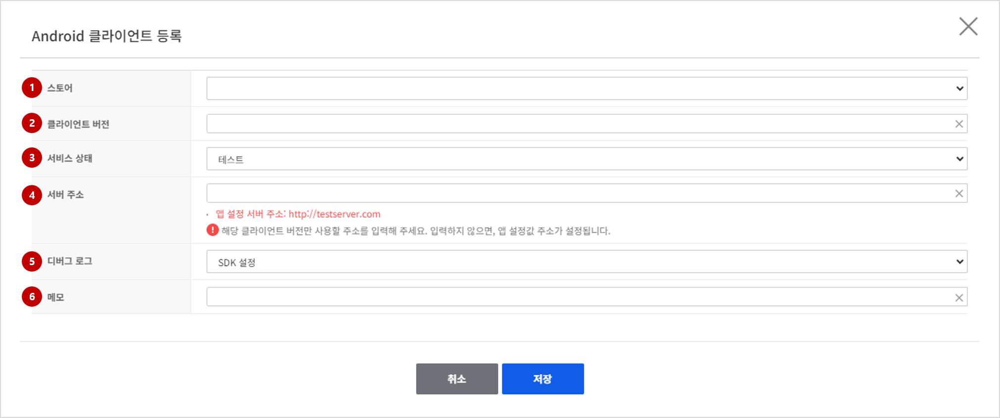
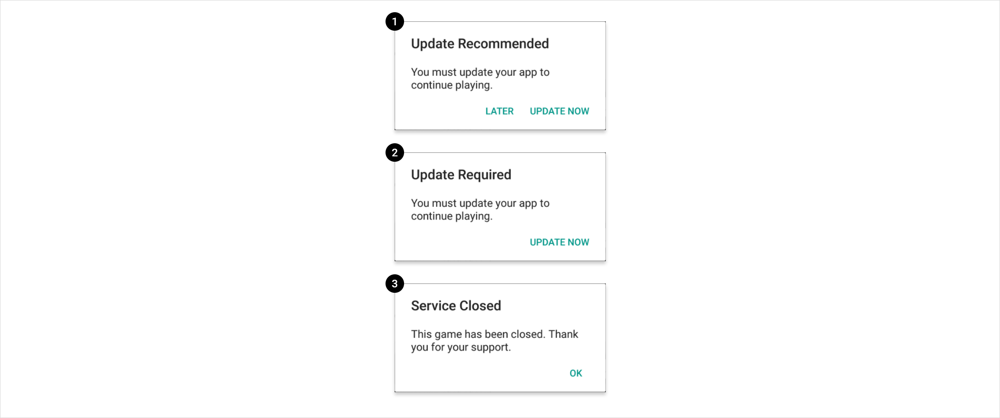
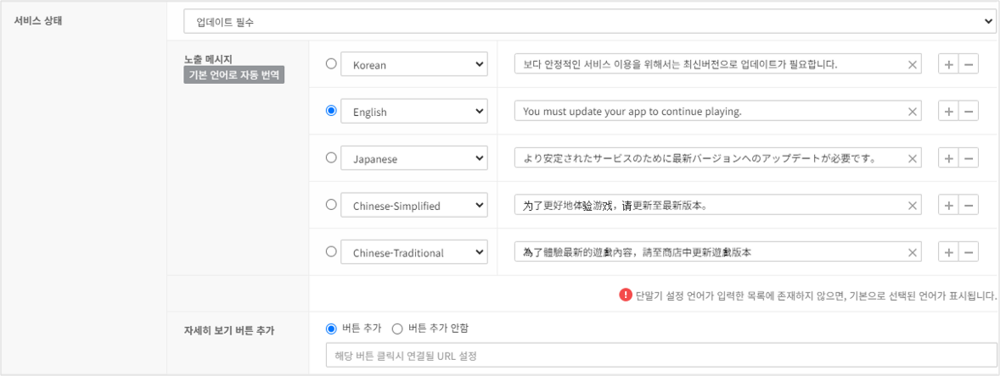
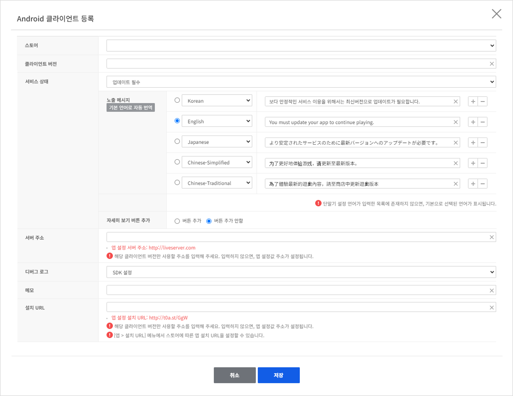

## Client

클라이언트 정보를 운영체제(iOS, Android, Unity WebGL, Unity Standalone), 버전별로 관리할 수 있습니다.

### Client List

<!-- LLM_Image_DESC_20260408_185735
    유형: Screenshot
    내용: Gamebase 앱 설정 콘솔의 클라이언트 목록 화면
    구성: '클라이언트 목록' 제목 아래 OS별로 구분된 클라이언트 버전 목록이 표시됨. Android(Google Play, ONE store, Galaxy Store, Huawei AppGallery, CHINA 등 스토어별), iOS(App Store), Web(Web Custom), Windows(Windows Custom), Mac OS 섹션으로 나뉘며, 각 버전이 서비스 상태에 따라 색상이 다른 라벨(녹색=서비스, 노란색=테스트, 주황색=심사중/베타 등)로 표시됨. 각 OS 섹션에 '전체 목록' 펼침 화살표가 있음
    Keyword: 앱 설정, Console, Screenshot, Client List, 클라이언트 목록
-->
현재 등록된 클라이언트 목록을 확인할 수 있습니다.
운영체제별로 구분되어 보여지며 아이콘 내 숫자는 클라이언트 등록 시 입력한 버전을 의미합니다.
아이콘 목록은 서비스 상태가 테스트, 베타 서비스, 심사중, 서비스, 업데이트 권장(서비스중)인 목록만 표시됩니다. 운영체제별 하단 오른쪽의 화살표를 클릭하면 업데이트 필수, 종료 상태의 클라이언트 목록을 확인할 수 있습니다.
아이콘 색깔을 서비스 상태별로 구분하여 한눈에 서비스 상태를 파악할 수 있습니다.

### Properties

Gamebase Console에서 관리하는 클라이언트 등록 정보를 설명합니다.
**클라이언트** 탭에서 **AOS 등록**, **iOS 등록** 버튼 등을 클릭하면 클라이언트 등록 화면이 나타납니다. 등록된 클라이언트의 입력값을 수정하거나 삭제하고 싶다면 아이콘 목록에서 아이콘을 클릭하거나 클라이언트 전체 목록에서 원하는 클라이언트를 선택하시면 됩니다.

<!-- LLM_Image_DESC_20260408_185735
    유형: Screenshot
    내용: Gamebase 앱 설정 콘솔의 Android 클라이언트 등록 폼
    구성: 'Android 클라이언트 등록' 제목의 모달 다이얼로그. 번호가 매겨진 입력 필드가 세로로 나열됨: (1)스토어(드롭다운), (2)클라이언트 버전(텍스트 입력), (3)서비스 상태(드롭다운, '테스트' 선택됨), (4)서버 주소(텍스트 입력, 앱 설정 서버 주소 참조 안내), (5)디버그 로그(드롭다운, 'SDK 설정'), (6)메모(텍스트 입력). 하단에 취소/저장 버튼이 있음
    Keyword: 앱 설정, Console, Screenshot, Client 등록, Android
-->
#### (1) 스토어
(필수) 클라이언트를 배포할 스토어를 선택합니다.
운영체제별로 선택 가능한 스토어가 다릅니다.
#### (2) 게임 버전
(필수) 클라이언트 버전을 입력합니다.
게임에서 정한 규칙에 따라 문자열로 입력하면 됩니다.
#### (3) 서비스 상태
(필수) 클라이언트의 서비스 상태를 선택합니다.
상태는 테스트, 베타 서비스, 심사중, 서비스, 업데이트 권장(서비스중), 업데이트 필수, 종료 이렇게 6가지입니다.

- 테스트: 내부 테스트
- 베타 서비스: 서비스 서버가 아닌 별도의 베타 서버에 연결이 필요한 경우 선택합니다.
- 심사중: 스토어 심사 중

<!-- LLM_Image_DESC_20260408_185735
    유형: Screenshot
    내용: Gamebase SDK 서비스 상태별 기본 팝업 예시 (클라이언트 화면)
    구성: 3개의 앱 내 팝업 다이얼로그가 세로로 나열된 이미지. (1) 'Update Recommended' - 업데이트 권장 팝업(LATER/UPDATE NOW 버튼), (2) 'Update Required' - 업데이트 필수 팝업(UPDATE NOW 버튼만), (3) 'Service Closed' - 서비스 종료 팝업(OK 버튼). 각 팝업에 영문 안내 메시지가 포함됨
    Keyword: 앱 설정, Screenshot, 서비스 상태, 팝업, SDK, 클라이언트
-->

- 서비스중: 정상 서비스
- 업데이트 권장(서비스 중): 정상 서비스.  보다 안정적인 버전을 사용하도록 유도하기 위해 팝업을 표시합니다.  새로운 버전을 다운로드해서 이용하도록 유도하지만 사용자가 원하는 경우 현재 버전으로도 계속 서비스를 이용할 수 있습니다. 아래는 '업데이트 권장(서비스 중)' 상태일 때 Gamebase SDK에서 기본적으로 제공하는 팝업입니다.

- 업데이트 필수: 서비스 불가능.  현재 게임에서 서비스를 지원하지 않는 버전으로, 최신 버전 설치 안내 팝업을 표시합니다. 아래는 '업데이트 필수' 상태일 때 Gamebase SDK에서 기본적으로 제공하는 팝업입니다.

<!-- LLM_Image_DESC_20260408_185735
    유형: Screenshot
    내용: Gamebase 앱 설정 콘솔의 서비스 상태 '업데이트 필수' 메시지 설정 화면
    구성: 서비스 상태 드롭다운에서 '업데이트 필수'가 선택된 상태. 노출 메시지 영역에 '기본 언어로 자동 번역' 버튼이 있고, 언어별(Korean, English, Japanese, Chinese-Simplified, Chinese-Traditional) 메시지 입력 필드가 나열됨. 각 언어에 업데이트 안내 메시지가 입력되어 있음. 하단에 '자세히 보기 버튼 추가' 옵션(버튼 추가/버튼 추가 안함 라디오)이 있음
    Keyword: 앱 설정, Console, Screenshot, 서비스 상태, 업데이트 필수, 다국어 메시지
-->

>  [주의] 
>  **업데이트 필수와 점검이 동시에 설정**되어 있을 경우 서비스 상태는 '업데이트 필수'가 됩니다.
>  점검 진행 도중 사용자에게 업데이트 필수 팝업을 표시하고 싶지 않다면 점검 완료 이후에 서비스 상태를 '업데이트 필수'로 변경해야 합니다.
>  [참고] 
>  업데이트 버튼을 누르면 설치 URL 메뉴에서 설정한 각각의 스토어 주소로 연결됩니다.
>  예를 들면 클라이언트가 App store로 설정되어 있고 설치 URL 메뉴에서 App store 관련 설정이 존재한다면 설정한 주소로 이동되며 만약 설치 URL 메뉴에 설정이 되어 있지 않을 경우 공통(Common) URL로 연결됩니다.

- 종료: 서비스 불가능.   서비스가 종료된 버전인 경우 선택합니다. 아래는 '종료' 상태일 때 Gamebase SDK에서 기본적으로 제공하는 팝업입니다.

> [참고]
> 서비스 상태별 표시할 메시지 설정
> **업데이트 권장(서비스중)**, **업데이트 필수**, **종료** 상태인 경우 사용자에게 표시할 안내 메시지를 다국어로 설정할 수 있습니다.
> 서비스 상태를 선택하면 앱에 설정되어 있는 언어 설정 정보에 따라 각 상태에 맞는 기본 메시지가 제공되며 원하는 경우 언어를 추가하거나 기본 메시지의 문구를 변경할 수 있습니다.
> 만약 이전에 각 상태로 설정되어 있던 각 언어별 설정들이 있다면 앱의 언어 설정 정보에 관계 없이 이전에 등록했던 내용들을 불러와 보여지게 됩니다.
> 앱의 언어 설정에 설정된 정보가 없을 경우 5개(한국어, 영어, 일본어, 중국어 간체, 중국어 번체)의 언어로 기본 메시지가 제공되며 원하는 경우 언어를 추가하거나 기본 메시지의 문구를 변경할 수 있습니다.
> 
<!-- LLM_Image_DESC_20260408_185735
    유형: Screenshot
    내용: Gamebase 앱 설정 콘솔의 Android 클라이언트 등록 폼 (업데이트 필수 상태 선택 시)
    구성: 'Android 클라이언트 등록' 모달 다이얼로그에서 서비스 상태가 '업데이트 필수'로 선택된 상태. 스토어/클라이언트 버전/서비스 상태 필드에 이어 노출 메시지 영역에 다국어(Korean, English, Japanese, Chinese Simplified, Chinese Traditional) 업데이트 안내 메시지가 입력됨. 자세히 보기 버튼 추가 옵션, 서버 주소, 디버그 로그(SDK 설정), 메모, 설치 URL 필드가 표시됨. 하단에 취소/저장 버튼이 있음
    Keyword: 앱 설정, Console, Screenshot, Client 등록, 업데이트 필수, 다국어
-->

#### (4) 서버 주소
클라이언트에서 이용할 서버 주소(IP, URL)를 입력합니다.
**앱** 탭에서 서버 주소를 입력하면 모든 클라이언트에 적용되므로, 클라이언트마다 다른 서버 주소를 사용하고 싶을 때만 서버 주소를 입력합니다.

#### (5) Debug log
Gamebae SDK의 Debug Log 출력 여부를 콘솔에서 실시간으로 변경할 수 있습니다.
설정되어 있지 않으면 기본적으로 Gamebase SDK 내부에 설정된 값을 우선으로 동작하고 Gamebase 콘솔에서 Debug Log 출력 여부를 설정할 수 있습니다.
Gamebase SDK에 Debug Log가 'OFF' 상태이더라도 콘솔에서 'ON'으로 설정하면 단말기에 Gamebase Debug Log가 출력됩니다.

#### (6) 메모
해당 클라이언트에 대한 간단한 메모를 30자 내로 입력할 수 있습니다.
