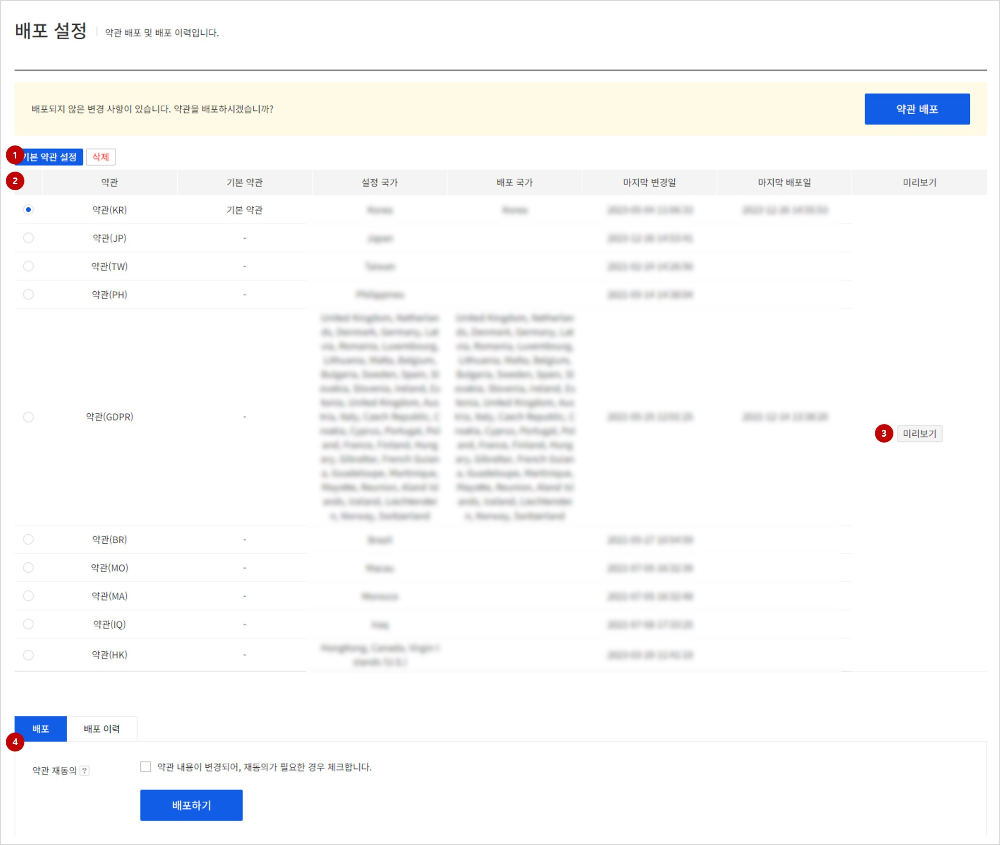
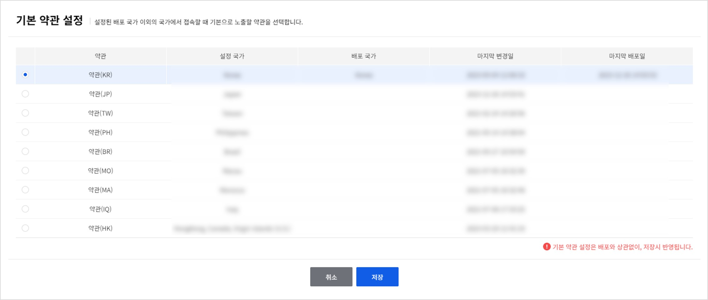
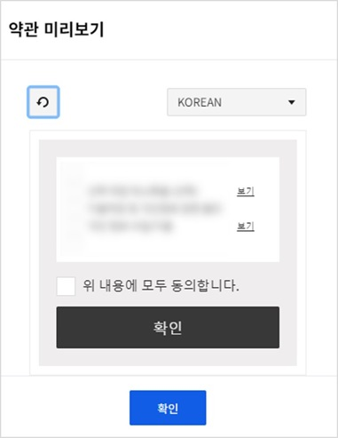
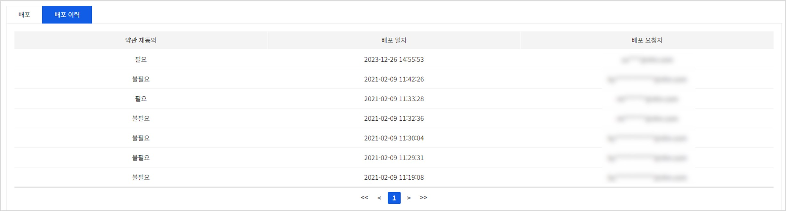

## Terms Of Service Deploy

게임에 표시할 약관 배포 및 배포 이력입니다.

<!-- LLM_Image_DESC_20260408_191856
    유형: Screenshot
    내용: Gamebase 앱 설정 콘솔 Terms Of Service Deploy 화면 #01
    구성: Gamebase 앱 설정 콘솔의 Terms Of Service Deploy 기능 설정/조회 화면 스크린샷
    Keyword: 앱 설정, Console, Screenshot, Terms Of Service Deploy
-->

### (1) 기본 약관 설정

<!-- LLM_Image_DESC_20260408_191856
    유형: Screenshot
    내용: Gamebase 앱 설정 콘솔 (1) 기본 약관 설정 화면 #02
    구성: Gamebase 앱 설정 콘솔의 (1) 기본 약관 설정 기능 설정/조회 화면 스크린샷
    Keyword: 앱 설정, Console, Screenshot, (1) 기본 약관 설정
-->

- 생성한 약관 중 설정된 배포 국가 이외의 국가에서 접속할 경우 기본으로 노출될 약관을 선택합니다.

> [주의] 
>
> 기본 약관은 설정하지 않을 수도 있습니다. 기본 약관이 설정되지 않았다면  배포된 국가 이외의 국가에서 접속시 약관이 노출 되지 않습니다.
>

### (2) 약관 목록

- 현재 생성된 약관 목록입니다.

### (3) 미리보기

<!-- LLM_Image_DESC_20260408_191856
    유형: Screenshot
    내용: Gamebase 앱 설정 콘솔 (3) 미리보기 화면 #03
    구성: Gamebase 앱 설정 콘솔의 (3) 미리보기 기능 설정/조회 화면 스크린샷
    Keyword: 앱 설정, Console, Screenshot, (3) 미리보기
-->

- 약관 목록에서 선택된 약관을 미리볼 수 있습니다.

### (4) 약관 배포 및 배포 이력
#### 배포
- 약관 목록에서 선택된 약관을 배포할 수 있습니다.
- 약관 재동의 체크 후 배포를 진행하면, 기존에 약관 동의를 받았던 유저에게도 새롭게 약관 창이 노출 됩니다. 문구 등의 단순 수정시에는 약관 재동의를 체크 할 필요가 없습니다.

#### 배포 이력

<!-- LLM_Image_DESC_20260408_191856
    유형: Screenshot
    내용: Gamebase 앱 설정 콘솔 배포 이력 화면 #04
    구성: Gamebase 앱 설정 콘솔의 배포 이력 기능 설정/조회 화면 스크린샷
    Keyword: 앱 설정, Console, Screenshot, 배포 이력
-->
- 약관 목록에서 선택된 약관의 배포 이력입니다.
