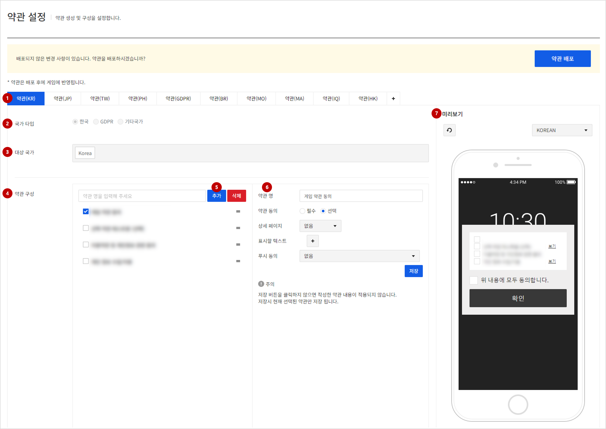
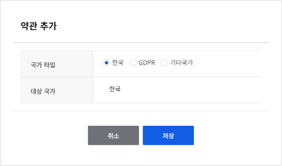
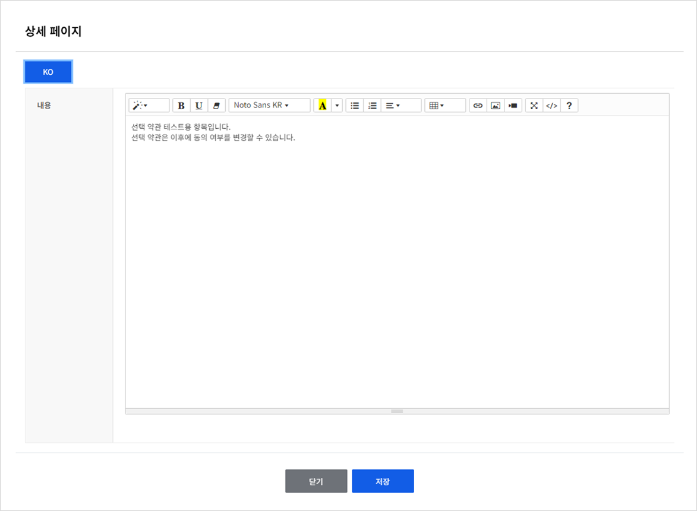

## Terms Of Service
게임에 보여줄 약관을 생성 및 구성을 설정합니다.

<!-- LLM_Image_DESC_20260408_185735
    유형: Screenshot
    내용: Gamebase 앱 설정 콘솔 Terms Of Service 화면 #01
    구성: Gamebase 앱 설정 콘솔의 Terms Of Service 기능 설정/조회 화면 스크린샷
    Keyword: 앱 설정, Console, Screenshot, Terms Of Service
-->
### (1) 생성된 약관 목록
- **+** 버튼을 클릭하여 약관을 추가로 생성할 수 있습니다.

<!-- LLM_Image_DESC_20260408_185735
    유형: Screenshot
    내용: Gamebase 앱 설정 콘솔 (1) 생성된 약관 목록 화면 #02
    구성: Gamebase 앱 설정 콘솔의 (1) 생성된 약관 목록 기능 설정/조회 화면 스크린샷
    Keyword: 앱 설정, Console, Screenshot, (1) 생성된 약관 목록
-->

### (2) 약관의 국가 타입

### (3) 약관의 대상 국가
- 국가 타입이 기타 국가인 경우 대상 국가를 추가로 선택할 수 있습니다.

### (4) 약관의 구성
- 드래그 앤 드롭 방식으로 약관 항목의 순서를 지정할 수 있습니다.
- 약관 항목은 상위 약관 5개, 하위 약관 5개 총 25개를 생성할 수 있습니다.

### (5) 약관 항목 생성
- 약관 항목 목록에서 약관 구성을 선택한 후, **추가** 버튼을 클릭하면 해당 약관의 하위 약관이 생성됩니다.
- 하위 약관을 선택한 경우 약관을 생성할 수 없습니다.

### (6) 선택한 약관의 상세 정보
- 약관 명
	- 약관을 관리하기 위한 약관 이름입니다.
- 약관 동의
	- 약관 동의 필수 여부입니다.
- 상세 페이지
	- 없음: 상세 페이지가 존재하지 않는 경우입니다.
	- URL 입력: 상세 페이지의 URL을 설정할 수 있습니다.
	- 직접 입력: 상세 페이지를 생성할 수 있습니다.

<!-- LLM_Image_DESC_20260408_185735
    유형: Screenshot
    내용: Gamebase 앱 설정 콘솔 (6) 선택한 약관의 상세 정보 화면 #03
    구성: Gamebase 앱 설정 콘솔의 (6) 선택한 약관의 상세 정보 기능 설정/조회 화면 스크린샷
    Keyword: 앱 설정, Console, Screenshot, (6) 선택한 약관의 상세 정보
-->
- 표시할 텍스트
	- 게임에 표시할 텍스트입니다.
	- **+** 버튼을 클릭하여 언어를 추가할 수 있습니다.
	- 지원하지 않는 언어를 요청할 경우, 버튼에 체크된 언어를 기본으로 보여줍니다.
- 푸시 동의
	- 없음: 푸시 관련 동의가 아닌 경우입니다.
	- 광고성 수신 동의: 광고성 푸시 수신 동의가 필요한 약관입니다.
	- 광고성 야간 수신 동의: 광고성 야간 푸시 수신 동의가 필요한 약관입니다.

> [주의] 
>
> 저장 버튼을 클릭하지 않으면 작성한 약관 내용이 적용되지 않습니다.
> 저장시 현재 선택된 약관 상세 정보만 저장 됩니다.
>
