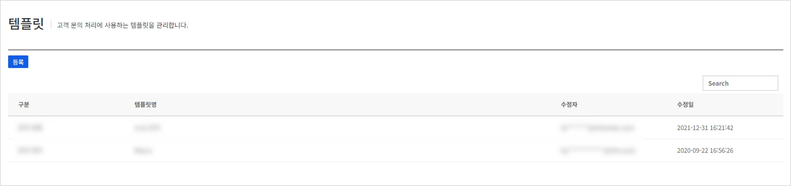
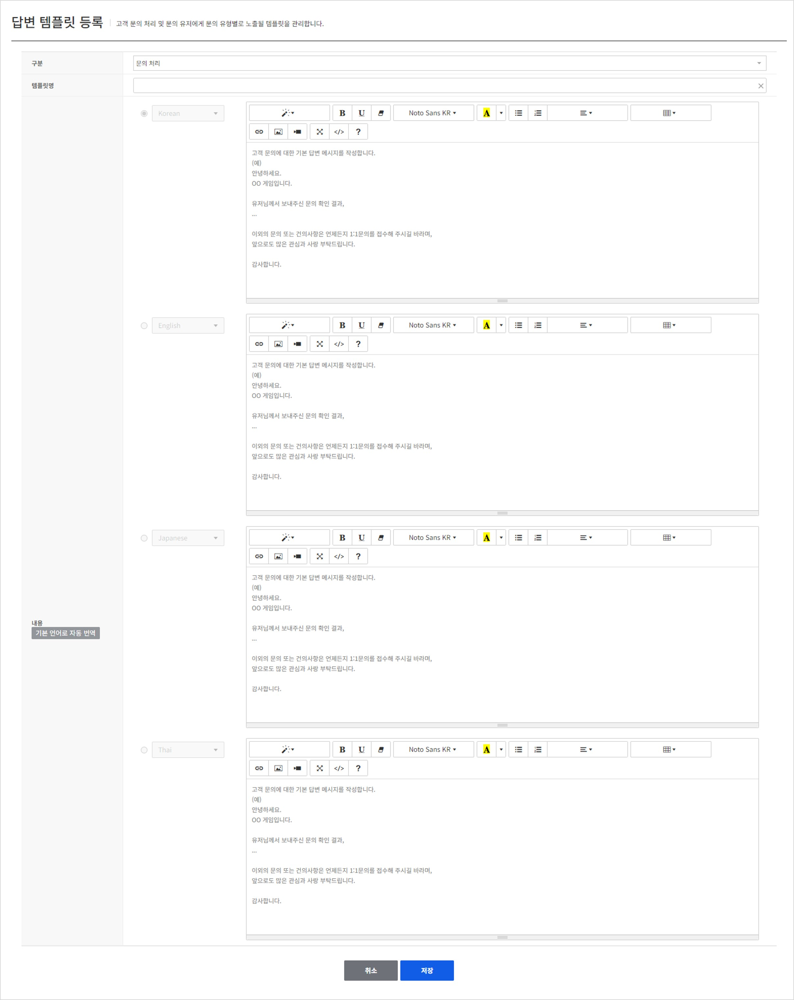

## Answer template

고객 문의 처리 시 반복입력을 자주 할 경우 템플릿을 사용하여 처리할 수 있도록 기능을 지원합니다.
또한, 고객이 문의 작성 시 필요한 정보들을 작성할 수 있도록 문의 유형별 템플릿을 사용할 수 있도록 기능을 지원합니다.

### Search Template
현재 등록된 템플릿 리스트를 표시하며, 우측 상단에 검색어를 입력하여 현재 등록된 템플릿을 검색할 수 있습니다.

<!-- LLM_Image_DESC_20260408_191856
    유형: Screenshot
    내용: Gamebase 고객센터 콘솔 Search Template 화면 #01
    구성: Gamebase 고객센터 콘솔의 Search Template 기능 설정/조회 화면 스크린샷
    Keyword: 고객센터, Console, Screenshot, Search Template
-->

**결과**
- **템플릿명**: 문의 처리시에 템플릿 항목에 노출되어 선택할 수 있는 템플릿명입니다.
- **수정자**: 답변 템플릿을 마지막으로 등록 또는 수정한 유저의 정보를 보여줍니다.
- **수정일**: 답변 템플릿이 마지막으로 등록 또는 수정된 날짜 정보를 보여줍니다.

### Register or Update Template
답변 템플릿을 새롭게 등록하거나 기존에 등록된 답변 템플릿 정보를 수정할 수 있습니다.
등록 또는 수정 시 변경할 수 있는 항목은 모두 동일합니다.

<!-- LLM_Image_DESC_20260408_191856
    유형: Screenshot
    내용: Gamebase 고객센터 콘솔 Register or Update Template 화면 #02
    구성: Gamebase 고객센터 콘솔의 Register or Update Template 기능 설정/조회 화면 스크린샷
    Keyword: 고객센터, Console, Screenshot, Register or Update Template
-->

#### 1. 구분
- **문의 처리**: 고객 문의에 대한 기본 답변 메시지입니다.
- **문의 유형**: 유저 문의 입력에 기본으로 노출되는 메시지입니다.

#### 2. 템플릿명
문의 처리시에 템플릿 선택항목에 노출될 템플릿명을 입력합니다.
구분이 문의 유형인 경우는 문의 유형 관리에서 노출될 템플릿 명입니다.

#### 3. 내용
문의 처리시 템플릿이 선택되었을 때 채워질 내용을 입력합니다.
Text editor를 이용하여 자유롭게 입력이 가능하며 입력된 내용이 그대로 문의 처리시 템플릿을 선택하면 동일하게 적용됩니다.
