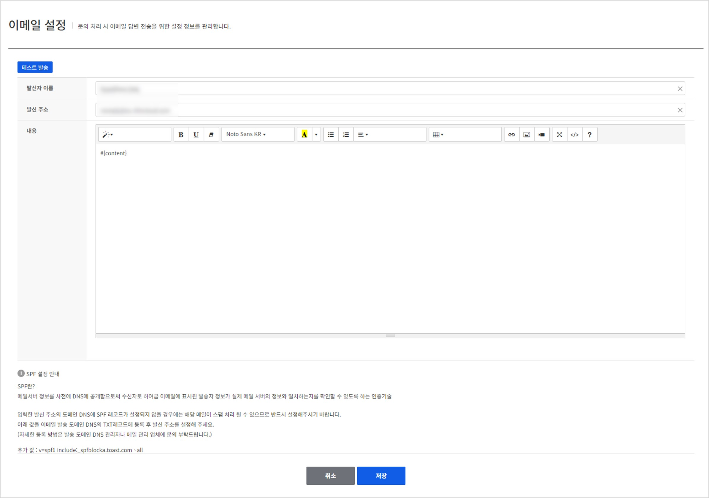

## Email Config
문의 처리가 완료되었을 경우 유저에게 발송할 이메일 형식을 설정할 수 있습니다.
최초에 활성화 시켰을 경우 기본 템플릿이 제공되며 이후 Text editor를 통해 원하는 형태로 얼마든지 수정하실 수 있습니다.

테스트 발송 기능이 제공되며 해당 기능을 통해 현재 입력한 템플릿을 이용하여 실제 유저에게 어떤 형태로 전송되는지 미리 확인할 수 있습니다.

<!-- LLM_Image_DESC_20260408_185735
    유형: Screenshot
    내용: Gamebase 고객센터 콘솔 Email Config 화면 #03
    구성: Gamebase 고객센터 콘솔의 Email Config 기능 설정/조회 화면 스크린샷
    Keyword: 고객센터, Console, Screenshot, Email Config
-->

> [참고]
> 발신 주소에 설정된 이메일이 SPF 레코드가 설정되지 않았을 경우에는 해당 메일이 스팸 처리 될 수 있습니다. 
> 그러므로 반드시 아래의 값을 DNS의 TXT레코드에 먼저 등록 후 발신주소에 설정해 주셔야 합니다.
> 추가 값 : v=spf1 include:_spfblocka.toast.com ~all
