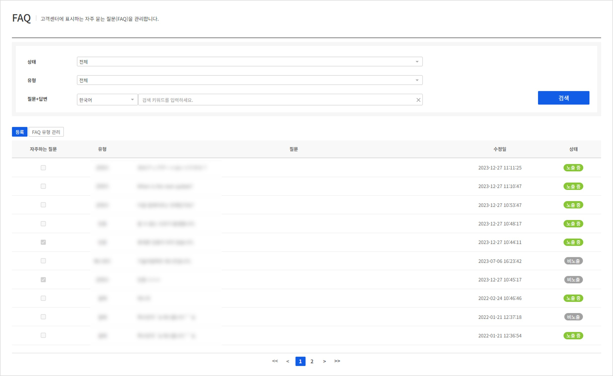
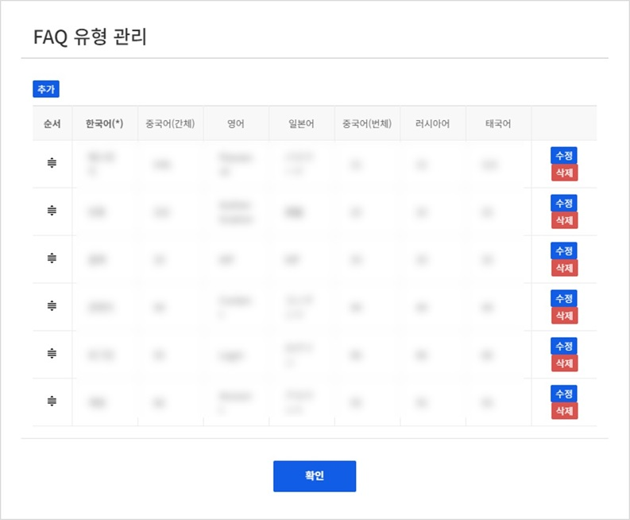
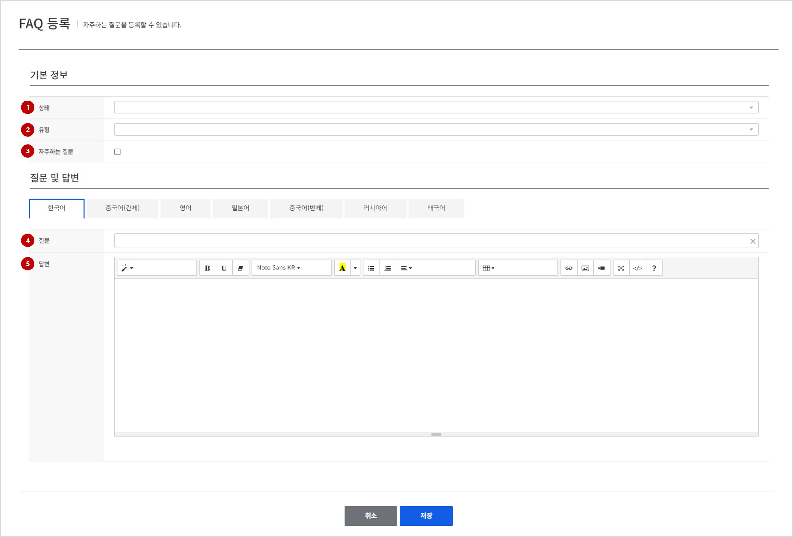

## FAQ

고객센터 페이지에서 제공되는 FAQ 항목에 대한 관리를 진행할 수 있습니다.

### Search FAQ

등록되어 있는 FAQ 항목에 대하여 검색할 수 있습니다.

<!-- LLM_Image_DESC_20260408_185735
    유형: Screenshot
    내용: Gamebase 고객센터 콘솔 Search FAQ 화면 #01
    구성: Gamebase 고객센터 콘솔의 Search FAQ 기능 설정/조회 화면 스크린샷
    Keyword: 고객센터, Console, Screenshot, Search FAQ
-->

**검색 조건**

- **상태**: (필수) FAQ의 노출 형태를 선택합니다. 노출 / 비노출 항목을 선택할 수 있습니다.
- **유형**: (필수) FAQ의 유형을 선택하여 검색할 수 있습니다. 선택항목은 FAQ 유형 관리에서 등록된 내용을 기준으로 표시됩니다.
- **질문+답변**: 질문 또는 답변에 특정한 키워드를 포함한 FAQ를 검색하고자 할 때 사용합니다. 다른 언어로 등록된 내용을 등록하고자 할 경우에는 검색할 언어를 지정한 후에 검색합니다.

**검색 결과**

- **자주하는 질문**: FAQ가 자주하는 질문란에 들어가있는지에 대한 여부를 표시합니다.
- **유형**: 등록된 FAQ의 분류 유형을 표시합니다.
- **제목**: FAQ의 질문 제목입니다.
- **수정자**: FAQ를 마지막으로 등록 또는 수정한 유저의 정보를 보여줍니다.
- **수정일**: FAQ가 마지막으로 등록 또는 수정된 날짜 정보를 보여줍니다.
- **상태**: FAQ가 현재 표시되고 있는지 여부를 보여줍니다. 노출 중 / 비노출 상태가 있습니다.

#### FAQ 유형 관리

<!-- LLM_Image_DESC_20260408_185735
    유형: Screenshot
    내용: Gamebase 고객센터 콘솔 FAQ 유형 관리 화면 #02
    구성: Gamebase 고객센터 콘솔의 FAQ 유형 관리 기능 설정/조회 화면 스크린샷
    Keyword: 고객센터, Console, Screenshot, FAQ 유형 관리
-->

FAQ 등록 또는 수정시 선택할 수 있는 유형을 관리할 수 있습니다.
지원하는 언어별로 등록이 가능하며 항목별 최대 글자수는 20자입니다.
표시되는 순서대로 표시되며 해당순서는 드래그앤 드랍을 이용하여 목록 내에서 변경이 가능합니다.
> [참고]
> 지원 언어 선택 현황은 앱 - 고객센터 설정에서 확인할 수 있습니다.

### Register or Update FAQ
FAQ를 등록하거나 또는 기존에 등록된 FAQ정보를 수정할 수 있습니다.
등록 또는 수정 시 변경할 수 있는 항목은 모두 동일합니다.

<!-- LLM_Image_DESC_20260408_185735
    유형: Screenshot
    내용: Gamebase 고객센터 콘솔 Register or Update FAQ 화면 #03
    구성: Gamebase 고객센터 콘솔의 Register or Update FAQ 기능 설정/조회 화면 스크린샷
    Keyword: 고객센터, Console, Screenshot, Register or Update FAQ
-->

#### 1. 상태
등록 또는 수정하고자 하는 FAQ의 노출 상태를 선택합니다.
노출 / 비노출 항목이 있으며 고객센터 페이지에서 실제 유저에게 노출할지에 대한 여부를 선택하면 됩니다.

#### 2. 유형
FAQ 유형 관리에서 등록된 유형을 기반으로 등록 또는 수정하고자 하는 FAQ의 유형을 선택합니다.

#### 3. 자주하는 질문
고객센터 페이지에서 자주하는 질문란에 해당 질문을 표시할 지에 대한 여부를 체크합니다.

#### 4. 질문
FAQ 질문 내용을 입력합니다.
> [참고]
> 앱 - 고객센터에서 설정한 지원 언어들은 모두 입력해야 등록이 가능합니다.

####. 5. 답변
FAQ 질문에 대한 답변 내용을 입력합니다.
Text Editor를 통해 원하는 형태로 답변을 입력할 수 있으며 해당형태 그대로 웹페이지에 노출됩니다.
> [참고]
> 앱 - 고객센터에서 설정한 지원 언어들은 모두 입력해야 등록이 가능합니다.
