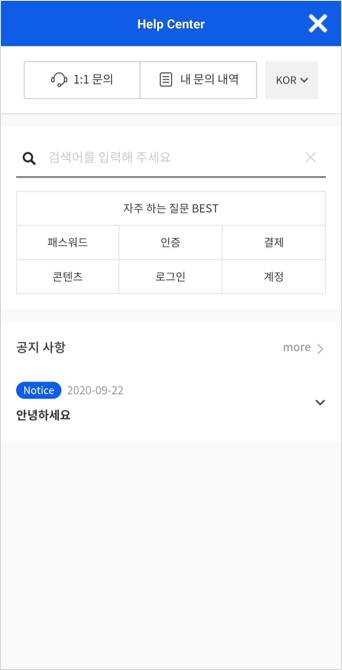
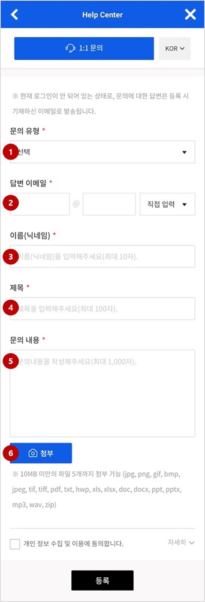
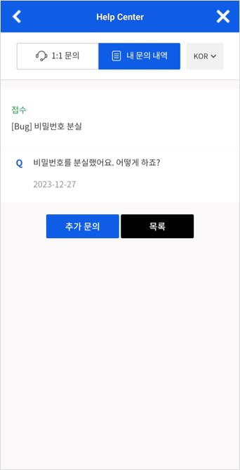
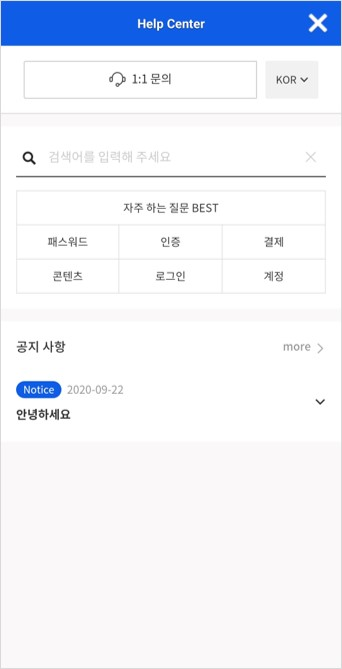
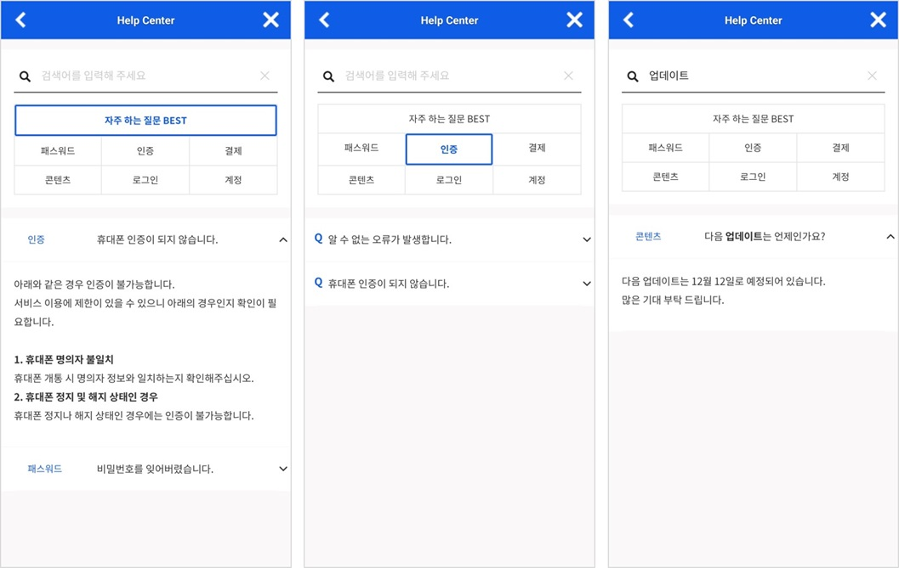
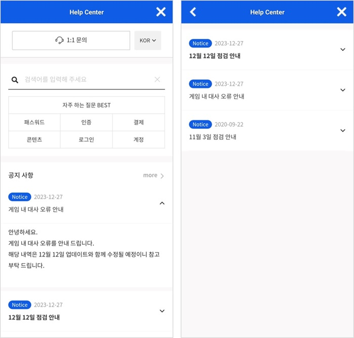

## Game > Gamebase > 콘솔 사용 가이드 > 고객센터

게임 운영 중 유저에게 인입된 문의를 처리할 수 있으며 그 외 고객센터 페이지를 통해 제공할 수 있는 공지사항, FAQ 등의 설정을 관리할 수 있습니다.
문의 처리시에 유저에게 발송될 이메일 설정 및 자주 쓰이는 답변을 템플릿으로 등록하여 활용하실 수도 있습니다.
> [참고]
> 이 메뉴를 이용하시려면 앱 - 고객센터 설정에서 Gamebase 제공 고객센터 항목을 선택하셔야 합니다.
>

## Help Center Web Page 

유저에게 노출되는 고객센터 웹페이지에 대해서 설명합니다.
해당 화면을 통해 유저는 1:1 문의를 등록하고 내 문의 내역 조회가 가능하며, 자주하는 질문 및 공지사항을 확인할 수 있습니다.

### Main 

게임에서 Gamebase SDK를 이용하여 고객센터 페이지를 오픈하면 다음과 같은 화면이 유저에게 노출됩니다.

<!-- LLM_Image_DESC_20260408_191856
    유형: Screenshot
    내용: Gamebase 고객센터 콘솔 Main 화면 #01
    구성: Gamebase 고객센터 콘솔의 Main 기능 설정/조회 화면 스크린샷
    Keyword: 고객센터, Console, Screenshot, Main
-->

#### (1) 1:1 문의

**1:1 문의** 버튼을 클릭하면 1:1 문의를 등록하는 화면으로 이동합니다.

<!-- LLM_Image_DESC_20260408_191856
    유형: Screenshot
    내용: Gamebase 고객센터 콘솔 (1) 1:1 문의 화면 #02
    구성: Gamebase 고객센터 콘솔의 (1) 1:1 문의 기능 설정/조회 화면 스크린샷
    Keyword: 고객센터, Console, Screenshot, (1) 1:1 문의
-->

다음은 문의 등록 시에 입력하는 항목입니다.
등록된 문의는 **[고객센터 > 고객문의](./oper-customer-service-Inquiry.md#inquiry)** 콘솔에서 확인하고 답변 처리가 가능합니다.

1. 문의 유형: 접수 문의 유형을 선택합니다. 접수 문의 유형은 [고객센터 > 고객문의](./oper-customer-service-Inquiry.md#inquiry)에서 등록, 수정, 삭제가 가능합니다. 
2. 답변 이메일: 문의에 관한 답변을 받을 이메일 주소를 입력합니다. 콘솔에서 문의 처리를 완료하면 입력된 이메일 주소로 자동으로 메일을 발송합니다.
3. 이름(닉네임): 게임에서 사용하는 닉네임을 입력합니다. 최대 10자까지 입력 가능합니다. 
게임 닉네임을 추가 정보로 설정하여 고객센터 페이지를 열면 유저가 입력하지 않아도 자동으로 닉네임이 입력됩니다.
4. 제목: 문의 제목을 입력합니다. 최대 100자까지 입력 가능합니다.
5. 문의 내용: 문의 내용을 작성하여 입력합니다. 최대 1,000자까지 입력 가능합니다.
6. 첨부: 첨부파일이 있는 경우 등록합니다. 10MB 미만의 파일 5개까지 첨부 가능합니다.

> [참고] 
> 접수 문의 유형을 선택 시에 해당 문의 유형에 템플릿이 설정되어 있으면, 문의 내용에 자동으로 템플릿 내용이 작성됩니다.
> 템플릿 설정은 [고객센터 > 고객 문의 > 문의 유형 관리](./oper-customer-service-Inquiry.md#inquiry)에서 할 수 있습니다.

#### (2) 내 문의 내역

로그인을 하고 고객센터 웹페이지에 접근하여야 **내 문의 내역** 버튼이 표시됩니다. 클릭하면 이전에 고객이 문의한 내역을 확인하는 화면으로 이동합니다.

<!-- LLM_Image_DESC_20260408_191856
    유형: Screenshot
    내용: Gamebase 고객센터 콘솔 (2) 내 문의 내역 화면 #03
    구성: Gamebase 고객센터 콘솔의 (2) 내 문의 내역 기능 설정/조회 화면 스크린샷
    Keyword: 고객센터, Console, Screenshot, (2) 내 문의 내역
-->

내 문의 내역은 기본 10개의 목록을 확인할 수 있고 10개 이상인 경우 **더 보기** 클릭 시 10개가 추가로 노출됩니다.

> [참고] 로그인을 하지 않으면 내 문의 내역을 확인할 수 없습니다.
> 로그인 하지 않고 문의를 남기면 이메일로만 문의 내역 확인이 가능하며 내 문의 내역에서의 확인 또한 불가능합니다.
> 
<!-- LLM_Image_DESC_20260408_191856
    유형: Screenshot
    내용: Gamebase 고객센터 콘솔 (2) 내 문의 내역 화면 #04
    구성: Gamebase 고객센터 콘솔의 (2) 내 문의 내역 기능 설정/조회 화면 스크린샷
    Keyword: 고객센터, Console, Screenshot, (2) 내 문의 내역
-->

#### (3) 자주하는 질문

FAQ에서는 카테고리 질문 및 자주하는 질문 등을 확인할 수 있습니다. 리스트에서는 최대 12개가 노출됩니다.
원하는 내용을 검색하거나 카테고리 버튼을 클릭하여 [고객센터 > FAQ](./oper-customer-service-FAQ.md#faq)에서 등록한 FAQ내용을 확인할 수 있습니다.

<!-- LLM_Image_DESC_20260408_191856
    유형: Screenshot
    내용: Gamebase 고객센터 콘솔 (3) 자주하는 질문 화면 #05
    구성: Gamebase 고객센터 콘솔의 (3) 자주하는 질문 기능 설정/조회 화면 스크린샷
    Keyword: 고객센터, Console, Screenshot, (3) 자주하는 질문
-->

1) 확인하고 싶은 검색어를 입력하여 검색어가 포함된 FAQ를 확인할 수 있습니다.
2) 자주 하는 질문으로 등록된 질문을 확인할 수 있습니다.
3) FAQ 등록시 설정한 **FAQ 유형 관리**별로 묶어서 FAQ를 확인할 수 있습니다.
4) FAQ 카테고리는 [Gamebase Console > 고객센터 >  FAQ 유형관리](./oper-customer-service-FAQ.md#search-faq)를 통해 추가하거나 삭제할 수 있습니다.

#### (4) 공지사항
**고객센터 > 공지사항**에 등록된 게시물을 확인할 수 있습니다.

메인 화면에서는 최근에 작성한 3개의 게시물이 표시되고 상단 고정 게시물은 굵은 폰트로 표시됩니다. **more**를 클릭하여 등록된 전체 공지사항을 확인할 수 있습니다.
작성일 내림차순으로 정렬되어 공지사항 게시물이 노출되고 상단 고정으로 지정한 공지는 굵은 폰트로 상단에 우선 노출됩니다. 노출 기간이 지난 게시물은 목록에서 더 이상 표시되지 않습니다. 게시물을 클릭하면 상세 내용을 확인할 수 있습니다.

<!-- LLM_Image_DESC_20260408_191856
    유형: Screenshot
    내용: Gamebase 고객센터 콘솔 (4) 공지사항 화면 #06
    구성: Gamebase 고객센터 콘솔의 (4) 공지사항 기능 설정/조회 화면 스크린샷
    Keyword: 고객센터, Console, Screenshot, (4) 공지사항
-->
