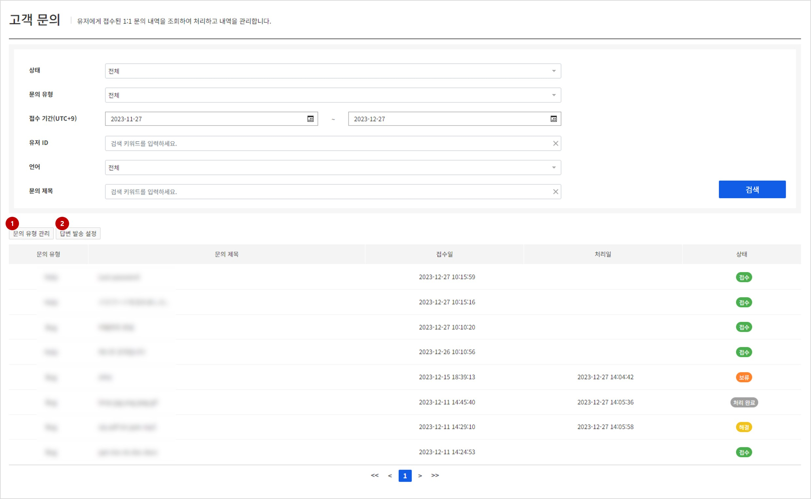
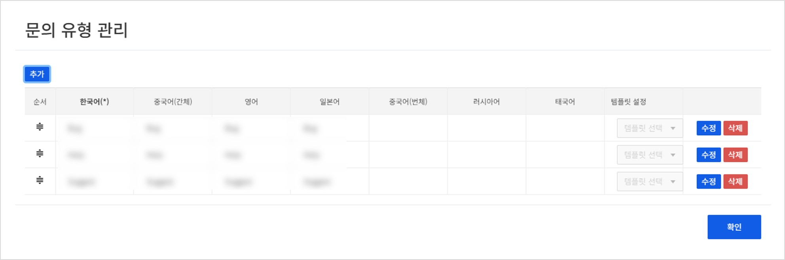
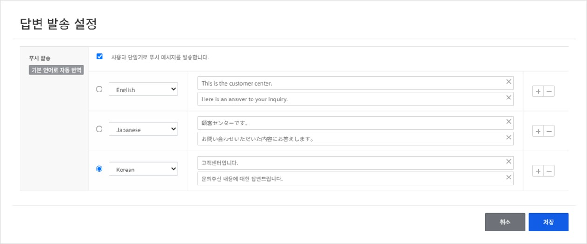
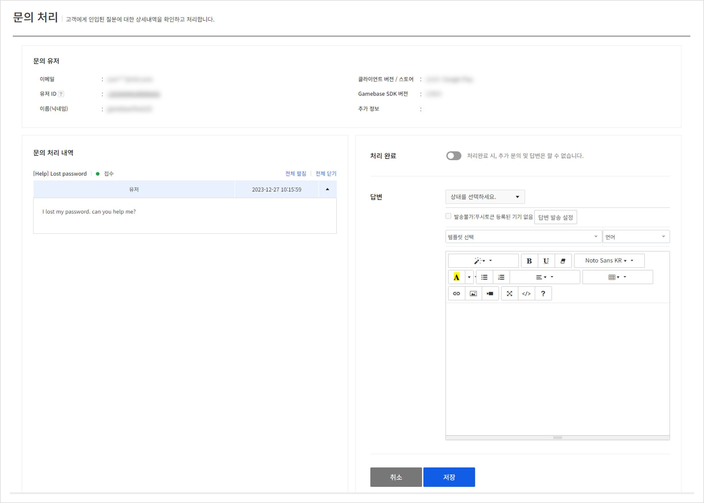
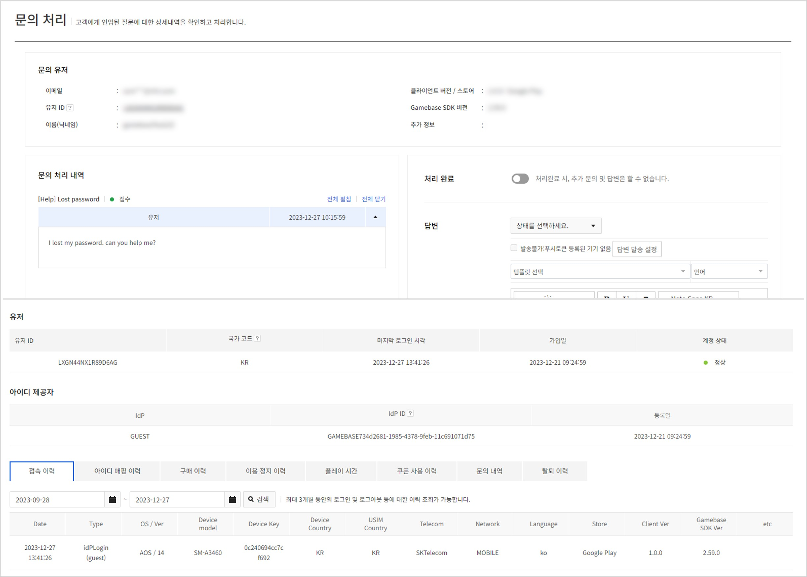

## Inquiry
고객에게 인입된 문의를 처리하거나 조회할 수 있습니다.
그 외에도 고객이 문의를 등록하고자 할 때 필요한 접수 유형 항목을 설정할 수 있으며 문의가 처리되었을 때 유저에게 발송되는 Push 알람에 대한 설정도 가능합니다.

### Search Inquiry

검색 조건에 맞는 고객 문의 내역을 검색합니다.

<!-- LLM_Image_DESC_20260406
    유형: Screenshot
    내용: Gamebase 고객센터 - 고객 문의 검색 화면
    구성: 상단에 상태, 문의 유형, 접수 기간, 유저 ID, 언어, 문의 제목 등의 검색 조건 필터와 검색 버튼이 있음. 하단에 접수 유형, 문의 제목, 접수일, 처리일, 상태 컬럼으로 구성된 문의 목록 테이블이 있으며 각 행에 상태 배지(접수, 보류, 해결, 완료)가 표시됨
    Keyword: 고객 문의, 검색, 접수 유형, 문의 목록, 상태 필터
-->

**검색 조건**

- **상태**: (필수) 고객 문의의 현재 처리 상태를 선택합니다.
- **접수 유형**: (필수) 고객 문의시 유저가 선택한 접수 유형 항목을 선택합니다. 접수 / 처리 완료 항목이 존재합니다.
- **접수 기간**: (필수)선택한 기간동안 인입된 문의를 조회합니다.
- **유저 ID**: 특정 유저의 문의를 검색하려면 유저ID를 입력합니다.
- **문의 제목**: 특정 제목의 문의를 검색하려면 문의 제목을 입력합니다.

**검색 결과**

- **접수 유형**: 유저가 문의 등록시 선택한 접수 유형 항목
- **문의 제목**: 유저가 문의 등록시 입력한 문의 제목
- **접수일**: 유저의 문의 등록 일시
- **처리일**: 담당자가 인입된 문의를 처리한 일시
- **상태**: 인입된 문의의 현재 처리 상태
    - 접수: 유저가 문의를 등록한 상태입니다. 기존 문의 글에 추가 문의를 남겨도 접수 상태로 변경됩니다.
    - 보류: 담당자가 답변을 남길 때, 보류로 작성한 상태입니다. 추가로 확인이 필요한 경우 사용됩니다.
    - 해결: 담당자가 답변을 남길 때, 해결로 작성한 상태입니다. 문의가 해결된 상태입니다.
    - 완료: 담당자가 완료 처리 혹은 해결된 문의가 2주 지나면 자동으로 완료 상태가 됩니다.

#### 1. 문의 유형 관리

<!-- LLM_Image_DESC_20260406
    유형: UI
    내용: Gamebase 고객센터 - 문의 유형 관리 팝업
    구성: 상단에 '문의 유형 관리' 제목과 추가 버튼이 있음. 순서, 한국어(*), 중국어(간체), 영어, 일본어, 중국어(번체), 러시아어, 태국어, 템플릿 설정 컬럼이 있는 테이블에 유형 항목이 나열되며 각 행에 수정/삭제 버튼이 있음. 드래그앤드롭으로 순서 변경 가능
    Keyword: 문의 유형, 관리, 다국어, 템플릿, 수정, 삭제
-->

유저가 문의 등록시 선택할 수 있는 접수 유형 항목을 관리할 수 있습니다.
지원하는 언어별로 등록이 가능하며 항목별 최대 글자수는 20자입니다.
표시되는 순서대로 유저에게 목록이 표시되며 해당순서는 드래그앤 드랍을 이용하여 목록 내에서 변경이 가능합니다.
**고객센터 > 템플릿**에서 등록한 템플릿을 선택하여 고객이 문의 작성 시 문의 대응에 필요한 정보들을 작성할 수 있도록 할 수 있습니다.
> [참고]
> 지원 언어 선택 현황은 앱 - 고객센터 설정에서 확인할 수 있습니다.

#### 2. 답변 발송 설정

<!-- LLM_Image_DESC_20260406
    유형: UI
    내용: Gamebase 고객센터 - 답변 발송 설정 화면
    구성: '답변 발송 설정' 제목 아래에 푸시 발송 체크박스와 기본 언어로 자동 번역 버튼이 있음. 영어(English), 일본어(Japanese), 한국어(Korean) 등 언어별로 푸시 메시지 제목과 내용을 입력할 수 있는 필드가 있으며, 하단에 취소/저장 버튼이 배치됨
    Keyword: 답변 발송, 푸시 설정, 다국어, 메시지 설정, 자동 번역
-->

문의에 대한 처리가 완료되었을 경우 유저에게 Push 메시지를 통해 알림을 발송하고자 할 경우에 해당 기능을 설정할 수 있습니다.
사용하고자 할 경우에 상단에 발송여부를 체크하면 유저에게 처리완료 시 완료 Push알람이 함께 전송됩니다.
글로벌 서비스의 경우 원하는 언어를 추가로 등록하여 발송할 수 있으며 유저의 기기설정에 따라 맞는 언어설정으로 유저에게 푸시 알람이 전송되게 됩니다.
> [참고]
> 1. 이 기능을 사용하려면 NHN Cloud Push 상품이 먼저 활성화되어 있어야 합니다.
> 2. 답변발송 설정의 언어선택의 경우 고객센터에서 지원되는 언어와 무관하게 Gamebase에서 지원되는 모든 언어를 등록할 수 있습니다.

### Inquiry details

<!-- LLM_Image_DESC_20260406
    유형: Screenshot
    내용: Gamebase 고객센터 - 문의 처리 상세 화면
    구성: 좌측에 문의 유저 정보(이메일, 유저 ID, 이름)와 문의 처리 내역(접수 상태, 날짜, 문의 내용)이 표시됨. 우측에 처리 완료 토글, 답변 입력란(템플릿 선택, 텍스트 에디터)이 있으며, 하단에 취소/저장 버튼이 배치됨
    Keyword: 문의 처리, 문의 상세, 답변 입력, 텍스트 에디터, 템플릿
-->

유저에게 인입된 문의에 대하여 상세내용 확인 및 해당 문의에 대한 처리를 진행할 수 있습니다.
문의를 처리한 후 유저가 추가로 문의할 수 있습니다.
문의를 처리한 후에 **처리 완료** 버튼을 클릭하여 문의 상태를 처리 완료 상태로 변경할 수 있으며, 처리 완료 상태의 문의에는 유저가 더는 문의를 남길 수 없습니다.

템플릿을 선택할 경우 고객센터 - 답변 템플릿 메뉴에서 설정한 템플릿 내용을 답변에서 바로 사용할 수 있으며 템플릿 내용 외에 Text editor를 이용하여 원하시는 모양대로 답변을 만들어 유저에게 전달할 수 있습니다.
유저 문의 답변시 파일첨부가 필요할 경우 최대 10MB 이내의 파일을 5개까지 첨부하여 유저에게 전달가능합니다.
이후 처리하기가 완료될 경우 문의 인입시 등록된 email을 통해 담당자가 작성한 내용이 유저에게 전달됩니다.
이 때 답변 발송 항목을 통해 문의 처리 완료 시 해당 유저에게 Push알람이 전송되는지에 대한 여부를 확인할 수 있습니다.
> [참고]
> 
<!-- LLM_Image_DESC_20260406
    유형: Screenshot
    내용: Gamebase 고객센터 - 문의 처리 상세 화면 (유저 정보 포함)
    구성: 상단에 문의 유저 정보와 문의 처리 내역이 있고, 하단에 장치, 아이디 제공자 등 로그인 유저의 상세 정보(접속 이력, 아이디/매핑 이력, 구매 이력, 이용정지 이력, 플레이 시간 등)가 탭으로 구분되어 표시됨
    Keyword: 문의 처리, 유저 정보, 접속 이력, 구매 이력, 상세 정보
-->
> 로그인된 유저가 문의를 등록했을 경우 해당 유저에 대한 정보가 한 화면에 조회되어 확인할 수 있습니다.
> 우측 X 버튼을 클릭하여 창을 닫을 수 있으며, 유저 ID를 클릭 시 다시 노출됩니다.
> 기존 회원 메뉴에서 사용했던 기능과 동일하게 유저정보가 조회되므로 유저 문의대응시 필요한 정보를 한화면에서 편리하게 확인하실 수 있습니다.

#### 1. 답변 발송 설정

<!-- LLM_Image_DESC_20260406
    유형: UI
    내용: Gamebase 고객센터 - 답변 발송 설정 화면
    구성: '답변 발송 설정' 제목 아래에 푸시 발송 체크박스와 기본 언어로 자동 번역 버튼이 있음. 영어(English), 일본어(Japanese), 한국어(Korean) 등 언어별로 푸시 메시지 제목과 내용을 입력할 수 있는 필드가 있으며, 하단에 취소/저장 버튼이 배치됨
    Keyword: 답변 발송, 푸시 설정, 다국어, 메시지 설정, 자동 번역
-->

문의에 대한 처리가 완료되었을 경우 유저에게 Push 메시지를 통해 알림을 발송하고자 할 경우에 해당 기능을 설정할 수 있습니다.
사용하고자 할 경우에 상단에 발송여부를 체크하면 유저에게 처리완료 시 완료 Push알람이 함께 전송됩니다.
글로벌 서비스의 경우 원하는 언어를 추가로 등록하여 발송할 수 있으며 유저의 기기설정에 따라 맞는 언어설정으로 유저에게 푸시 알람이 전송되게 됩니다.
> [참고1]
> 1. 이 기능을 사용하려면 NHN Cloud Push 상품이 먼저 활성화되어 있어야 합니다.
> 2. 답변발송 설정의 언어선택의 경우 고객센터에서 지원되는 언어와 무관하게 Gamebase에서 지원되는 모든 언어를 등록할 수 있습니다.

> [참고2]
> 문의 처리가 완료된 고객 문의를 조회할 경우에는 문의 내역 및 처리 내역을 함께 조회할 수 있으며 처리 당시에 등록한 첨부파일이 있을 경우 해당항목을 클릭하여 다운이 가능합니다.
