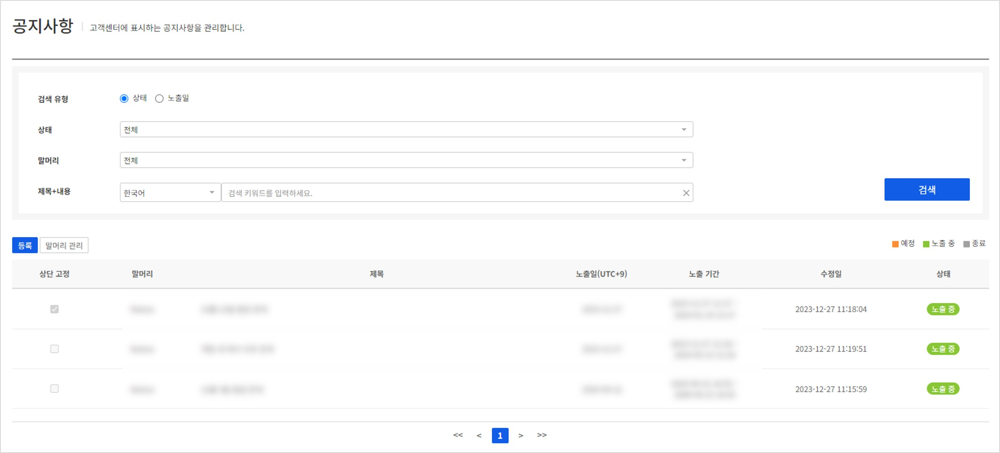
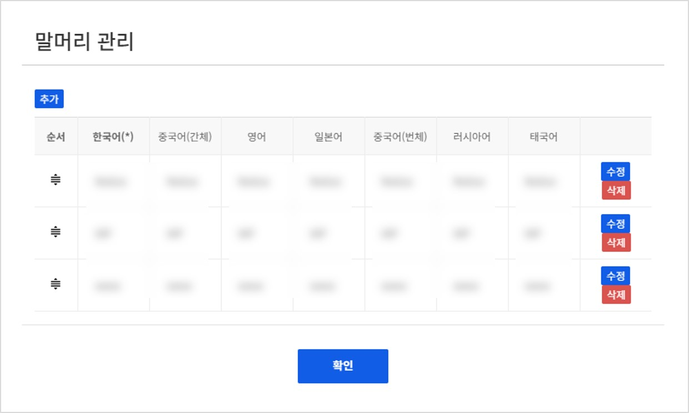
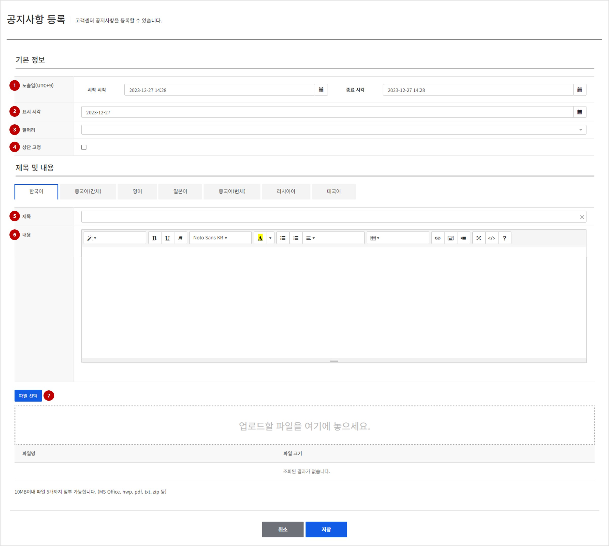

## Notice

고객센터 페이지에서 제공할 공지사항에 대한 관리를 진행할 수 있습니다.

### Search Notice

등록되어 있는 공지사항 목록에 대하여 검색할 수 있습니다.

<!-- LLM_Image_DESC_20260408_185735
    유형: Screenshot
    내용: Gamebase 고객센터 콘솔 Search Notice 화면 #01
    구성: Gamebase 고객센터 콘솔의 Search Notice 기능 설정/조회 화면 스크린샷
    Keyword: 고객센터, Console, Screenshot, Search Notice
-->

**검색 조건**

- **검색 유형**: (필수) 공지사항의 검색 유형을 선택할 수 있습니다. 기본으로 상태가 선택되어 있으며 노출일을 기준으로 검색하고자 할 경우 해당항목을 선택한 후에 동일하게 검색할 수 있습니다.
- **상태**: (필수) 위 검색 유형에서 기본으로 선택되어 있는 항목으로 현재 공지의 노출 상태를 기준으로 검색합니다. 예정 / 노출 중 / 종료 항목을 선택할 수 있습니다.
- **노출일**: 검색 유형에서 노출일 항목을 선택헀을 경우 설정할 수 있으며 선택된 노출일을 기준으로 보여지는 공지사항 목록을 검색하여 볼 수 있습니다.
- **제목+내용**: 제목 또는 내용에 특정한 키워드를 포함한 공지사항을 검색하고자 할 때 사용합니다. 다른 언어로 등록된 내용을 등록하고자 할 경우에는 검색할 언어를 지정한 후에 검색합니다.

**검색 결과**
- **상단 고정**: 해당 공지사항이 상단 고정란에 들어가있는지에 대한 여부를 표시합니다.
- **유형**: 등록된 공지사항의 분류 유형을 표시합니다.
- **제목**: 공지사항의 제목입니다.
- **노출일(UTC+9)**: 공지사항이 노출될 때 실제 노출할 등록일(표시일)을 보여줍니다.
- **노출 기간**: 해당 공지사항의 노출 기간을 표시합니다.
- **상태**: 공지사항의 현재 진행여부 보여줍니다. 예정 / 노출 중 / 종료 상태가 있습니다.

#### 말머리 관리

<!-- LLM_Image_DESC_20260408_185735
    유형: Screenshot
    내용: Gamebase 고객센터 콘솔 말머리 관리 화면 #02
    구성: Gamebase 고객센터 콘솔의 말머리 관리 기능 설정/조회 화면 스크린샷
    Keyword: 고객센터, Console, Screenshot, 말머리 관리
-->

공지사항 등록 또는 수정시 선택할 수 있는 말머리를 관리할 수 있습니다.
지원하는 언어별로 등록이 가능하며 항목별 최대 글자수는 20자입니다.
표시되는 순서대로 표시되며 해당순서는 드래그앤 드랍을 이용하여 목록 내에서 변경이 가능합니다.
> [참고]
> 지원 언어 선택 현황은 앱 - 고객센터 설정에서 확인할 수 있습니다.

### Register or Update Notice
새로운 공지사항을 등록하거나 기존에 등록된 공지사항 정보를 수정할 수 있습니다.
등록 또는 수정 시 변경할 수 있는 항목은 모두 동일합니다.

<!-- LLM_Image_DESC_20260408_185735
    유형: Screenshot
    내용: Gamebase 고객센터 콘솔 Register or Update Notice 화면 #03
    구성: Gamebase 고객센터 콘솔의 Register or Update Notice 기능 설정/조회 화면 스크린샷
    Keyword: 고객센터, Console, Screenshot, Register or Update Notice
-->

#### 1. 노출일
공지사항을 노출하고자 하는 기간을 설정합니다.

#### 2. 표시 시각
공지사항 내용을 표시할 때 실제 유저에게 보여질 날짜를 선택합니다.

#### 3. 말머리
공지사항의 말머리를 선택합니다.

#### 4. 상단 고정
공지사항을 상단에 고정하여 항상 노출될 수 있도록 합니다.

#### 5. 제목
공지사항의 제목을 입력합니다.

#### 6. 내용
공지사항에 대한 내용을 입력합니다.
Text Editor를 통해 원하는 형태로 답변을 입력할 수 있으며 해당형태 그대로 웹페이지에 노출됩니다.
> [참고]
> 앱 - 고객센터에서 설정한 지원 언어들은 모두 입력해야 등록이 가능합니다.

#### 7. 파일 첨부
해당 공지사항에 함께 노출할 파일을 첨부하여 올릴 수 있습니다.
10MB 이내의 파일을 최대 5개까지 첨부가능합니다.
첨부파일들은 공지사항에 함께 노출되며 클릭 시 다운로드가 가능합니다.
