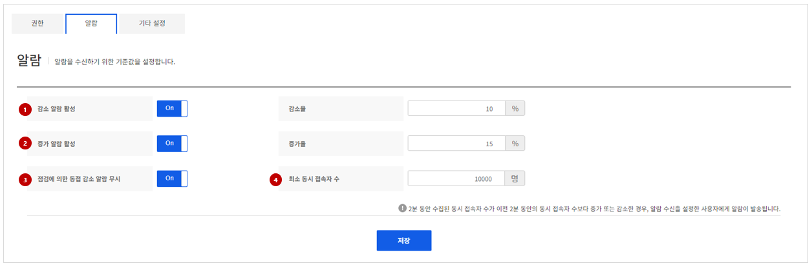
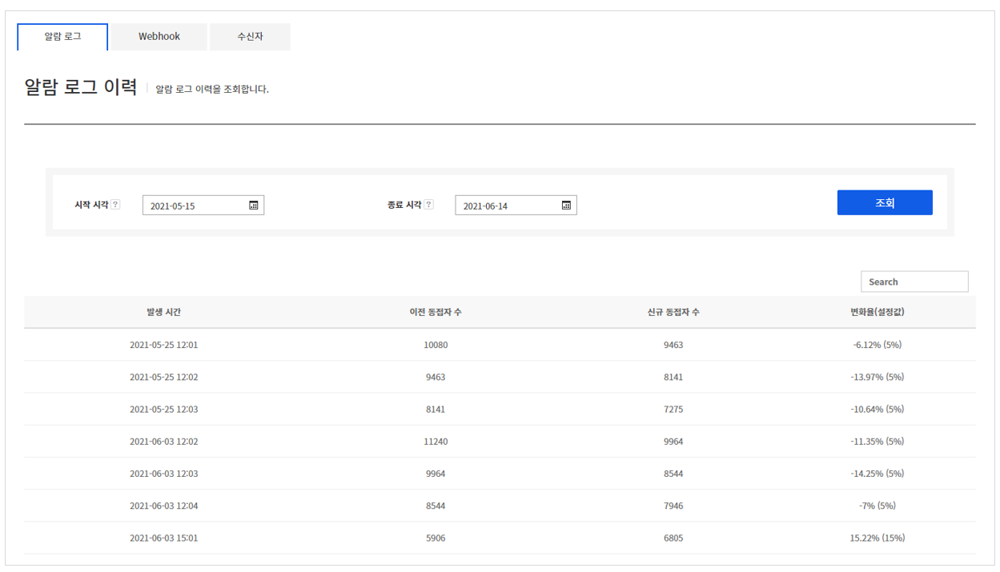
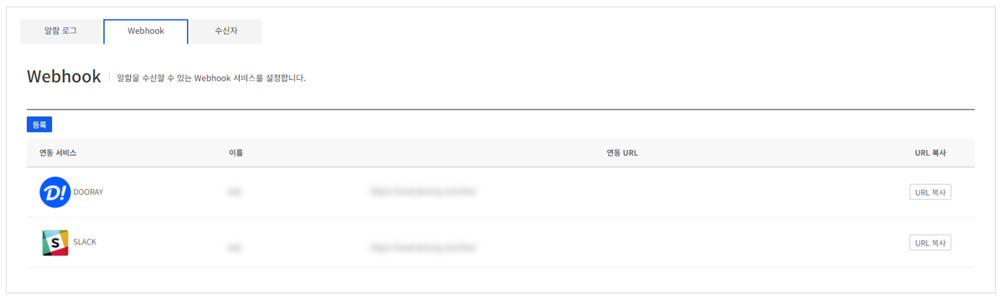
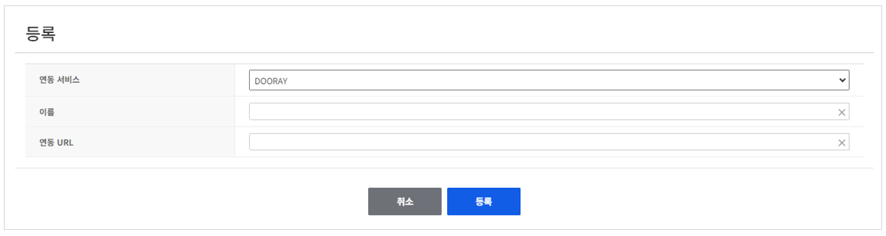
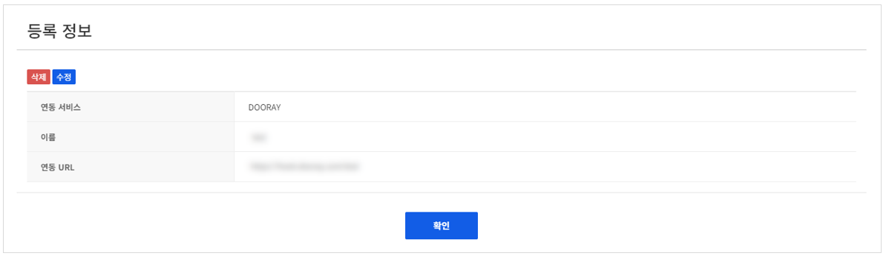
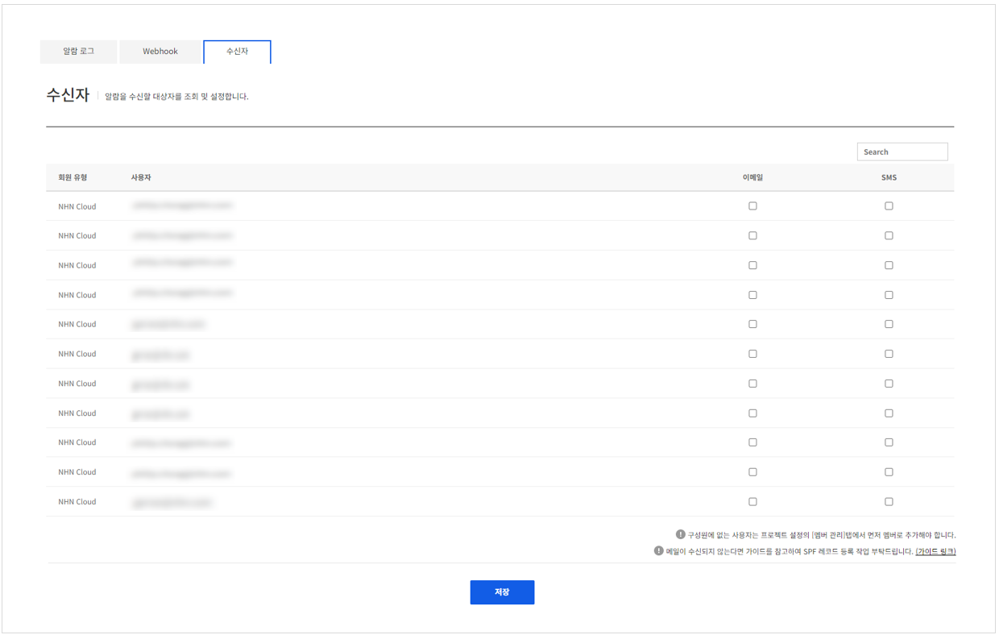

## Alarm

Gamebase의 알람 기능을 사용하여 게임 유저의 증가율이나 감소율, 최소 동시 접속자 수 변화 등에 대한 알람을 받을 수 있습니다.

### Alarm

<!-- LLM_Image_DESC_20260406
    유형: Screenshot
    내용: Gamebase 관리 - 알람 기준값 설정 화면
    구성: 상단에 권한, 알람, 기타 설정 탭이 있음. '알람' 제목 아래에 감소 알람 활성(On/Off)과 감소율(%) 설정, 증가 알람 활성(On/Off)과 증가율(%) 설정, 점검에 의한 동접 감소 알람 무시(On/Off), 최소 동시 접속자 수 설정 항목이 배치됨. 하단에 저장 버튼이 있음
    Keyword: 알람 설정, 감소 알람, 증가 알람, 동접, 기준값
-->

#### (1) 감소 알람 활성
동시 접속이 감소했을 때 알람을 받을지 여부를 설정합니다. 알람을 받으려면 **감소 알람 활성**을 **On**으로 설정합니다.

- **감소율**: 동시 접속이 몇 % 감소했을 때 알람을 받을 것인지를 지정합니다.
- **점검에 의한 동접 감소 알람 무시**: 앱을 점검하는 경우에는 동시 접속 수가 감소할 수밖에 없습니다.
  이런 경우에는 **점검에 의한 동접 감소 알람 무시**를 **On**으로 설정하여 알람을 받지 않게 할 수 있습니다.

#### (2) 증가 알람 활성
동시 접속자 수가 증가했을 때 알람을 받도록 설정할 수 있습니다.
기능이 활성화되었을 경우 운영자가 알람을 받고자 하는 수치를 설정할 수 있습니다.

#### (3) 메시지 언어
알람 발송 메시지의 언어를 선택할 수 있습니다. 현재는 한글과 영어 메시지만 지원하며 추가 요구 사항이 있을 때 다른 언어들을 추가할 예정입니다.

#### (4) 최소 동시 접속자 수
**최소 동시 접속자 수**에 지정한 인원보다 적은 수가 앱에 접속한 경우에 알람을 받게 할 수 있습니다. 예를 들어 **최소 동시 접속자 수**를 '500명'으로 설정한 경우, 동시 접속자 수가 500명 아래로 떨어지면 알람을 받게 됩니다. 최소 설정값은 100명이며, 100명 미만의 값은 설정할 수 없습니다.

### Alarm Log

알람 로그는 알람 메뉴 아래에 있으며 알람이 발생한 이력을 조회할 수 있습니다.
조회는 최대 30일까지 가능하며, 조회 후 **Search** 버튼을 클릭하면 실시간으로 필터링도 할 수 있습니다.

<!-- LLM_Image_DESC_20260406
    유형: Screenshot
    내용: Gamebase 관리 - 알람 로그 이력 화면
    구성: 상단에 알람 로그, Webhook, 수신자 탭이 있음. 시작 시각, 종료 시각 날짜 선택과 조회 버튼이 있고, 발생 시간, 이전 동접자 수, 신규 동접자 수, 변동률(증감값) 컬럼으로 구성된 알람 이력 테이블이 배치됨
    Keyword: 알람 로그, 이력, 동접자 수, 변동률, 조회
-->

- 발생 시간: 알람이 발송된 시간 정보
- 이전 동시 접속자 수: 알람이 발송되기 이전 수집되었던 동시 접속자 정보
- 신규 동시 접속자 수: 알람이 발송되는 순간 수집된 동시 접속자 정보
- 변화율(설정값): 앞의 변화율 값은 이전 동시 접속자 수 대비 신규 동시 접속자 수에 대한 정보. 설정값은 알람 발생 시의 발송을 위해 설정해둔 값

### Webhook
Gamebase에서 기본으로 제공되는 SMS/Email 외에 별도로 알람을 수신할 수 있는 Webhook 설정 기능을 제공합니다.
외부 시스템의 Webhook URL을 통해 알람 발송 요청이 있을 경우 함께 알람을 전송합니다.

#### (1) 목록 조회

<!-- LLM_Image_DESC_20260406
    유형: Screenshot
    내용: Gamebase 관리 - Webhook 목록 화면
    구성: 상단에 알람 로그, Webhook, 수신자 탭이 있음. 등록 버튼과 연동 서비스(DOORAY, SLACK 아이콘), 이름, 연동 URL, URL 복사 버튼 컬럼으로 구성된 Webhook 목록 테이블이 배치됨
    Keyword: Webhook, DOORAY, SLACK, 연동 URL, 알람 수신
-->
현재 알람을 수신할 수 있는 Webhook들에 대한 등록 내역을 볼 수 있습니다.
등록된 Webhook URL이 필요한 경우 오른쪽의 **URL 복사**를 클릭해 손쉽게 복사할 수 있습니다.

#### (2) 등록

<!-- LLM_Image_DESC_20260406
    유형: UI
    내용: Gamebase 관리 - Webhook 등록 폼
    구성: '등록' 제목 아래에 연동 서비스(DOORAY 선택), 이름, 연동 URL 입력 필드가 있으며, 하단에 취소/등록 버튼이 배치됨
    Keyword: Webhook 등록, 연동 서비스, DOORAY, URL, 등록 폼
-->
**등록** 버튼을 클릭해 외부 시스템에서 발급 받은 Webhook 정보를 등록할 수 있습니다.
현재는 Dooray와 Slack만 등록할 수 있으며 추후 요청이 있을 때 새로운 목록을 추가할 예정입니다.

#### (2) 상세조회/수정/삭제

<!-- LLM_Image_DESC_20260406
    유형: UI
    내용: Gamebase 관리 - Webhook 등록 정보 상세 화면
    구성: '등록 정보' 제목 아래에 삭제/수정 버튼이 있고, 연동 서비스(DOORAY), 이름, 연동 URL 정보가 표시됨. 하단에 확인 버튼이 배치됨
    Keyword: Webhook 상세, 등록 정보, DOORAY, 수정, 삭제
-->
각 항목을 클릭하면 상세 정보를 조회할 수 있습니다.
등록된 정보를 변경하려면 **수정** 버튼을 클릭합니다. 만약 해당 Webhook이 필요하지 않을 경우에는 **삭제** 버튼을 클릭해 항목을 삭제할 수도 있습니다.

### Recipient List

알람을 수신할 사용자를 설정할 수 있습니다. 새 맴버를 등록하려면 NHN Cloud 프로젝트 멤버관리에서 추가해야  합니다.

<!-- LLM_Image_DESC_20260406
    유형: Screenshot
    내용: Gamebase 관리 - 알람 수신자 설정 화면
    구성: 상단에 알람 로그, Webhook, 수신자 탭이 있음. 회원 유형, 사용자, 이메일 체크박스, SMS 체크박스 컬럼으로 구성된 수신자 목록 테이블이 배치됨. 하단에 저장 버튼이 있음
    Keyword: 수신자 설정, 이메일, SMS, 알람 수신, 회원
-->
Gamebase에서는 이메일과 SMS로 알람을 전송할 수 있습니다.
이메일과 SMS 모두 NHN Cloud 가입할 때 입력한 정보를 이용하여 발송되며, 이메일 주소나 번호를 잘못 등록한 경우에는 알람을 받지 못할 수도 있습니다.휴대폰 번호 정보는 NHN Cloud의 **내 정보 관리** 페이지에서 확인할 수 있습니다.
