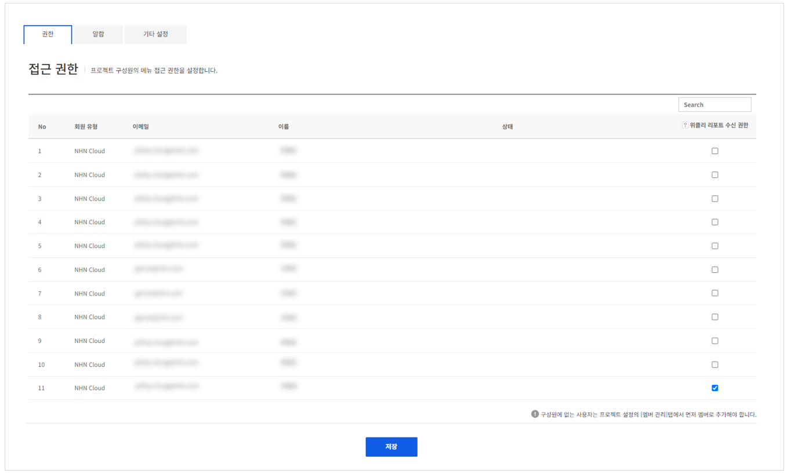

## Game > Gamebase > 콘솔 사용 가이드 >  관리

Gamebase를 사용하는 게임에 대한 조회 권한 관리, 알람 발송 설정, 알람에 대한 내역 조회 등의 기능을 사용할 수 있습니다.

## Authorization

Gamebase Console 사용 권한을 관리할 수 있습니다.

<!-- LLM_Image_DESC_20260408_191856
    유형: Screenshot
    내용: Gamebase 관리 콘솔 Authorization 화면 #01
    구성: Gamebase 관리 콘솔의 Authorization 기능 설정/조회 화면 스크린샷
    Keyword: 관리, Console, Screenshot, Authorization
-->

* Gamebase Console 사용 권한 관리
  * **위클리 리포트 수신 권한** : **위클리 리포트** 수신에 대한 권한
* 새 멤버를 등록하려면 NHN Cloud 프로젝트 멤버관리에서 추가해야 합니다.
* 자기 자신의 권한은 수정할 수 없습니다.
