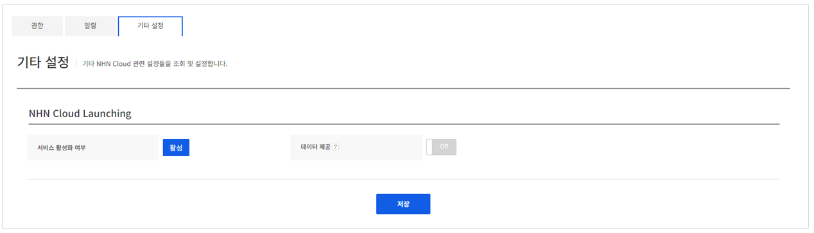

## Config

Gamebase와 NHN Cloud 서비스의 연동 관련 설정을 할 수 있습니다.

<!-- LLM_Image_DESC_20260408_185735
    유형: Screenshot
    내용: Gamebase 관리 콘솔 Config 화면 #08
    구성: Gamebase 관리 콘솔의 Config 기능 설정/조회 화면 스크린샷
    Keyword: 관리, Console, Screenshot, Config
-->

NHN Cloud Launching에 설정한 정보를 Gamebase Launching API 호출 시에 함께 전달받을지를 설정할 수 있습니다. NHN Cloud Launching 서비스를 사용하는 경우에만 기능을 On, Off할 수 있습니다.
