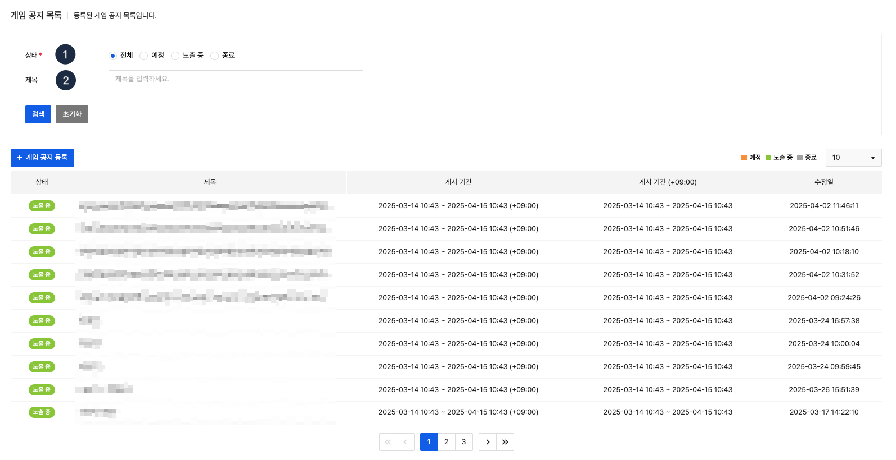
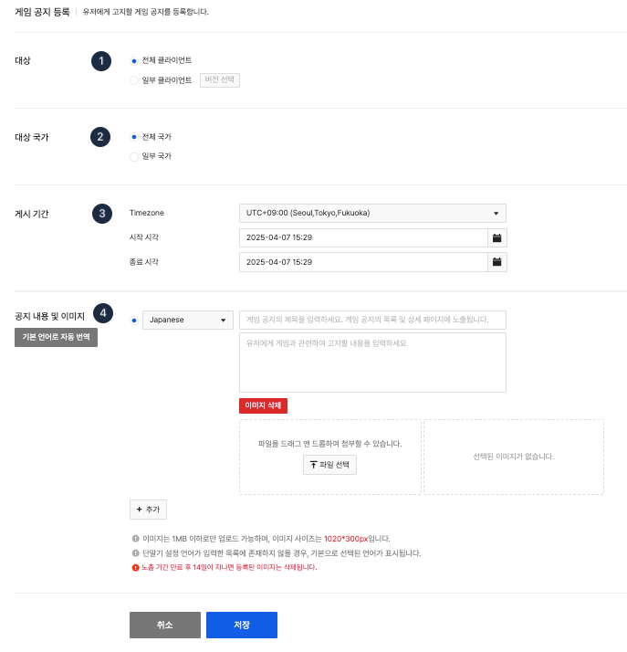
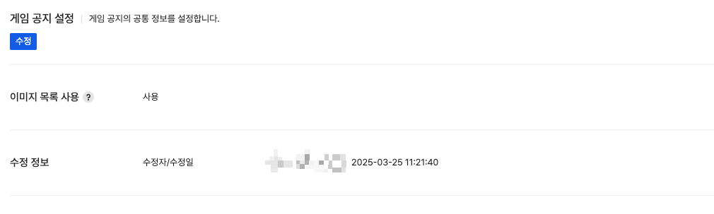

## Game notice

콘솔에 게임 공지를 등록하여 게임 내에 이미지와 공지를 같이 제공할 수 있습니다.
등록된 게임 공지 정보를 한눈에 확인할 수 있으며, **노출 중** 상태인 게임 공지의 등록 일자 기준으로 게임 내에 게임 공지 목록이 표시됩니다.
게임 공지 메시지의 게시 상태와 제목으로 게임 공지 검색이 가능합니다. 

<!-- LLM_Image_DESC_20260406
    유형: Screenshot
    내용: Gamebase 운영 - 게임 공지 목록 화면
    구성: 상단에 '게임 공지 목록' 제목과 등록/게임 공지 설정 버튼이 있음. 상태, 제목, 게시 시간, 게시 시간(+09:00), 수정일 컬럼으로 구성된 게임 공지 이력 테이블이 배치되어 있으며, 상태 배지(예정, 노출 중, 종료)와 페이지네이션이 있음
    Keyword: 게임 공지, 목록, 예정, 노출 중, 종료, 게시 시간
-->

(1) **상태**: 게임 내 게임 공지의 게시 상태를 기준으로 게임 공지 목록 검색이 가능합니다.
  - 예정: 게임 공지가 노출될 예정
  - 노출 중: 게임 공지 노출 중
  - 종료: 게임 공지 노출 종료

 (2) **제목**: 기본으로 선택된 언어의 게임 공지 제목을 포함하는 게임 공지 목록 검색이 가능합니다.

#### properties
각 항목에 표시되는 내용은 아래와 같습니다.

- **상태**: 실제로 게임 내에 보여지는 게임 공지의 상태를 보여줍니다.
- **제목**: 기본으로 선택된 언어의 게임 공지 제목을 보여줍니다.
- **게시 시간**: 게임 공지가 노출되는 시간을 표시합니다. 설정 시 등록자가 선택한 시간과 타임존 정보를 보여줍니다.
- **게시 시간(+09:00)**: 게임 공지가 노출되는 시간 정보를 한국 시각 기준(+09:00)으로 변경하여 보여줍니다.
- **수정일**: 게임 공지가 최종적으로 수정된 시각을 보여줍니다.

### Register Game notice

<!-- LLM_Image_DESC_20260406
    유형: Screenshot
    내용: Gamebase 운영 - 게임 공지 등록 화면
    구성: 대상(전체/일부 클라이언트), 대상 국가(전체/일부), 게시 기간(Timezone, 시작/종료 시각), 공지 내용 및 이미지(다국어별 제목, 내용, 이미지 업로드, 이미지 삭제) 설정 영역이 순서대로 배치됨. 하단에 취소, 저장 버튼이 있음
    Keyword: 게임 공지, 등록, 대상, 게시 기간, 이미지 업로드
-->

**게임 공지** 목록에서 **등록** 버튼을 선택하면 게임 공지를 등록할 수 있습니다.

#### (1) 대상

게임 공지를 노출할 대상을 선택합니다.

- 전체 게임: 모든 클라이언트 버전에 노출이 필요한 경우 선택합니다.
- 일부 클라이언트: 특정 클라이언트 버전에만 노출이 필요한 경우 선택합니다. **버전 선택**을 클릭하면 클라이언트 메뉴에서 등록한 클라이언트 버전 목록이 출력됩니다.
   **일부 클라이언트 선택 화면 예시**
   클라이언트 상태 및 스토어별 전체 선택이 가능하며, 노출을 원하는 클라이언트 버전을 선택한 뒤 **확인**을 클릭합니다.
  
<!-- LLM_Image_DESC_20260406
    유형: UI
    내용: Gamebase 운영 - 대상 클라이언트 선택 팝업
    구성: 스토어별(App Store, Google Play 등) 각 상태의 버전 번호를 체크박스로 선택할 수 있는 테이블이 배치됨. 하단에 취소/확인 버튼이 있음
    Keyword: 대상 클라이언트, 스토어, 버전 선택, 체크박스, 팝업
-->

#### (2) 대상 국가
공지를 노출할 국가를 선택합니다.

- 전체 국가: 모든 게임 유저에게 노출
- 일부 국가: 선택한 국가의 유저에게만 공지 노출
  추가하고자 하는 국가 코드를 입력하면 자동으로 완성되어 입력됩니다. 입력하고자 하는 국가 코드가 없는 경우 [고객 센터](https://toast.com/support/inquiry)로 연락 주시기 바랍니다.

> [참고]
>
> 국가 판단 기준
> 사용자의 **USIM** 국가 코드 기준으로 판단하며 USIM이 없을 경우 **단말기**에 설정되어 있는 국가를 기준으로 공지가 노출됩니다.

#### (3) 게시 기간
등록된 게임 공지가 게임 내에 노출될 시간을 설정합니다.
타임존의 경우 기본적으로 'UTC+09:00'가 선택되어 있으며, 서비스를 하는 국가의 시간대를 선택해 점검을 등록하는 것도 가능합니다.

#### (4) 공지 내용 및 이미지
게임 내에 노출할 공지 내용과 이미지를 등록합니다.
언어별로 노출하고자 하는 공지 내용과 이미지를 설정할 수 있으며 단말기의 언어에 맞게 공지 내용과 이미지가 노출됩니다.
등록 가능한 파일 형식은 **PNG, JPG, JPEG, JPE**이며 크기는 최대 1MB를 넘을 수 없고 등록 가능한 이미지의 사이즈는 **1020x300**(Landscape, Portrait)입니다. 
등록된 이미지는 게임 내의 가로, 세로 이미지 비율을 유지하여 전체 이미지를 노출합니다.

> [참고]
>
> 업로드한 이미지는 게임 공지의 노출 기간 만료 후 14일이 지나면 자동으로 삭제됩니다.

### Modify Game notice

등록한 게임 공지의 상세 내용을 확인하고 수정, 삭제가 가능합니다.
이미지를 교체하고자 할 경우 수정 화면에서 다시 등록할 수 있으며 그 외에도 게임 공지의 게시 기간이나 노출 대상 등을 수정할 수 있습니다.
등록된 게임 공지와 유사한 내용으로 게임 공지를 새로 등록하고자 하는 경우 복사 기능을 통해 이미지만 새롭게 업로드하여 등록할 수 있습니다.

> [참고]
>
> 업로드한 이미지는 게임 공지의 노출 기간 만료 후 14일이 지나면 자동으로 삭제됩니다.

### Modify Game notice Setting

<!-- LLM_Image_DESC_20260406
    유형: Screenshot
    내용: Gamebase 운영 - 게임 공지 설정 화면
    구성: '게임 공지 설정' 제목과 수정 버튼이 있음. 이미지 목록 사용 여부(사용)와 수정 정보(수정자/수정일) 항목이 표시됨
    Keyword: 게임 공지 설정, 이미지 목록 사용, 수정 정보
-->

게임 공지의 기본적인 설정을 할 수 있으면, 설정한 정보는 모든 게임 공지에 일괄 적용됩니다.
- 이미지 목록 사용: 이미지 목록 사용 시 게임 공지에 등록한 이미지가 게임 내의 목록 화면에서도 노출됩니다.
