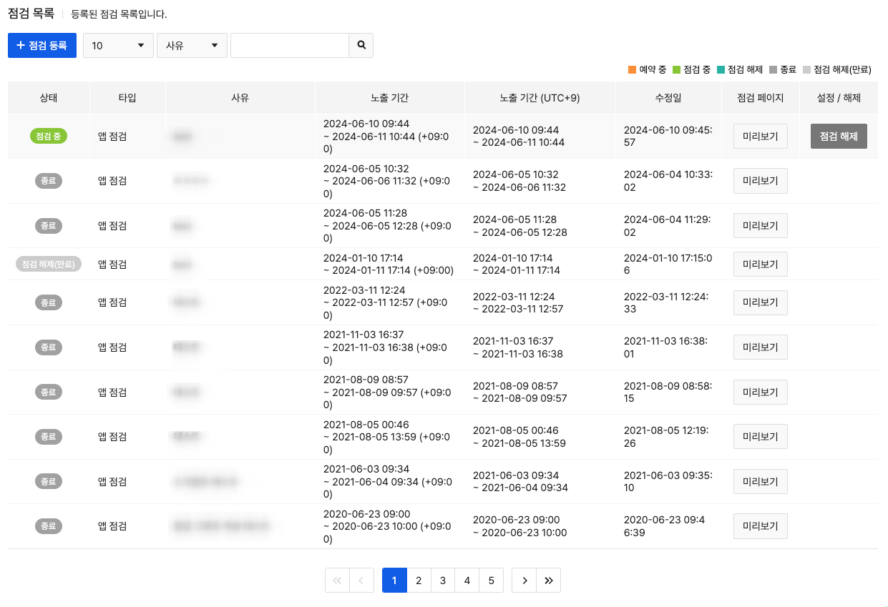
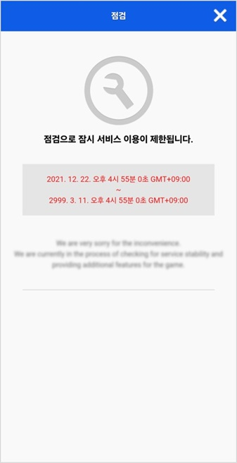
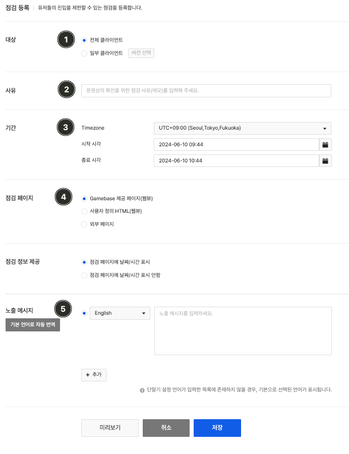
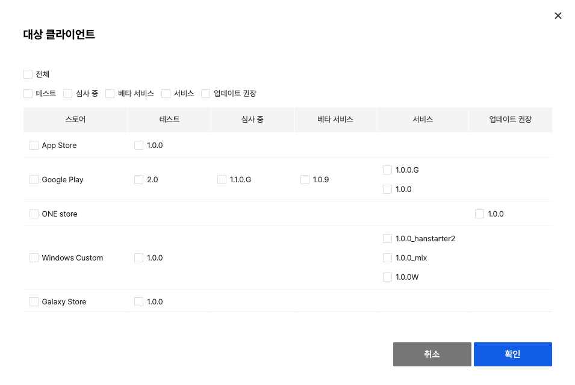
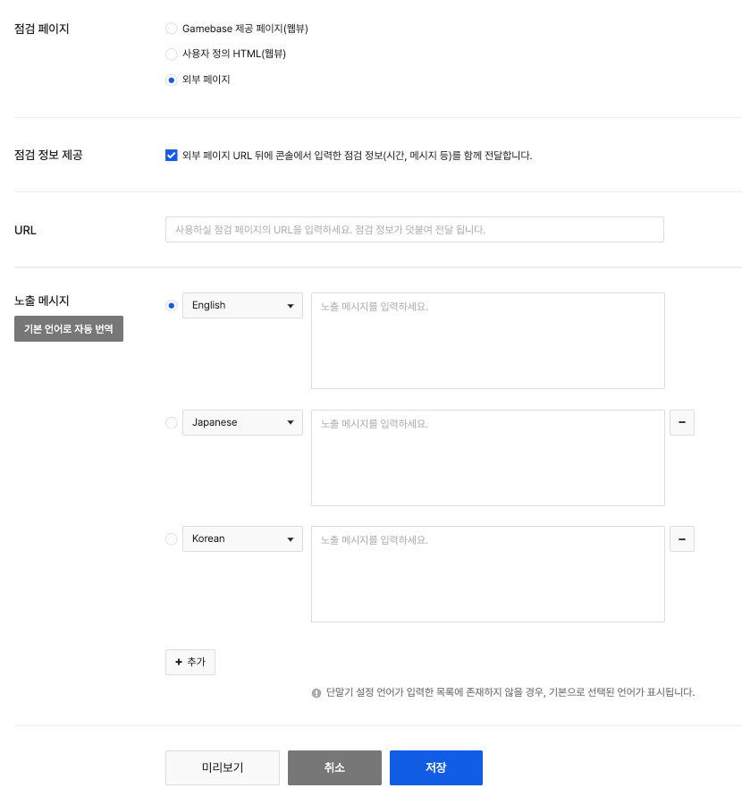

## Game > Gamebase > 콘솔 사용 가이드 > 운영

앱 운영 시 필요한 기능들을 제공하는 메뉴입니다.

* 점검(Maintenance): 앱 점검 관리
* 점검 공지(Notice): 게임 유저에게 팝업 형태로 제공하는 긴급 공지 관리
* 게임 공지(Game notice): 게임 유저에게 팝업 형태로 제공하는 게임 공지 관리
* 이미지 공지(Image notice): 게임 유저에게 이미지 형태로 제공하는 이미지 공지 관리
* 킥 아웃(Kick out): 앱을 사용하는 유저의 연결을 해제

## Maintenance

<!-- LLM_Image_DESC_20260406
    유형: Screenshot
    내용: Gamebase 운영 - 점검 목록 화면
    구성: 상단에 '점검 목록' 제목과 등록 버튼이 있음. 상태, 사유, 시간, 노출 시간, 등록 일시, 수정 일시 컬럼으로 구성된 점검 이력 테이블이 배치되어 있으며, 상태 배지(예약중, 점검중, 종료, 점검해제 등)와 페이지네이션이 있음
    Keyword: 점검 목록, 점검 상태, 예약중, 점검중, 종료, 점검해제
-->

게임 점검이 필요한 경우 Console에서 손쉽게 등록할 수 있습니다.
등록한 앱 점검 내역 조회와 점검 등록 내용 및 진행 상태 등을 한눈에 확인할 수 있으며 등록된 점검 사유로 점검 검색이 가능합니다.
점검 상태는 아래와 같이 다섯 가지로 구분됩니다.

(1) 예약중: 점검이 진행될 예정
(2) 점검중: 현재 점검 진행 중
(3) 종료: 점검 시간 종료
(4) 점검해제: 점검이 진행 중인 상태에서 운영자가 **점검해제**를 한 경우
(5) 점검 해제(기한만료): **점검해제** 상태에서 점검 시간이 종료되는 경우

Gamebase에서는 점검진행 중 게임내에서 사용자에게 보여줄 점검팝업과 상세페이지를 제공하고 있습니다.
Gamebase에서 기본으로 제공하는 점검 팝업

<!-- LLM_Image_DESC_20260406
    유형: UI
    내용: Gamebase 기본 점검 팝업 화면
    구성: 'Maintenance' 제목과 "This service is unavailable during maintenance. We'll be back soon!" 메시지가 표시된 팝업 카드가 중앙에 배치됨. 하단에 'SHOW DETAIL' 링크가 있음
    Keyword: 점검 팝업, Maintenance, 서비스 불가, 기본 팝업
-->
Gamebase에서 기본으로 제공하는 점검 페이지(점검 사유와 점검 시간 표시)

<!-- LLM_Image_DESC_20260406
    유형: UI
    내용: Gamebase 기본 점검 상세 페이지 (모바일 웹뷰)
    구성: 상단에 '점검' 제목과 닫기(X) 버튼이 있음. 렌치 아이콘과 '점검으로 잠시 서비스 이용이 제한됩니다.' 메시지가 표시됨. 점검 시작/종료 시간이 GMT+09:00 기준으로 표시되며, 하단에 점검 사유 안내 메시지가 있음
    Keyword: 점검 페이지, 점검 시간, 서비스 제한, 모바일 웹뷰
-->

### Register Maintenance

**점검** 탭에서 **등록** 버튼을 클릭하면 점검을 등록하는 화면으로 이동합니다.

<!-- LLM_Image_DESC_20260406
    유형: Screenshot
    내용: Gamebase 운영 - 점검 등록 화면
    구성: 대상(전체/일부 클라이언트), 사유 입력란, 기간(Timezone, 시작/종료 시각), 점검 페이지(Gamebase 제공/사용자 HTML/외부 페이지), 점검 정보 제공, 노출 메시지(다국어) 입력 영역이 순서대로 배치됨. 하단에 미리보기, 취소, 저장 버튼이 있음
    Keyword: 점검 등록, 대상 선택, 기간 설정, 점검 페이지, 노출 메시지
-->

>  [주의]  
>  
>  **업데이트 필수와 점검이 동시에 설정**돼 있을 경우 서비스 상태는 '업데이트 필수'가 됩니다.
>  점검 진행 도중 사용자에게 업데이트 필수 팝업을 표시하고 싶지 않다면 점검 완료 이후에 서비스 상태를 '업데이트 필수'로 변경해야 합니다.

#### (1) 대상
점검을 진행할 대상을 선택합니다.

- 전체 게임 : 모든 클라이언트 버전에 점검이 필요한 경우 선택합니다.
- 일부 클라이언트 : 특정 클라이언트 버전에만 점검이 필요한 경우 선택합니다. '버전 선택'버튼을 클릭하면 클라이언트 메뉴에서 등록한 클라이언트 버전리스트가 출력됩니다.
   **일부 클라이언트 선택 화면 예시**
   클라이언트 상태 및 스토어별 전체 선택이 가능하며, 점검을 원하는 클라이언트 버전을 선택 후 확인 버튼을 누르면 됩니다.

<!-- LLM_Image_DESC_20260406
    유형: UI
    내용: Gamebase 운영 - 대상 클라이언트 선택 팝업
    구성: '대상 클라이언트' 제목 아래에 전체, 테스트, 심사 중, 베타 서비스, 서비스, 업데이트 권장 체크박스가 있음. 스토어별(App Store, Google Play, ONE store, Windows Custom, Galaxy Store) 각 상태의 버전 번호를 체크박스로 선택할 수 있는 테이블이 배치됨. 하단에 취소/확인 버튼이 있음
    Keyword: 대상 클라이언트, 스토어, 버전 선택, 체크박스, 팝업
-->

#### (2) 사유
점검이 진행되는 사유를 입력합니다.
이 입력정보는 게임 유저에게 노출되지 않으며 해당 점검을 등록하는 간단한 사유에 대하여 입력하시면 됩니다.

#### (3) 시간
점검이 진행될 시간을 설정합니다.
타임존의 경우 기본적으로 'UTC+09:00'가 선택돼 있으며, 서비스를 하는 국가의 시간대를 선택해 점검을 등록하는 것도 가능합니다.

#### (4) 점검 페이지
사용자에게 제공할 점검 페이지 유형을 설정합니다.
**Gamebase 제공 페이지(웹뷰)**, **사용자 정의 HTML(웹뷰)**, **외부 페이지** 중 선택할 수 있으며 각 항목별로 입력 창이 달라집니다.
각 항목에 대한 추가 입력 항목은 아래와 같습니다. 입력한 내용은 **미리보기**를 클릭해 확인할 수 있습니다.

##### 4-1) Gamebase 제공 페이지(웹뷰)
기본으로 제공되는 형식의 점검 페이지로, Gamebase에서 제공하는 웹뷰 페이지에 운영자가 입력한 정보를 표시합니다.
별도의 점검 페이지가 없는 경우 유용하게 사용할 수 있습니다.
**노출 메시지**에는 점검 진행 중에 사용자에게 표시할 메시지를 입력합니다.
메시지는 영어, 일어, 중국어 등 외국어로도 입력할 수 있으며, 등록된 언어 중에 선택된 언어는 '기본 언어'로 설정됩니다.
등록된 메시지 중에 매칭되는 언어가 없는 사용자에게는 '기본 언어'로 선택된 언어가 표시됩니다. 오른쪽의 **+** 버튼을 클릭하면 언어를 추가할 수 있으며 원하는 언어가 없는 경우 [고객 센터](https://toast.com/support/inquiry)로 연락 주시면 새로운 언어를 추가할 수 있습니다.
**미리보기**를 클릭하면 '기본 언어'로 된 미리보기 화면을 확인할 수 있습니다.

##### 4-2) 사용자 제공 HTML(웹뷰)
운영자가 직접 점검 페이지를 HTML 형식으로 입력하여 사용자에게 제공합니다.
입력한 HTML 태그를 기반으로 미리보기 페이지도 함께 지원합니다.
원하는 점검 페이지 형식을 만들고자 할 때 유용하게 사용할 수 있습니다.

##### 4-3) 외부 페이지

<!-- LLM_Image_DESC_20260406
    유형: Screenshot
    내용: Gamebase 운영 - 점검 페이지 설정 (외부 페이지 옵션)
    구성: 점검 페이지 유형으로 외부 페이지가 선택된 상태. 점검 정보 제공 체크박스, URL 입력란, 노출 메시지 다국어(English, Japanese, Korean) 입력 영역이 있으며, 하단에 미리보기, 취소, 저장 버튼이 배치됨
    Keyword: 외부 페이지, 점검 페이지, URL, 노출 메시지, 다국어
-->
자체 점검 페이지 또는 점검 템플릿을 가지고 있을 경우 점검 페이지를 해당 URL로 연결할 수 있습니다.
연결하는 URL의 미리보기 페이지도 함께 지원합니다.
점검 정보를 별도로 입력하여 점검 정보를 전달받고 싶은 경우 **점검 정보 제공** 항목을 선택하고 **노출 메시지**에 메시지를 입력합니다. 점검 페이지에 Gamebase 점검 내용에 등록한 점검 정보(점검 시간 정보, 메시지 등)를 전달받을 수 있습니다.
점검 전달 파라미터는 다음과 같습니다. 모두 URL 인코딩되어 전달됩니다.

- message: 디바이스 정보에서 설정한 언어에 따른 점검 메시지. 미리보기의 경우 기본으로 선택된 메시지가 전달됨
- timezone: 점검 등록 시 선택한 표준 시간대 정보 예) UTC+9의 경우 전달 값 - +09:00
- beginDate: 점검 등록 시 입력한 시작 시간
- endDate: 점검 등록 시 입력한 종료 시간

#### (5) 노출 메시지
점검 시 보여질 메시지를 설정합니다.
'기본 언어로 자동 번역'버튼을 선택할 경우 기본언어로 입력된 내용을 기반으로 내용을 번역하여 각 항목에 설정된 언어에 맞게 내용이 입력됩니다.

### Modify Maintenance

등록한 점검의 상세내용을 확인하고 수정, 삭제가 가능합니다.
기본적으로 입력 항목은 등록 화면과 동일하며, 점검을 잘못 등록하였을 때 삭제버튼을 통하여 점검 삭제도 가능합니다.
유사한 내용으로 점검을 다시 등록하고자 하는 경우 복사기능을 통하여 점검을 쉽게 등록 하실 수 있습니다.
