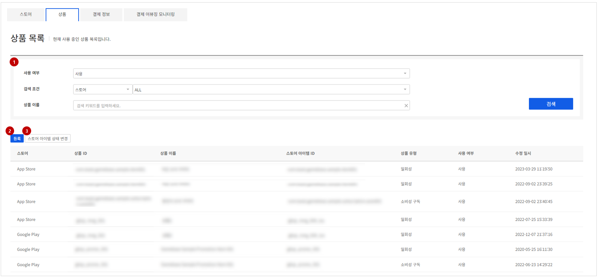
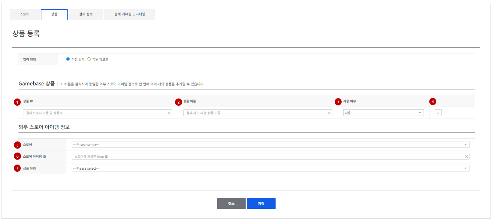
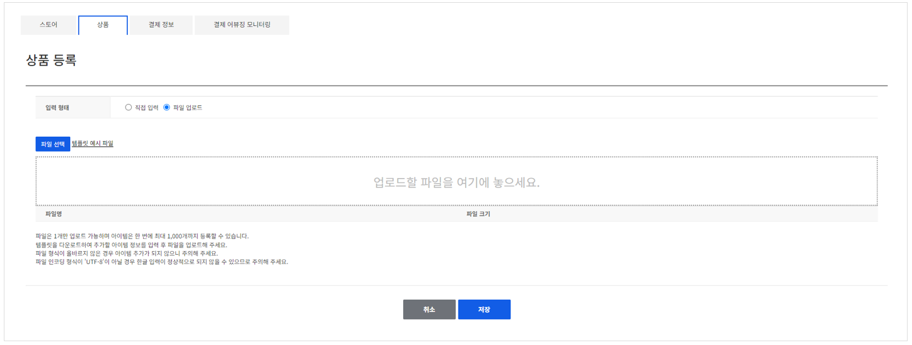
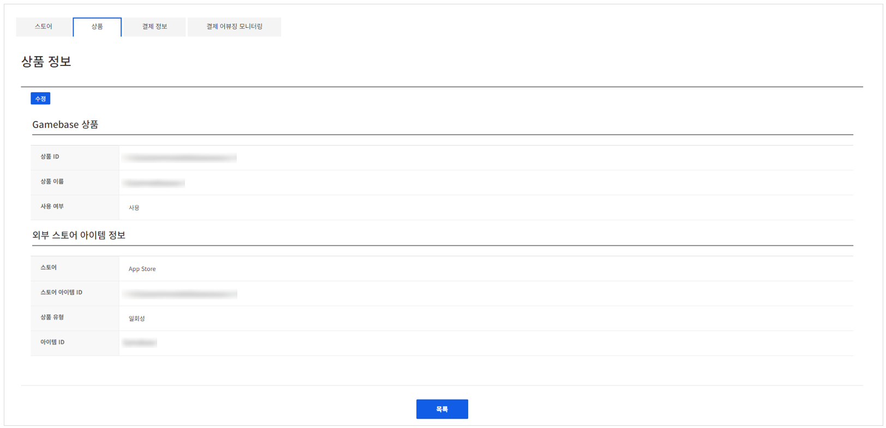

## Product

스토어에서 판매할 상품을 등록할 수 있습니다.
**상품** 탭에서 새 상품을 등록하거나 이미 등록한 상품을 관리할 수 있습니다.

- (1) **필터** : 사용여부, 스토어/스토어 아이템 ID/상품 ID, 상품 이름 필터를 제공하여 검색을 편리하게 할 수 있습니다. 검색값이 없을 경우 모든 스토어의 상품 목록이 노출됩니다.
- (2) **등록** : 하나의 스토어 아이템 ID를 이용해 여러개의 상품을 등록할 수 있습니다.
- (3) **스토어 아이템 상태 변경** : 하나의 스토어 아이템 ID로 등록된 상품들의 사용 여부를 한번에 변경할 수 있습니다.

<!-- LLM_Image_DESC_20260408_185735
    유형: Screenshot
    내용: Gamebase 결제 콘솔 Product 화면 #05
    구성: Gamebase 결제 콘솔의 Product 기능 설정/조회 화면 스크린샷
    Keyword: 결제, Console, Screenshot, Product
-->

### Register

새로운 상품을 등록하려면 **상품 목록** 화면의 **등록** 버튼을 클릭합니다.
#### 1. 직접 입력을 이용한 등록 방법

<!-- LLM_Image_DESC_20260408_185735
    유형: Screenshot
    내용: Gamebase 결제 콘솔 1. 직접 입력을 이용한 등록 방법 화면 #06
    구성: Gamebase 결제 콘솔의 1. 직접 입력을 이용한 등록 방법 기능 설정/조회 화면 스크린샷
    Keyword: 결제, Console, Screenshot, 1. 직접 입력을 이용한 등록 방법
-->

* (1) **상품 ID** : 결제 요청시 사용 할 상품 ID를 입력합니다. 해당 ID를 통해 SDK에서 구매 API를 호출해야 입력한 상품으로 구매가 진행됩니다.
* (2) **상품 이름** : 결제 되는 상품의 이름을 입력합니다. 이 곳에 입력한 내용을 기반으로 결제 내역 조회 및 지표에서 해당 상품명이 표시됩니다.
* (3) **사용 여부** : 상품의 사용 여부를 선택합니다. SDK에서 상품목록 요청시 사용여부가 'USE'로 선택된 상품들만 상품 목록으로 전달됩니다.
* (4) **상품 추가** : 추가 상품을 등록하고자 할 때 **+** 버튼을 선택하면 상품 입력란이 추가됩니다.
* (5) **스토어** : 등록하고자 하는 외부 스토어를 선택합니다.  등록하려는 스토어가 없다면 **스토어** 메뉴에서 먼저 스토어를 등록해야 합니다.
* (6) **스토어 아이템 ID** : 스토어 등록 후 발급 받은 ID 정보를 입력합니다. Gamebase 상품에 등록된 목록은 선택한 스토어에 결제 요청 시 이 부분에 입력한 내용을 이용하여 결제가 이루어집니다.
* (7) **스토어 아이템 유형**  등록하고자 하는 상품 유형을 선택합니다. Google play, App store의 경우 구독 아이템 등록이 가능하며 그 외의 스토어를 선택할 경우 일회성 아이템으로 등록됩니다.

#### 2. 파일 업로드를 이용한 등록 방법

<!-- LLM_Image_DESC_20260408_185735
    유형: Screenshot
    내용: Gamebase 결제 콘솔 2. 파일 업로드를 이용한 등록 방법 화면 #07
    구성: Gamebase 결제 콘솔의 2. 파일 업로드를 이용한 등록 방법 기능 설정/조회 화면 스크린샷
    Keyword: 결제, Console, Screenshot, 2. 파일 업로드를 이용한 등록 방법
-->

* 파일 업로드를 통해 상품 등록을 진행할 수 있습니다.
* 파일 업로드를 통한 상품 등록은 한 번에 최대 1,000개까지 가능합니다.
* 입력 형식이 올바르지 않은 경우 상품 등록이 진행되지 않으므로 입력 형식에 주의해야 합니다.
* 파일의 인코딩 형식이 'UTF-8'이 아닐 경우 한글 입력이 정상적으로 등록되지 않으므로 주의해야 합니다.
* 파일 등록에 실패하였을 경우 결과창의 **다운로드**항목을 통해 실패한 목록을 다운받아 확인할 수 있습니다.

### Modify

조회 목록에서 등록된 상품의 상세 정보를 조회하거나 정보를 변경할 수 있습니다.

<!-- LLM_Image_DESC_20260408_185735
    유형: Screenshot
    내용: Gamebase 결제 콘솔 Modify 화면 #08
    구성: Gamebase 결제 콘솔의 Modify 기능 설정/조회 화면 스크린샷
    Keyword: 결제, Console, Screenshot, Modify
-->
- 조회 목록에서 각 아이템을 선택하면 등록된 아이템의 상세 정보를 조회할 수 있습니다.
- **수정** 버튼을 클릭하면 스토어와 아이템 번호 및 상품 유형을 제외한 나머지 정보를 변경할 수 있습니다.
- 수정이 가능한 항목은 **상품 이름**, **사용 여부**, **스토어 아이템 ID** 항목이며 그 외의 항목은 수정할 수 없으므로 등록 시 주의가 필요합니다.
- **스토어 아이템 ID**는 이미 등록된 다른 **스토어 아이템 ID**로만 수정이 가능하며, 신규 **스토어 아이템 ID**는 상품 등록해야 합니다.
