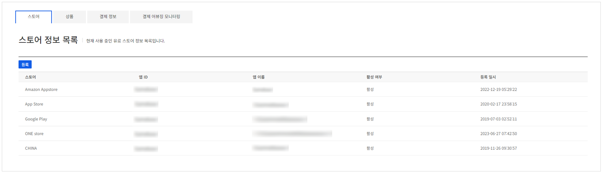
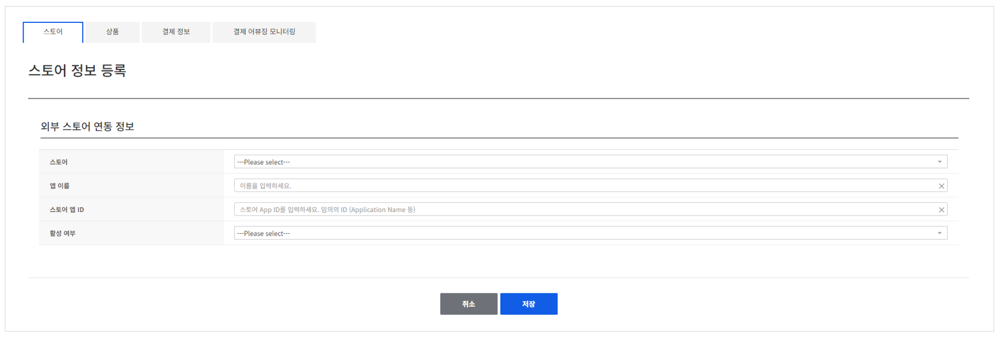
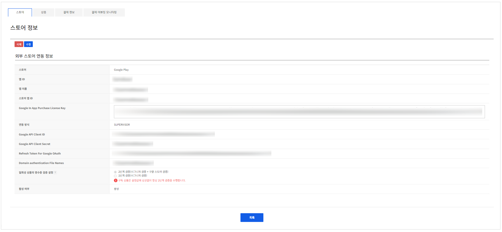

## Store

게임 내에서 상품을 판매하기 위해 스토어를 등록합니다.
**Store** 탭의 **스토어 정보 리스트**에서 새 스토어를 등록하거나 이미 등록한 스토어를 관리할 수 있습니다.

<!-- LLM_Image_DESC_20260406
    유형: Screenshot
    내용: Gamebase IAP - 스토어 정보 목록 화면
    구성: 상단에 스토어, 상품, 결제 정보, 결제 어뷰징 모니터링 탭이 있음. '스토어 정보 목록' 제목과 등록 버튼이 있고, 스토어, 앱 ID, 앱 이름, 활성 여부, 등록 일시 컬럼으로 구성된 스토어 목록 테이블이 배치됨
    Keyword: 스토어 목록, IAP, App Store, Google Play, ONE store
-->

### Register

새로운 스토어를 등록하려면 **스토어 정보 리스트** 화면의 **등록** 버튼을 클릭합니다.

<!-- LLM_Image_DESC_20260406
    유형: Screenshot
    내용: Gamebase IAP - 스토어 정보 등록 화면
    구성: '스토어 정보 등록' 제목 아래에 외부 스토어 연동 정보 섹션이 있음. 스토어 선택 드롭다운, 앱 이름, 스토어 앱 ID, 활성 여부 입력 필드가 배치됨. 하단에 취소/저장 버튼이 있음
    Keyword: 스토어 등록, 외부 스토어, 앱 이름, 스토어 앱 ID
-->

* **스토어**  등록하고자 하는 외부 스토어를 선택합니다.  등록하고자 하는 스토어가 없다면, [고객센터](https://toast.com/support/inquiry)로 연락주시기 바랍니다.
* **앱 이름**   등록하고자 하는 게임의 이름을 입력합니다.
* **스토어 앱 ID**   스토어에서 발급 받은 정보를 입력합니다.
* **사용 여부**  스토어 사용 여부를 선택합니다.

> [참고] Google Play Store의 영수증 검증
>
> 구글 영수증 검증 시스템 장애시 **일회성 상품의 영수증 검증 설정**을 1단계 검증으로 하여, Gamebase 내부적인 시그니쳐 검증만으로 정상적인 결제가 가능합니다.
> 구독 상품은 설정값에 상관없이 항상 2단계 검증을 수행합니다.

### Modify

조회 목록에서 등록된 스토어의 상세 정보를 조회하거나 정보를 변경할 수 있습니다.

<!-- LLM_Image_DESC_20260406
    유형: Screenshot
    내용: Gamebase IAP - 스토어 정보 상세 화면
    구성: '스토어 정보' 제목 아래에 삭제/수정 버튼이 있음. Gamebase 상품 섹션에 스토어(Google Play), 앱 ID, 앱 이름, 스토어 앱 ID, Google In App Purchase License Key, 연동 방식(SUPERVISOR), Google API Client ID/Secret, Refresh Token 등의 상세 정보가 표시됨. 하단에 목록 버튼이 있음
    Keyword: 스토어 상세, Google Play, License Key, API Client, 연동 정보
-->

- 조회 목록에서 등록된 스토어를 선택하면 상세 정보를 조회할 수 있습니다.
- **수정** 버튼을 클릭하면 스토어 앱 ID를 제외한 앱 이름, 스토어 앱, 사용 여부 정보를 수정할 수 있습니다.
- **삭제** 버튼을 클릭하면 스토어의 정보를 삭제할 수 있습니다. 단, 사용여부가 미사용인 스토어 삭제만 가능합니다.
