## Transactions

결제 정보를 조회할 수 있습니다.
원하는 검색 유형을 선택하여 원하는 결제 정보를 편리하게 조회할 수 있습니다.
결제 내역 조회 결과는 오른쪽 상단의 **다운로드** 버튼을 클릭해 언제든지 다운로드할 수 있습니다.

### Transaction Status Code
결제 상태 코드는 사용자가 결제를 진행하는 과정에서 발생한 상황을 나타내는 코드입니다.  

> [참고]
> 결제 처리 과정은 크게 4단계로 구분합니다.
> 
> [예약] - [결제] - [검증] - [완료]
> 
> - 예약: 사용자의 결제를 준비하는 단계로 결제에 필요한 정보를 Gamebase에 전달하는 과정
> - 결제: 마켓에 결제를 진행하는 과정
> - 검증: 마켓으로부터 전달 받은 결과를 검증하는 과정
> - 완료: 검증 완료 후에 마켓별로 필요한 마무리하는 과정

- 결제 예약 완료: [예약] 단계가 완료된 상태
- 결제 검증 실패: [검증] 단계에서 검증이 실패한 상태
- 결제 검증 완료: [검증] 단계가 완료된 상태
- 결제 완료: 모든 결제 과정이 끝난 상태
- 환불 완료: 사용자 혹은 운영자에 의해 환불된 상태
- 진행 중 취소: 사용자가 결제 진행 중에 취소한 상태

> [참고]
> **결제 예약 완료** 상태는 다음과 같은 사유로 발생할 수 있습니다.
> - 결제 창에서 사용자가 결제를 취소한 경우
> - 결제 진행 중에 사용자가 앱을 종료하는 경우
> - 결제 진행 중에 마켓으로부터 응답을 받지 못한 경우(일시적인 마켓 장애, 사용자 네트워크 단절 등)
> - 마켓에서 결제 처리가 완료되지 않은 동일한 상품을 구매하려는 경우
> 
> 
> **결제 검증 완료** 상태에서 변경이 없다면 고객 센터로 문의 주시기 바랍니다.

### 결제 내역 조회
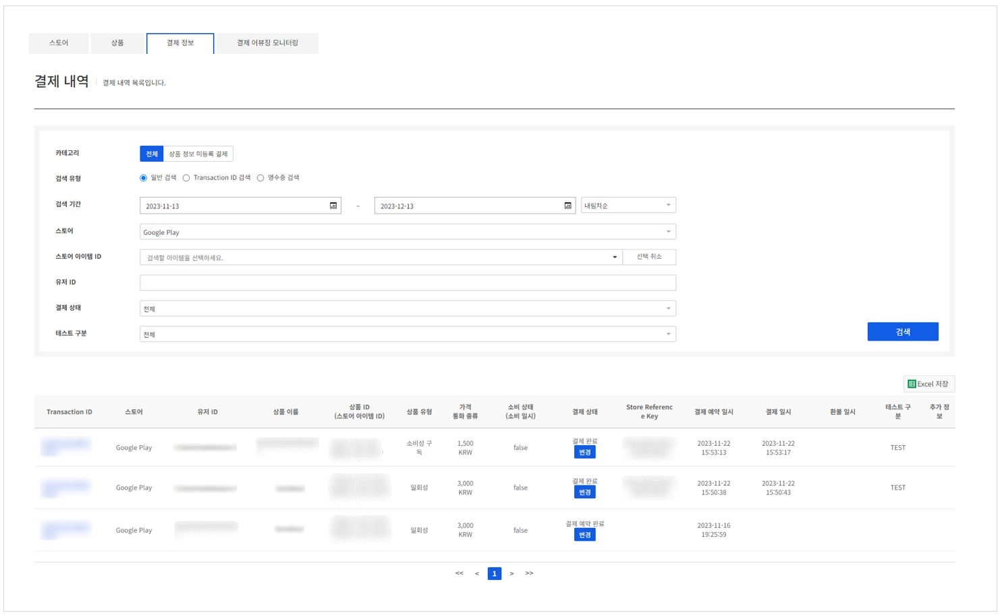
<!-- LLM_Image_DESC_20260406
    유형: Screenshot
    내용: Gamebase IAP - 결제 내역 조회 화면
    구성: 상단에 결제 정보 탭이 선택되어 있고, 카테고리(전체/상품 정보 미등록 결제), 검색 유형(일반/Transaction ID/영수증), 검색 기간, 스토어, 스토어 아이템 ID, 유저 ID, 결제 상태 등 검색 필터가 있음. 하단에 결제 내역 테이블이 배치됨
    Keyword: 결제 내역, 조회, 검색 필터, Transaction ID, 결제 상태
-->

#### 카테고리

결제 내역은 2가지 카테고리로 조회할 수 있습니다.

- **전체**: 모든 결제 내역을 조회
- **상품 정보 미등록 결제**: 결제는 완료되었지만 상품 정보가 누락되어 아이템 지급이 불가능한 결제 내역을 조회 

#### Search conditions
선택한 검색 유형에 따라 검색 항목이 다르게 표시됩니다.

##### (1) 일반 검색
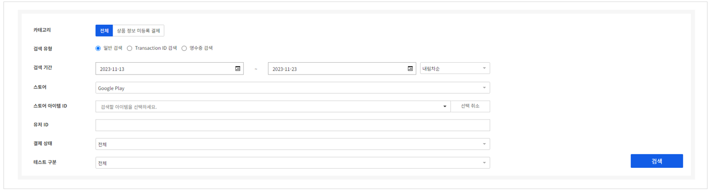
<!-- LLM_Image_DESC_20260406
    유형: Screenshot
    내용: Gamebase IAP - 일반 검색 조건 화면
    구성: 카테고리(전체), 검색 유형(일반 검색 선택), 검색 기간 날짜 선택, 스토어(Google Play), 스토어 아이템 ID, 유저 ID, 결제 상태, 테스트 구분 필터와 검색 버튼이 배치됨
    Keyword: 일반 검색, 검색 기간, 스토어, 유저 ID, 결제 상태
-->

아래의 검색 조건을 만족하는 결과를 검색할 수 있습니다.
- **검색 기간**: 사용자가 구입을 시도한 기간. 오른쪽의 내림차순/오름차순 항목을 통해 정렬을 선택할 수 있음
- **스토어**: 검색하고자 하는 스토어 정보
- **스토어 아이템 ID** : 스토어에 등록한 후 발급 받은 ID 정보
- **아이템** : 검색하고자 하는 아이템을 선택
- **유저 ID**: 결제한 사용자 ID
- **결제 상태**: 검색하고자 하는 결제 상태 기준

##### (2) Trnasaction ID 검색
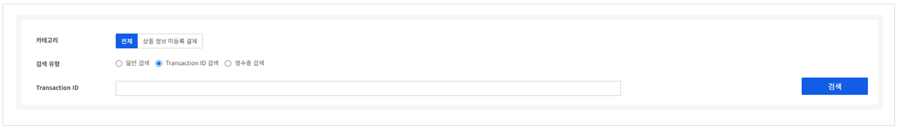
<!-- LLM_Image_DESC_20260406
    유형: Screenshot
    내용: Gamebase IAP - Transaction ID 검색 화면
    구성: 카테고리(전체), 검색 유형(Transaction ID 검색 선택), Transaction ID 입력란과 검색 버튼이 배치됨
    Keyword: Transaction ID, 검색, 결제 조회
-->

결제 시 생성되는 Transaction ID를 이용해 검색할 수 있습니다.

##### (3) 영수증 검색
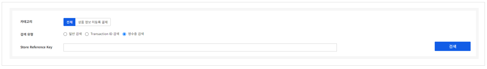
<!-- LLM_Image_DESC_20260406
    유형: Screenshot
    내용: Gamebase IAP - 영수증 검색 화면
    구성: 카테고리(전체), 검색 유형(영수증 검색 선택), Store Reference Key 입력란과 검색 버튼이 배치됨
    Keyword: 영수증 검색, Store Reference Key, 결제 조회
-->
결제 시 지급된 영수증 정보를 이용해 검색할 수 있습니다.

#### [전체] 검색 결과
검색 결과 항목은 아래와 같습니다.

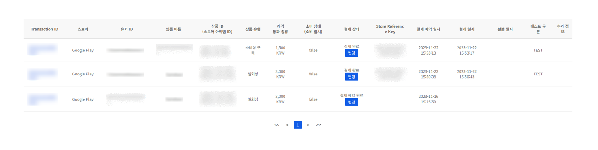
<!-- LLM_Image_DESC_20260406
    유형: Screenshot
    내용: Gamebase IAP - 결제 내역 검색 결과 테이블
    구성: Transaction ID, 스토어, 유저 ID, 상품 이름, 상품 ID(스토어 아이템 ID), 가격/통화 종류, 소비 상태, 결제 상태(배지), Store Reference Key, 결제 예약 일시, 환불 일시, 테스트 구분, 추가 정보 컬럼으로 구성된 결제 내역 테이블이 배치됨. 페이지네이션이 있음
    Keyword: 결제 내역, 검색 결과, Transaction ID, 결제 상태, 환불
-->

- **Transaction ID**: Gamebase 내에서 결제를 구별할 수 있는 고유 번호
- **스토어**: 결제된 스토어 정보
- **유저 ID**: 결제한 사용자 아이디
- **상품 이름**: 사용자가 앱에서 구입한 실제 상품 이름
- **상품 ID(스토어 아이템 ID)**: 사용자가 앱에서 구입한 실제 상품 아이디 및 스토어에 실제로 결제된 스토어 아이템 ID
- **상품 유형**: 사용자가 앱에서 구입한 실제 상품 유형
- **가격/통화 종류**: 사용자가 구입한 아이템의 가격 및 통화 종류
- **소비 상태**: 결제한 아이템의 지급 여부
- **결제 상태**: 결제의 현재 진행 상태
- **Store Reference Key**: 스토어에서 발급해 주는 결제 고유 번호
- **결제 예약 일시**: 사용자가 구입을 시도한 시간
- **결제 일시**: 사용자가 구입을 완료한 시간
- **환불 일시**: 사용자 아이템이 환불된 시간
- **추가 정보**: SDK에서 결제 요청 시 전달한 추가 정보(Developer payload)

##### 결제 상태 변경
검색한 결제 정보의 상태는 아래와 같으며 각 상태는 아래와 같습니다.
- **결제 완료(Success)**
    - 결제 처리가 정상적으로 완료된 경우를 의미합니다.
    - Refund 상태로 변경 가능합니다.
- **결제 예약 완료(Reserved)**
	- 스토어를 통한 결제가 더 이상 진행되지 않거나 결제 검증까지 진행되지 않은 경우를 의미합니다.
	- Success, Refund 상태로 변경 가능합니다.
      - 단, Google Play Store에서는 Success 상태 변경이 불가능합니다.
- **결제 검증 실패(Failure)**
	- 스토어에서 결제를 진행했으나 결제 검증에서 오류가 발생한 경우를 의미합니다.
	- Success, Refund 상태로 변경 가능합니다.
- **환불 완료(Refund)**
	- 관리자가 수동으로 스토어에서 환불 처리에 대한 여부를 업데이트한 경우입니다.
	- 다른 결제 상태로 변경이 불가능합니다.
- **진행 중 취소(UserClose)**
	- 유저가 결제 진행 중 취소

###### Success 변경
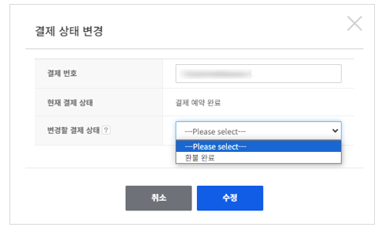
<!-- LLM_Image_DESC_20260406
    유형: UI
    내용: Gamebase IAP - 결제 상태 변경 팝업 (결제 예약 완료 -> 환불 완료)
    구성: '결제 상태 변경' 제목 아래에 결제 번호, 현재 결제 상태(결제 예약 완료), 변경할 결제 상태 드롭다운(환불 완료 선택 가능)이 있음. 하단에 취소/수정 버튼이 배치됨
    Keyword: 결제 상태 변경, 환불 완료, 결제 예약 완료, 팝업
-->
결제 진행 시 발급 받은 **영수증 번호**, **가격**, **통화** 정보를 입력해야 상태를 변경할 수 있습니다.

###### Refund 변경
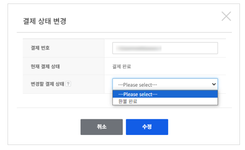
<!-- LLM_Image_DESC_20260406
    유형: UI
    내용: Gamebase IAP - 결제 상태 변경 팝업 (결제 완료 -> 환불 완료)
    구성: '결제 상태 변경' 제목 아래에 결제 번호, 현재 결제 상태(결제 완료), 변경할 결제 상태 드롭다운(환불 완료 선택 가능)이 있음. 하단에 취소/수정 버튼이 배치됨
    Keyword: 결제 상태 변경, 환불 완료, 결제 완료, 팝업
-->
추가 정보 입력 없이 상태를 선택한 후 변경을 선택합니다.
변경된 결제 정보는 이후 변경이 불가능하므로 신중하게 확인해야 합니다.

##### 영수증 검증
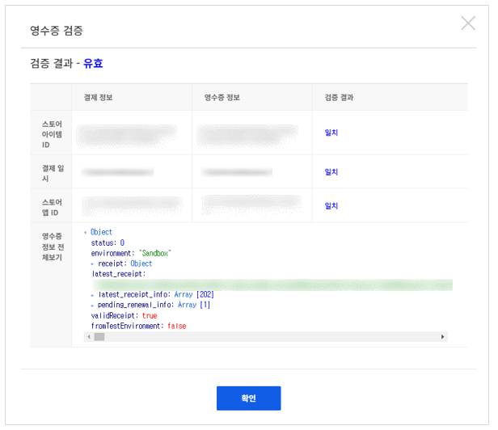
<!-- LLM_Image_DESC_20260406
    유형: UI
    내용: Gamebase IAP - 영수증 검증 결과 팝업
    구성: '영수증 검증' 제목 아래에 검증 결과(유효) 표시가 있음. 결제 정보, 영수증 정보, 검증 결과(일치/불일치) 컬럼으로 스토어 아이템 ID, 결제 일시, 스토어 앱 ID를 비교한 테이블이 있음. 하단에 영수증 정보 전체보기(JSON 형태)와 확인 버튼이 배치됨
    Keyword: 영수증 검증, 검증 결과, 유효, 일치, JSON
-->

* 조회된 영수증의 결제가 유효한지 검증할 수 있습니다.
* 각 필드를 비교한 결과를 확인할 수 있습니다. 스토어에서 받은 응답값을 JSON 형식으로 제공하므로 필요한 경우 데이터를 직접 확인하실 수 있습니다.
* 현재는 App Store 결제 건만 검증할 수 있습니다.

##### 결제 이력 조회
검색한 결제 정보의 Transaction ID를 클릭해서 결제 이력을 조회할 수 있습니다.
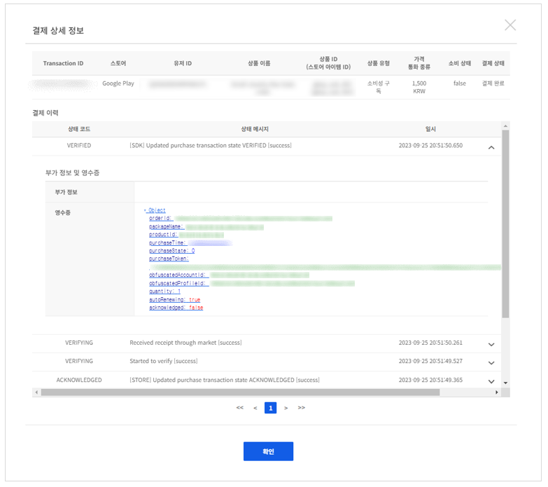
<!-- LLM_Image_DESC_20260406
    유형: Screenshot
    내용: Gamebase IAP - 결제 상세 정보 팝업
    구성: '결제 상세 정보' 제목 아래에 Transaction ID, 스토어, 상품 이름 등 기본 결제 정보가 표시됨. 결제 이력 섹션에 상태 메시지와 일시가 나열되며, 부가 정보 및 영수증 섹션에 영수증 원본 데이터(JSON)가 표시됨. 하단에 확인 버튼이 배치됨
    Keyword: 결제 상세, 결제 이력, 영수증, 부가 정보, JSON
-->

###### (1) 부가 정보 및 영수증 조회
각각의 결제 상태마다 오른쪽 화살표를 클릭해서 부가 정보와 영수증 정보를 확인할 수 있습니다.

#### [상품 정보 미등록 결제] 검색 결과
검색 결과 항목은 아래와 같습니다.

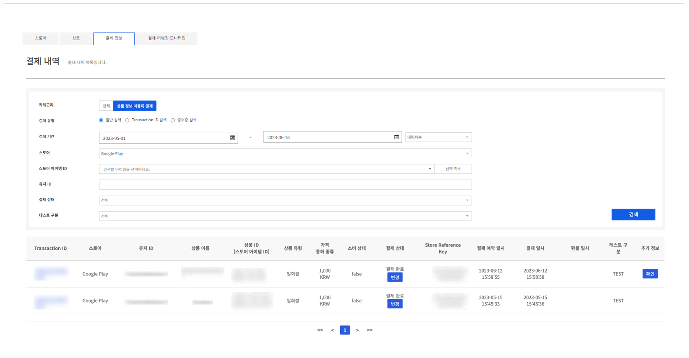
<!-- LLM_Image_DESC_20260406
    유형: Screenshot
    내용: Gamebase IAP - 상품 정보 미등록 결제 내역 검색 화면
    구성: 상단에 결제 정보 탭과 상품 정보 미등록 결제 카테고리가 선택됨. 검색 유형, 검색 기간, 스토어 등 검색 필터가 있고, 하단에 Transaction ID, 스토어, 유저 ID, 상품 이름, 가격/통화 종류, 결제 상태 등 컬럼으로 구성된 결제 내역 테이블이 배치됨
    Keyword: 상품 정보 미등록, 결제 내역, 검색, Transaction ID
-->

- **Transaction ID**: Gamebase 내에서 결제를 구별할 수 있는 고유 번호
- **스토어**: 결제된 스토어 정보
- **유저 ID**: 결제한 사용자 아이디
- **상품 이름**: 사용자가 앱에서 구입한 실제 상품 이름
- **상품 ID(스토어 아이템 ID)**: 사용자가 앱에서 구입한 실제 상품 아이디 및 스토어에 실제로 결제된 스토어 아이템 ID
- **상품 유형**: 사용자가 앱에서 구입한 실제 상품 유형
- **가격/통화 종류**: 사용자가 구입한 아이템의 가격 및 통화 종류
- **소비 상태**: 결제한 아이템의 지급 여부
- **결제 상태**: 결제의 현재 진행 상태
- **Store Reference Key**: 스토어에서 발급해 주는 결제 고유 번호
- **추가 정보**: SDK에서 결제 요청 시 전달한 추가 정보(Developer payload)
- **상품 ID 등록**: 상품 정보 수동 등록

##### 상품 ID 등록
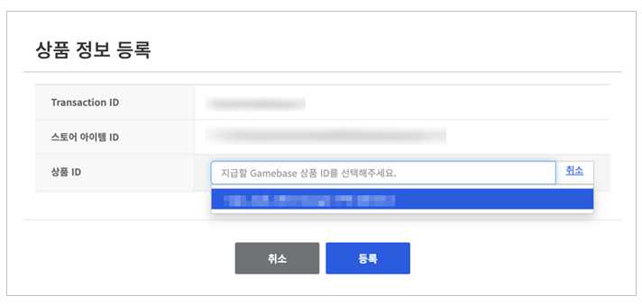
<!-- LLM_Image_DESC_20260406
    유형: UI
    내용: Gamebase IAP - 상품 정보 등록 팝업
    구성: '상품 정보 등록' 제목 아래에 Transaction ID, 스토어 아이템 ID가 표시되고, 상품 ID 드롭다운 선택란이 있음. 하단에 취소/등록 버튼이 배치됨
    Keyword: 상품 정보 등록, Transaction ID, 상품 ID, 수동 등록
-->
* 누락된 아이템 정보를 수동으로 선택하여 지급할 수 있습니다.
