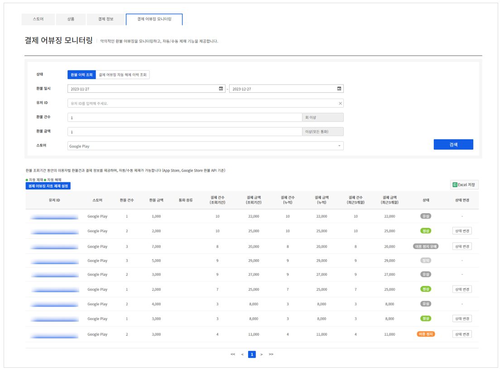
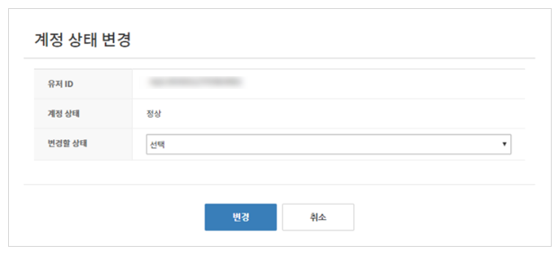
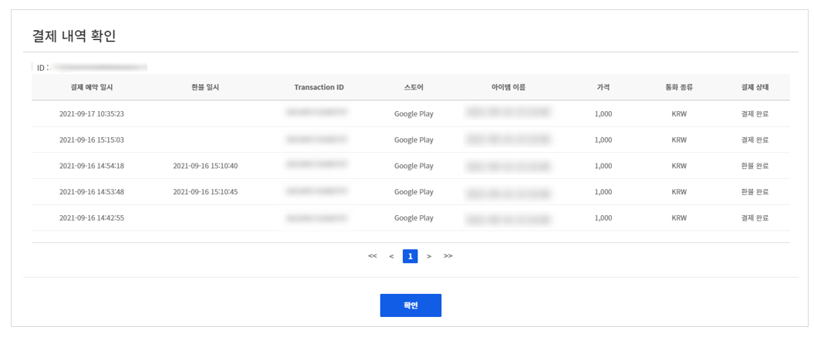
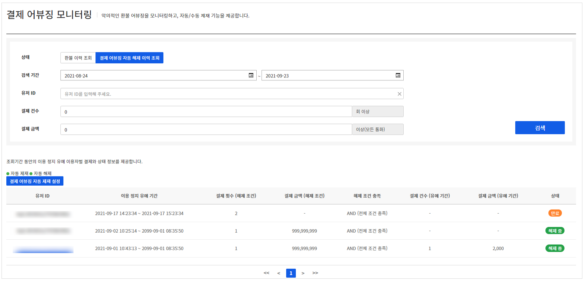
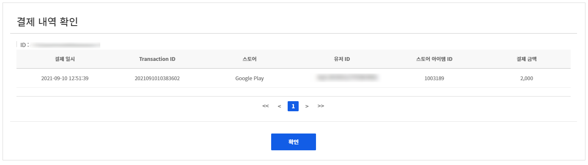
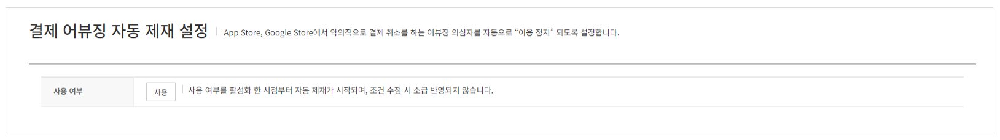
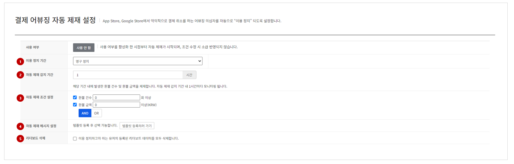
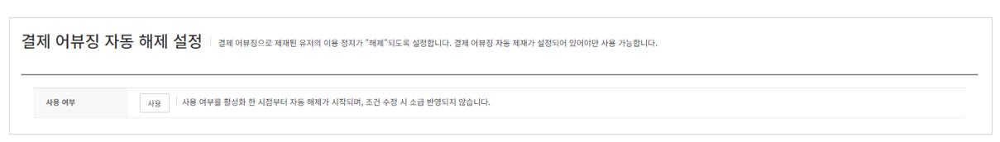
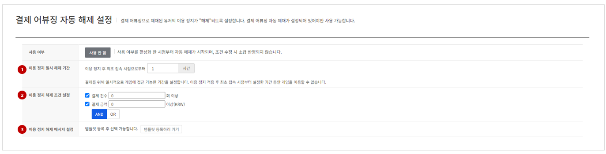

## 결제 어뷰징 모니터링

결제 어뷰징 정보를 조회하고 자동 제재/해제 설정을 할 수 있습니다.

### 환불 이력 조회

<!-- LLM_Image_DESC_20260408_185735
    유형: Screenshot
    내용: Gamebase 결제 콘솔 환불 이력 조회 화면 #20
    구성: Gamebase 결제 콘솔의 환불 이력 조회 기능 설정/조회 화면 스크린샷
    Keyword: 결제, Console, Screenshot, 환불 이력 조회
-->

아래 검색 조건을 이용해 원하는 결제 및 환불 정보를 검색할 수 있습니다.
결제 및 환불 내역은 오른쪽 상단의 **다운로드** 버튼을 클릭해 언제든지 다운로드할 수 있습니다.

#### 검색 조건
- **환불 일시**: 환불 처리된 시간
- **유저 ID**: 결제한 사용자 ID
- **환불 건수**: 사용자가 환불받은 횟수로 입력한 횟수 이상이 조회됩니다.
- **환불 금액**: 사용자가 환불받은 금액으로, 입력한 금액 이상이 조회됩니다.
- **스토어**: 환불한 스토어

#### 검색 결과
- **유저 ID**: 결제한 사용자 ID
- **스토어**: 결제된 스토어 정보
- **환불 건수**: 사용자가 환불받은 횟수
- **환불 금액**: 사용자가 환불받은 금액
- **결제 건수(조회 기간)**: 사용자가 조회 기간 내 결제한 횟수
- **결제 금액(조회 기간)**: 사용자가 조회 기간 내 결제한 금액
- **결제 건수(누적)**: 사용자가 결제한 전체 누적 횟수
- **결제 금액(누적)**: 사용자가 결제한 전체 금액
- **결제 건수(최근 3개월)**: 사용자가 최근 3개월간 결제한 횟수
- **결제 금액(최근 3개월)**: 사용자가 최근 3개월간 결제한 금액
- **상태**: 사용자의 현재 상태
- **상태 변경**: 사용자 상태에 따라 이용 정지 또는 정지 해제

#### 상태 변경

<!-- LLM_Image_DESC_20260408_185735
    유형: Screenshot
    내용: Gamebase 결제 콘솔 상태 변경 화면 #21
    구성: Gamebase 결제 콘솔의 상태 변경 기능 설정/조회 화면 스크린샷
    Keyword: 결제, Console, Screenshot, 상태 변경
-->

조회한 게임 유저의 계정 상태를 변경할 수 있는 기능입니다.
상태별로 변경할 수 있는 경우는 아래와 같습니다.

- **정상**: 이용 정지, 탈퇴 상태로 변경할 수 있습니다. 탈퇴 시에는 해당 계정 정보를 되돌릴 수 없으므로 처리 전 확인 및 주의가 필요합니다.
- **이용 정지**: 이용 정지 해제를 진행할 수 있습니다.
- **이용 정지 유예**: 이용 정지 상태로 변경할 수 있습니다.
- **탈퇴**: 상태를 변경할 수 없으므로 해당 버튼이 표시되지 않습니다.

#### 결제 내역 확인

검색된 목록에서 유저 ID를 클릭하면 검색 기간의 결제 상세 내역을 조회할 수 있습니다.

<!-- LLM_Image_DESC_20260408_185735
    유형: Screenshot
    내용: Gamebase 결제 콘솔 결제 내역 확인 화면 #22
    구성: Gamebase 결제 콘솔의 결제 내역 확인 기능 설정/조회 화면 스크린샷
    Keyword: 결제, Console, Screenshot, 결제 내역 확인
-->

#### 결제 내역
- **결제 예약 일시**: 사용자가 구입을 시도한 시간
- **결제 일시**: 사용자가 구입을 완료한 시간
- **환불 일시**: 사용자 아이템이 환불된 시간
- **Transaction ID**: Gamebase 내에서 결제를 구별할 수 있는 고유 번호
- **스토어**: 결제된 스토어 정보
- **아이템 이름**: 사용자가 앱에서 구입한 실제 아이템 이름
- **가격**: 사용자가 구입한 아이템 가격
- **통화 종류**: 사용자가 구입 시 사용한 통화 종류
- **결제 상태**: 결제의 현재 진행 상태

### 결제 어뷰징 자동 해제 이력 조회

<!-- LLM_Image_DESC_20260408_185735
    유형: Screenshot
    내용: Gamebase 결제 콘솔 결제 어뷰징 자동 해제 이력 조회 화면 #23
    구성: Gamebase 결제 콘솔의 결제 어뷰징 자동 해제 이력 조회 기능 설정/조회 화면 스크린샷
    Keyword: 결제, Console, Screenshot, 결제 어뷰징 자동 해제 이력 조회
-->

아래 검색 조건을 이용해 원하는 결제 어뷰징 자동 해제 사용자 정보를 검색할 수 있습니다.

#### 검색 조건
- **검색 기간**: 이용 정지 유예가 시작된 시간 기준으로 조회됩니다.
- **유저 ID**: 이용 정지 유예 사용자 ID
- **결제 건수**: 이용 정지 유예 기간 중에 사용자가 결제한 횟수로 입력한 횟수 이상이 조회됩니다.
- **결제 금액**: 이용 정지 유예 기간 중에 사용자가 결제한 금액으로, 입력한 금액 이상이 조회됩니다.

#### 검색 결과
- **유저 ID**: 이용 정지 유예 사용자 ID
- **이용 정지 유예 기간**: 이용 정지 유예 시작 및 종료 시간
- **결제 횟수(해제 조건)**: 이용 정지 해제를 위해서 결제해야할 전체 횟수
- **결제 금액(해제 조건)**: 이용 정지 해제를 위해서 결제해야할 전체 금액
- **해제 조건 충족**: 해제 조건을 충족하기 위한 조건(AND, OR)
- **결제 건수(유예 기간)**: 이용 정지 유예 기간 중에 사용자가 결제한 전체 누적 횟수
- **결제 금액(유예 기간)**: 이용 정지 유예 기간 중에 사용자가 결제한 전체 금액

#### 결제 내역 확인

검색된 목록에서 유저 ID를 클릭하면 검색 기간의 결제 상세 내역을 조회할 수 있습니다.
(단, 결제 내역이 없는 유저는 비활성화됩니다.)

<!-- LLM_Image_DESC_20260408_185735
    유형: Screenshot
    내용: Gamebase 결제 콘솔 결제 내역 확인 화면 #24
    구성: Gamebase 결제 콘솔의 결제 내역 확인 기능 설정/조회 화면 스크린샷
    Keyword: 결제, Console, Screenshot, 결제 내역 확인
-->

#### 결제 내역
- **결제 일시**: 사용자가 구입을 완료한 시간
- **Transaction ID**: Gamebase 내에서 결제를 구별할 수 있는 고유 번호
- **스토어**: 결제된 스토어 정보
- **유저 ID**: 결제한 사용자 ID
- **스토어 아이템 ID**: 사용자가 앱에서 구입한 실제 스토어 아이템 ID
- **결제 금액**: 사용자가 결제한 금액

#### 결제 어뷰징 자동 제재 설정

자동 제재 설정을 사용하려면 **사용** 버튼을 클릭해 설정 값을 입력합니다.

<!-- LLM_Image_DESC_20260408_185735
    유형: Screenshot
    내용: Gamebase 결제 콘솔 결제 어뷰징 자동 제재 설정 화면 #25
    구성: Gamebase 결제 콘솔의 결제 어뷰징 자동 제재 설정 기능 설정/조회 화면 스크린샷
    Keyword: 결제, Console, Screenshot, 결제 어뷰징 자동 제재 설정
-->

#### 설정 정보

<!-- LLM_Image_DESC_20260408_185735
    유형: Screenshot
    내용: Gamebase 결제 콘솔 설정 정보 화면 #26
    구성: Gamebase 결제 콘솔의 설정 정보 기능 설정/조회 화면 스크린샷
    Keyword: 결제, Console, Screenshot, 설정 정보
-->

* **이용 정지 기간**  자동 제재 적용 시 이용 정지 기간을 입력합니다.
    * **영구 정지**: 영구 이용 정지를 하려면 선택합니다.
    * **기간 지정**: 이용 정지 기간을 일(day) 단위로 지정합니다.
* **자동 제재 조건 설정**  설정된 조건에 해당되는 사용자는 자동 제재 처리됩니다. 최소 1개 이상 설정해야 합니다.
    * **환불 건수**: 어뷰징에 해당하는 환불 건수를 입력합니다.
    * **환불 금액**: 어뷰징에 해당하는 환불 금액을 입력합니다.
* **자동 제재 메시지 설정**  
    * 사용자에게 표시할 이용 정지 메시지를 입력합니다.
    * 사용자에게 표시할 메시지를 다국어로 입력하여 손쉽게 재사용할 수 있도록 템플릿을 제공합니다. 미리 등록한 템플릿을 선택해 등록합니다.
* **리더보드 삭제**
    * 자동 제재 시 해당 게임 유저의 리더보드 데이터도 함께 삭제할지 여부를 설정합니다.
    * 선택 후 등록하면 자동 제재 적용 시 리더보드에서 게임 유저의 데이터가 삭제되며 해당 데이터는 복구되지 않으므로 주의해야 합니다.

#### 결제 어뷰징 자동 해제 설정

자동 해제 설정을 사용하려면 **사용** 버튼을 클릭해 설정 값을 입력합니다.
자동 해제 설정을 활성화하기 위해서는 자동 제재 설정이 반드시 활성화되어야 합니다.

<!-- LLM_Image_DESC_20260408_185735
    유형: Screenshot
    내용: Gamebase 결제 콘솔 결제 어뷰징 자동 해제 설정 화면 #27
    구성: Gamebase 결제 콘솔의 결제 어뷰징 자동 해제 설정 기능 설정/조회 화면 스크린샷
    Keyword: 결제, Console, Screenshot, 결제 어뷰징 자동 해제 설정
-->

#### 설정 정보

<!-- LLM_Image_DESC_20260408_185735
    유형: Screenshot
    내용: Gamebase 결제 콘솔 설정 정보 화면 #28
    구성: Gamebase 결제 콘솔의 설정 정보 기능 설정/조회 화면 스크린샷
    Keyword: 결제, Console, Screenshot, 설정 정보
-->

* **이용 정지 일시 해제 기간**: 자동 해제 적용 시 이용 정지 유예 기간을 입력합니다.
* **이용 정지 해제 조건 설정**: 자동 해제에 필요한 조건을 설정합니다. 최소 1개 이상 설정해야 합니다.
    * **결제 건수**: 자동 해제를 위해 결제해야할 건수를 입력합니다.
    * **결제 금액**: 자동 해제를 위해 결제해야할 금액을 입력합니다.
* **이용 정지 해제 메시지**
    * 사용자에게 표시할 이용 정지 해제 메시지를 입력합니다.
    * 사용자에게 표시할 메시지를 다국어로 입력하여 손쉽게 재사용할 수 있도록 템플릿을 제공합니다. 미리 등록한 템플릿을 선택해 등록합니다.
