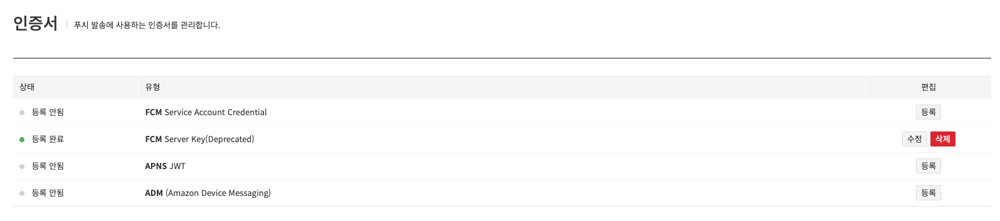
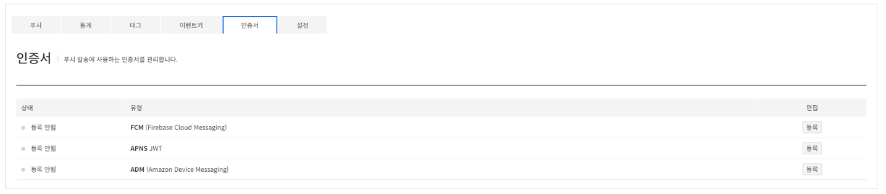
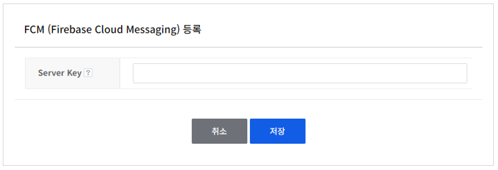
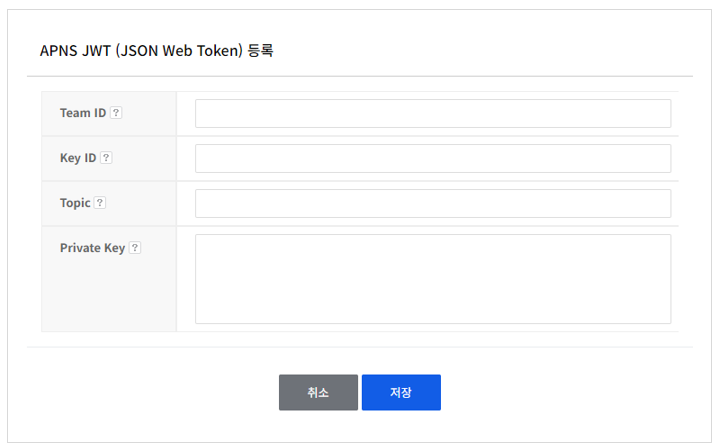
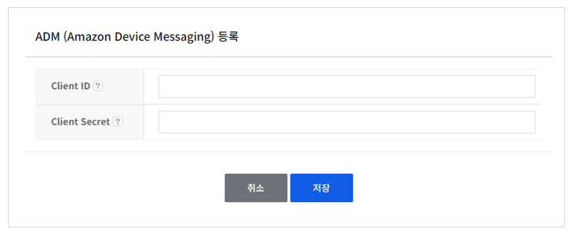

## Authentication
푸시 발송에 사용하는 인증서를 관리할 수 있습니다.

<!-- LLM_Image_DESC_20260406
    유형: Screenshot
    내용: Gamebase Push - 인증서 관리 화면
    구성: '인증서' 제목 아래에 상태(등록 안됨/등록 완료), 유형(FCM Service Account Credential, FCM Server Key(Deprecated), APNS JWT, ADM), 편집(등록/수정/삭제) 컬럼으로 구성된 인증서 목록 테이블이 배치됨
    Keyword: 인증서, FCM, APNS, ADM, 등록, 삭제
-->

각 인증서 별로 **등록**, **수정**, **삭제** 버튼을 클릭해 인증서를 등록, 수정, 삭제할 수 있습니다.

> [참고]
> FCM Server Key 인증서는 2024년 6월 20일 지원이 중단됩니다.
> 6월 20일까지 신규 인증 FCM Service Account Credential 등록이 필요합니다.
> FCM Service Account Credential을 등록하면 FCM Server Key 인증서는 삭제됩니다. FCM Server Key를 복구하려면 다시 FCM Server Key 인증서를 등록하시면 됩니다.

### Authentication register

<!-- LLM_Image_DESC_20260406
    유형: Screenshot
    내용: Gamebase Push - 인증서 관리 화면 (신규 구조)
    구성: '인증서' 제목 아래에 상태(등록 안됨), 유형(FCM (Firebase Cloud Messaging), APNS JWT, ADM (Amazon Device Messaging)), 편집(등록) 컬럼으로 구성된 인증서 목록 테이블이 배치됨
    Keyword: 인증서, FCM, APNS JWT, ADM, 등록
-->

<!-- LLM_Image_DESC_20260406
    유형: UI
    내용: Gamebase Push - FCM (Firebase Cloud Messaging) 등록 폼
    구성: 'FCM (Firebase Cloud Messaging) 등록' 제목 아래에 Server Key 입력 필드가 있음. 하단에 취소/저장 버튼이 배치됨
    Keyword: FCM 등록, Server Key, Firebase Cloud Messaging
-->

<!-- LLM_Image_DESC_20260406
    유형: UI
    내용: Gamebase Push - APNS JWT (JSON Web Token) 등록 폼
    구성: 'APNS JWT (JSON Web Token) 등록' 제목 아래에 Team ID, Key ID, Topic, Private Key 입력 필드가 있음. 하단에 취소/저장 버튼이 배치됨
    Keyword: APNS JWT, Team ID, Key ID, Topic, Private Key
-->

<!-- LLM_Image_DESC_20260406
    유형: UI
    내용: Gamebase Push - ADM (Amazon Device Messaging) 등록 폼
    구성: 'ADM (Amazon Device Messaging) 등록' 제목 아래에 Client ID, Client Secret 입력 필드가 있음. 하단에 취소/저장 버튼이 배치됨
    Keyword: ADM 등록, Client ID, Client Secret, Amazon Device Messaging
-->
