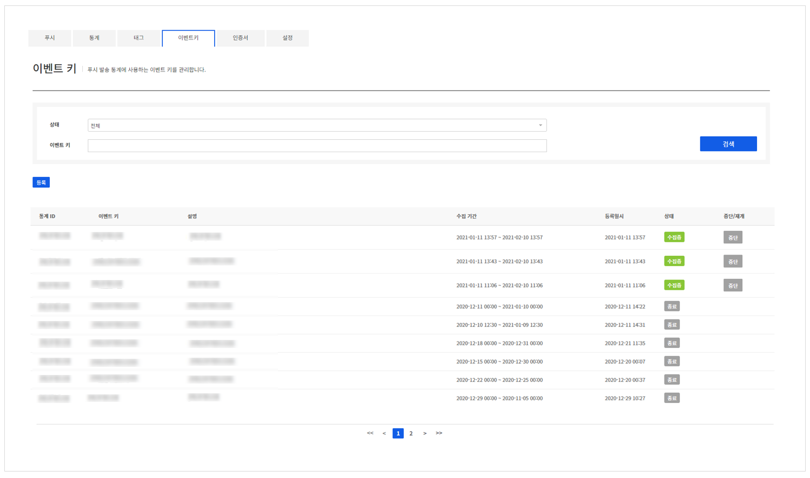
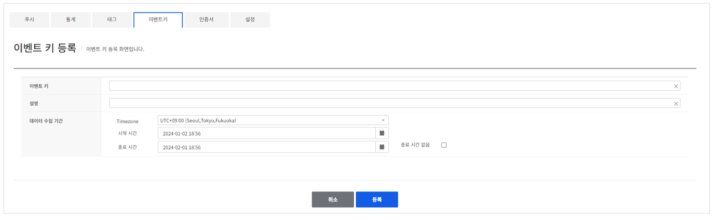
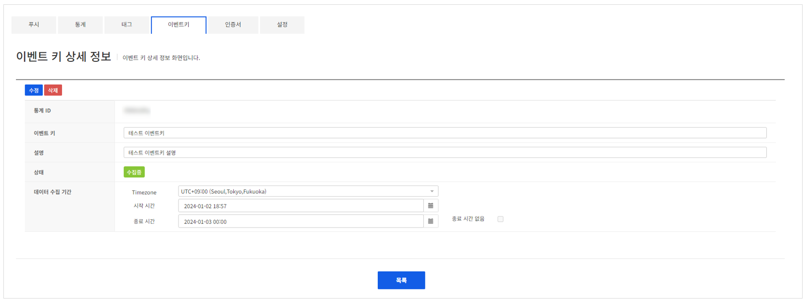

## Event Key
푸시 발송 통계에 사용하는 이벤트키를 관리할 수 있습니다.

<!-- LLM_Image_DESC_20260406
    유형: Screenshot
    내용: Gamebase Push - 이벤트 키 목록 화면
    구성: 상단에 이벤트키 탭이 선택되어 있고, 검색 필터(상태, 키워드)와 검색 버튼이 있음. 등록 버튼과 통계 ID, 이벤트 키, 설명, 수집 기간, 등록일시, 상태(수집중/종료 배지) 컬럼으로 구성된 이벤트 키 목록 테이블이 배치됨. 페이지네이션이 있음
    Keyword: 이벤트 키, 목록, 수집중, 종료, 통계 ID
-->

Push에서 푸시 메시지를 발송할 때 사용할 이벤트키를 등록할 수 있습니다.

### Event Key register

<!-- LLM_Image_DESC_20260406
    유형: Screenshot
    내용: Gamebase Push - 이벤트 키 등록 화면
    구성: '이벤트 키 등록' 제목 아래에 이벤트 키, 설명 입력란이 있음. 데이터 수집 기간에 Timezone, 시작 시간, 종료 시간 설정과 종료 시간 없음 체크박스가 있음. 하단에 취소/등록 버튼이 배치됨
    Keyword: 이벤트 키 등록, 수집 기간, Timezone, 시작/종료 시간
-->

### Event Key detail
등록된 이벤트 키를 관리할 수 있습니다.

<!-- LLM_Image_DESC_20260406
    유형: Screenshot
    내용: Gamebase Push - 이벤트 키 상세 정보 화면
    구성: '이벤트 키 상세 정보' 제목 아래에 수정/삭제 버튼이 있음. 통계 ID, 이벤트 키(테스트 이벤트키), 설명(테스트 이벤트키 설명), 상태(수집중 배지), 데이터 수집 기간(Timezone, 시작/종료 시간)이 표시됨. 하단에 목록 버튼이 배치됨
    Keyword: 이벤트 키 상세, 수집중, 통계 ID, 수정, 삭제
-->

상단의 **삭제**, **수정** 버튼을 클릭해 이벤트키 정보를 수정하거나 삭제할 수 있습니다.
