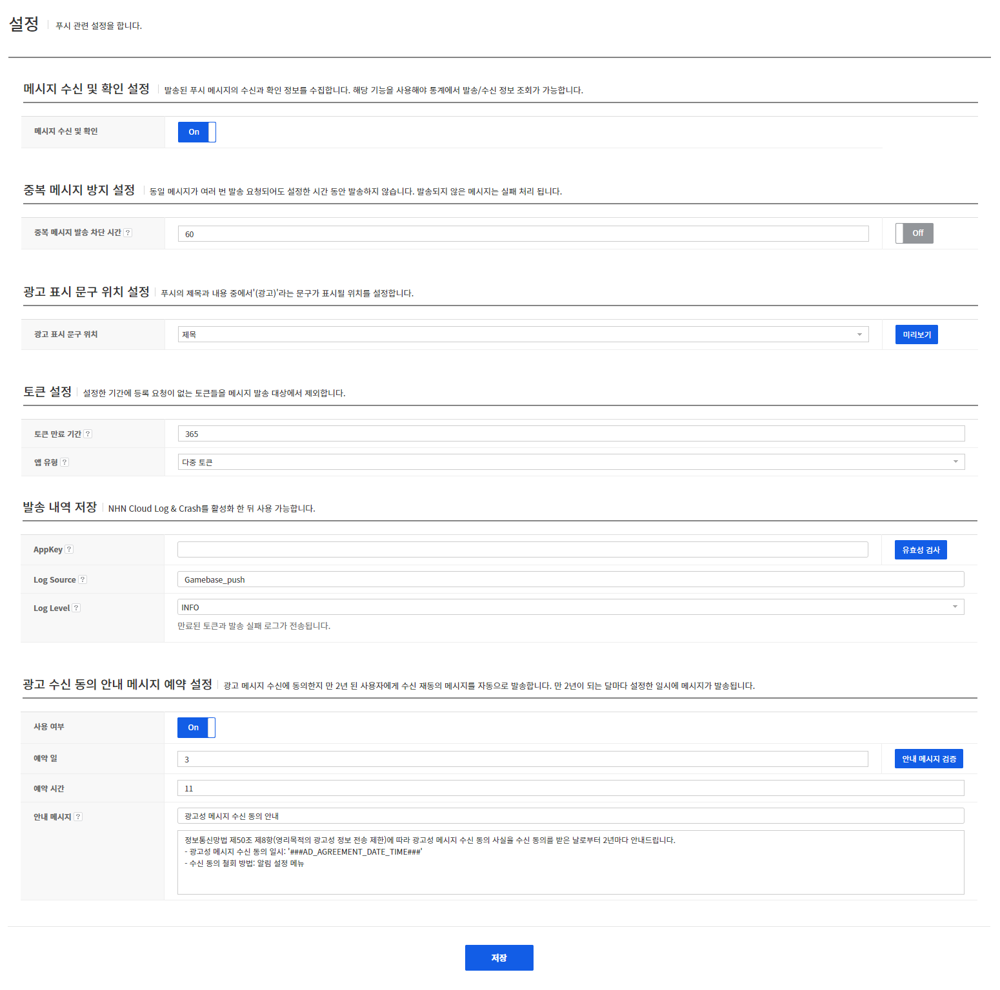
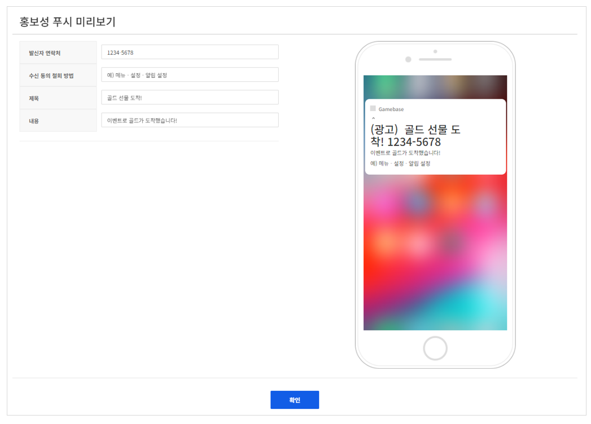

## Setting
푸시 관련 설정을 할 수 있습니다.

<!-- LLM_Image_DESC_20260408_185735
    유형: Screenshot
    내용: Gamebase Push 콘솔 Setting 화면 #20
    구성: Gamebase Push 콘솔의 Setting 기능 설정/조회 화면 스크린샷
    Keyword: Push, Console, Screenshot, Setting
-->

### 메시지 수신 및 확인 설정
발송된 메시지의 수신과 확인 정보를 수집하는 기능입니다.

### 중복 메시지 방지 설정
내용이 완전히 같은 메시지가 여러 번 발송 요청 되어도 설정한 시간동안 발송하지 않는 기능입니다.

* 1분부터 60분까지 1분 간격으로 설정할 수 있습니다.

### 광고 표시 문구 위치 설정
광고성 메시지 발송 시 표시되는 광고 표시 위치를 설정할 수 있습니다.

* 우측 **미리보기** 버튼 클릭 시 설정한 광고 표시 문구 위치에 따른 푸시 예시를 확인할 수 있습니다.

<!-- LLM_Image_DESC_20260408_185735
    유형: Screenshot
    내용: Gamebase Push 콘솔 광고 표시 문구 위치 설정 화면 #23
    구성: Gamebase Push 콘솔의 광고 표시 문구 위치 설정 기능 설정/조회 화면 스크린샷
    Keyword: Push, Console, Screenshot, 광고 표시 문구 위치 설정
-->

### 토큰 설정

토큰 만료 기간 설정 및 앱 유형을 설정할 수 있습니다.

* 토큰 만료 기간: 1일에서 730일까지 설정할 수 있습니다.
* 앱 유형
	* 다중 토큰: UID(사용자 아이디)는 여러 개의 토큰을 가질 수 있습니다. 한 사용자가 동시 여러 기기에서 사용할 수 있는 앱입니다.
	* 단일 토큰: UID는 하나의 토큰만 가질 수 있습니다. 한 사용자가 한 기기에서만 사용할 수 있는 앱입니다.

### 발송 내역 저장

메시지 발송 내역을 NHN Cloud Log & Crash Search에 저장하는 기능입니다.

* AppKey: Log & Crash Search 앱 키입니다.
* Log Source: Gamebase에서 제공하는 PUSH API를 이용하여 발송한 PUSH 이력을 Log & Crash Search에서 검색할 수 있습니다.
* Log Level: Log & Crash Search로 전송할 로그 레벨입니다.
	* ALL: 모든 로그가 Log & Crash Search로 전송됩니다.
	* INFO: 만료된 토큰과 발송 실패 로그가 Log & Crash Search로 전송됩니다.
	* ERROR: 발송 실패 로그가 Log & Crash Search로 전송됩니다.
