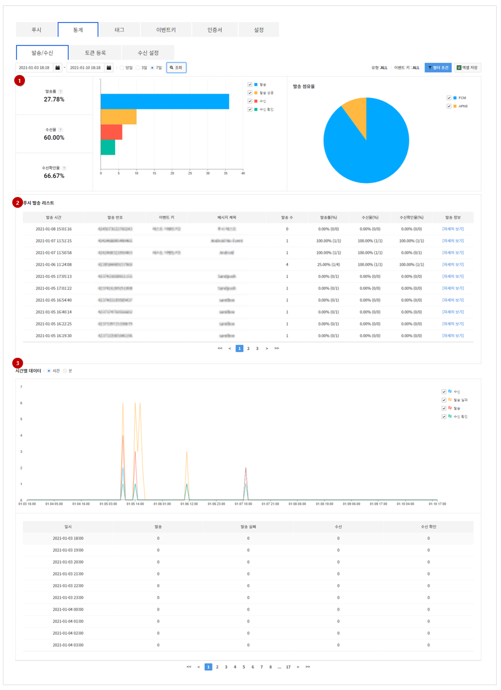
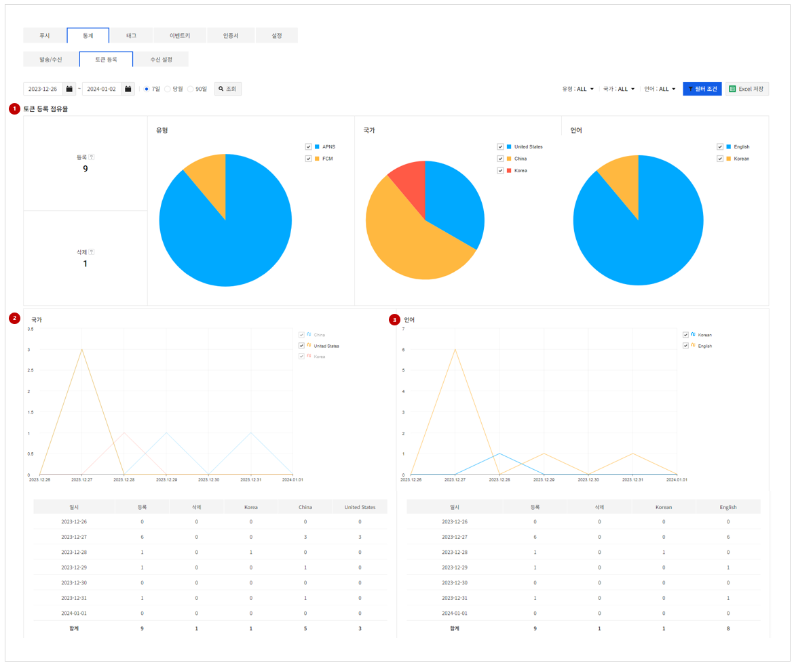
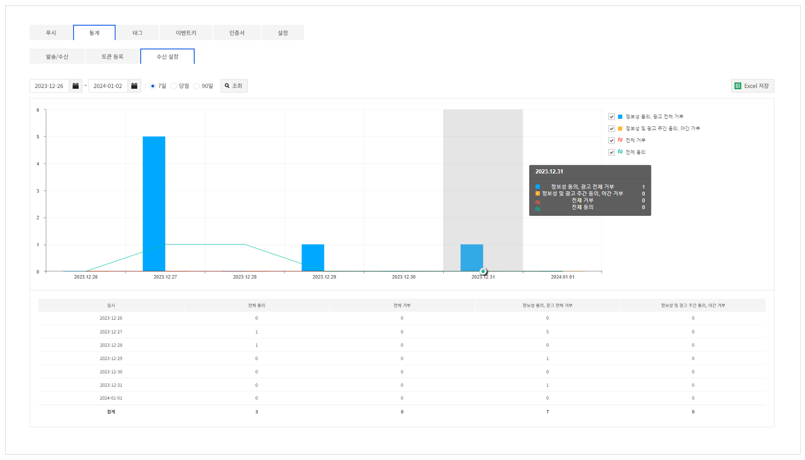

## Statistics

푸시 메시지, 토큰, 수신 설정과 관련된 지표들을 표와 그래프로 확인할 수 있습니다.
통계는 다음의 메뉴로 구성되어 있습니다.

- 발송/수신: 푸시 메시지 발송 및 수신 관련 지표
- 토큰 등록: 푸시 토큰 등록 및 삭제 관련 지표
- 수신 설정: 푸시 수신 설정 관련 지표

### 발송/수신

<!-- LLM_Image_DESC_20260408_185735
    유형: Screenshot
    내용: Gamebase Push 콘솔 발송/수신 화면 #05
    구성: Gamebase Push 콘솔의 발송/수신 기능 설정/조회 화면 스크린샷
    Keyword: Push, Console, Screenshot, 발송/수신
-->

1. 발송/수신 통계 

선택된 기간 동안의 푸시 메시지 발송/수신 통계를 보여줍니다.

* 발송률: 기간내 전체 발송 성공 수 / 전체 발송 수
* 수신율: 기간내 전체 수신 성공 수 / 전체 발송 성공 수
* 수신확인율: 기간내 전체 수신 확인 수 / 전체 수신 성공 수

> [참고]
> 수신율과 수신확인율 통계 데이터를 수집하기 위해서는 **설정** > [메시지 수신 및 확인](#Setting)을 **ON**으로 설정해야 합니다.

2. 푸시 발송 리스트
선택된 기간 동안 푸시 메시지 발송 목록

3. 시간별 데이터
선택된 기간 동안 시간 간격에 따른 푸시 발송, 발송 실패, 수신, 수신 확인 지표를 보여줍니다.

* 선택된 기간이 24시간 이하인 경우에만 **분** 단위 선택이 가능합니다.

### 토큰 등록

<!-- LLM_Image_DESC_20260408_185735
    유형: Screenshot
    내용: Gamebase Push 콘솔 토큰 등록 화면 #06
    구성: Gamebase Push 콘솔의 토큰 등록 기능 설정/조회 화면 스크린샷
    Keyword: Push, Console, Screenshot, 토큰 등록
-->

1. 토큰 등록 통계

선택된 기간 동안의 토큰 등록, 삭제 통계를 보여줍니다.

* 유형: 토큰 유형에 따른 등록 점유율
* 국가: 사용지 국가에 따른 토큰 등록 점유율
* 언어: 사용자 언어에 따른 토큰 등록 점유율

2. 국가
선택된 기간 동안의 사용자 국가에 따른 토큰 등록, 삭제 통계를 보여줍니다.

3. 언어
선택된 기간 동안의 사용자 언어에 따른 토큰 등록, 삭제 통계를 보여줍니다.

### 수신 설정
선택된 기간 동안의 수신 설정 관련 통계를 보여줍니다.

<!-- LLM_Image_DESC_20260408_185735
    유형: Screenshot
    내용: Gamebase Push 콘솔 수신 설정 화면 #07
    구성: Gamebase Push 콘솔의 수신 설정 기능 설정/조회 화면 스크린샷
    Keyword: Push, Console, Screenshot, 수신 설정
-->

|구분|정보성|광고성|야간 광고성|
|------|:---:|:---:|:---:|
|전체 동의| O | O | O |
|전체 거부| | | |
|정보성 동의, 광고 전체 거부| O | | |
|정보성 및 광고 주간 동의, 야간 거부| O | O | |
