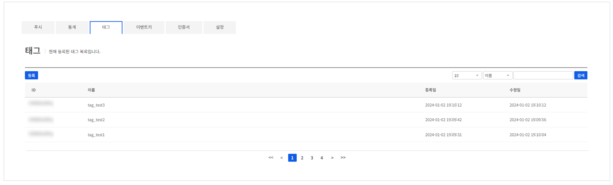
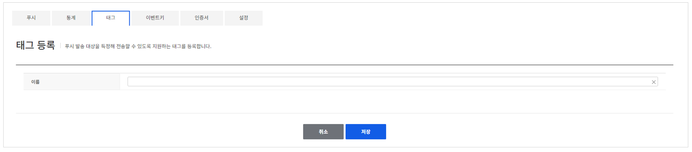
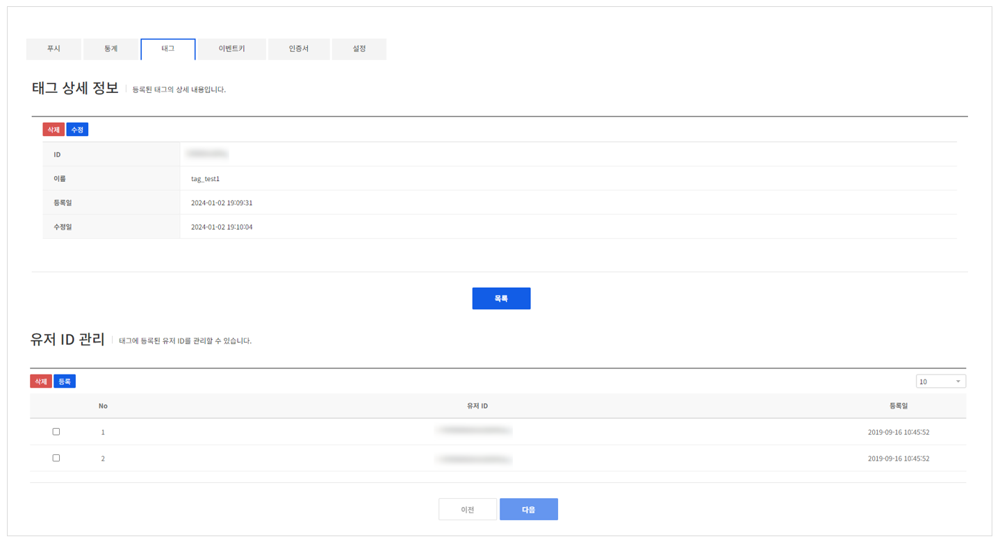
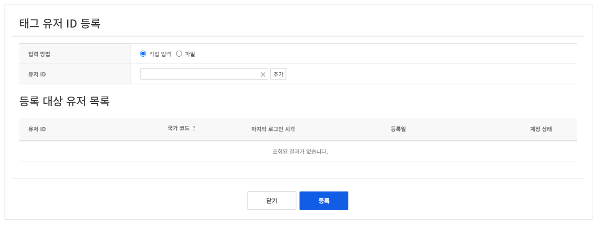
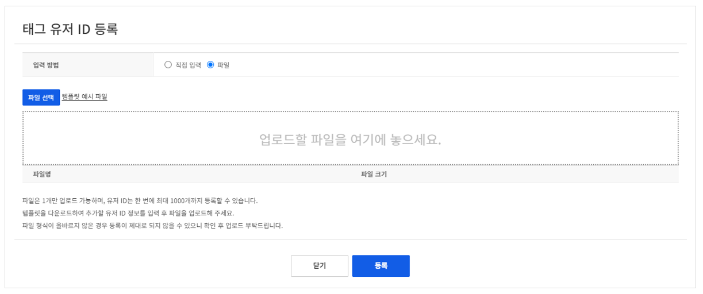
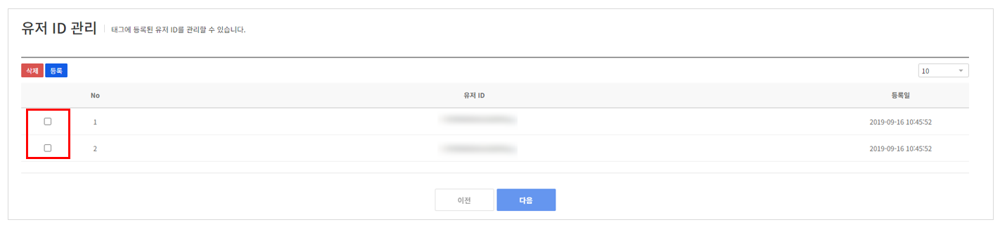

## Tag

유저를 특정 기준으로 묶어서 전송할 수 있는 태그 기능을 제공합니다.

<!-- LLM_Image_DESC_20260408_185735
    유형: Screenshot
    내용: Gamebase Push 콘솔 Tag 화면 #16
    구성: Gamebase Push 콘솔의 Tag 기능 설정/조회 화면 스크린샷
    Keyword: Push, Console, Screenshot, Tag
-->

NHN Cloud Push에서 푸시 메시지를 발송할 때 사용할 태그명을 등록할 수 있습니다.

### Tag register

<!-- LLM_Image_DESC_20260408_185735
    유형: Screenshot
    내용: Gamebase Push 콘솔 Tag register 화면 #17
    구성: Gamebase Push 콘솔의 Tag register 기능 설정/조회 화면 스크린샷
    Keyword: Push, Console, Screenshot, Tag register
-->

### Tag detail

등록된 태그의 관리 및 해당 태그에 등록된 유저의 목록을 관리할 수 있습니다.

<!-- LLM_Image_DESC_20260408_185735
    유형: Screenshot
    내용: Gamebase Push 콘솔 Tag detail 화면 #18
    구성: Gamebase Push 콘솔의 Tag detail 기능 설정/조회 화면 스크린샷
    Keyword: Push, Console, Screenshot, Tag detail
-->

상단의 **삭제**, **수정** 버튼을 클릭해 태그 정보를 수정하거나 삭제할 수 있으며 하단의 유저 ID 관리 기능을 사용해 태그에 유저를 등록하거나 삭제할 수 있습니다.

#### 유저 등록

##### 단건 등록

<!-- LLM_Image_DESC_20260408_185735
    유형: Screenshot
    내용: Gamebase Push 콘솔 유저 등록 화면 #19
    구성: Gamebase Push 콘솔의 유저 등록 기능 설정/조회 화면 스크린샷
    Keyword: Push, Console, Screenshot, 유저 등록
-->

##### 파일 등록

<!-- LLM_Image_DESC_20260408_185735
    유형: Screenshot
    내용: Gamebase Push 콘솔 유저 등록 화면 #20
    구성: Gamebase Push 콘솔의 유저 등록 기능 설정/조회 화면 스크린샷
    Keyword: Push, Console, Screenshot, 유저 등록
-->

**등록** 버튼을 클릭하면 위와 같이 등록 팝업이 나타나며 직접 ID를 입력하거나 파일을 등록해 입력할 수 있습니다.

**파일 등록**으로는 한 번에 최대 1,000명까지 등록할 수 있습니다.

#### 유저 삭제

<!-- LLM_Image_DESC_20260408_185735
    유형: Screenshot
    내용: Gamebase Push 콘솔 유저 삭제 화면 #21
    구성: Gamebase Push 콘솔의 유저 삭제 기능 설정/조회 화면 스크린샷
    Keyword: Push, Console, Screenshot, 유저 삭제
-->

태그에 등록된 유저를 삭제하려면 유저 목록에서 왼쪽의 체크 박스를 선택한 후 **삭제** 버튼을 클릭합니다.
