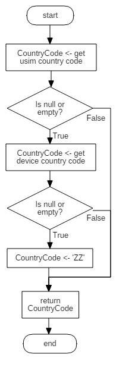

### Country Code

* Gamebase는 System의 국가 코드를 다음과 같은 API로 제공하고 있습니다.
* 각 API 마다 특징이 있으니 쓰임새에 맞는 API를 선택하시기 바랍니다.

#### USIM Country Code

* USIM에 기록된 국가 코드를 반환합니다.
* USIM에 잘못된 국가 코드가 기록되어 있다 하더라도 추가적인 체크 없이 그대로 반환합니다.
* 값이 비어있는 경우 'ZZ'를 반환합니다.

**API**

Supported Platforms
<span style="color:#1D76DB; font-size: 10pt">■</span> UNITY_IOS
<span style="color:#0E8A16; font-size: 10pt">■</span> UNITY_ANDROID


```cs
static string GetCountryCodeOfUSIM()
```

#### Device Country Code

* OS로부터 전달받은 단말기 국가 코드를 추가적인 체크 없이 그대로 반환합니다.
* 단말기 국가 코드는 '언어' 설정에 따라 OS가 자동으로 결정합니다.
* 여러 개의 언어가 등록된 경우, 우선권이 가장 높은 언어로 국가 코드를 결정합니다.
* 값이 비어있는 경우 'ZZ'를 반환합니다.

**API**

Supported Platforms
<span style="color:#1D76DB; font-size: 10pt">■</span> UNITY_IOS
<span style="color:#0E8A16; font-size: 10pt">■</span> UNITY_ANDROID

```cs
static string GetCountryCodeOfDevice()
```

#### Intergrated Country Code

* USIM, 단말기 언어 설정의 순서로 국가 코드를 확인하여 반환합니다.
* GetCountryCode API는 다음 순서로 동작합니다.
	1. USIM에 기록된 국가 코드를 확인하고, 값이 존재한다면 추가적인 체크 없이 그대로 반환합니다.
	2. USIM 국가 코드가 빈 값이라면 단말기 국가 코드를 확인하고, 값이 존재한다면 추가적인 체크 없이 그대로 반환합니다.
	3. USIM, 단말기 국가 코드가 모두 빈 값이라면 'ZZ' 를 반환합니다.


<!-- LLM_Image_DESC_20260406
    유형: Flowchart
    내용: CountryCode 획득 로직 플로우차트
    구성: start에서 시작하여 USIM country code를 먼저 획득 시도, null/empty이면 device country code 획득 시도, 그것도 null/empty이면 'ZZ'를 반환. 각 단계에서 값이 있으면 바로 해당 CountryCode를 반환하고 end로 종료
    Keyword: CountryCode, USIM, device, 국가 코드, 플로우차트
-->

> [참고]
>
> Editor on Windows, Standalone on Windows인 경우에는 [CultureInfo](https://docs.microsoft.com/en-us/dotnet/api/system.globalization.cultureinfo?view=netframework-4.7.2)를 참고하여 국가 코드를 반환합니다.
>
> Editor on Mac, WebGL은 [Application.systemLanguage](https://docs.unity3d.com/ScriptReference/SystemLanguage.html) 값을 참고하여 국가 코드를 반환합니다.<br/>예를 들어,Application.systemLanguage == SystemLanguage.Korean인 경우에는 'KR'을 반환합니다.

**API**

<span style="color:#1D76DB; font-size: 10pt">■</span> UNITY_IOS
<span style="color:#0E8A16; font-size: 10pt">■</span> UNITY_ANDROID
<span style="color:#F9D0C4; font-size: 10pt">■</span> UNITY_STANDALONE
<span style="color:#5319E7; font-size: 10pt">■</span> UNITY_WEBGL
<span style="color:#B60205; font-size: 10pt">■</span> UNITY_EDITOR

```cs
public static string GetCountryCode()
```
